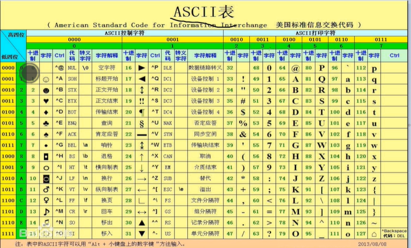

### 变量和数据
#### 变量的基本概念
+ 概念
    + 当需要在程序中记录单个数据内容时，需要声明一个变量，声明变量的本质是在内存中申请一个存储单元，由于该存储单元的内容可以发生变化，因此被叫做变量
    + 为了方便访问变量，需要给变量一个名字用于记录对应的存储单元
#### 变量的声明和使用
+ 声明方式
    + 数据类型 变量名 = 初始值（初始值可以省略）
#### 变量使用的注意事项
+ java是强类型语言，变量在使用前必须声明来指明数据类型
+ 变量使用前必须初始化
+ 变量不能重复声明
#### 标识符的命名法则
+ 由数字，字母，下划线以及$等组成，其中数字不能开头（防止出现数字+L/l的组合，会被识别为long类型数字）
+ 不能使用java语言的关键字
+ 区分大小写，长度没有限制但是不宜过长
#### 变量输入输出的案例实现
+ 扫描器使用
    + 引入
        ```
            import java.util.Scanner
        ```
    + 在main方法中调用
        ```
            // 创建一个扫描器扫描键盘输入--System.in表示键盘输入
            Scanner input = new Scanner(System.in);
        ```
#### 数据类型的分类
+ 基本数据类型
    + byte
    + short
    + int
    + long
    + float
    + double
    + boolean
    + char
+ 引用数据类型
    + 数组
    + 类
    + 接口
    + 枚举
    + 标注
#### 常用的进制
+ 十进制
    + 权重
        + 10^0,10^1,10^2
+ 二进制
    + 权重
        + 2^0,2^1,2^2
    + 最高位
        + 二进制中最高位（最左边）用于代表符号位，若该位是0则表示非负数，若1则代表是负数
+ 八进制和十六进制
    + 二进制的简写
#### 正十进制转二进制
+ 除二取余
    + 使用十进制不断除2取出余数，直到商为0，将所有余数逆序
    + java7中为了区分十进制和二进制，在二进制前加上0b/0B作为标识符
    + 45除二取余法获取二进制表示为：0b101101
    + 代码实现
        ```
            import java.util.*;
            public class test {
                
                public static void main(String[] args) {
                    
                    int data = 45;
                    Deque<Integer> stack = new LinkedList<>();
                    while(data > 0) {
                        stack.push(data%2);
                        data = data/2;
                    }
                    while(!stack.isEmpty()) {
                        System.out.print(stack.pop());
                    }
                }   
            }
        ```
+ 拆分法
    
    + 将十进制整数拆分为若干个二进制权重的和，有该权重下面写1否则写0
#### 正二进制转十进制
+ 加权法
    + 将二进制中的每一个数字乘以当前位的权重再累加
    + 对于n位二进制第k个数的权重为2^(n-k),如果是当做字符数组逐个拆解，k是从0开始的于是权重变为2^(n-k-1)
#### 负十进制转二进制
+ 将十进制的绝对值转换为二进制，再进行按位取反+1（因为负数需要补码）
#### 负二进制转十进制
+ 先减一，按位取反，累加为十进制数后加上负号
#### 单字节所能表示的整数范围
+ 计算机中1 字节（byte）= 8 二进制位（bit）
    + 正整数（0000 0000 -- 0111 1111）：最高位0表示符号位
        + 0000 0000
        + 0
        + 0111 1111
        + 累加2^7-1 = 127
        + （0——127）
    + 负整数（1000 0000 -- 11111111）：最高位1表示符号位
        + 1000 0000
        + 减一  --- 0111 1111
        + 按位取反  --- 1000 0000
        + 表示-128
        + 1111 1111
        + 减一  --- 1111 1110
        + 按位取反  --- 0000 0001
        + 表示-1
        + （-128——-1）
    + 于是一个字节表示-128——127 
#### 整数类型的概念
+ java中描述整数的数据类型
    + byte
        + 占1个字节，范围 -2^7——2^7-1
    + short
        占2个字节，范围 -2^15——2^15-1
    + int
        + 占4个字节，范围 -2^31——2^31-1
    + long
        + 占8个字节，范围 -2^63——2^63-1
    + java.math.BigInteger(比long还长，任意大的数，内存多大，上限有多大)
#### 整数类型的编程使用
+ java直接写出的整数数据叫做直接量、字面量、常量，默认为int类
    + 如果定义变量为int向下的类型，并且该变量属于该范围，将会自动转换
        ```
            byte b = 24; // 24是整型，但是属于-128——127范围内，所以会被转化为byte类型
        ```
    + 如果希望表达更大的直接量，则在直接量的后面加上l或者L
    ```
        long i = 2200000000 // 整数太大超过int类型表示上限，无法表示
        long i = 2200000000L // 编译完成 
    ```
#### 整数类型的笔试考点
+ 如题
    ```
        // 下面的代码有没有问题？
        byte a = 24;
        // 没问题
        --------------
        int i = 12;
        byte b = i;
        System.out.println("b:"+b);
        // 有问题，会报错类型不兼容，因为i是一个int类型的变量，虽然看起来是12，但是不清楚什么时候会改变，甚至计算机一开始只知道i是int类型，不知道i = 12，上面没问题是因为上面是确定值，而下面的是变量
    ```
#### 浮点类型的概念
+ 浮点类型
    + 用于描述小数的数据类型：float和double（推荐double）
    + float在内存中占4个字节，叫做单精度浮点数，可以表示7位有效数字范围-3.403E38——3.403E38（E38 = 10^38）
        
        + 构成 符号位，次方位，整数位
    + double在内存中占8个字节，叫做双精度浮点数，可以表示15位有效数字范围-1.798E308——1.798E308
    + 上面的表示7位和15位是精确表示，可能会有多余的位数但是超过7和15位的数值将不再精确
    + java中直接写出的小数数据，默认类型为double
    + 如果希望默认类型为float加上f/F即可
        ```
            float i = 3.1415926f
            System.out.println("i: "+i); // 3.1415925
            // 不一致原因，float只能表示7位有效数字，但是现在有8位,所以只要前7位数字是有效的，第8位会开始产生偏差
        ```
#### 浮点类型的编程使用
+ 考点
    ```
        System.out.println(0.1 + 0.2);
        // 0.3 0000 0000 0000 0004
        // 因为默认类型是double类型所以存在误差，如果想精确运算需要借助java.math.BigDecimal类型
    ```
#### 布尔类型的概念和编程使用
+ java中描述真假信息类型有：boolean，数值只要true和false
+ boolean类型大小没有规定，可以认为是一个字节
#### 字符类型的概念
+ java中用于描述单个字符的数据类型：char类型
+ 占内存空间两个字节，没有符号位，表示范围0——65535(2^16-1)
+ 现实中很少有数据能够被单个字符描述所以更多的使用多个字符连接起来的字符串，使用String类型描述
+ 计算机底层只能识别0和1，对于字符'a'这样的图案并不满足识别规则，因此该数据无法直接存储在计算机中，为了使该数据能够存储起来也给该数据指定一个编号然后将编号存储起来，该编号叫做ASCII(美国标准信息交换代码)
+ char类型变量赋值
    + 字符
    + ASCII
    + unicode
    ```
        char i = 'a';
        // 将字符图案赋值给i，输出为该图案
        char j = 97;
        // 将编号赋值给j，输出j为编号对应的图案
        想要输出对应的编号需要进行int强制类型转换
        System.out.println((int)i+" "+(int)j);
        --------------------------------------
        char k = '\u5974';
        // 将unicode编码赋值给该字符
    ```
+ char类型变量比较
    ```
        char i = 98;
        char j = 99;
        System.out.println(i > j ? i : j);
    ```
#### 字符类型的编程使用
+ 字符以及对应ASCII编码
    ```
        char temp = 'a';
        System.out.println((int)temp); // 97
        --------------------------------
        char temp = 97;
        System.out.println(temp); // a
    ```
    
#### unicode字符集的概念和使用
+ java字符类型采用unicode字符集编码，unicode是世界通用的定长字符集，所有字符都是16位（unicode字符集包含ASCII码）
+ 使用
  + char c = '\4e00';  // 一 
#### 转义字符的概念和使用
+ 转义
    + 转变后面字母或符号的含义
    ```
        System.out.println("我想过过\"过过过过的生活");
        // \"   ——  输出"
        System.out.println("我想过过\'过过过过的生活");
        // \'   ——  输出'
        System.out.println("我想过过\\过过过过的生活");
        // \\   ——  输出\
        System.out.println("我想过过\t过过过过的生活");
        // \t   ——  输出制表符（相当于按了tab键输出几个空格）
        System.out.println("我想过过\n过过过过的生活");
        // \n   ——  输出换行
    ```
#### 自动类型转换的概念和使用
+ 自动类型转换
    + 自动类型转换是指小类型到大类型之间的转换
    + byte(1)-short(2)/char(2)-int(4)-long(8)-float(4)-double(8)
        + 8位的long小于4位的float呢？因为long取值2^64-1，float范围3.403*10^38，long是小于float的
+ 强制类型转换
    + 强制类型转换是指大类型到小类型之间的转换
    + 语法格式：目标类型 变量名 = （目标类型）源类型变量名
    + 类型转换问题案例
        ```
            byte b = 10;
            short s = 128;
            b = (byte)s;
            System.out.println(b); // -128
            // short类型128二进制表示 0000 0000 1000 0000
            // 变为byte类型之后变为 1000 0000
            // 第一位为1表示复数，转换为十进制
            // 取反0111 1111
            // 加一1000 0000
            // 获取十进制数128
            // 加上负号-128
        ```
#### 强制类型转换的概念和使用
#### 重点总结
