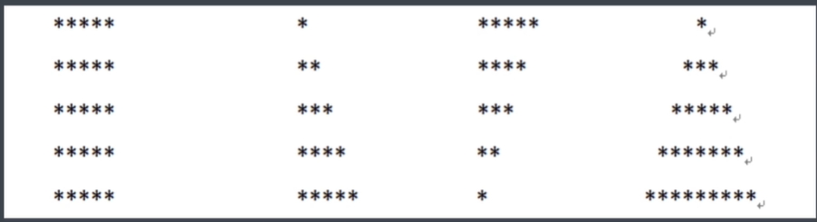
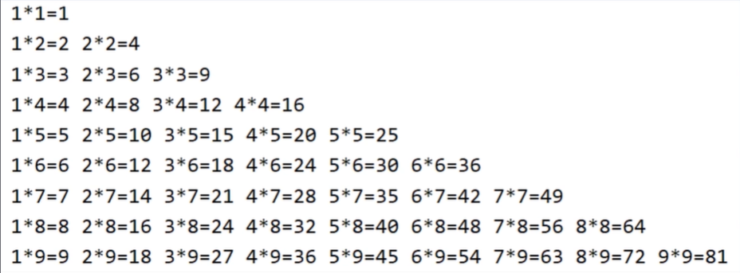

### 流程控制语句
#### if概念及使用
+ if分支结构
    ```java
        if(条件表达式) {
            语句块
        }
        // 条件成立，执行语句块
        // 条件不成立，不执行语句块
    ```
#### if查找最大值
+ 案例
    + 输入两个整数输出最大的
        ```java
            import java.util.*;
            public class test {
                
                public static void main(String[] args) {
                    Scanner input = new Scanner(System.in);

                    System.out.println("please input first number: ");
                    int a = input.nextInt();
                    System.out.println("please input first number: ");
                    int b = input.nextInt();
                    // 第一种方式直接比较
                    // if(a >= b) {
                    //     System.out.println("the bigge num is :"+ a);
                    // }
                    // if(a < b) {
                    //     System.out.println("the bigger num is :"+ b);
                    // }
                    // 第二种方式假定第一个是最大值，推荐方式，数值较多时比较通用
                    int max = a;
                    if(b > max) {
                        max = b;
                    }
                    System.out.println("the bigger num is :"+ max);
                }
            }
        ```
#### if-else概念及使用
+ 结构
    ```java
        if(条件表达式) {
            语句块1
        } else {
            语句块2
        }
        // 表达式成立，执行语句块1
        // 表达式不成立，执行语句块2
    ```
#### if-else判断正负
```java
    int num = 3;
    if(num < 0) {
        System.out.println(num+"是负数");
    } else {
        if(num > 0) {
            System.out.println(num+"是正数");
        } else {
            System.out.println(num);
        }
    }
```
#### if-elseif-else概念及使用
+ 语法结构
    ```java
        if(条件表达式1) {
            语句块1
        } else if(条件表达式2) {
            语句块2
        } else {
            语句块3
        }
        // 表达式1成立，执行语句块1并结束
        // 表达式1不成立，判断表达式2
        // 表达式2成立，执行语句块2并结束
        // 表达式2不成立，执行语句块3并结束
    ```
#### 个人所得税计算
```java
    import java.util.*;
    public class test {
        
        public static void main(String[] args) {
            Scanner input = new Scanner(System.in);
            double total = 0;
            System.out.println("please input your salary: ");
            int salary = input.nextInt();
            // 第一种方式按梯度逐层计算相加项
            // 个人所得税计算公式： 本月应纳税所得额*税率-速算扣除数（提前算好的数据）
            if(salary <= 5000) {
                System.out.println("无需纳税");
            } else if (salary <= 8000) {
                // total = (salary - 5000) * 0.03;
                total = (salary - 5000) * 0.03 - 0;
            } else if (salary <= 17000) {
                // total = (salary - 8000) * 0.1 + (8000 - 5000) * 0.03;
                total = (salary - 8000) * 0.1 - 210;
            } else if (salary <= 30000) {
                // total = (salary - 17000) * 0.2 + (17000 - 8000) * 0.1 + (8000 - 5000) * 0.03;
                total = (salary - 17000) * 0.2 - 1410;
            }
            System.out.println("the total is :"+ total);
        }
    }
```
#### 出租车计费系统
```java
    import java.util.*;
    public class test {
        
        public static void main(String[] args) {
            Scanner input = new Scanner(System.in);
            double total = 0;
            System.out.println("please input miles: ");
            int miles = input.nextInt();
            System.out.println("please input sec: ");
            int sec = input.nextInt();
            if(miles <= 3) {
                total += 13;
            } else if (miles <= 15) {
                total = 13 + (miles - 3)*2;
            } else {
                total = 13 + (15 - 3) * 2 + (miles -15) * 3; 
            }
            total += sec/150;
            System.out.println("the total is :"+ total);
        }
    }
```
#### if实现等级判断
```java
    import java.util.*;
    public class test {
        
        public static void main(String[] args) {
            Scanner input = new Scanner(System.in);
            char grade = 'A';
            System.out.println("please input your points: ");
            int point = input.nextInt();
            if(point > 89) {
                grade = 'A';
            } else if (point > 79) {
                grade = 'B';
            } else if (point > 69) {
                grade = 'C';
            } else if (point > 59) {
                grade = 'D';
            } else {
                grade = 'E';
            }
            System.out.println("等级是：" + grade);
        }
    }
```
#### switchcase概念
+ 结构
    ```java
        switch(变量/表达式) {
            case 字面值1:语句块1;break;
            case 字面值2:语句块2;break;
            case 字面值3:语句块3;break;
            ...
            default:语句块n;
        }
    ```
+ 注意case穿透
  
    + 当语句块执行之后没有break时会发生case穿透，即使变量不满足case要求依然会执行下一个语句块
+ 支持变量类型
    + 最开始
        + byte,short,char,int
    + jdk 1.5新增
        + 枚举
    + jdk 1.7新增
        + String
#### switchcase实现等级判断
```java
    import java.util.*;
    public class test {
        
        public static void main(String[] args) {
            Scanner input = new Scanner(System.in);
            System.out.println("please input your points: ");
            int point = input.nextInt();
            switch(point / 10) {
                case 10:
                case 9: System.out.println("等级A");break;
                case 8: System.out.println("等级B");break;
                case 7: System.out.println("等级C");break;
                case 6: System.out.println("等级D");break;
                default: System.out.println("等级E");
            }
        }
    }
```
#### for循环概念和使用
+ 结构
    ```java
        for(初始化表达式;条件表达式;修改初始值表达式) {
            循环体
        }
    ```
#### for循环三种方式打印奇数
```java
    for(int i = 1; i <= 100; i++) {
        if(i % 2 == 1) {
            System.out.println(i);
        }
    }
    for(int i = 1; i <= 100; i = i+2) {
        System.out.println(i);
    }
    for(int i = 1; i <= 50; i++) {
        System.out.println(2 * i - 1);
    }
```
#### for循环实现累加和
```java
    int sum = 0;
    for(int i = 1;i <= 10000;i++) {
        sum += i;
    }
    System.out.println(sum);
```
#### for循环打印水仙花数
+ 题目
    + 使用for循环打印三位数中的水仙花数
    + 水仙花数即一个整数满足其值等于各个数位的立方和
    + 153 = 1^3+5^3+3^3
    ```java
        import java.util.*;
        public class test {
            
            public static void main(String[] args) {
                for(int i = 100; i < 1000; i++) {
                    int three = (int)Math.pow(i/100, 3);
                    int two = (int)Math.pow(i % 100 / 10, 3);
                    int one = (int)Math.pow(i % 10, 3);
                    if(three + two + one == i) {
                        System.out.println(i);
                    }
                }
                
            }
        }
    ```
#### continue关键字
+ 题目
    + 打印1-20所有整数跳过5的倍数
        ```java
            for(int i = 1;i < 21;i++) {
                if(0 == i % 5) {
                    continue;
                }
                System.out.println(i);
            }
        ```
#### break模拟聊天
+ 题目
    + 允许用户不断输入内容直到用户输入bye
        ```java
            import java.util.*;
            public class test {
                
                public static void main(String[] args) {
                    
                    Scanner input = new Scanner(System.in);

                    for(;;) {
                        String str = input.nextLine();
                        if("bye".equals(str)) {
                            System.out.println("聊天结束");
                            break;
                        }
                    }
                }
            }
        ```
#### 猜数字游戏实现
+ 题目
    + 随机生成数字n(1-100),根据用户输入的数字判断大了还是小了，猜对就结束游戏
    ```java
        import java.util.*;
        public class test {
            
            public static void main(String[] args) {
                
                Scanner input = new Scanner(System.in);
                Random ra = new Random();
                int rand = ra.nextInt(100)+1;
                for(;;) {
                    System.out.println("please input your num: ");
                    int guess = input.nextInt();
                    if(rand > guess) System.out.println("it's smaller");
                    else if(rand < guess)System.out.println("it's bigger");
                    else {
                        System.out.println("it's right!");
                        break;
                    }
                }
            }
        }
    ```
#### 双重for循环
+ 结构
    ```java
        for(初始化表达式1;条件表达式2;修改初始化表达式3) {
            for(初始化表达式4;条件表达式5;修改初始化表达式6) {
                循环体;
            }
        }
    ```
+ break
    + 双重for循环直接break只能跳出内层循环不能完全终止，需要使用标号才能推出多层循环(标号名随便)
    ```java
        outer:for(;;) {
            for(;;) {
                break outer;
            }
        }
    ```
#### 各种星星图案的打印
+ 题目
    + 打印下面的各种星星
        
        
        ```java
            import java.util.*;
            public class test {
                
                public static void main(String[] args) {
                    
                    // for(int i = 0;i < 5;i++) {
                    //     for(int j = 0;j < 5;j++) {
                    //         System.out.print("*");
                    //     }
                    //     System.out.println();
            // }
        
                    // for(int i = 0;i < 5;i++) {
                    //     for(int j = 0;j <= i;j++) {
                    //         System.out.print("*");
                    //     }
                    //     System.out.println();
                    // }
                    // for(int i = 0;i < 5;i++) {
                    //     for(int j = 0;j < 5-i;j++) {
                    //         System.out.print("*");
                    //     }
                    //     System.out.println();
                    // }
                    for(int i = 0;i < 5;i++) {
                        for(int j = 0;j < 4-i;j++) {
                            System.out.print(" ");
                        }
                        for(int j = 0;j < 2*i+1;j++) {
                            System.out.print("*");
                        }
                        System.out.println();
                    }
                }
            }
        ```
#### 九九乘法表的打印
+ 题目
    + 打印九九乘法表
        
        ```java
            for(int i = 1;i <= 9;i++) {
                for(int j = 1;j <= i;j++) {
                    System.out.print(i+"*"+j+"="+i*j+" ");
                }
                System.out.println("");
            }
        ```
    + 当打印6*6结束后终止循环
        ```java
            outer:for(int i = 1;i <= 9;i++) {
                for(int j = 1;j <= i;j++) {
                    System.out.print(i+"*"+j+"="+i*j+" ");
                    if(6 == j) break outer;
                }
                System.out.println("");
            }
        ```
#### 素数打印及优化
+ 题目
    + 打印2-100之间所有素数
    + 当一个数只能被1和她本身整除时，叫素数
        ```java
            for(int i = 2;i <= 200;i++) {
            boolean flag = true;
            // for(int j = 2;j < i;j++) {
            for(int j = 2;j<Math.sqrt(i);j++) {
                // 优化，只需要循环到平方根就可以
                    if( 0 == i % j) {
                        flag = false;
                        break;
                    }
                }
                if(flag) System.out.println(i);
            }
        ```
    + 为什么循环到平方根就可以停止
      
        + 因为如果是一个合数，必然有一对因数是成对出现的，一个比平方根大一个比平方根小，所以如果到平方根之前都没有找到那对因数，平方根之后也不会找到
#### while循环概念和使用
+ 语法格式
    ```java
        while(条件表达式) {
            循环体
        }
        // 当条件表达式成立执行循环体
        // 直到条件表达式不成立，循环停止
    ```
+ 题目
    + 使用while循环计算调和数列累加和并打印
    + 1/1+1/2+1/4+···+1/n
        ```java
            int n = 1;
            double sum = 0;
            while(n < 10) {
                sum += (double)1/n;
                // 注意这边是对1进行强制类型转换而不是对1/n进行转换或者使用 sum += 1.0/n;
                n++;
            }
            System.out.println(sum);
        ```
#### while与for比较
+ while和for完全可以互换，推荐for循环
+ while适合明确循环条件但不明确循环次数的场合
+ for适合明确循环次数或范围的场合
+ while(true)和for(;;)都表示无限循环
#### while实现反向输出
+ 提示用户输入一个正整数，然后反向输出
    ```java
        import java.util.*;
        public class test {
            
            public static void main(String[] args) {
                Scanner input = new Scanner(System.in);
                int num = input.nextInt();
                while(num != 0) {
                    System.out.print(num%10);
                    num = num/10;
                }
            }
        }
    ```
    ```java
        import java.util.*;
        public class test {
            
            public static void main(String[] args) {
                Scanner input = new Scanner(System.in);
                int num = input.nextInt();
                Deque<Integer> queue = new LinkedList<>();
                while(num != 0) {
                    queue.add(num%10);
                    num = num/10;
                }
                while(!queue.isEmpty()) {
                    System.out.print(queue.poll());
                }
            }
        }
    ```
#### dowhile概念和使用
+ 语法
    ```java
        do{
            循环体;
        } while (条件表达式);
    ```
+ dowhile和while循环的区别
  
    + 条件表达式不成立的情况下dowhile至少执行一次循环
#### dowhile模拟任务检查
+ 题目
    + 模拟学习任务是否合格的检查，如果合格则停止，否则重新完成任务
        ```java
            import java.util.*;
            public class test {
                
                public static void main(String[] args) throws Exception{
                    Scanner input = new Scanner(System.in);
                    String temp = null;
                    do{
                        System.out.println("studying !");
                        Thread.sleep(5000);
                        System.out.println("please value: y/n");
                        temp = input.next();
                    } while ("n".equals(temp));
                }
            }
        ```
#### 循环笔试考点
+ 十动然拒（十分感动然后拒绝？？？）
    ```java
        int i = 1;
        while(i < 10000); {
            System.out.println("I LOVE YOU");
        }
        // 这边输出不能执行，因为执行语句被更改成了;相当于
        while(i < 10000) {
            ;
        }
        {
            System.out.println("I LOVE YOU");
        }
        // 因为没有机会更改条件，所以死在了第一步
        // 破局之道，只要能够坚持舔到最后还是可以应有尽有的,分号前更改条件变量值
        while(i < 10000) i++; {
            System.out.println("I LOVE YOU");
        }
    ```
+ while结构
    ```java
        while(表达式) {
            循环体
        } {
            语句块
        }
        // 循环结束之后，会执行语句块内的内容，该语句块和while没有任何关系，可以看成普通代码块只是执行完立刻释放
    ```
#### 总结