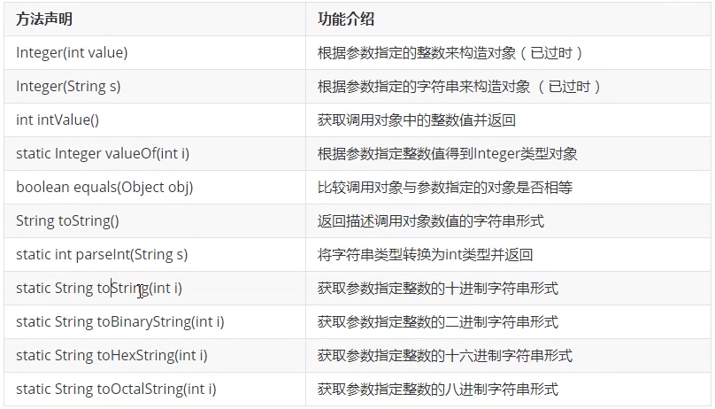
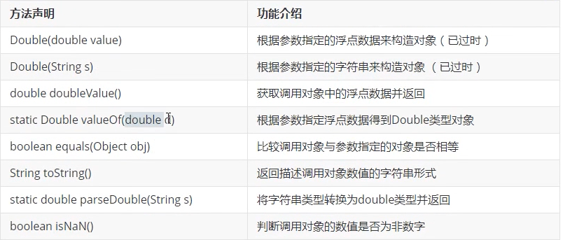
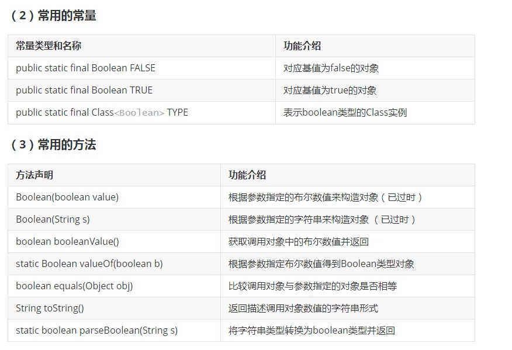
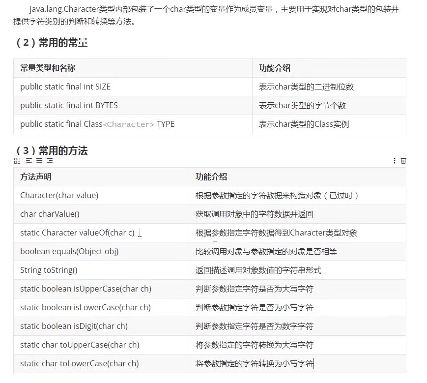
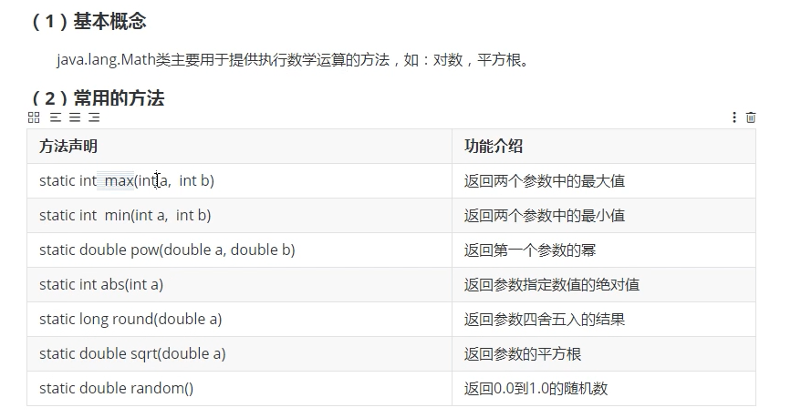
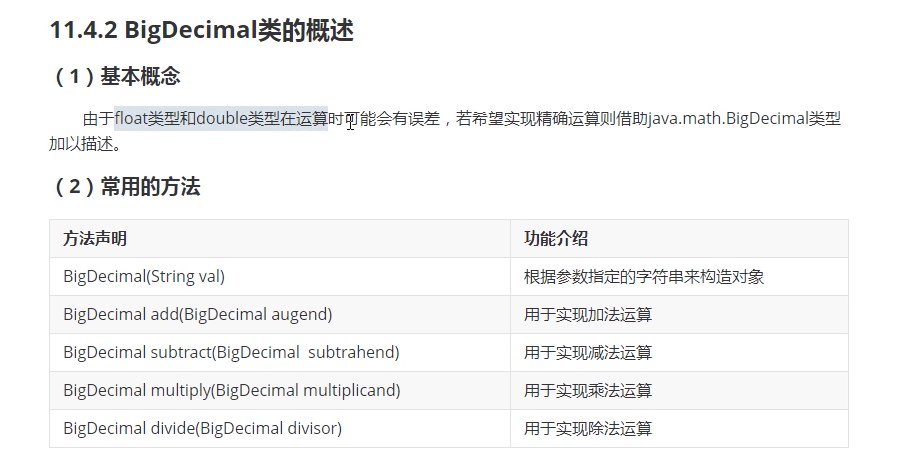
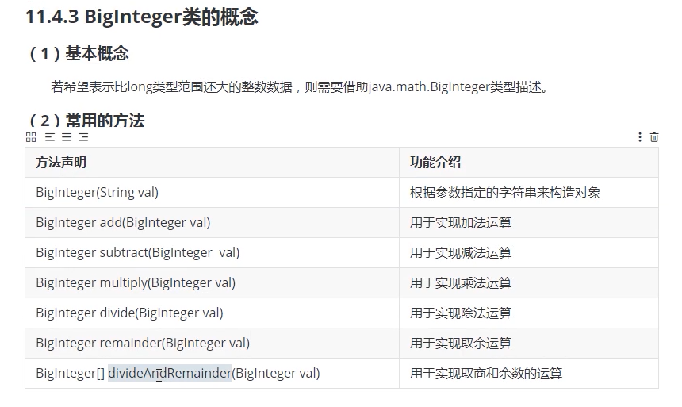

### 常用类的概述和使用
#### API的使用和常用包的概述
#### Object类的概念和构造方法
+ 描述
    + java.lang.Object类是java类中层次结构的根类，也就是说任何一个类都是该类的直接或者间接子类
    + 如果定义一个java类时没有用extends关键字声明其父类，则其父类为java.lang.Object类
    + Object类定义了对象的基本行为，被子类默认继承
+ 常用方法
    + Object()
        + 使用无参方式构造对象
    + boolean equals(Object obj)
        + 判断该对象与参数是否相等
            + 该方法默认比较两个对象的地址是否相等，与==运算符结果一致
            + 如果希望比较两个对象的内容，需要重写该方法
            + 若该方法被重写，则应该重写hascode方法来保证一致性
        + 注意调用该方法的对象不能为null否则会出现空指针异常
    + int hashCode()
        + 用于获取对象的hash码值（内存地址的编号）
        + 若两个对象调用equals方法相等，则各自调用该方法值必须相同
        + 若两个对象调用equals方法不等，则各自调用该方法值应该不同
        + 为了使该方法与equals方法保持一致，需要重写该方法
    + String toString()
        + 用于获取调用对象的字符串形式
        + 该方法默认返回的字符串为：包名.类名@哈希码值的十六进制(就是hashcode的十六进制)
        + 为了返回更有意义的数据，需要重写该方法
        + 使用print或者println打印引用或字符串拼接引用都会调用该方法
    + Class<?> getClass()
        + 用于返回调用对象执行时的class实例，反射机制使用
#### equals方法默认功能的使用
+ 创建学生类后比较两个对象
    ```java
        Student s1= new Student(1,"luna");
        Student s2= new Student(1,"saber");
        System.out.println(s1.equals(s2));
    ```
#### equals方法的重写
+ 示例
    ```java
        @Override
        public boolean equals(Object obj) {
            // Object父类想要调用Student子类中的方法需要进行强制转换
            // 为了防止类型转换异常需要提前判断引用是否指向student类
            if(obj instanceof Student) {
                Student s = (Student) obj;
                return this.getId() == s.getId();
            } else return false;
        }
    ```
#### equals方法的优化
+ 示例
    ```java
        @Override
        public boolean equals(Object obj) {
            
            // 如果指向同一个对象返回true
            if(this == obj) return true;
            // 如果比较对象为null返回false
            if(null == obj) return false;
            // 为了防止类型转换异常需要提前判断引用是否指向student类
            if(obj instanceof Student) {
                Student s = (Student) obj;
                return this.getId() == s.getId();
            } else return false;
        }
    ```
#### hashcode方法的重写实现
+ 示例
    ```java
        /**
        * 重写hashCode使其与equals结果一样
        */
        @Override
        public int hashCode() {
            // 随便处理一下返回值使之即与id对应又有所区别
            final int base = 24;
            int change = base*12;
            return change + getId();
        }
    ```
#### toString方法的重写实现
+ 示例
    ```java
        /**
         * 重写toString
         * 1.当打印引用变量时会自动调用该方法
         * print/println(Student stu)
         * 2.当打印时进行字符串拼接时也会自动调用该方法
         * println(str = str + stu);
         */
        public String toString() {
            return "Student[id: "+getId()+" name: "+getName()+"]";
        }
    ```
#### 姓名作为基准的重写实现
+ equals重写
    ```java
        @Override
        public boolean equals(Object obj) {

            // 如果指向同一个对象返回true
            if(this == obj) return true;
            // 如果比较对象为null返回false
            if(null == obj) return false;
            // 为了防止类型转换异常需要提前判断引用是否指向student类
            if(obj instanceof Student) {
                Student s = (Student) obj;
                // 以学号为基准判断对象相等 int是基本数据类型，内存空间存放的就是数据本身，使用==可以判断数据是否相同
                // return this.getId() == s.getId();
                // 以姓名为基准判断对象相等 String是引用数据类型，内存空间存放的是地址，使用==比较的是地址而不是数据本身
                // return this.getName() = s.getName();
                // String类内部重写了equals方法用于比较String类型内容是否相等
                return this.getName().equals(s.getName());
            } else return false;
        }
    ```
+ hashCode重写
    ```java
        /**
        * 重写hashCode使其与equals结果一样
        */
        @Override
        public int hashCode() {
            // 随便处理一下返回值使之即与id对应又有所区别
            final int base = 24;
            int change = base*12;
            // 以学号为基准
            // return change + getId();
            // 以姓名为基准,String内部重写了hashcode方法相同字符串返回相同数字
            return change + getName().hashCode();
        }
    ```
#### equals和hascode方法的生成
+ alt+insert
#### 包装类的概念和生成
+ 概念
    + 为了满足一切皆对象的概念，需要对基本数据类型的变量进行打包封装处理成对象，而负责将这些变量声明为成员变量进行对象化处理的相关类叫做包装类
#### Integer类的概念和构造方法
+ 概念
  
    + java.lang.Integer类内部包装了一个int类型变量作为成员变量，主要用于实现对int类型的包装并且提供int类型到String类型之间的转换等方法
+ 常用变量
    ```java
        System.out.println("最大值是："+Integer.MAX_VALUE);     // 2^32-1
        System.out.println("最小值是："+Integer.MIN_VALUE);     // -2^32
        System.out.println("所表示二进制为："+Integer.SIZE);    // 32
        System.out.println("所占字节数是："+Integer.BYTES);     // 4
        System.out.println("对应类型的实例是："+Integer.TYPE);  // int
    ```
+ 构造方法
    ```java
        // 两种过时的
        Integer i1 = new Integer(123);
        Integer i2 = new Integer("123");
        // 目前的主流方法valueOf（传参字符串和数字都可以）
        // valueOf方法可以将int类型和String类型转换为Integer类型
        Integer i3 = Integer.valueOf(123);
        System.out.println(Integer.valueOf("123"));
    ```
+ 常用方法
    + static valueOf()
    + intValue()
        + 将Integer转变为int类型
#### Integer类的装箱和拆箱机制
+ java5前
    + valueOf方法将int类型转变为Integer类型的过程叫做装箱
    + intValue方法将Integer类型转变为int类型叫做拆箱
+ java5后自动拆装
    + 直接通过赋值运算符完成拆装
        ```java
            Integer i1 = 5; // 装箱
            int i2 = i1;    // 拆箱
        ```
+ 装箱拆箱笔试考点
    ```java
        Integer i1 = 128;
        Integer i2 = 128;
        Integer i5 = 127;
        Integer i6 = 127;
        Integer i3 = new Integer(128);
        Integer i4 = new Integer(127);
        System.out.println(i1 == i2);       // 比较地址 false
        System.out.println(i1.equals(i2));  // 比较内容 true
        System.out.println(i3 == i4);       // 比较地址 false
        System.out.println(i3.equals(i4));  // 比较内容 true
        System.out.println(i5 == i6);       // 比较地址 true 为什么这边是true内见下自动装箱
        System.out.println(i5.equals(i6));  // 比较内容 true
    ```
+ 自动装箱池
  
    + 在Integer类中提供了自动装箱池技术，-128——127之间的整数装箱完毕，大概程序使用该范围内的整数时，无序装箱直接到自定装箱池中取就好了，从而提高效率（也就是说-128——127内装箱获取的对象不会创建新的内存空间而是调用默认的对象，不同引用对该范围内同一个数字进行装箱时指向同一个对象）
#### Integer类的常用方法
+ 进制转换示例
    ```java
        Integer i1 = 200;
        System.out.println(Integer.toString(i1));
        System.out.println(Integer.toBinaryString(i1));
        System.out.println(Integer.toOctalString(i1));
        System.out.println(Integer.toHexString(i1));
        System.out.println(Integer.parseInt(Integer.toHexString(i1),16));
    ```


#### Double类的概念和使用
+ 概念
+ 常用方法

+ 装拆箱示例
    ```java
        // java5前手动
        Double d1 = Double.valueOf(3.14);
        double d2 = d1.doubleValue();
        // java5后自动
        Double d3 = 3.14;
        double d4 = d3;
    ```

#### Boolean类的概念和使用
+ 概念
    + java.lang.Boolean类型内部包装了一个boolean类型的变量作为成员变量，主要用于实现对boolean的包装并提供boolean和String类型之间转换的方法


#### Character类的概念和使用
+ 概念

+ 使用
    ```java
        Character c = 'c';

        System.out.println(Character.isDigit(c));       // 字符是否为数字型
        System.out.println(Character.isUpperCase(c));   // 字符是否为大写
        System.out.println(Character.isLowerCase(c));   // 字符是否为小写
        System.out.println(Character.toUpperCase(c));   // 字符转换为大写
        System.out.println(Character.toLowerCase(c));   // 字符转换为小写
    ```

#### 包装类的使用总结
+ 基本数据类型转对应包装类的方式
    + 调用包的构造方法或静态方法就可以
+ 获取包装类对象中基本数据类型数值的方式
    + 调用xxxValue()方法即可
+ 字符串转换为基本诗句类型
    + 调用parseXxx()方法即可
#### Math类的概念和使用


#### BigDecimal类的概念和使用
+ 注意
    + 如果使用该类型进行操作后得到无限循环小数不能精确表示将会报错，这时需要制定模式
    + 示例
        ```java
            BigDecimal b1 = new BigDecimal("5.2");
            BigDecimal b2 = new BigDecimal("2.3");

            System.out.println(b1.add(b2));
            System.out.println(b1.subtract(b2));
            System.out.println(b1.multiply(b2));
            System.out.println(b1.divide(b2,RoundingMode.HALF_UP));
        ```
     

#### BigInteger类的概念和使用
 