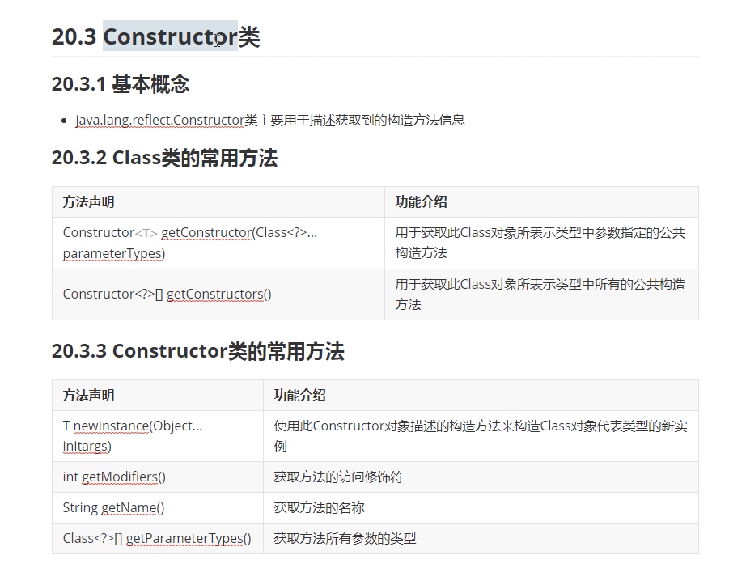
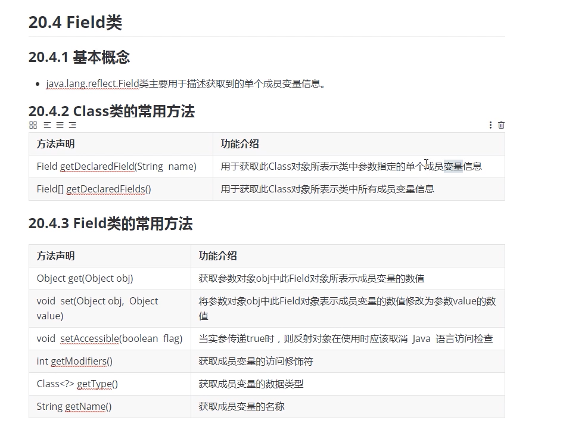
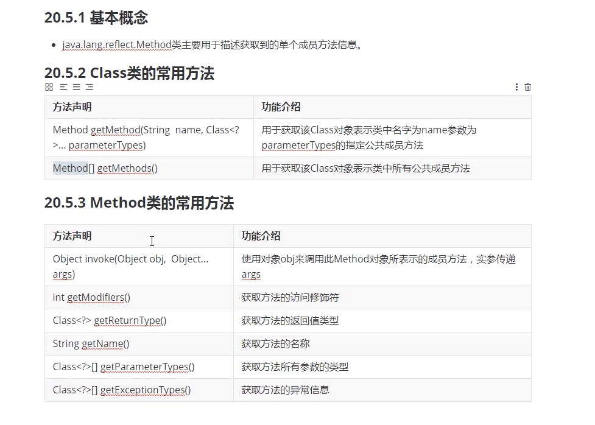
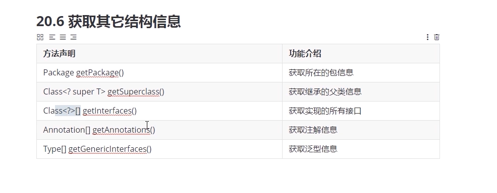

### 反射机制

#### 反射机制基本概念

+ 通常情况下编写代码都是固定的，无论运行多少次执行的结果都是固定的，在某些特殊场合编写代码时不确定要创建什么类型的对象，也不确定要调用什么样的方法，这些都希望通过运行时，传递的参数来决定，该机制叫做动态编程技术，也就是反射机制

+ 反射机制就是用于动态调用方法的机制

+ 目前主流的框架底层都是采用反射机制实现的

+ 如：

  ```java
  Person p = new Person(); 	 //表明Person类型的引用指向Person类型的对象
  p.show();	 // 表示调用Person类中的成员方法show();
  ```

#### Class类的概念和Class对象的基本方式

+ 基本概念

  + java.lang.Class类的实例可以用于描述java应用程序中的类和接口，也就是一种数据类型
  + 该类没有公共构造方法，该类的实例由java虚拟机和类加载器自动构造完成，本质上就是加载到内存中的运行时类

+ 获取Class对象的方式

  + 使用数据类型.class的方式可以获取对应类型的Class对象
  + 使用引用/对象 get.class() 的方式可以获取对应类型的Class对象
  + 使用包装类.TYPE的方式可以获取对应基本数据类型的Class对象
  + 使用Class.forName()的方式来获取参数指定类型的Class对象
  + 使用类加载器ClassLoader的方式获取指定类型的Class对象

+ 常用方法

  ```java
  static Class<?> forName(String className) // 用于获取参数指定类型对应的Class对象并返回
  T newInstance()		// 用于创建该Class对象所表示类的新实例
  ```

  

#### 获取class对象的基本方式

+ demo

  ```java
  public class ClassTest {
  
      public static void main(String[] args) {
  
          Class c1;
          // 使用数据类型.class的方式可以获取对应类型的Class对象
          System.out.println(String.class);   // java.lang.String
          System.out.println(int.class);      // int
          System.out.println(void.class);     // void
          // 使用引用/对象 get.class() 的方式可以获取对应类型的Class对象
          Integer i1 = Integer.valueOf(20);
          System.out.println(i1.getClass());  // class java.lang.Integer
          int i2 = 3;
          // System.out.println(i2.getclass()); 报错，因为方法只属于引用数据类型，基本数据类型不能调用方法
          // 使用包装类.TYPE的方式可以获取对应基本数据类型的Class对象
          System.out.println(Integer.TYPE); // int 包装类的TYPE方法返回的是对应基本诗句类型的对象
          // 使用Class.forName()的方式来获取参数指定类型的Class对象
          try {
              c1 = Class.forName("java.lang.String"); // forName必须具体到类的位置，并且不能获取基本数据类型对象
          } catch (ClassNotFoundException e) {
              e.printStackTrace();
          }
          // 使用类加载器ClassLoader的方式获取指定类型的Class对象
          ClassLoader classLoader = ClassTest.class.getClassLoader(); // 注意这个类是否为空
          try {
              c1 = classLoader.loadClass("java.lang.String");
              System.out.println(c1);
          } catch (ClassNotFoundException e) {
              e.printStackTrace();
          }
      }
  }
  
  ```

  

#### 无参方式创建对象的两种形式

+ demo

  ```java
  public class PersonContructorTest {
  
      public static void main(String[] args) throws Exception {
  
          // 原始方式无参构造 Person对象
          Person p1 = new Person();
          System.out.println(p1.toString());
          // 反射机制无参构造
          /*从键盘输入创建对象类型
          Scanner sc = new Scanner(System.in);
          System.out.println("please input name of class:");
          String str = sc.next();*/
          // 从配置文件中读取类配置信息 这里只写了com.Ivan.task05.Person
          BufferedReader br = new BufferedReader(new InputStreamReader(new FileInputStream("f:/test/1.txt")));
          String str = br.readLine();
          Class c1 = Class.forName(str);
          System.out.println(c1.newInstance());
  
      }
  }
  ```

  

#### 无参方式构造对象的优化

+ Constructor类

  + 基本概念

    + java.lang.reflect.Constructor类主要用于描述获取到的构造方法信息

  + Class类和Constructor的常用方法

    

  + demo

    ```java
    public class PersonContructorTest {
    
        public static void main(String[] args) throws Exception {
    
            // 原始方式无参构造 Person对象
            Person p1 = new Person();
            System.out.println(p1.toString());
            // 反射机制无参构造
            /*从键盘输入创建对象类型
            Scanner sc = new Scanner(System.in);
            System.out.println("please input name of class:");
            String str = sc.next();*/
            // 从配置文件中读取类配置信息 这里只写了com.Ivan.task05.Person
            BufferedReader br = new BufferedReader(new InputStreamReader(new FileInputStream("f:/test/1.txt")));
            String str = br.readLine();
            Class c1 = Class.forName(str);
            // System.out.println(c1.newInstance()); 获取无参方式创建的对象废弃版
            // 获取Class对象中的无参构造方法
            Constructor constructor = c1.getConstructor();
            // 使用获取到的无参构造方法创建对象
            System.out.println(constructor.newInstance());
    
        }
    }
    ```

    

#### 有参方式构造对象的两种形式

+ demo

  ```java
  // 3.原始有参方式构造对象
  Person p2 = new Person("luna",16);
  System.out.println("有参： "+ p2);
  // 4.反射机制有参构造
  Constructor constructor1 = c1.getConstructor(String.class, int.class);
  System.out.println("有参： "+ constructor1.newInstance("saber",18));
  ```

  

#### 获取所有构造方式的实现

+ demo

  ```java
  // 5.使用反射机制获取所有公共构造方法
  Constructor[] constructors = c1.getConstructors();
  for(Constructor temp : constructors) {
      System.out.println("构造方法的访问修饰符是："+temp.getModifiers());
      System.out.println("构造方法的方法名称是："+temp.getName());
      Class[] parameterTypes = temp.getParameterTypes();
      System.out.println("构造方法的所有参数类型是："+ Arrays.toString(parameterTypes));
  }
  ```

  

#### 获取成员变量数值的两种形式

+ intro

  

+ demo

  ```java
  public class PersonFieldTest {
  
      public static void main(String[] args) throws Exception {
  
          // 1.使用原始方式构造对象
          Person p1 = new Person("luna",16);
          System.out.println(p1.getName());
          // 2.使用反射机制来构造对象以及获取成员变量的数值并打印
          // 2.1 获取Class对象
          Class c1 = Class.forName("com.Ivan.task05.Person");
          // 2.2 根据对象获取有参构造函数
          Constructor constructor = c1.getConstructor(String.class, int.class);
          // 2.3 根据有参构造方法获取Person类型对象
          Object object = constructor.newInstance("saber", 17);
          // 2.4 根据Class对象获取对应成员的变量信息
          Field field = c1.getDeclaredField("name");
          // 2.5 使用Person类型的对象来获取成员变量的数值并打印
          // 只能打印公共变量。。。私有的仍然不可访问
          System.out.println(field.get(object));
      }
  }
  
  ```

  

#### 修改成员变量数值的两种形式

+ demo

  ```java
  public class PersonFieldTest {
  
      public static void main(String[] args) throws Exception {
  
          // 1.使用原始方式构造对象
          Person p1 = new Person("luna",16);
          System.out.println(p1.getName());
          // 2.使用反射机制来构造对象以及获取成员变量的数值并打印
          // 2.1 获取Class对象
          Class c1 = Class.forName("com.Ivan.task05.Person");
          // 2.2 根据对象获取有参构造函数
          Constructor constructor = c1.getConstructor(String.class, int.class);
          // 2.3 根据有参构造方法获取Person类型对象
          Object object = constructor.newInstance("saber", 17);
          // 2.4 根据Class对象获取对应成员的变量信息
          Field field = c1.getDeclaredField("name");
          // 取消java语言访问检查,这样就可以访问和修改私有成员变量
          field.setAccessible(true);
          // 2.5 使用Person类型的对象来获取成员变量的数值并打印
          // 只能打印公共变量。。。私有的仍然不可访问
          System.out.println(field.get(object));
          // 3. 使用原始方式修改成员变量
          p1.setName("sakura");
          System.out.println(p1.getName());
          // 4. 使用反射机制修改指定对象中成员变量的数值后再打印
          field.set(object,"korito");
          System.out.println(field.get(object));
      }
  }
  
  ```

  

#### 获取所有成员变量数值的实现

+ demo

  ```java
  // 5. 获取class类中所有的成员变量
          Field[] declaredFields = c1.getDeclaredFields();
          for(Field temp : declaredFields) {
              System.out.println("修饰符 "+temp.getModifiers());
              System.out.println("变量名 "+temp.getName());
              System.out.println("变量类型 "+temp.getType());
          }
  ```

  

#### setAccessible

 + 用于接触访问限制在对方法和变量都有效（method和field）

+ demo

  ```java
  public class Test {
  
      public static void main(String[] args) throws Exception {
  
          Class c1 = Class.forName("com.Ivan.test.Person");
          Constructor constructor = c1.getConstructor(int.class,String.class);
          Object luna = constructor.newInstance(16, "luna");
          
          Method getAge = c1.getDeclaredMethod("getAge"); // 私有化方法getAge
          getAge.setAccessible(true);
          Object invoke = getAge.invoke(luna);
          System.out.println(invoke);     // 16
          
          Field field = c1.getDeclaredField("name");
          field.setAccessible(true);
          field.set(luna,"sakura");
          System.out.println(field.get(luna));    // sakura
  
  
      }
  }
  
  ```

  

#### 获取成员方法的两种形式

+ demo

  ```java
  public class PersonMethodTest {
  
      public static void main(String[] args) throws Exception {
  
          // 1.使用原始方式构造对象并调用方法打印结果
          Person p1 = new Person();
          System.out.println(p1.getName());
          // 2.使用反射机制构造对象并调用方法打印结果
          // 2.1 获取class对象
          Class c1 = Class.forName("com.Ivan.task05.Person");
          // 2.2 根据class对象获取对应的有参构造方法
          Constructor constructor = c1.getConstructor(String.class, int.class);
          // 2.3 使用有参构造方法构造对象并记录
          Object object = constructor.newInstance("luna", 16);
          // 2.4 根据class对象获取对应的成员方法
          Method method = c1.getMethod("getName");
          // 2.5 使用对象调用成员方法进行打印
          // 使用object对象调用method表示的方法
          System.out.println(method.invoke(object));
      }
  }
  
  ```

  

#### 获取所有成员方法的实现

+ methods

  

+ demo

  ```java
  // 3. 使用反射机制来获取类中的所有成员方法并打印
          Method[] methods = c1.getMethods();
          for(Method temp : methods) {
              System.out.println(temp.getModifiers());
              System.out.println(temp.getName());
              System.out.println(temp.getReturnType());
              System.out.println(Arrays.toString(temp.getParameterTypes()));
              System.out.println(Arrays.toString(temp.getExceptionTypes()));
          }
  ```

  

#### 获取其他结构的实现

+ intro

  

+ Student

  ```java
  @MyAnnotation
  public class Student<T,E> extends Person implements Comparable<String>, Serializable {
  
      @Override
      public int compareTo(String str) {
          return 0;
      }
  }
  ```

+ StudentTest

  ```java
  public class StudentTest {
  
      public static void main(String[] args) throws Exception {
  
          Class c1 = Class.forName("com.Ivan.task05.Student");
          System.out.println("包信息： "+c1.getPackage());
          System.out.println("父类信息： "+c1.getSuperclass());
          System.out.println("接口信息： "+Arrays.toString(c1.getInterfaces()));
          System.out.println("注解信息： "+Arrays.toString(c1.getAnnotations()));
          System.out.println("泛型信息： "+Arrays.toString(c1.getGenericInterfaces()));
  
      }
  }
  ```

  

