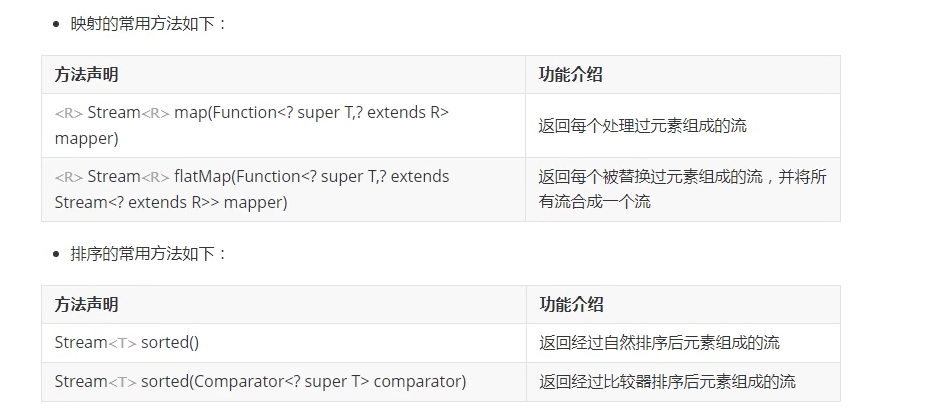

### 新特性

#### java8的概述和函数式接口的概念

+ 概述

  + java8是一个java语言的一个重要版本，该版本在2014年发布，是java5以来革命性的版本，这个版本包含语言，编译器，库，工具，jvm等新特性

+ 函数式接口

  + 函数式接口是指只包含一个抽象方法的接口：如java.lang.Runnable，java.util.Comparator接口等

  + java8提供@FunctionalInterface注解来定义函数式接口，若定义的接口不符合函数式的规范便会报错

  + java8中增加了java.util.function包，该包包含了常用的函数式接口，具体如下：

    | 接口名称      | 方法声明          | 功能介绍                     |
    | ------------- | ----------------- | ---------------------------- |
    | Consumer<T>   | void accept(T t)  | 根据指定的参数执行操作       |
    | Supplier<T>   | T get()           | 得到一个返回值               |
    | Function<T,R> | R apply(T t)      | 根据指定的参数执行操作并返回 |
    | Predicate<T>  | boolean test(T t) | 判断指定的参数是否满足条件   |

+ Lambda表达式

  +  Lambda表达式是实例化函数式接口的重要方式，使用Lambda表达式可以是代码变的更加简洁紧凑

  + Lambda表达式：参数列表，箭头符号 -> 和方法体组成，而方法体可以是表达式也可以是语句块
  + 语法格式：（参数列表） -> {方法体；} —— 其中（），参数类型，{}，return关键字可以省略

#### 匿名内部类实现函数式接口

+ demo

  ```java
  public class FunctionalInterface {
  
      public static void main(String[] args) {
  
          Runnable runnable = new Runnable() {
              @Override
              public void run() {
                  System.out.println("我是无参无返回值的方法");
              }
          };
          runnable.run();
  
          Consumer consumer = new Consumer() {
              @Override
              public void accept(Object o) {
                  System.out.println("有参无返回值");
              }
          };
          consumer.accept("???");
  
          Supplier supplier = new Supplier() {
              @Override
              public Object get() {
                  return "无参有返回值";
              }
          };
          System.out.println(supplier.get());
  
          Function function = new Function() {
              @Override
              public Object apply(Object o) {
                  return o;
              }
          };
          System.out.println(function.apply("有参有返回值"));
  
          Comparator comparator = new Comparator() {
              @Override
              public int compare(Object o1, Object o2) {
                  return 0;
              }
          };
          System.out.println(comparator.compare(10, 20));
      }
  }
  
  ```

  

#### lambda表达式实现函数式接口

+ demo

  ```java
  public class FunctionalInterface {
  
      public static void main(String[] args) {
  
          Runnable runnable = () -> System.out.println("无参无返回值");
          runnable.run();
  
          // 如果参数列表中参数只有一个时，小括号可以省略
          Consumer consumer = o -> System.out.println("有参无返回值");
          consumer.accept("???");
  
          // return可以省略
          Supplier supplier = () -> "无参有返回值";
          System.out.println(supplier.get());
  
          Function function = obj -> obj;
          System.out.println(function.apply("有参有返回值"));
  
          // 参数类型可以省略
          Comparator comparator = (o1, o2) -> 0;
          System.out.println(comparator.compare(10, 20));
      }
  }
  ```

  

#### 方法引用实现函数式接口的方式

+ 概述

  + 方法引用主要通过方法的名字来指向一个方法而不需要为方法引用提供方法体，该方法的调用交给函数式接口执行
  + 方法引用使用一对冒号 ：：将类名或对象与方法名进行连接，通常使用方式如下
    + 对象的非静态方法引用 ObjectName :: MethodName
    + 类的静态方法引用 ClassName :: StaticMethodName
    + 类的非静态引用 ClassName :: MethodName
    + 构造器的引用 ClassName :: new
    + 数组的引用 TypeName[] :: new

+ demo

  ```java
  public class MethodReferenceTest {
  
      public static void main(String[] args) {
  
          Person person = new Person("zhangfei",30);
  
          // 匿名内部类
          /*Runnable runnable = new Runnable() {
              @Override
              public void run() {
                  person.show();
              }
          };*/
          // lambda表达式
          /*Runnable runnable = () -> person.show();*/
  
  
          // 使用方法引用的方式调用person对象中的show方法
          Runnable runnable = person::show;
          runnable.run();
  
          // 使用匿名内部类的方式通过函数式接口Consumer中的方法来实现Person类中setName()方法的调用
          /*Consumer<String> consumer = new Consumer<String>() {
              @Override
              public void accept(String s) {
                  person.setName(s);
              }
          };
          consumer.accept("luna");*/
  
          // lambda表达式
          /*Consumer<String> consumer = s -> person.setName(s);
          consumer.accept("luna");*/
  
          // consumer方法引用
          Consumer<String> consumer = person::setName;
          consumer.accept("luna");
  
          // 通过supplier调用getName()方法
          Supplier<String> supplier = person::getName;
          supplier.get();
  
          // function调用Integer.parseInt()
          Function<String,Integer> function = Integer::parseInt;
          function.apply("1234");
  
          // comparator调用Integer.compara()
          Comparator<Integer> comparator = Integer::compare;
          comparator.compare(10,11);
  
          // 通过类名调用非静态方法
          // 其中一个参数对象作为调用对象来调用方法时，可以采用上述方式
          // 匿名内部类写法
          /*Comparator<Integer> comparator1 = new Comparator<Integer>() {
              @Override
              public int compare(Integer o1, Integer o2) {
                  return o1.compareTo(o2);
              }
          };*/
          // 方法引用写法，因为这边是一个对象作为参数另一个对象调用方法所以跨域使用类名::方法
          Comparator<Integer> comparator1 = Integer::compare;
          comparator1.compare(12,13);
  
          // 匿名内部类的方式通过supplier函数式接口创建Person类型的对象并返回
          /*Supplier<Person> supplier1 = new Supplier<Person>() {
              @Override
              public Person get() {
                  return new Person();
              }
          };
          System.out.println(supplier1.get());*/
  
          // lambda表达式创建对象
          /*Supplier<Person> supplier1 = () -> new Person();*/
  
          // 方法引用创建对象
          /*Supplier<Person> supplier1 = Person::new;
          System.out.println(supplier1.get());*/
  
          // 匿名内部类采用有参方式创建对象
          /*BiFunction<String,Integer,Person> biFunction = new BiFunction<String, Integer, Person>() {
              @Override
              public Person apply(String s, Integer integer) {
                  return new Person(s,integer);
              }
          };
          biFunction.apply("luna",16);*/
  
          // lambda表达式
          /*BiFunction<String,Integer,Person> biFunction = (s,i) -> new Person(s,i);
          System.out.println(biFunction.apply("luna",16));*/
  
          // 方法引用创建对象
          /*BiFunction<String,Integer,Person> biFunction = Person::new;
          System.out.println(biFunction.apply("luna",16));*/
  
          // 使用匿名内部类的方式通过Function函数式接口创建指定数量的的Person类型的对象数组并返回
          /*Function<Integer,Person[]> function1 = new Function<Integer, Person[]>() {
              @Override
              public Person[] apply(Integer integer) {
                  return new Person(integer);
              }
          };
          Person[] apply = function1.apply(3);
          System.out.println(Arrays.toString(apply));*/
  
          // lambda表达式
          /*Function<Integer,Person[]> function1 = i -> new Person[i];
           * function1.apply(5);*/
  
          // 方法引用
          /*Function<Integer,Person[]> function1 = Person[]::new;
          function1.apply(5);*/
      }
  }
  
  ```

  

#### 方法引用实现函数式接口的方式二

#### 方法引用实现函数式接口的方式三

#### 方法引用实现函数式接口的方式四

#### 方法引用实现函数式接口的方式五

#### 方法引用实现函数式接口的方式六

+ 如demo所示

#### 使用List集合实现元素的过滤

+ 案例

  + 准备一个List集合并放入Person类型的对象，将集合中所有成年人过滤出来放到另一个集合中并打印出来

+ demo

  ```java
  public class ListPersonTest {
  
      public static void main(String[] args) {
  
          // 1.准备一个List集合放入Person对象并打印
          List<Person> list = new ArrayList<>();
          list.add(new Person("luna",16));
          list.add(new Person("sakura",16));
          list.add(new Person("ivan",22));
          list.add(new Person("blade",22));
          // 2.将List集合中所有的成年人过滤出来放入另一个集合中并打印
          List<Person> list1 = new ArrayList<>();
          for(Person p : list) {
              if(p.getAge() > 18) list1.add(p);
          }
          System.out.println(list1);
      }
  }
  ```


#### Stream流实现集合元素的过滤和打印
+ 基本概念

  + java.util.stream.Stream接口是对集合功能的增强，可以对集合元素进行复杂的查找，过滤，筛选操作
  + Stream接口借助lambda表达式极大的提高编程效率和程序可读性，同时它提供串行和并行两种模式进行汇聚操作，并发模式能够充分利用多核处理器的优势

+ 使用步骤

  + 创建Stream，通过一个数据源获取一个流
  + 转换Stream，每次转换返回一个新的Stream对象
  + 对Stream进行聚合操作并产生结果

+ 创建方式

  + 方式一：通过调用集合的默认方法来获取流，如default Stream<E> stream()
  + 方式二：通过数组工具类中的静态方法获取流，如static IntStream stream(int[] array)
  + 方式三：通过Stream接口的静态方法获取流，如static<T> Stream<T>  of(T... values)
  + 方式四：通过Stream接口的静态方法来获取流，static<T> Stream<T> generate(Supplier<? extends T>s)
  
+ demo

  ```java
  public class ListPersonTest {
  
      public static void main(String[] args) {
  
          // 1.准备一个List集合放入Person对象并打印
          List<Person> list = new ArrayList<>();
          list.add(new Person("luna",16));
          list.add(new Person("sakura",16));
          list.add(new Person("ivan",22));
          list.add(new Person("blade",22));
          // 2.将List集合中所有的成年人过滤出来放入另一个集合中并打印
          /*List<Person> list1 = new ArrayList<>();
          for(Person p : list) {
              if(p.getAge() > 18) list1.add(p);
          }*/
          /*System.out.println(list1);*/
  
          // 使用Stream实现上述功能
          list.stream().filter(new Predicate<Person>() {
              @Override
              public boolean test(Person person) {
                  return person.getAge() >= 18;
              }
          }).forEach(new Consumer<Person>() {
              @Override
              public void accept(Person person) {
                  System.out.println(person);
              }
          });
          // lambda表达式
           list.stream().filter(person -> person.getAge() >= 18).forEach((person) -> System.out.println(person));
          // 方法引用
          list.stream().filter(person -> person.getAge() >= 18).forEach(System.out::println);
      }
  }
  
  ```

#### Stream流实现集合元素的切片和映射

+ 切片中间操作

  | 方法声明                                         | 功能介绍                   |
  | ------------------------------------------------ | -------------------------- |
  | Stream<T> filter(Preducate<? super T> predicate) | 返回一个包含匹配元素的流   |
  | Stream<T> disctinct()                            | 返回不包含重复元素的流     |
  | Stream<T> limit(long maxSize)                    | 返回不超过给定元素数量的流 |
  | Stream<T> skip(long n)                           | 返回丢弃前n个元素后的流    |

+ demo

  ```java
  public class ListPersonTest {
  
      public static void main(String[] args) {
  
          // 1.准备一个List集合放入Person对象并打印
          List<Person> list = new ArrayList<>();
          list.add(new Person("luna",16));
          list.add(new Person("sakura",16));
          list.add(new Person("ivan",22));
          list.add(new Person("blade",22));
          list.add(new Person("nothing",22));
          list.add(new Person("noname",22));
          
          // 实现对集合中元素跳过两个元素后再取三个元素并打印
          list.stream().skip(2).limit(3).forEach(System.out::println);
  
      }
  }
  
  ```
  
  
  
+ 映射常用方法

  
  
+ demo

  ```java
  public class ListPersonTest {
  
      public static void main(String[] args) {
  
          // 1.准备一个List集合放入Person对象并打印
          List<Person> list = new ArrayList<>();
          list.add(new Person("luna",16));
          list.add(new Person("sakura",16));
          list.add(new Person("ivan",22));
          list.add(new Person("blade",22));
          list.add(new Person("nothing",22));
          list.add(new Person("noname",22));
  
          // 实现将集合中的所有年龄获取出来并打印
          list.stream().map(new Function<Person, Integer>() {
              @Override
              public Integer apply(Person person) {
                  return person.getAge();
              }
          }).forEach(System.out::println);
          
          list.stream().map(item -> item.getAge()).forEach(System.out::println);
          
          list.stream().map(Person::getAge).forEach(System.out::println);
      }
  }
  ```

  

#### Stream流实现集合元素的排序

+ main

  ```java
  // 实现list中元素的自然排序并打印
  list.stream().sorted().forEach(System.out::println);
  ```

+ Person类中需要实现Comparable接口重写comparaTo方法

  ```java
  @Override
  public int compareTo(Person o) {
      return getName().compareTo(o.getName());
  }
  ```

  

#### Stream流实现集合元素的匹配和查找

| 方法声明                                          | 功能介绍               |
| ------------------------------------------------- | ---------------------- |
| Optional<T> findFirst                             | 返回该流的第一个元素   |
| boolean allMatch(Predicate<? super T> predicate)  | 返回元素是否匹配       |
| boolean noneMatch(Predicate<? super T> predicate) | 返回没有元素是否匹配   |
| Optional<T> max(Comparator<? super T> comparator) | 根据比较器返回最大元素 |
| Optional<T> min(Comparator<? super T> comparator) | 根据比较器返回最小元素 |
| long count                                        | 返回元素个数           |
| void forEach(Consumer<? super T> action)          | 对流中每个元素执行操作 |

+ demo

  ```java
  // 判断是否有年龄大于45岁的
          boolean b = list.stream().noneMatch(new Predicate<Person>() {
              @Override
              public boolean test(Person person) {
                  return person.getAge() > 45;
              }
          });
  
          // 判断指定的比较器规则获取集合所有元素的最大值
          // 匿名内部类
          Optional<Person> max = list.stream().max(new Comparator<Person>() {
              @Override
              public int compare(Person o1, Person o2) {
                  return o1.getAge() - o2.getAge();
              }
          });
          System.out.println(max);
          // lambda
          list.stream().max((o1,o2) -> o1.getAge() - o2.getAge());
  ```

  

#### Stream流实现集合元素的规约和收集

+ 规约方法

  + Optional<T> reduce(BinaryOperator<T> accumulator) 

    + 返回结合后的元素值
    + 就是将所有元素处理成一个元素

  + demo

    ```java
    // 将集合中所有元素映射出来累加并打印
            Optional<Integer> reduce = list.stream().map(Person::getAge).reduce(new BinaryOperator<Integer>() {
                @Override
                public Integer apply(Integer integer, Integer integer2) {
                    return integer + integer2;
                }
            });
    
            list.stream().map(Person::getAge).reduce((i1,i2) -> i1+i2);
            list.stream().map(Person::getAge).reduce(Integer::sum);
    ```

    

+ 收集常用方法如下

  + <R,A> R collect<Collector<? super T,A,R> collector>

    + 使用收集器对元素进行处理

  + demo

    ```java
    // 将集合中所有姓名收集并打印
       list.stream().map(Person::getName).collect(Collectors.toList()).forEach(System.out::println);
    
    ```

    

#### Optional类的概念和使用

+ 案例

  + 判断一个字符串是否为空如果为空打印0不为空打印长度

  + 传统demo

    ```java
    public class OptionalTest {
    
        public static void main(String[] args) {
    
            String str1 = "hello";
            if(null == str1) System.out.println(0);
            else System.out.println(str1.length());
        }
    }
    ```

+ 概念

  + java.util.Optional类可以理解为一个简单的容器，其值可能是null或者不是null，代表一个值存在或者不存在
  + 该类的引用很好的解决了空指针异常，不用显式进行空值检测

+ 常用方法

  | 方法声明                                                   | 功能介绍                                       |
  | ---------------------------------------------------------- | ---------------------------------------------- |
  | static<T> Optional<T> ofNullable(T value)                  | 根据参数指定数值来得到Optional类型的对象       |
  | <u> Optional<U> map(Function<? super T,?extends U> mapper) | 根据参数指定规则的结果来得到Optional类型的对象 |
  | T orElse(T other)                                          | 若该值存在就返回，否则返回other的数值          |

+ demo

  ```java
  public class OptionalTest {
  
      public static void main(String[] args) {
  
          String str1 = null;
          /*if(null == str1) System.out.println(0);
          else System.out.println(str1.length());*/
  
          // 使用Optional类实现空值的处理
          Optional<String> optional = Optional.ofNullable(str1);
          /*Optional<Integer> integer = optional.map(new Function<String, Integer>() {
              @Override
              public Integer apply(String s) {
                  return s.length();
              }
          });*/
          /*Optional<Integer> integer = optional.map(s -> s.length());*/
          Optional<Integer> integer = optional.map(String::length);
  
          System.out.println(integer);
          System.out.println(integer.orElse(0));
  
      }
  }
  
  ```

  

#### 模块化的概念和使用

+ java9新特性

  + java9的主要变化是模块化
  + 模块就是代码和数据的封装体，模块的代码被组织成多个包，每个包中包含java类的接口，模块的数据则包括资源文件和其他静态信息

+ 模块化的使用

  + 语法格式

    + 在module-info.java中，我们可以用新的关键词module来声明一个模块，具体

    + demo

      ```java
      module xxx {
          
      }
      ```

+ 模块化的优势

  + 减少内存的开销
  + 简化各种类库和大型应用的开发和维护
  + 安全性，可维护性，提高性能

+ demo

  + idea中创建module java9-01

  + idea中创建module java9-02

  + 在java9-01中创建com.Ivan.Person类

  + 在java9-01中创建module-info.java并暴露该模块中的相关包

    ```java
    module java9 {
         exports com.Ivan;
    }
    ```

  + 在java9-02中创建Test.java测试类

  + 在java9-02中创建module-info.java引入模块

    ```java
    module java902 {
         requires java9;
    }
    ```

  + 在测试类中使用其他模块中的类

    ```java
    import com.Ivan.Person;
    public class PersonTest {
    
        public static void main(String[] args) {
    
            Person person = new Person();
        }
    }
    ```

    

#### 钻石操作符的使用升级

+ 在java9中允许使用匿名内部类的同时使用钻石操作符（没错就是它。。。 <>）

  ```java
  public class DiamondTest {
  
      public static void main(String[] args) {
  
          // Comparator<Integer> comparator = new Comparator<Integer>() {
          // java9之后就可以不写后面的Integer了。。。
          Comparator<Integer> comparator = new Comparator<>() {
              @Override
              public int compare(Integer o1, Integer o2) {
                  return 0;
              }
          };
      }
  }
  
  ```

  

#### 集合工厂方法的使用

+ 基本概念

  + java9的List,Set,Map集合中增加了静态工厂方法of实现不可变实例的创建
  + 不可变体现在无法添加，修改和删除它们的元素
  + 不允许添加null元素对象

+ 实际意义

  + 保证线程安全：在并发程序中既保证线程安全也增加了并发效率
  + 被不可信的类库使用时会很安全
  + 如果一个对象不需要支持修改操作，将会节省空间和时间的开销
  + 可以当作一个常量来对待，并且这个对象以后也不会改变

+ demo

  ```java
  public class ColleactionTest {
  
      public static void main(String[] args) {
  
          // 使用of创建的集合无法进行增加删除修改操作
          List<Integer> list = List.of(1,23,3,4);
          System.out.println(list);
  
          Map<Integer,String> map = Map.of(1,"luna",2,"saber");
          System.out.println(map);
      }
  }
  ```

  

#### InputStream类的增强

+ InputStream提供了transferTo方法实现将数据直接传送到OutputStream中

+ demo

  ```java
  public class InputStreamTest {
  
      public static void main(String[] args) {
  
          InputStream inputStream = null;
          OutputStream outputStream = null;
  
  
          try {
              inputStream = new FileInputStream("d:/abc.txt");
              outputStream = new FileOutputStream("d:/abcd.txt");
              inputStream.transferTo(outputStream);  
              // 快速实现文件拷贝，底层使用的是带有缓冲区的read和write
          } catch (IOException e) {
              e.printStackTrace();
          } finally {
              if(null != inputStream) {
                  try {
                      inputStream.close();vdsgg,
                  } catch (IOException e) {
                      e.printStackTrace();
                  }
              }
              if(null != outputStream) {
                  try {
                      outputStream.close();
                  } catch (IOException e) {
                      e.printStackTrace();
                  }
              }
          }
  
      }
  }
  
  ```

  

#### 局部变量类型的判断

+ java10新特性

  + java10与2018年3月发布，改进的关键点包括本地类型的判断，一个垃圾回收处理器的增强
  + java10计划只是一个短期版本，因此公开更新将在六个月内结束，9月份发布的java11将是java的长期支持（LTS版本），LTS版本的发布每三年发布一次

+ 局部变量类型判断

  + 基本概念
    + java10可以使用var作为局部变量类型推断标识符，此符号仅适用于局部变量，增强for循环的索引，以及传统的for循环的本地变量
    + 它不能使用于方法的形式参数，构造函数形式参数，方法返回类型，字段，catch形式参数或者任何其他类型的变量声明
  + 实际意义
    + 标识符var不是关键字，只是一个保留的类型名称，这意味着var用作变量，方法名，包名的代码不会受到影响，但var不能作为类或者接口的名字
    + 避免的信息冗余
    + 对齐的变量名
    + 更容易阅读

+ demo

  ```java
  public class VarTest {
  
      public static void main(String[] args) {
  
          var num = 10;
  
          // 这边就需要在<>指定类型否则list中保存的是object类型
          var list = new ArrayList<>();
          list.add(1);
      }
  }
  
  ```

  

#### 简化的编译运行和String类中的新增方法

+ java11概述

  + java11与2018年9月正式发布，这是java大版本周期变化后的第一个长期版本，非常值得关注

+ 简化的编译运行的操作

  + 在java11中可以使用java命令一次性编译和运行操作
  + 执行源文件中的第一个类必须包含方法
  + 不可以使用其他源文件中自定义的类

+ String类新增的方法

  | 方法声明                                                   | 功能介绍                                       |
  | ---------------------------------------------------------- | ---------------------------------------------- |
  | boolean isBlank()                                          | 判断字符串是否为空或者只包含空白代码点         |
  | <U> Optional<U> map(Function<? super T,?extends U mapper>) | 根据参数指定规则的结果来得到Optional类型的对象 |
  | T orElse(T other)                                          | 若该值存在就返回，否则返回other数值            |

  


