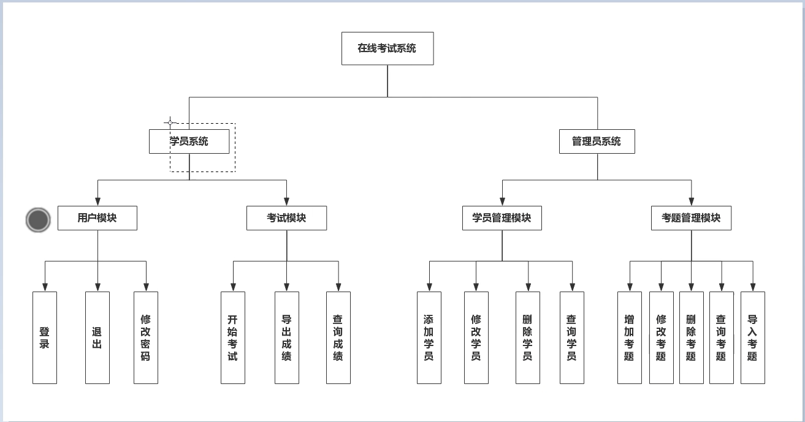
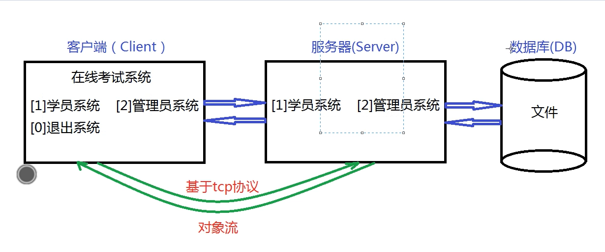
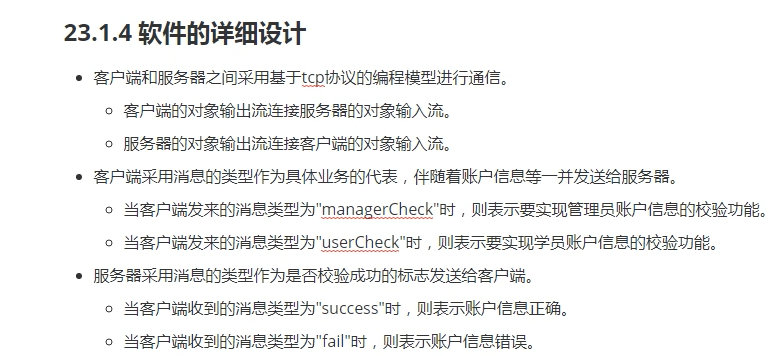
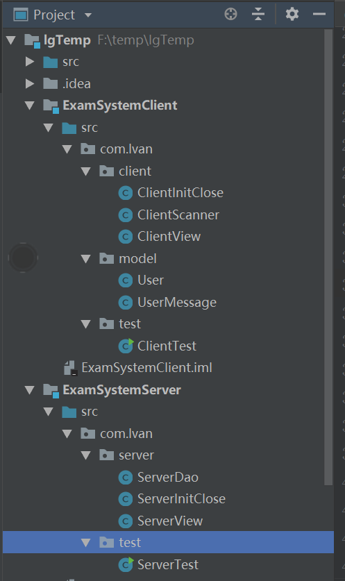

### 在线考试系统

#### 项目的需求分析

+ 软件开发的流程
  + 需求分析文档，概要设计文档，详细设计文档，编码和测试，安装和调试，维护和升级
+ 软件的需求分析
  + 学员系统
    + 用户模块：登录，修改密码，退出
    + 考试模块：开始考试，查询成绩，导出成绩
  + 管理员系统
    + 学员增删查改
    + 考题增删查改，导入考题



#### 项目的概要设计和详细设计

+ 概要设计（cs架构）
  + 客户端
    + 主要用于提供字符串界面供用户选择并将处理结果显示出来
  + 服务器
    + 主要用于针对字符界面的选择实现真正业务功能的处理
  + 数据库
    + 主要用于数据存取



+ 详细设计

  

#### 项目的编码流程

#### 服务器的初始化和关闭以及测试

#### 客户端的初始化和关闭以及测试

#### 客户端主界面的绘制和测试

#### 客户端扫描器工具类的封装

#### 客户端将管理员相关信息发送出去

#### 服务器接收客户端发来的消息并打印

#### 服务器校验后发送给客户端

#### 客户端接收结果并打印

+ 以上说来话长。。。不太想说。。。

+ talk is cheap show you the code

+ 项目结构

  

+ ClientInitClose.java

  ```java
  public class ClientInitClose {
  
      private Socket s;
      private ObjectInputStream ois;
      private ObjectOutputStream oos;
  
      public ObjectInputStream getOis() {
          return ois;
      }
  
      public ObjectOutputStream getOos() {
          return oos;
      }
  
      public void clientInit() throws IOException {
          s = new Socket(InetAddress.getLocalHost(),8888);
          System.out.println("client has succeeded to connect server!");
  
          oos = new ObjectOutputStream(s.getOutputStream());
          ois = new ObjectInputStream(s.getInputStream());
          System.out.println("client init finished!");
      }
  
      public void clientClose() throws IOException {
          oos.close();
          ois.close();
          s.close();
          System.out.println("client is closed");
      }
  }
  
  ```

  

+ ClientScanner.java

  ```java
  public class ClientScanner {
  
      private static Scanner sc = new Scanner(System.in);
  
      public static Scanner getSc() {
          return sc;
      }
  
      public  static void closeScanner() {
          sc.close();
      }
  }
  ```

+ ClientView.java

  ```java
  public class ClientView {
  
      private ClientInitClose cic = null;
  
      public ClientView(ClientInitClose cic) {
          this.cic = cic;
      }
  
      public void clientMainPage() throws IOException, ClassNotFoundException {
          while (true) {
              System.out.println(" \n\nExam system");
              System.out.println("--------------------------");
              System.out.print("    [1] 学员系统");
              System.out.println("    [2] 管理员系统");
              System.out.println("    [0] 退出系统");
              System.out.println("--------------------------");
              System.out.println("请选择要进行的操作：");
  
              int choose = ClientScanner.getSc().nextInt();
              switch (choose) {
                  case 1:
                      System.out.println("正在进入学员系统");
                      clientManagerLogin();
                      break;
                  case 2:
                      System.out.println("正在进入管理员系统");
                      break;
                  case 0:
                      System.out.println("正在退出系统");
                      return;
                  default:
                      System.out.println("输入错误，重新选择");
                      break;
              }
          }
      }
  
      private void clientManagerLogin() throws IOException, ClassNotFoundException {
          System.out.println("请输入管理员信息: ");
          String name = ClientScanner.getSc().next();
          System.out.println("请输入管理员密码信息: ");
          String password = ClientScanner.getSc().next();
          UserMessage um = new UserMessage("managerCheck",new User(name,password));
          cic.getOos().writeObject(um);
          System.out.println("信息发送完毕");
  
          um = (UserMessage) cic.getOis().readObject();
          if("success".equals(um.getType())) {
              System.out.println("登录成功");
          } else {
              System.out.println("用户名或密码错误");
          }
      }
  }
  
  ```

+ User.java

  ```java
  public class User implements Serializable {
  
      private static final long serialVersionUID = 1379873041322704241L;
      private String name;
      private String password;
  
      public User(String name, String password) {
          this.name = name;
          this.password = password;
      }
  
      public User() {
      }
  
      public String getName() {
          return name;
      }
  
      public void setName(String name) {
          this.name = name;
      }
  
      public String getPassword() {
          return password;
      }
  
      public void setPassword(String password) {
          this.password = password;
      }
  }
  
  ```

  

+ UserMessage.java

  ```java
  public class UserMessage implements Serializable {
      private static final long serialVersionUID = 5005707502193794214L;
  
      private String type;
      private User user;
  
      public String getType() {
          return type;
      }
  
      public void setType(String type) {
          this.type = type;
      }
  
      public User getUser() {
          return user;
      }
  
      public void setUser(User user) {
          this.user = user;
      }
  
      public UserMessage() {
      }
  
      public UserMessage(String type, User user) {
          this.type = type;
          this.user = user;
      }
  }
  
  ```

  

+ ClientTest.java

  ```java
  public class ClientTest {
  
      public static void main(String[] args) {
  
  
          ClientInitClose cic = null;
          try {
              // 1.clientinitclose类型的引用指向clientinitclose类型的对象
              cic = new ClientInitClose();
              // 2.调用成员方法实现客户端的初始化操作
              cic.clientInit();
              // 3.声明clientview类型的引用指向clientview类型的对象
              ClientView cv = new ClientView(cic);
              cv.clientMainPage();
          } catch (IOException e) {
              e.printStackTrace();
          } catch (ClassNotFoundException e) {
              e.printStackTrace();
          } finally {
              try {
                  ClientScanner.closeScanner();
                  cic.clientClose();
              } catch (IOException e) {
                  e.printStackTrace();
              }
          }
      }
  }
  
  ```

+ ServerDao.java

  ```java
  public class ServerDao {
  
      /**
       * 编程实现管理员账号和密码的校验并将结果返回出去
       * @param user
       * @return
       */
      public boolean serverManagerCheck(User user) {
          if ("admin".equals(user.getName()) && "123456".equals(user.getPassword())) {
              return true;
          }
          return false;
      }
  }
  ```

  

+ ServerInitClose

  ```java
  public class ServerInitClose {
  
      private ServerSocket ss;
      private Socket s;
      private ObjectInputStream ois;
      private ObjectOutputStream oos;
  
      public ObjectInputStream getOis() {
          return ois;
      }
  
      public ObjectOutputStream getOos() {
          return oos;
      }
  
      public void serverInit() throws IOException{
  
          ss = new ServerSocket(8888);
          System.out.println("server is running...");
          s = ss.accept();
          System.out.println("a client connect to server");
          ois = new ObjectInputStream(s.getInputStream());
          oos = new ObjectOutputStream(s.getOutputStream());
          System.out.println("server init finished!");
      }
  
      public void serverClose() throws IOException {
          oos.close();
          ois.close();
          s.close();
          ss.close();
          System.out.println("server is closed!");
      }
  }
  
  ```

  

+ ServerView.java

  ```java
  public class ServerView {
  
      private ServerInitClose sic;
      private ServerDao sd;
  
      public ServerView(ServerInitClose sic,ServerDao sd) {
          this.sic = sic;
          this.sd = sd;
      }
  
      public void serverReceive() throws IOException, ClassNotFoundException {
          UserMessage userMessage = (UserMessage) sic.getOis().readObject();
          System.out.println("接收到的信息是：" + userMessage);
          if(sd.serverManagerCheck(userMessage.getUser())) {
              userMessage.setType("success");
          } else {
              userMessage.setType("fail");
          }
  
          sic.getOos().writeObject(userMessage);
          System.out.println("服务器发送信息成功！");
      }
  }
  
  ```

  

+ ServerTest.java

  ```java
  public class ServerTest {
  
      public static void main(String[] args) {
  
          ServerInitClose sic = null;
          try {
              sic = new ServerInitClose();
              sic.serverInit();
              ServerDao sd = new ServerDao();
              ServerView sv = new ServerView(sic,sd);
              sv.serverReceive();
          } catch (Exception e) {
              e.printStackTrace();
          } finally {
              try {
                  sic.serverClose();
              } catch (IOException e) {
                  e.printStackTrace();
              }
          }
      }
  }
  
  ```

  

+ 注意
  
  + 在idea中不同模块之间可以根据提示添加依赖也可以实现不同模块之间的类共享