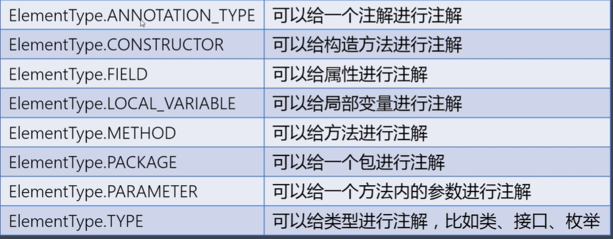
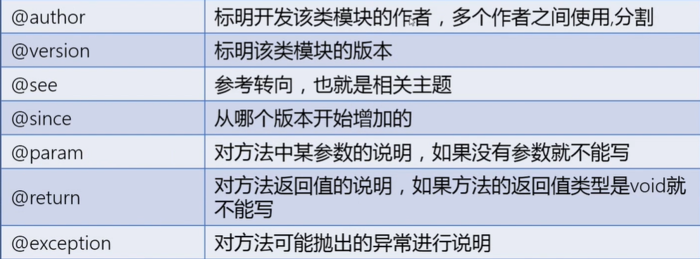

### 特殊类
#### 内部类的概念和分类
+ 基本概念
    + 当一个类的定义出现在另一个类的类体中时那么这个类叫做内部类（inner），而这个内部类所在的类叫做外部类（outer）
    + 类中的内容：成员变量，成员方法，构造方法，静态成员，构造块和静态代码块，内部类
+ 实际作用
    + 当一个类的价值仅仅是为某一个类单独服务时，那么六可以将这个类定义为所服务类中的内部类，这样可以隐藏该类的实现细节并且可以方便的访问外部类的私有成员而不再提供共有的set和get方法
+ 分类
    + 普通内部类
        + 直接将一个类的定义放在另一个类的类体中
    + 静态内部类
        + 使用static关键字修饰，隶属于类层级
    + 局部内部类
        + 直接将一个类的定义放在方法体的内部
    + 匿名内部类
        + 没有名字的内部类
#### 普通内部类的定义
+ 格式
    ```
        访问修饰符 class 外部类名 {
            访问修饰符 class 内部类名 {
                内部类的类体；
            }
        }
    ```
#### 普通内部类的实验方式
+ 实现
    ```

        // test1.java
        public class Test1 {

            private int cnt = 1;

            public class Test2{

                public Test2() {}
                public void show() {
                    System.out.println("cnt = "+cnt);
                }
            }
        }
        // testmain.java
        public static void main(String[] args) {
            Test1 t1 = new Test1();
            Test1.Test2 t2 = t1.new Test2();
        }

    ```
+ 使用方式
    + 普通内部类使用和普通类类似
    + 普通内部类需要外部类对象来创建对象
    + 如果内部类访问外部类中与本类内部同名的变量需要使用this指针
        ```
            public class Test1 {

            private int cnt = 1;

            public class Test2{

                private int cnt = 2;

                public Test2() {}

                public void show(int cnt) {
                    System.out.println("cnt = " + cnt); //打印形参cnt
                    System.out.println("cnt = " + this.cnt); //打印内部cnt
                    System.out.println("cnt = " + Test1.this.cnt); //打印外部cnt--类名.this获取该类的this指针
                }


            }
        }
        ```
#### 静态内部类的定义和使用方法
+ 结构
    ```
        访问修饰符 class 外部类名 {
            访问修饰符 static class 内部类名 {
                内部类的类体；
            }
        }
    ```
+ 使用
    ```
        // test1.java
        public class Test1 {

            private static int cnt = 1;

            public static class Test2{
                
                private int ia = 3;
                private static int cnt = 2;

                public Test2() {}
                
                public void show() {

                    // 注意静态内部类只能访问外部类中带有static关键字修饰的变量
                    System.out.println("ia = " + ia);       // 3
                    System.out.println("cnt = " + cnt);     // 2
                    System.out.println("cnt = " + Test1.cnt); // 1 
                }

                public void show2(int cnt) {
                    System.out.println("cnt = " + cnt);         // 输出形参
                    System.out.println("cnt = " + Test2.cnt);   // 输出内部类cnt
                    System.out.println("cnt = " + Test1.cnt);   // 输出外部类cnt
                }
            }
        }

        // testmain.java
        Test1.Test2 t = new Test1.Test2();
    ```
+ 使用方式
    + 静态内部类不能直接访问外部类的非静态成员
    + 静态内部类可以直接创建对象
    + 如果静态内部类需要访问外部与内部重名的变量是需要使用了类名.的方式访问（当然访问内部类参数this指针可以，但是this指针是指向正在构建的对象或者正在调用的对象，static修饰的是类层级不推荐使用this指针）
#### 局部内部类的定义和使用方式
+ 结构
    ```
        访问控制符 class 外部类的类名 {
            访问控制符 返回值类型 成员方法名（形参列表） {
                class 内部类的类名 {
                    内部类的类体；
                }
            }
        }
    ```
+ 示例
    ```
        // Test1.java
        public class Test1 {

            private int cnt = 1;

            public void show() {

                int i = 3;

                public class Test2{

                    private int ia = 2;

                    public void test() {
                        System.out.println(ia+cnt); // 3
                        System.out.println(i); // 不会报错因为java8开始如果输出一个值系统会认为该变量被final修饰，但是如果对i进行一次赋值，系统则会认为这不是final修饰的变量，会报错，所以请加上final
                    }
                }

                Test2 t = new Test2();
                t.test();
            }
        }

        // testmain.java
        public static void main(String[] args) {
            Test1 t = new Test1();
            t.show();
        }
    ```
+ 使用方式（类似局部变量）
    + 局部内部类只能在该方法内部使用
    + 局部内部类可以在方法内直接创建对象
    + 局部内部类不能使用访问控制符和static修饰
    + 局部内部类可以使用外部方法的局部变量但是必须是被final修饰的，由局部内部类和局部变量的声明周期不同所致
#### 回调模式的概念和编程
+ 回调模式的概念
    + 回调模式是指如果一个方法的参数是接口类型，则在调用该方法时，需要创建并传递一个实现此接口的类型的对象，而该方法在运行时会调用到参数对象中所实现的方法（接口模式中定义的）
#### 匿名内部类的使用
+ 开发经验
    + 当接口/类类型的引用作为方法的形参时，实参的传递方式有两种
        + 自定义类实现接口/继承类并重写方法，然后创建该类对象作为实参传递
        + 使用上述匿名内部类的语法形式得到接口/类类型的引用即可
+ 匿名内部类语法格式
    ```
        接口/父类类型 引用变量名 = new 接口/父类类型() {}
    ```
+ 使用
    ```
        // Test1.java
        public void test(animo ani) {
            ...
        }
        // 这里需要一个animo参数，但是animo本身是接口类型，解决方法
        // 1.新建animo接口的实现类借用多态特性传入
        // 2.创建匿名对象传入
        // 3.lamda表达式

        // 二号方案
        public static void main(String[] args) {
            animo ani = new animo {
                
                @Override 
                public void show() {
                    System.out.println("this is a animo object");
                }
            }

            test(ani);
        }
    ```
+ 从java8开始提出新特性Lamda表达式，可以简化上面的代码
    + 结构
        ```
            (参数列表)-> { 方法体 }
        ```
    + 替换示例
        ```
            // 三号方案
            animo ani = () -> System.out.println("this is lamda");
        ```
#### 枚举类的概念和自定义实现
+ 概念
    + 事物的取值只有固定的几个，描述事物的所有值都可以列举出来，这个可以列举的烈性就叫做枚举类型
+ 实现
    ```
        public class Direction {

            private final String desc;

            public static final up = new Direction("向上");
            public static final down = new Direction("向下");
            public static final left = new Direction("向左");
            public static final right = new Direction("向右");

            private Direction(String desc) {
                this.desc = desc;
            }

            public String getDesc() {
                return desc;
            }
        }
    ```
#### 枚举类的定义
+ 枚举的定义
    + 使用public static final修饰比较繁琐，使用enum关键字来定义枚举类型取代常量，枚举类型是从java5开始增加的一个引用数据类型
    + 枚举值就是当前类的类型，也就是指向本类的对象，默认使用public static final修饰，因此采用 枚举类型. 的方式调用
        ```
            public enum Direction {

                UP("向上"),DOWN("向下"),LEFT("向左"),RIGHT("向右");

                private final String desc;

                private Direction(String desc) {
                    this.desc = desc;
                }

                public String getDesc() {
                    return desc;
                }
            }
            // 使用testmain
            psvm {
                Direction de = Direction.UP;
                de.getDesc();
            }
        ```
    + 枚举类可以自定义构造方法，但是构造方法的修饰符必须是private，默认也是私有的
#### 自定义类和雷剧类型在switch结构中的使用
+ 示例
    ```
        Direction de
        switch(de) {
            case UP: System.out.println(" ");break;
            case DOWN: System.out.println(" ");break;
            case LEFT: System.out.println(" ");break;
            case RIGHT: System.out.println(" ");break;
            default: System.out.println(" ");
        }
    ```
#### Enum类的概念和常用方法
+ Enum类的概念
    + 所有枚举类都是继承java.lang.Enum类，常用方法如下
        + static T[] values()           返回当前枚举类中所有对象
        + String toString()             返回当前枚举类对象名称
        + int ordinal()                 获取枚举对象在枚举类中的索引位置
        + static T valueOf(String str)  将参数指定的字符串名转为当前枚举类的对象
        + int compareTo(E o)            比较两个枚举对象在定义时1顺序
#### 枚举类实现接口的方式
+ 两种
    + 类中重写一次
        ```
            public enum Direction {

                UP("向上"),DOWN("向下"),LEFT("向左"),RIGHT("向右");

                private final String desc;

                private Direction(String desc) {
                    this.desc = desc;
                }

                public String getDesc() {
                    return desc;
                }

                @Override 
                public void show() {
                    System.out.println(" ");
                }
            }
        ```
    + 每个对象都重写
        ```
            public enum Direction {

                UP("向上"){
                    @Override 
                    public void show() {
                        System.out.println(" ");
                    }
                },
                DOWN("向下"){
                    @Override 
                    public void show() {
                        System.out.println(" ");
                    }
                },
                LEFT("向左"){
                    @Override 
                    public void show() {
                        System.out.println(" ");
                    }
                },
                RIGHT("向右"){
                    @Override 
                    public void show() {
                        System.out.println(" ");
                    }
                };

                private final String desc;

                private Direction(String desc) {
                    this.desc = desc;
                }

                public String getDesc() {
                    return desc;
                }
            }
        ```
#### 注解的概念定义和使用
+ 概念
    + 注解又叫标注，是从java5开始增加的引用数据类型
    + 注解的本质是代码的特殊标记，通过标记可以在编译，类加载，以及运行时执行指定的处理（可以看成接口）
+ 语法格式
    ```
        访问修饰符 @interface 注解名称 {
            注解成员；
        }
    ```
+ 自定义注解自动继承java.lang.annotation.Annotation接口
+ 通过@注解名称的方式可以修饰包，类，成员方法，成员变量，构造方法，参数，遍布变量的声明
+ 示例
    ```
        public @interface MyAnnotation{
            // 若一个注解中没有任何成员，那这个注解就叫标记注解
            public String value();  // 在注解类型中这表示声明了一个名为value的成员变量，注解被调用时需要给它赋值
            public String value2() default "123"; // 设置默认值，这样注解被调用时就不一定需要给它赋值了 
        }

        // 在然后在某个地方使用@MyAnnotation就可以
        @MyAnnotation(value = "123")
        public class Test{
            private string name;
        }
    ```
+ 注解的使用
    + 注解中只有成员变量，没有成员方法，而注解的成员变量以"无形参的方法"形式来声明，其方法定义了该成员变量的名字，其返回值定义了该成员变量的类型
    + 如果注解只有一个参数成员，建议使用参数名为value，而类型只能是巴中基本类型，String，Class，enum，Annotation
#### 元注解的概念和@Retetion的使用
+ 概念
    + 元注解可以注解到其他注解上
    + 元注解主要有： @Retention,@Documented,@Target,@Inherited,@Repeatabled
+ @Retention
    + 应用到一个注解上用于说明该注解的生命周期，取值如下：
        + RetentionPolicy.SOURCE: 注解只在源码阶段保留，在编译器进行编译时它将被丢弃
        + RetentionPolicy.CLASS: 注解只被保留到编译的时候，不会被加载到jvm中，默认方式
        + RetentionPolicy.RUNTIME: 注解可以保留到程序运行时，它会被加载到jvm中，所以在程序运行时可以获取到它们
    + 示例
        + @Retention(RetentionPolicy.SOURCE)
#### @Documented的使用
+ 相关工具
    + 使用javadoc工具可以从程序源代码中抽取类，方法，成员等注释形成一个和源码配套的API帮助文档，而该工具抽取时默认不包括注解内容（idea中tools-generate-javadoc 在other commandline：-encoding utf-8）
+ @Documented作用
    + 被它修饰的注解可以被工具提取成文档（定义为@Documented的注解必须设置Retention值为RUNTIME）
#### @Target和@Inherited的使用
+ @Target
    + 用于指定被修饰的注解能用于哪些元素的修饰，取值如下：
    
    + java8开始ElementType枚举值增加了两个
        + ElementType.TYPE_PARAMETER表示该注解可以写在类型变量的声明语句中，如：泛型
        + ElementType.TYPE_USER表示该语句能够写在使用类型的任何语句中
+ @Inherited
    + 如果一个父类的注解被Inherited修饰，且子类没有被任何注解修饰，则父类的注解会被继承
#### @Repeatabled使用
+ 表示自然可重复的含义，java8开始的新特性
    + 被它修饰的注解可以多次使用
#### 常见预制注解

+ @deprecated
    + 会提醒过时
+ @SuppressWarnings
    + 抑制编译器警告