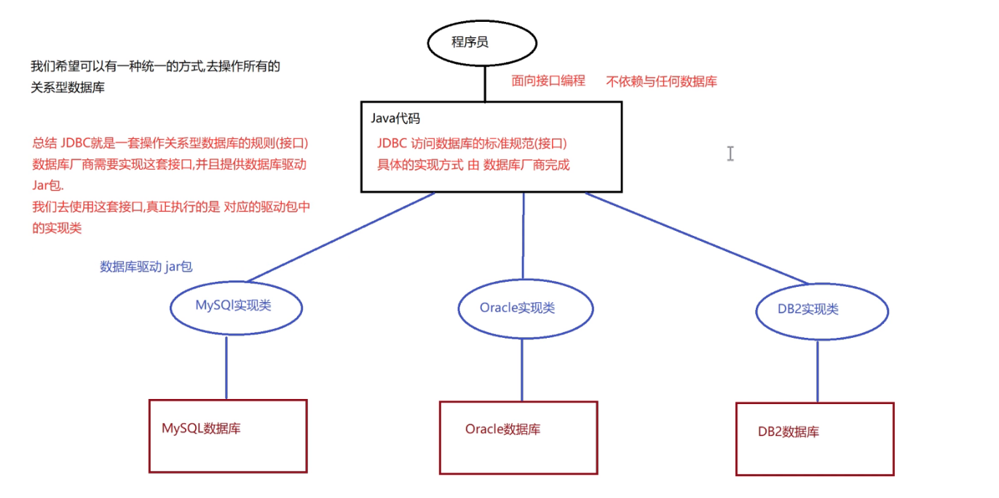
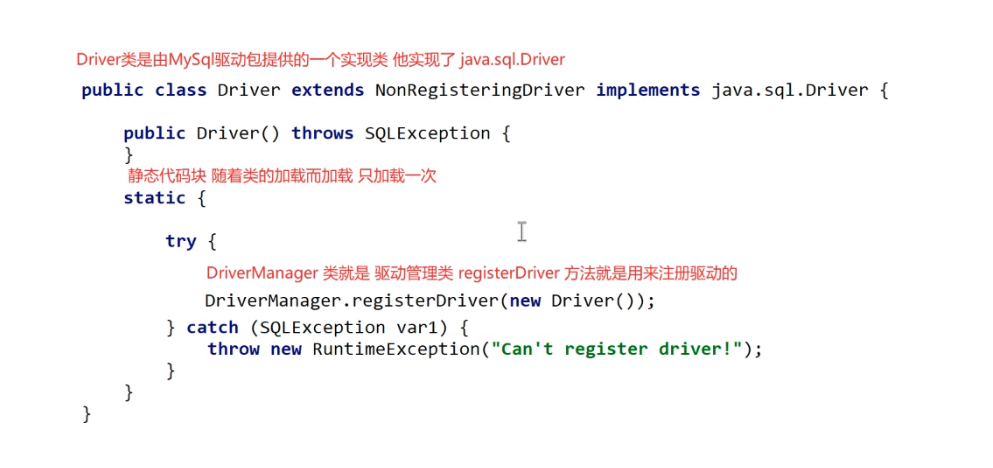
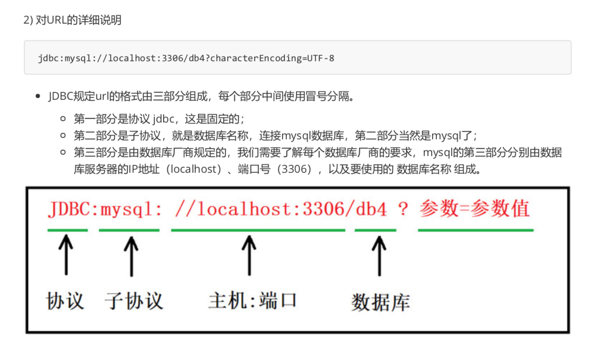
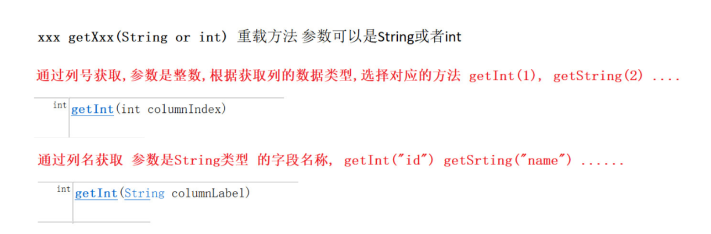
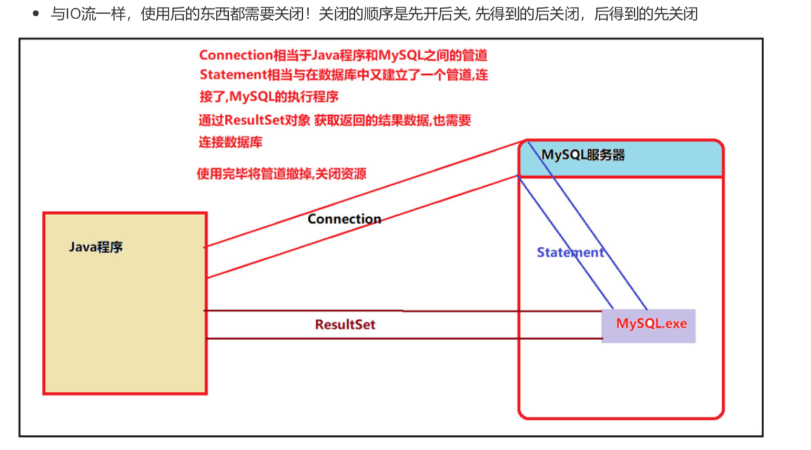
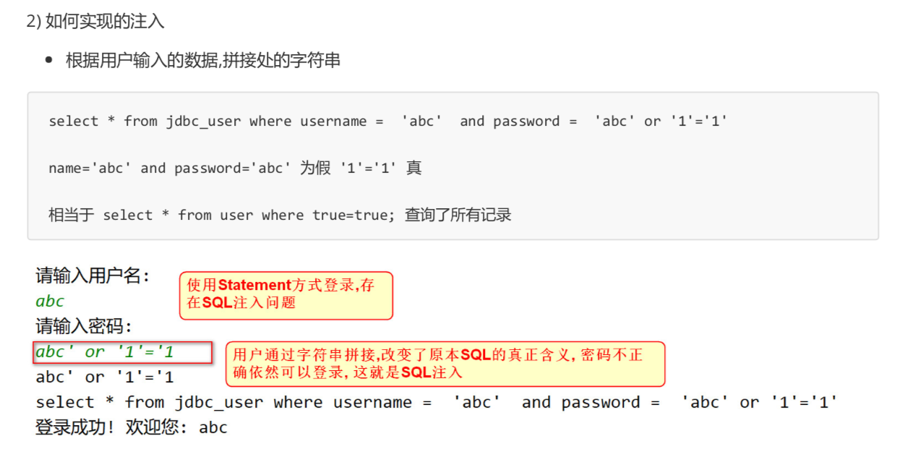
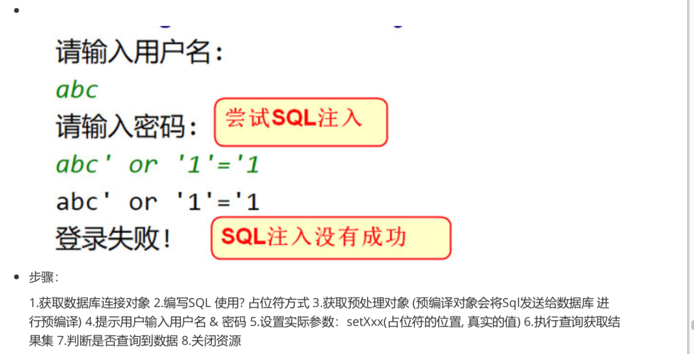
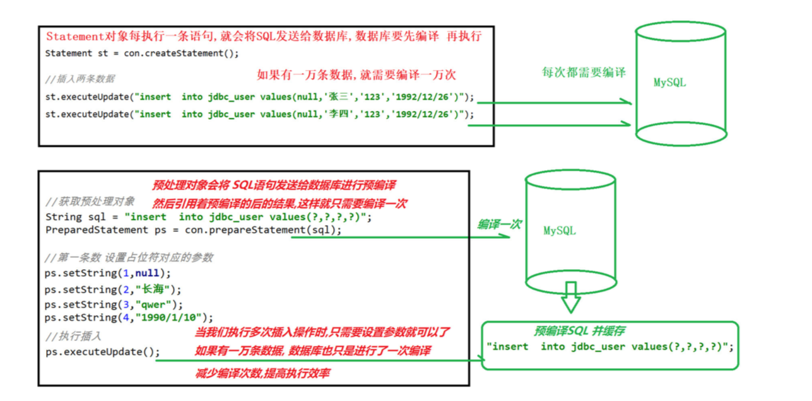

### jdbc

#### jdbc概述

+ 操作数据库方式

  + 第三方客户端
  + 命令行
  + java程序访问mysql

+ 什么是jdbc

  + jdbc（java Data Base Connectity） 是java访问数据库的标准规范，是一种用于执行sql语句的javaAPI，可以为多种关系数据库提供统一访问，它由一组用java语法编写的类和接口组成，是java访问数据库的标准规范

+ jdbc原理

  + JDBC是接口，驱动是接口的实现，没有驱动将无法完成数据库连接，从而不能操作数据库，每个数据库厂商都需要提供自己的驱动，用来连接自己公司的数据库，也就是说驱动一般由数据库生成厂商提供

    

#### jdbc开发准备

+ mysql数据

  ```mysql
  -- 创建表
  CREATE TABLE jdbc_user (
    id INT PRIMARY KEY AUTO_INCREMENT ,
    username VARCHAR(50),
    password VARCHAR(50),
    birthday DATE
  );
  -- 添加数据
  INSERT INTO jdbc_user (username, password,birthday) VALUES('admin1', '123','1991/12/24'), ('admin2','123','1995/12/24'),
  ('test1', '123','1998/12/24'),
  ('test2', '123','2000/12/24');
  ```

+ mysql驱动包

  + 本地创建一个myjar文件夹专门存放jar包

+ idea  文件结构 module 添加 选择myjar OK

#### Jdbc开发注册驱动

+ JDBC规范定义驱动接口：java.sql.Driver

+ mysql驱动包提提供了实现类：com.mysql.jdbc.Driver

+ 加载驱动的方式

  + Class.forName(数据库驱动实现类)

  + 描述

    + 加载和注册数据库驱动，数据库驱动由数据库厂商mysql提供，“com.mysql.jdbc.Driver”

      ```java
      public class JDBCDemo01 {
      
          public static void main(String[] args) throws ClassNotFoundException {
              
            	// 1.注册驱动（从jdbc3开始注册驱动可以省略）
              Class.forName("com.mysql.jdbc.Driver");
          }
      }
      
      ```

      

#### jdbc开发获取连接

+ 通过api获取连接

  + connection接口代表一个连接对象，具体实现类由数据库的厂商实现

  + 使用DriverManager类的静态方法，getConnection可以获取数据库连接

  + 获取连接的静态方法

    + Connection getConnection(String url,String user,String password)
    + 说明：通过连接，用户名，密码来获取数据库连接对象

  + getConnction方法3个连接参数说明

    | 连接参数 | 说明                                             |
    | -------- | ------------------------------------------------ |
    | user     | 登陆用户名                                       |
    | password | 登陆密码                                         |
    | url      | mysql Url格式：  jdbc:mysql://localhost:3306/db4 |

    

```java
public class JDBCDemo01 {

    public static void main(String[] args) throws Exception {

        // 1.注册驱动（从jdbc3开始注册驱动可以省略）
        Class.forName("com.mysql.jdbc.Driver");

        // 2.获取连接对象 connect连接对象
        String url = "jdbc:mysql://localhost:3306/db4?characterEncoding=UTF-8";
        Connection connection = DriverManager.getConnection(url, "root", "L1178594290");

        System.out.println(connection);
    }
}
```


#### Jdbc开发语句执行对象

+ 通过Connection中的createStatement方法获取sql语句执行对象

  | Connection接口中的方法         | 说明                |
  | ------------------------------ | ------------------- |
  | Statement  createStatement（） | 创建sql语句执行对象 |

+ Statement： 代表一条语句对象，用于发送sql语句给服务器，用于执行静态sql语句并返回它所生成结果的对象

  | Statement类常用方法                | 说明                                            |
  | ---------------------------------- | ----------------------------------------------- |
  | int executeUpdate(String sql)      | 执行insert update delete返回int类型表示影响行数 |
  | ResultSet executeQuery(String sql) | 执行select语句，返回ResultSet结果集对象         |

+ 示例：

  ```java
  
  ```

  

#### jdbc开发处理结果集对象

+ 只有在进行查询操作时才会处理结果集

+ 代码演示

  ```java
  public class JDBCDemo01 {
  
      public static void main(String[] args) throws Exception {
  
          // 1.注册驱动（可以省略）
          Class.forName("com.mysql.jdbc.Driver");
  
          // 2.获取连接对象 connect连接对象
          String url = "jdbc:mysql://localhost:3306/db4?characterEncoding=UTF-8";
          Connection connection = DriverManager.getConnection(url, "root", "L1178594290");
  
          System.out.println(connection);
  
          // 3.获取语句执行平台 Statement
          Statement statement = connection.createStatement();
  
          // 3.1 通过statement对象的executeUpdate方法创建一张表
          String sql = "create table test(id int,name varchar(20),age int)";
          int i = statement.executeUpdate(sql); // 返回值表示受影响行数
  
          System.out.println(i);
  
          // 关闭流
          statement.close();
          connection.close();;
      }
  }
  
  ```

+ ResultSet

  + 作用：封装数据库查询的结果集，对结果集进行遍历，取出每一条记录

    | ResultSet接口方法         | 说明                                                         |
    | ------------------------- | ------------------------------------------------------------ |
    | boolean next()            | 游标向下一行<br/>返回boolean类型，如果还有下一条记录，返回true，否则返回false |
    | xxx getXxx(String or int) | 通过列名，参数String类型，返回不同的类型<br/>通过列号，参数时整数，从1开始，返回不同的类型 |

    

+ 代码演示

  ```java
  public class JDBCDemo02 {
  
      public static void main(String[] args) throws Exception {
  
          // 1.注册驱动
          Class.forName("com.mysql.jdbc.Driver");
  
          // 2.获取连接
          String url = "jdbc:mysql://localhost:3306/db4";
          Connection connection = DriverManager.getConnection(url, "root", "L1178594290");
  
          // 3.获取语句执行对象
          Statement statement = connection.createStatement();
  
          // 4.执行查询操作
          String sql = "select * from jdbc_user";
          ResultSet resultSet = statement.executeQuery(sql);
  
          // resultset是结果集
          // boolean next = resultSet.next();
          // System.out.println(next);
  
          // 获取id
          // int id = resultSet.getInt("id");
          // System.out.println(id);
          // int anInt = resultSet.getInt(1);
          // System.out.println(anInt);
  
          // 通过while循环遍历获取数据
          while(resultSet.next()) {
              int id = resultSet.getInt("id");
              String username = resultSet.getString("username");
              String password = resultSet.getString("password");
              Date birthday = resultSet.getDate("birthday");
  
              System.out.println(id+" "+username+" "+password+" "+birthday);
          }
  
          // 关闭流
          resultSet.close();
          statement.close();
          connection.close();
      }
  }
  
  ```

  

#### jdbc开发释放资源

+  需要释放的对象：ResultSet结果集，Statement语句，Connection连接

+ 释放原则：先开的后关，后开的先关。ResultSet ==> Statement ==> Connection

+ 放在哪个代码块中：finally块

  

+ 代码演示

  ```mysql
  public class JDBCDemo03 {
  
      public static void main(String[] args){
  
  
          Connection connection = null;
          Statement statement = null;
          ResultSet resultSet = null;
          try {
  
              connection = DriverManager.getConnection("jdbc:mysql://localhost:3306/db4", "root", "L1178594290");
              statement = connection.createStatement();
              String sql = "select * from jdbc_user";
              resultSet = statement.executeQuery(sql);
          } catch (SQLException e) {
              e.printStackTrace();
          } finally {
              try {
                  resultSet.close();
                  statement.close();
                  connection.close();
              } catch (SQLException throwables) {
                  throwables.printStackTrace();
              }
          }
  
  
      }
  }
  
  ```

+ 步骤总结

  + 获取驱动
  + 获取连接
  + 获取statement对象
  + 处理结果集（只在查询时处理）
  + 释放资源

#### 编写jdbc工具类

+ 什么时候创建工具类

  + 如果一个功能经常用到，我们建议把这个功能做成一个工具类，可以在不同的地方重用
  + “获得数据库连接”操作，将在以后的增删查改中都存在，可以封装成工具类jdbcUtils，提供获取连接对象的方法，从而达到代码的重复利用

+ 工具类包含的内容

  + 可以把几个字符串定义成常量：用户名，密码，url，驱动类
  + 得到数据库的连接：getConnection（）
  + 关闭所有打开的资源

+ 示例

  ```java
  public class JDBCUtils {
  
      // 1.将连接信息定义为字符串常量
      public static final String DRIVERNAME = "com.mysql.jdbc.Driver";
      public static final String URL = "jdbc:mysql://localhost:3306/db4?characterEncoding=UTF-8";
      public static final String USER = "root";
      public static final String PASSWORD = "L1178594290";
  
      // 2.静态代码块
      static {
          try {
              Class.forName("com.mysql.jdbc.Driver");
          } catch (ClassNotFoundException e) {
              e.printStackTrace();
          }
      }
  
      public static Connection getConnection() {
          Connection connection = null;
          try {
              connection = DriverManager.getConnection(URL,USER,PASSWORD);
              return connection;
          } catch (SQLException throwables) {
              throwables.printStackTrace();
              return null;
          }
      }
  
      public static void close(Connection con, Statement statement) {
          if(con != null && statement != null) {
              try {
                  statement.close();
                  con.close();
              } catch (SQLException throwables) {
                  throwables.printStackTrace();
              }
          }
      }
  
      public static void close(Connection con, Statement statement,ResultSet resultSet) {
          if(con != null && statement != null) {
              try {
                  resultSet.close();
                  statement.close();
                  con.close();
              } catch (SQLException throwables) {
                  throwables.printStackTrace();
              }
          }
      }
  }
  
  
  
  ```

  

#### 使用jdbcUtils完成DML操作

+ 插入记录

  + 解决中文乱码问题

    ```java
    jdbc:mysql://localhost:3306/db4?characterEncoding=UTF-8
    characterEncoding=UTF-8   指定字符的编码解码格式
    ```

  + 代码示例：

    ```java
    public class TestDML {
    
        /**
         * 插入操作
         */
        @Test
        public void testInsert() throws SQLException {
    
            // 1.通过jdbc工具类获取连接
            Connection connection = JDBCUtils.getConnection();
    
            // 获取sql执行平台
            Statement statement = connection.createStatement();
    
            // 编写sql
            String sql = "insert into jdbc_user values(null,'张百万','123','2020/11/11')";
    
            // 执行sql
            int i = statement.executeUpdate(sql);
            System.out.println(i);
    
            // 关闭流
            JDBCUtils.close(connection,statement);
    
        }
    
        @Test
        /**
         * 更新操作，根据id修改用户名
         */
        public void testUpdate() throws SQLException {
    
            Connection connection = JDBCUtils.getConnection();
    
            Statement statement = connection.createStatement();
    
            String sql = "update jdbc_user set username = '刘能' where id = 1";
    
            statement.executeUpdate(sql);
    
            JDBCUtils.close(connection,statement);
        }
    }
    
    ```

+ 删除记录

  + 删除id为3和4的记录

    ```java
    public class TestDML {
    
        /**
         * 删除id为1和2的数据
         */
        @Test
        public void testDelete() throws SQLException {
    
            Connection connection = JDBCUtils.getConnection();
    
            Statement statement = connection.createStatement();
    
            String sql = "delete from jdbc_user where id in (1,2)";
            statement.executeUpdate(sql);
    
            JDBCUtils.close(connection,statement);
    
        }
    }
    
    ```

    

####  使用jdbcUtils完成DQL操作

+ 查询姓名为张百万的一条记录

  ```java
  public class TestDQL {
  
      public static void main(String[] args) throws SQLException {
  
          Connection connection = JDBCUtils.getConnection();
          Statement statement = connection.createStatement();
  
          String sql = "select * from jdbc_user where username = '张百万'";
  
          ResultSet resultSet = statement.executeQuery(sql);
  
          while(resultSet.next()) {
              int id = resultSet.getInt("id");
              String username = resultSet.getString("username");
              String password = resultSet.getString("password");
              Date birthday = resultSet.getDate("birthday");
  
              System.out.println(id+" "+username+" "+password+" "+ birthday);
          }
  
          JDBCUtils.close(connection,statement,resultSet);
      }
  }
  
  ```

  

#### sql注入问题

+ sql注入演示

  + 向jdbc_user表中插入两条数据

    ```mysql
     # 插入2条数据
    INSERT INTO jdbc_user VALUES(NULL,'jack','123456','2020/2/24'); INSERT INTO jdbc_user VALUES(NULL,'tom','123456','2020/2/24');
    ```

  + sql注入演示

    ```mysql
    # SQL注入演示
    -- 填写一个错误的密码
    SELECT * FROM jdbc_user WHERE username = 'tom' AND PASSWORD = '123' OR '1' = '1';
    ```

    

  + 如果这是一个登陆操作，那么用户就登陆成功了，这显然不是我们想要的结果

#### 用户登陆案例演示sql注入

+ 需求：用户在控制台上输入用户名和密码，然后使用Statement字符串拼接的形式实现用户登陆

+ 步骤

  + 得到用户从控制台上输入的用户名和密码来查询数据库
  + 写一个登陆方法
    + 通过工具类得到连接
    + 创建语句对象，使用拼接字符串的方式生成sql语句
    + 查询数据库如果已有数据登陆成功，否则登陆失败
    + 释放资源

  + 问题分析

    + 什么是sql注入

      + 我们让用户输入的密码和sql语句进行字符串拼接，用户输入的内容作为sql的一部分，改变了原有sql真正的意义，以上成为sql注入

      + 如何实现sql注入

        

      + 如何解决

        + 要解决sql注入就不能让用户输入的密码和我们的sql语句进行简单的字符串拼接

      + demo

        ```java
        public class TestLogin01 {
        
            public static void main(String[] args) throws SQLException {
        
                Connection connection = JDBCUtils.getConnection();
        
                Statement statement = connection.createStatement();
        
                Scanner sc = new Scanner(System.in);
        
                System.out.println("please input the username: ");
                // 123
                String username = sc.nextLine();
        
                System.out.println("please input the password: ");
                // zxc' or 'a' = 'a 这边好像有bug，复制粘贴前面一个a不会被忽略，手打会被忽略
                String password = sc.nextLine();
        
                String sql = "select * from jdbc_user where username = '"+ username + "' and password = '"+password+"'";
                ResultSet resultSet = statement.executeQuery(sql);
                System.out.println(sql);
        
                if(resultSet.next()) {
                    System.out.println("succeed to login!");
                } else {
                    System.out.println("fail to login");
                }
        
                JDBCUtils.close(connection,statement,resultSet);
            }
        }
        
        ```

        

#### 使用预处理对象解决sql注入

+ PreparedStatement接口介绍

  + PreparedStatement是Statement接口的子接口，继承父类中所有方法，它是一个预编译的sql语句对象
  + 预编译是指sql语句被预编译并存储在PreparedStatement对象中，然后可以使用此对象多次高效的执行该语句

+ PreparedStatement特点

  + 因为有预先编译的功能，提高sql效率
  + 可以有效防止sql注入的问题，安全性更高

+ 获取PreparedStatement对象

  + 通过Connection创建PreparedStatement对象

    | Connection接口中的方法                            | 说明                                                       |
    | ------------------------------------------------- | ---------------------------------------------------------- |
    | PreparedStatement preparedStatement（String sql） | 指定预编译sql语句<br />sql语句中使用占位符创建一个语句对象 |

  + PreparedStatement接口常用方法

    | 常用方法                   | 说明                           |
    | -------------------------- | ------------------------------ |
    | int executeUpdate（）      | 执行insert update delete语句   |
    | ResultSet executeQuery（） | 执行select语句返回集对象Result |

  + 使用preparedStatement的步骤

    + 编写sql语句，未知内容用？占位

    + 获取preparedStatement对象

    + 设置实际参数： setXxx（占位符的位置，真实的值） 

    + 执行参数话sql语句

    + 关闭资源

      | setXxx重载方法                                 | 说明                              |
      | ---------------------------------------------- | --------------------------------- |
      | void setDouble（int parameterIndex，double x） | 将制定参数设置为给定java double值 |
      | void setInt（int parameterIndex，int x）       | 将制定参数设置为给定java int值    |
      | void setString（int parameterIndex，String x） | 将制定参数设置为给定java String值 |
      | void setObject（int parameterIndex，Object x） | 将制定参数设定指定参数的值        |

  + demo

    ```java
    public class TestLogin02 {
    
    
        /**
         * sql注入
         *  用户输入的用户名和密码与我们编写的sql进行了拼接，用户输入的内容成为了sql语法的一部分
         *  用户会用这个漏洞改变sql原本的意思
         * 如果解决
         *  要解决sql注入，就不能让用户输入的数据和我们的sql进行拼接
         * 预处理对象 PreparedStatement他是statement的子接口
         *  使用预处理对象，它有预编译的功能可以提高sql的执行效率
         *  使用预处理对象通过占位的方式设置参数可以有效防止注入
         * @param args
         */
        public static void main(String[] args) throws SQLException {
    
    
            // 1.获取连接
            Connection connection = JDBCUtils.getConnection();
    
    
            // 2.创建预处理对象
            String sql = "select * from jdbc_user where username = ? and password = ?";
            PreparedStatement ps = connection.prepareStatement(sql);
    
            // 3.获取输入
            Scanner sc = new Scanner(System.in);
    
            System.out.println("please input the username: ");
            // 123
            String username = sc.nextLine();
    
            System.out.println("please input the password: ");
            // zxc' or 'a' = 'a 这边好像有bug，复制粘贴前面一个a不会被忽略，手打会被忽略
            String password = sc.nextLine();
    
            // 4.设置参数，使用setXxx()方法设置占位符的参数
            ps.setString(1,username);
            ps.setString(2,password);
    
            // 5.执行查询
            ResultSet resultSet = ps.executeQuery();
    
            if (resultSet.next()) {
                System.out.println("succeed to login!");
            } else {
                System.out.println("fail to login");
            }
    
    
            // 6.关闭流
            JDBCUtils.close(connection,ps,resultSet);
        }
    }
    
    ```

    

  + 使用prepreadStatement完成登陆案例

    + 使用preparedStatement预处理对象，可以有效避免sql注入

      

#### 预处理对象的执行原理

+ 分别使用Statement对象和PreparedStatement对象进行操作

  

+ statement和preparedStatement的区别

  + statement用于执行静态的sql语句，在执行时，必须事先准备好的sql语句
  + preparedStatement时预编译的sql语句对象，语句中可以包含动态参数“？”在执行时，可以为“？”动态谁知参数值
  + preparedStatement可以减少编译次数提高数据库性能

#### jdbc控制事务api介绍

+ 之前我们是用mysql命令来操作事务，接下来我们用jdbc操作事务

+ 数据准备

  ```mysql
  -- 创建账户表
  CREATE TABLE account(
  -- 主键
  id INT PRIMARY KEY AUTO_INCREMENT, -- 姓名
  name VARCHAR(10),
  -- 转账金额
  money DOUBLE
  );
  -- 添加两个用户
  INSERT INTO account (name, money) VALUES ('tom', 1000), ('jack', 1000);
  ```

+ 事务相关api

  + 我们在使用Connection中的方法实现事务管理

    | 方法                                   | 说明                                                |
    | -------------------------------------- | --------------------------------------------------- |
    | void setAutoCommit(boolean autoCommit) | 参数时true或false，表示关闭自动提交，相当于开启事务 |
    | void commit()                          | 提交事务                                            |
    | void rollback()                        | 回滚事务                                            |

    

#### jdbc控制事务代码演示

+ 开发步骤

  + 获取连接
  + 开启事务
  + 获取PreparedStatement，执行两次更新操作
  + 正常情况下提交事务
  + 出现异常后回滚事务
  + 最后关闭资源

+ 代码示例

  ```java
  public class TestJDBCTransaction {
  
      // 使用jdbc操作事务
      public static void main(String[] args) {
  
  
          Connection connection = null;
          PreparedStatement ps = null;
  
          try {
              // 获取连接
              connection = JDBCUtils.getConnection();
              // 开启事务
              connection.setAutoCommit(false);
              // 获取预处理，执行sql
              ps = connection.prepareStatement("update account set money = money - ? where name = ?");
              ps.setDouble(1,500.0);
              ps.setString(2,"tom");
              ps.executeUpdate();
  
              // 模拟异常
              System.out.println(0 / 0);
  
              ps = connection.prepareStatement("update account set money = money +  ? where name = ?");
              ps.setDouble(1,500.0);
              ps.setString(2,"jack");
              ps.executeUpdate();
  
              // 提交事务
              connection.commit();
              System.out.println("转账成功！");
          } catch (SQLException throwables) {
              throwables.printStackTrace();
              // 出现异常会回滚
              try {
                  connection.rollback();
              } catch (SQLException e) {
                  e.printStackTrace();
              }
  
          } finally {
              // 释放资源
              JDBCUtils.close(connection,ps);
          }
  
  
      }
  }
  
  ```

  