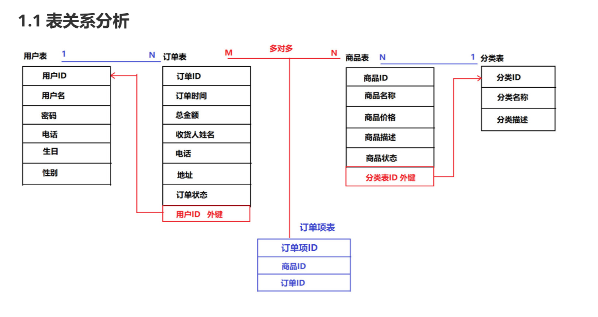
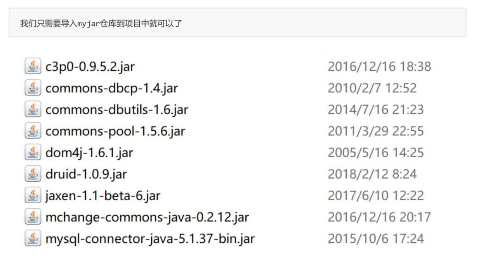
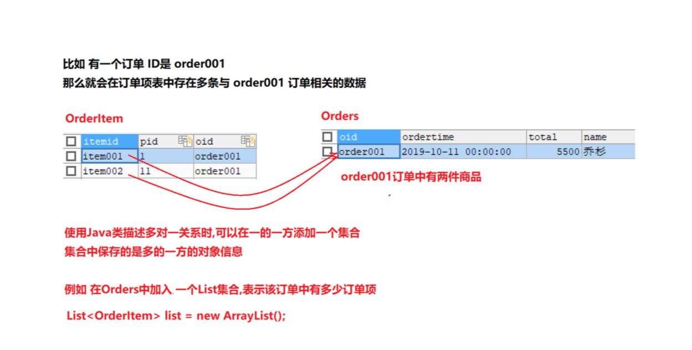

### 综合案例

#### 商城案例阶段和表的创建

+ 创建名为store的数据库，对应商城项目

  ```mysql
  create database db6 character set utf8;
  ```

  

+ 创建用户表

  ```mysql
  CREATE TABLE user (
  	uid varchar(32) PRIMARY KEY, -- 用户ID 
    username varchar(20) , -- 用户名 
    password varchar(20) , -- 密码 
    telephone varchar(20) , -- 电话 
    birthday date , -- 生日
  	sex varchar(10) -- 性别
  );
  
   INSERT INTO USER VALUES 
   ('001','渣渣辉','123456','13511112222','2015-11-04','男'), 
   ('002','药水哥','123456','13533334444','1990-02-01','男'), 
   ('003','大明白','123456','13544445555','2015-11-03','男'), 
   ('004','长海','123456','13566667777','2000-02-01','男'), 
   ('005','乔杉','123456','13588889999','2000-02-01','男');
  ```

+ 创建订单表

  ```mysql
   CREATE TABLE orders (
    oid varchar(32) PRIMARY KEY, -- 订单id
    ordertime datetime , -- 下单时间
    total double , -- 总金额
    name varchar(20), -- 收货人姓名
    telephone varchar(20) , -- 电话
    address varchar(30) , -- 地址
    state int(11) , -- 订单状态
    uid varchar(32), -- 外键字段 对应用户表id
    CONSTRAINT ofk_0001 FOREIGN KEY (uid) REFERENCES user (uid)
  );
  
   -- 插入一条订单数据
  INSERT INTO orders VALUES('order001','2019-10-11',5500,'乔杉','15512342345','皇家洗浴',0,'001');
  ```

+ 创建商品分类表

  ```mysql
   CREATE TABLE category (
    cid varchar(32) PRIMARY KEY,
    cname varchar(20)
  );
  INSERT INTO `category` VALUES ('1','手机数码'),('2','电脑办公'),('3','运动鞋服'),('4','图书音像');
  ```

+ 创建商品表

  ```mysql
   CREATE TABLE product (
    pid varchar(32) PRIMARY KEY, -- 商品id
    pname varchar(50) , -- 商品名称
    price double, -- 商品价格
    pdesc varchar(255), -- 商品描述
    pflag int(11) , -- 商品状态 1 上架 ,0 下架
    cid varchar(32) , -- 外键对应 分类表id
    KEY sfk_0001 (cid),
    CONSTRAINT sfk_0001 FOREIGN KEY (cid) REFERENCES category (cid)
  );
  
   INSERT INTO `product` VALUES
  ('1','小米6',2200,'小米 移动联通电信4G手机 双卡双待',0,'1'), 
  ('2','华为Mate9',2599,'华为 双卡双待 高清大屏',0,'1'), 
  ('3','OPPO11',3000,'移动联通 双4G手机',0,'1'), 
  ('4','华为荣耀',1499,'3GB内存标准版 黑色 移动4G手机',0,'1'), 
  ('5','华硕台式电脑',5000,'爆款直降，满千减百',0,'2'), 
  ('6','MacBook',6688,'128GB 闪存',0,'2'), ('7','ThinkPad',4199,'轻薄系列1)',0,'2'), 
  ('8','联想小新',4499,'14英寸超薄笔记本电脑',0,'2'),
  ('9','李宁音速6',500,'实战篮球鞋',0,'3'), 
  ('10','AJ11',3300,'乔丹实战系列',0,'3'), 
  ('11','AJ1',5800,'精神小伙系列',0,'3');
  ```

+ 订单项表

  ```mysql
   -- 订单项表
  CREATE TABLE orderitem (
    itemid VARCHAR(32) PRIMARY KEY, -- 订单项ID 
    pid VARCHAR(32), -- 外键 对应商品表 id
    oid VARCHAR(32), -- 外键 对应订单表 id
    KEY fk_0001 (pid),
    KEY fk_0002 (oid),
    CONSTRAINT fk_0001 FOREIGN KEY (pid) REFERENCES product (pid),
    CONSTRAINT fk_0002 FOREIGN KEY (oid) REFERENCES orders (oid)
  );
  
  -- 向中间表中插入两条数据
  INSERT INTO orderitem VALUES('item001','1','order001'); 
  INSERT INTO orderitem VALUES('item002','11','order001');
  ```

  

#### 商城表关系分析




#### 环境搭建

+ 项目结构

  > com.lagou.app 测试包 用于对DAO代码进行测试
  >
  > com.lagou.dao dao包 数据访问层,包含所有对数据库的相关操作的类 
  >
  > com.lagou.entity 实体包 保存根据数据库表 对应创建的JavaBean类 
  >
  > com.lagou.utils 工具包

+ 需要导入的jar包

  

+ 导入配置文件以及工具类
  + druid.properties
  + druidUtils.java

#### 设计用户与订单

+ javaBean类创建

  + 在java一对多的数据关系中需要遵循以下设计原则
    + java类的名称=实体表的名称
    + java类的属性=书体表的字段
    + java类的对象=实体表的一行记录
    + 外健关系=引用配置

+ 一个拥有多个订单，所以用户是一，订单是多

+ User类

  ```java
  public class User{
  
      private String uid;
  
      private String username;
  
      private String password;
  
      private String telephone;
  
      private String birthday;
  
      private String sex;
  
      public String getUid() {
          return uid;
      }
  
      public void setUid(String uid) {
          this.uid = uid;
      }
  
      public String getUsername() {
          return username;
      }
  
      public void setUsername(String username) {
          this.username = username;
      }
  
      public String getPassword() {
          return password;
      }
  
      public void setPassword(String password) {
          this.password = password;
      }
  
      public String getTelephone() {
          return telephone;
      }
  
      public void setTelephone(String telephone) {
          this.telephone = telephone;
      }
  
      public String getBirthday() {
          return birthday;
      }
  
      public void setBirthday(String birthday) {
          this.birthday = birthday;
      }
  
      public String getSex() {
          return sex;
      }
  
      public void setSex(String sex) {
          this.sex = sex;
      }
  
      @Override
      public String toString() {
          return "User{" +
                  "uid='" + uid + '\'' +
                  ", username='" + username + '\'' +
                  ", password='" + password + '\'' +
                  ", telephone='" + telephone + '\'' +
                  ", birthday='" + birthday + '\'' +
                  ", sex='" + sex + '\'' +
                  '}';
      }
  }
  
  ```

  

+ Order类

  ```java
  public class Orders {
  
      private String oid; //订单ID
  
      private String ordertime; //下单的时间
  
      private double total; //订单的总金额
  
      private String name; //收货人的姓名
  
      private String telephone; //收货人电话
  
      private String address; //收货人的地址
  
      private int state; //订单状态 1 代表已支付, 0 代表未支付
  
      //外键 uid
      private String uid;
  
      //保存订单对应的 用户的详细信息
      private User user;
  
      //描述 多对一关系 一个订单中 包含了多个订单项信息
      List<OrderItem> list = new ArrayList<>();
  
      public String getOid() {
          return oid;
      }
  
      public void setOid(String oid) {
          this.oid = oid;
      }
  
      public String getOrdertime() {
          return ordertime;
      }
  
      public void setOrdertime(String ordertime) {
          this.ordertime = ordertime;
      }
  
      public double getTotal() {
          return total;
      }
  
      public void setTotal(double total) {
          this.total = total;
      }
  
      public String getName() {
          return name;
      }
  
      public void setName(String name) {
          this.name = name;
      }
  
      public String getTelephone() {
          return telephone;
      }
  
      public void setTelephone(String telephone) {
          this.telephone = telephone;
      }
  
      public String getAddress() {
          return address;
      }
  
      public void setAddress(String address) {
          this.address = address;
      }
  
      public int getState() {
          return state;
      }
  
      public void setState(int state) {
          this.state = state;
      }
  
      public String getUid() {
          return uid;
      }
  
      public void setUid(String uid) {
          this.uid = uid;
      }
  
      public User getUser() {
          return user;
      }
  
      public void setUser(User user) {
          this.user = user;
      }
  
      @Override
      public String toString() {
          return "Orders{" +
                  "oid='" + oid + '\'' +
                  ", ordertime='" + ordertime + '\'' +
                  ", total=" + total +
                  ", name='" + name + '\'' +
                  ", telephone='" + telephone + '\'' +
                  ", address='" + address + '\'' +
                  ", state=" + state +
                  ", uid='" + uid + '\'' +
                  '}';
      }
  }
  
  ```

  

+ Orders类设计分析

  + 第一种方式

    + 根据两表的关系，我们可以在订单类中添加一个uid表示订单属于哪一个用户

      ```java
      如上
      ```

    + 但是这样设计会存在一个问题，比如我要查询的订单是属于哪个用户的用户名，但是我们只有一个uid

  + 第二种方式

    + java类表示一对多的关系，可以在多的一方添加一个成员变量，这个成员变量的类型就是一的一方的类型
    + 再在订单表中添加一个user对象，在User对象中保存订单关联用户的所有信息

+ 修改Order类

  ```java
  如上。。。不用改了
  ```

  

#### 设计商品与分类

+ 分类是商品也是一对多的关系，我们可以在多的一方进行操作，添加一个成员变量，类型是一的一方的类型

+ category类

  ```java
  public class Category {
  
      private String cid;
  
      private String cname;
  
      public String getCid() {
          return cid;
      }
  
      public void setCid(String cid) {
          this.cid = cid;
      }
  
      public String getCname() {
          return cname;
      }
  
      public void setCname(String cname) {
          this.cname = cname;
      }
  
      @Override
      public String toString() {
          return "Category{" +
                  "cid='" + cid + '\'' +
                  ", cname='" + cname + '\'' +
                  '}';
      }
  }
  
  ```

  

+ product类

  ```java
  public class Product {
  
      private String pid;
  
      private String pname;
  
      private double price;
  
      private String pdesc;
  
      private int pflag; //是否上架 1 上架, 0 下架
  
      //外键
      private String cid;
  
      private Category category; //保存分类的详细信息
  
      public Category getCategory() {
          return category;
      }
  
      public void setCategory(Category category) {
          this.category = category;
      }
  
      public String getPid() {
          return pid;
      }
  
      public void setPid(String pid) {
          this.pid = pid;
      }
  
      public String getPname() {
          return pname;
      }
  
      public void setPname(String pname) {
          this.pname = pname;
      }
  
      public double getPrice() {
          return price;
      }
  
      public void setPrice(double price) {
          this.price = price;
      }
  
      public String getPdesc() {
          return pdesc;
      }
  
      public void setPdesc(String pdesc) {
          this.pdesc = pdesc;
      }
  
      public int getPflag() {
          return pflag;
      }
  
      public void setPflag(int pflag) {
          this.pflag = pflag;
      }
  
      public String getCid() {
          return cid;
      }
  
      public void setCid(String cid) {
          this.cid = cid;
      }
  
      @Override
      public String toString() {
          return "Product{" +
                  "pid='" + pid + '\'' +
                  ", pname='" + pname + '\'' +
                  ", price=" + price +
                  ", pdesc='" + pdesc + '\'' +
                  ", pflag=" + pflag +
                  ", cid='" + cid + '\'' +
                  '}';
      }
  }
  
  ```

  

#### 设计订单项

+ 多对多分析

  + 商品与订单是多对多关系，一个订单上可以有多个商品，一个商品可以出现在多个订单中
  + 多对多建表原则需要一张中间表，中间表中至少有两个字段，作为中间表的外健分别是指向另外两张表的主键

+ 创建orderItem

  ```java
  public class OrderItem {
  
      private String itemid; //订单项ID
  
      private String pid; //外键 指向了商品表的主键
  
      private String oid; //外键 指向了订单表的主键
  
      private Product product; //订单项中商品的详细信息
  
      private Orders orders; //订单项所属的 订单的详细信息
  
      public String getItemid() {
          return itemid;
      }
  
      public void setItemid(String itemid) {
          this.itemid = itemid;
      }
  
      public String getPid() {
          return pid;
      }
  
      public void setPid(String pid) {
          this.pid = pid;
      }
  
      public String getOid() {
          return oid;
      }
  
      public void setOid(String oid) {
          this.oid = oid;
      }
  
      public Product getProduct() {
          return product;
      }
  
      public void setProduct(Product product) {
          this.product = product;
      }
  
      public Orders getOrders() {
          return orders;
      }
  
      public void setOrders(Orders orders) {
          this.orders = orders;
      }
  
      @Override
      public String toString() {
          return "OrderItem{" +
                  "itemid='" + itemid + '\'' +
                  ", pid='" + pid + '\'' +
                  ", oid='" + oid + '\'' +
                  '}';
      }
  }
  
  ```

  

#### 编写userDao需求

+ userdao

  + 需求一：编写一个注册用户的方法，接收的参数是一个user对象
  + 需求二：编写一个用户登陆的方法，接收的参数是用户名密码，返回值是user对象

  ```java
  public class UserDao {
  
      //需求一: 编写一个注册用户的方法,接收的参数是一个User对象
      public int register(User user) throws SQLException {
  
          //1.获取QueryRunner对象
          QueryRunner qr = new QueryRunner(DruidUtils.dataSource);
  
          //2.编写SQL
          String sql = "insert into user values(?,?,?,?,?,?)";
  
          Object[] param = {user.getUid(),user.getUsername(),user.getPassword(),user.getTelephone()
          ,user.getBirthday(),user.getSex()};
  
          //3.执行插入操作
          int update = qr.update(sql, param);
  
          return update;
      }
  
      //需求二: 编写一个 用户登录的方法,接收的参数是 用户名 和密码, 返回值是User对象
      public User login(String username,String password) throws SQLException {
  
          //1.获取QueryRunner对象
          QueryRunner qr = new QueryRunner(DruidUtils.dataSource);
  
          //2.编写SQL
          String sql = "select * from user where username = ? and password = ?";
  
          //3.执行查询 使用BeanHandler来封装结果集, 获取结果集中的第一条数据
          User user = qr.query(sql, new BeanHandler<User>(User.class), username, password);
  
  
          return user;
      }
  
  }
  
  ```

+ 测试

  ```java
  public class TestUserDao {
  
      UserDao userDao = new UserDao();
  
      //测试 注册用户
      @org.junit.Test
      public void testRegister() throws SQLException {
  
          //1.创建User
          User user = new User();
          user.setUid(UUIDUtils.getUUID());
          user.setUsername("武松");
          user.setPassword("123456");
          user.setTelephone("13512341234");
          user.setSex("男");
          user.setBirthday(DateUtils.getDateFormart());
  
          //2.执行注册
          int register = userDao.register(user);
  
          if(register > 0){
  
              System.out.println("注册成功! 欢迎您: " + user.getUsername());
          }else{
  
              System.out.println("注册失败!!");
          }
      }
  
      //2.测试 用户登录
      @Test
      public void testLogin() throws SQLException {
  
          //1.调用UserDao的login方法 传入用户名和密码
          User user = userDao.login("大郎", "123456");
  
          //2.判断user是否为空
          if(user != null){
  
              System.out.println("欢迎您! " + user.getUsername());
          }else{
  
              System.out.println("用户名或者密码错误!登录失败!");
          }
  
      }
  
  
  }
  
  ```

  

#### 编写productDao需求

+ 需求一：根据商id获取商品名称，商品价格，以及商品所属分类的名称

  + 参数pid，返回值product对象

+ 需求二：根据分类id获取商品分类信息

  + 参数cid，返回值category对象

+ 需求三：查询指定分类id下的商品个数

  + 参数cid，返回值int类型商品个数

+ 需求四：查询指定分类id下的所有商品信息

  + 参数分类id，返回值list集合，集合中保存商品对象

+ 编写productdao对象

  ```java
  
  public class ProductDao {
  
      //需求1: 根据商品ID 获取商品名称 ,商品价格 以及商品所属分类的名称
      public Product findProductById(String pid) throws SQLException {
  
          //1.创建QueryRunner
          QueryRunner qr = new QueryRunner(DruidUtils.getDataSource());
  
          //2.编写SQL
          String sql = "select * from product where pid = ?";
  
          //3.执行查询
          Product product = qr.query(sql, new BeanHandler<Product>(Product.class), pid);
  
          //4.获取外键的值 对应分类的ID
          String cid = product.getCid();
  
          //商品对应的 分类信息
          Category category = findCategoryById(cid);
          product.setCategory(category);
  
          return product;
      }
  
      //根据分类ID 查询分类的详细信息
      public Category findCategoryById(String cid) throws SQLException {
  
          QueryRunner qr = new QueryRunner(DruidUtils.getDataSource());
  
          String sql = "select * from category where cid = ?";
  
          Category category = qr.query(sql, new BeanHandler<Category>(Category.class), cid);
  
          return category;
      }
  
  
      //需求3: 查询指定分类ID 下的商品个数
      public int getCount(String cid) throws SQLException {
  
          QueryRunner qr = new QueryRunner(DruidUtils.getDataSource());
  
          String sql = "select count(*) from product where cid = ?";
  
          //获取单列数据 使用 ScalarHandler 来封装
          Long count = qr.query(sql, new ScalarHandler<>(), cid);
  
          //将Long类型包装类 转换为int类型 并返回
          return count.intValue();
      }
  
      //需求4: 查询指定分类ID 下的所有商品信息
      public List<Product> findProductByCid(String cid) throws SQLException {
  
          QueryRunner qr = new QueryRunner(DruidUtils.getDataSource());
  
          String sql = "select * from product where cid = ?";
  
          // 查询结果是一个 list集合, 使用 BeanListHandler来封装
          List<Product> list = qr.query(sql, new BeanListHandler<Product>(Product.class), cid);
  
          return list;
      }
  
  }
  
  ```

+ 测试productdao

  ```java
  public class TestProductDao {
  
      ProductDao productDao = new ProductDao();
  
      //测试 根据商品ID 获取商品名称 ,商品价格 以及商品所属分类的名称
      @Test
      public void testFindProductById() throws SQLException {
  
          //1.调用方法获取 商品对象
          Product product = productDao.findProductById("1");
  
          //2.打印信息
          System.out.println(product.getPname() +"  " + product.getPrice() + "  " +
                 product.getCategory().getCname() );
      }
  
      //测试 查询指定分类ID 下的商品个数
      @Test
      public void testgetCount() throws SQLException {
  
          //查询分类ID为 3的分类小 有几个商品
          int count = productDao.getCount("3");
  
  
          System.out.println("分类ID为3的商品个数是: " + count);
      }
  
      //测试 查询指定分类ID 下的所有商品信息
      @Test
      public void testfindProductByCid() throws SQLException {
  
          //查询 类ID为 2 的所有商品信息
          List<Product> list = productDao.findProductByCid("2");
  
          for (Product product : list) {
              System.out.println(product);
          }
      }
  
  
  }
  
  ```

#### 多对一关系分析

+ orderItem和order表关系是多对一，之前我们一直在描述一对多，我们现在描述一下多对一

+ 方式是在orders中应该有一个集合用来保存订单中的订单项信息

  

+ 在orders类中添加订单项的集合

  ```java
  
  ```

  

#### 编写ordersDao

+ 需求一：获取uid为001的用户的所有订单信息

  + 参数：uid，返回值list订单集合

+ 需求二：获取订单编号为order001的订单中的所有商品信息
  + 参数：oid，返回list商品集合

+ 编写

  ```java
  public class OrdersDao {
  
      //需求1: 获取 uid为 001 的用户的所有订单信息
      public List<Orders>  findAllOrders(String uid) throws SQLException {
  
          QueryRunner qr = new QueryRunner(DruidUtils.getDataSource());
  
          String sql = "select * from orders where uid = ?";
  
          //一个用户所有的订单信息
          List<Orders> ordersList = qr.query(sql, new BeanListHandler<Orders>(Orders.class), uid);
  
          return ordersList;
      }
  
      //需求2: 获取订单编号为 order001的订单中的所有商品信息
      public List<Product> findOrderById(String oid) throws SQLException {
  
          QueryRunner qr = new QueryRunner(DruidUtils.getDataSource());
  
          //1.查询订单项表 获取订单项表中 订单ID为order001的数据
          String sql = "SELECT pid FROM orderitem WHERE oid = ? ";
  
          //2.查询的结果是 多条订单项数据
          List<OrderItem> list = qr.query(sql, new BeanListHandler<OrderItem>(OrderItem.class), oid);
  
          //3.创建集合保存商品信息
          List<Product> productList = new ArrayList<>();
  
          ProductDao productDao = new ProductDao();
  
          //4.遍历订单项集合 获取Pid
          for (OrderItem orderItem : list) {
  
              //4.1从orderitem中获取 pid
              String pid = orderItem.getPid();
  
              //4.2 调用productDao
              Product product = productDao.findProductById(pid);
  
              //4.3 保存到集合
              productList.add(product);
          }
  
          //返回 订单中对应的商品信息
          return productList;
      }
  
  
  }
  
  
  ```

+ 测试

  ```java
  public class TestOrdersDao {
  
      OrdersDao ordersDao = new OrdersDao();
  
      @Test
      public void testFindAllOrders() throws SQLException {
  
          List<Orders> allOrders = ordersDao.findAllOrders("001");
  
          for (Orders orders : allOrders) {
              System.out.println(orders);
          }
  
      }
  
      //测试 获取订单编号为 order001的订单中的所有商品信息
      @Test
      public void testFindOrderById() throws SQLException {
  
          List<Product> order001 = ordersDao.findOrderById("order001");
  
          for (Product product : order001) {
              System.out.println(product);
          }
      }
  }
  
  ```

  