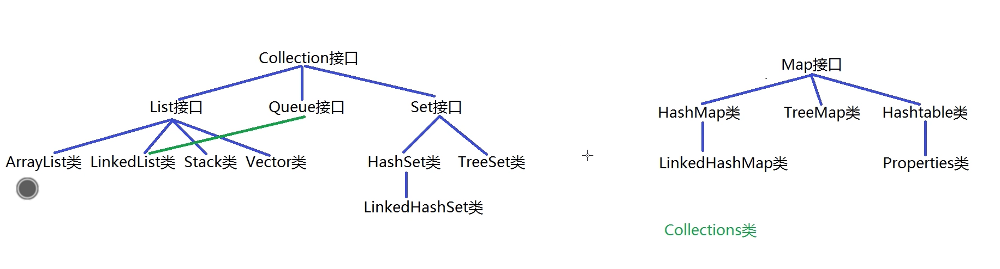
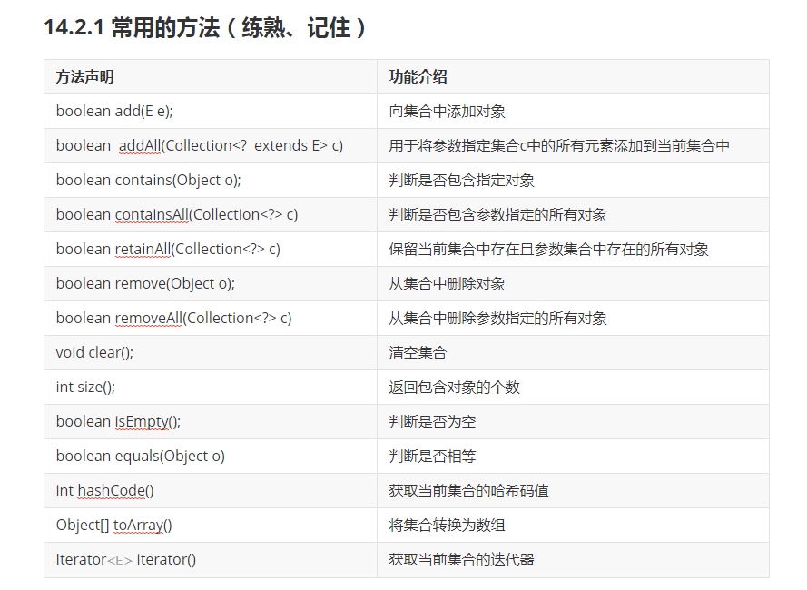
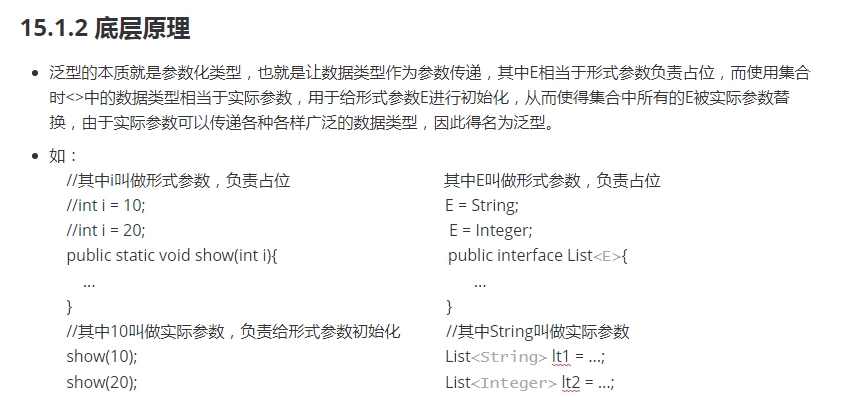

### 集合类库
#### 集合概述
+ 集合由来
    + 需要在java中记录单个数据内容，则声明一个变量
    + 需要在java中记录多个类型相同的数据内容时，声明一个一维数组
    + 需要在java中记录多个类型不同的数据内容时，创建一个对象
    + 需要在java中记录多个类型相同的对象数据时，创建一个对象数组
    + 需要在java中记录多个类型不同的对象数组时，创建一个集合
+ 集合框架结构
    + java中集合框架顶层框架层是：java.util.Collection集合和java.util.Map集合
    + 其中Collection集合存取元素的基本单位是：单个元素
    + 其中Map集合中存取元素的基本单位是：单对元素


#### Collection集合的准备和元素添加
+ 基本概念
    + java.util.Collection接口是List接口，Queue接口，Set接口的父接口，因此该接口里定义的方式既可以用于操作List集合，也可以用于操作Queue和Set集合

+ 示例
    ```java
        // Collection c1 = new Collection(); collection是接口不能创建实例
        Collection c1 = new ArrayList();
        c1.add(new String("123"));
        c1.add(Integer.valueOf("4"));
        c1.add('a');
        System.out.println(c1); // 打印集合就是自动调用集合中每个元素中的toString方法

        // 向集合中添加集合
        Collection c2 = new ArrayList();
        c2.add("567");
        c2.add(9);
        c1.addAll(c2);  // 将c2集合中的元素分别加入c1 [123, 4, a, 567, 9]
        c1.add(c2);     // 将c2集合当做一个整体加入c1 [123, 4, a, 567, 9, [567, 9]]
        System.out.println(c1);
    ```

#### Collection集合判断单个元素是否存在
+ contains()
    
    + 该方法的本质是调用了元素的equals方法
+ 示例
    ```
        System.out.println(c2.contains(new String("567"))); // true 这边没有问题是因为String类的equals被重写了，只比较内容
    ```


#### Collection集合判断所有元素是否存在
+ 示例
    ```
        System.out.println(c1.containsAll(c2)); // true
    ```
#### Collection集合实现交集的计算
+ 示例
    ```java
        Collection c3 = new ArrayList();
        c3.add(0);
        c3.add(1);
        Collection c4 = new ArrayList();
        c4.add(1);
        c4.add(2);
        c3.retainAll(c3);       // false
        c3.retainAll(c4);       // true 
        System.out.println(c3); // [1]
    ```
#### Collection集合实现元素删除
+ remove(Object obj)
+ removeAll(Collection c)
    + 该方法也是调用了元素的equals方法
        ```java
            boolean b1 = c1.remove(c2); // true [123, 4, a, 9, 567, 9]
            boolean b2 = c1.removeAll(c2); // true 将c2的元素从c1中全部删除，有则删无则跳，只要删除过一个元素就返回true
            System.out.println(c1); // [123, 4, a]
        ```
#### Collection集合实现其他方法的测试
+ 示例
    ```java
        c1.clear();
        System.out.println(c1.size());
        System.out.println(c1.isEmpty());

        Collection c5 = new ArrayList();
        c5.add(2);
        c5.add(1);
        Collection c6 = new ArrayList();
        c6.add(1);
        c6.add(2);
        System.out.println(c5.equals(c6));
    ```
#### Collection集合和数组的转换方式
+ 示例
    ```java
        // 集合到数组
        Object[] objects = c5.toArray();
        System.out.println(Arrays.toString(objects));
        // 数组到集合
        Collection objects1 = Arrays.asList(objects);
        System.out.println(objects1);
    ```
#### Collection集合实现迭代器的使用
+ Iterator接口
    + 概念  
        + java.util.Iterator接口主要是描述迭代器对象，可以遍历Collection集合中所有的对象
        + java.util.Collection接口继承Iterator接口，因此所有实现Collection的类都可以使用迭代器对象
    + 常用方法
        + boolean hasNext()
            + 判断集合中是否有可以迭代/访问的元素
        + E next()
            + 用于取出一个元素并指向下一个元素
        + void remove()
            + 用于删除访问到的最后一个元素
#### Collection集合使用迭代器模拟toString()
+ 示例
    ```java
        Collection c1 = new ArrayList();

        c1.add("one");
        c1.add(2);

        // 使用迭代器遍历集合元素
        Iterator iterator = c1.iterator();
        while (iterator.hasNext()) {
            System.out.println(iterator.next());
        }

        // 重置迭代器指向
        iterator = c1.iterator();
        StringBuilder sb = new StringBuilder("[");
        while (iterator.hasNext()) {
            Object obj = iterator.next();
            if(!iterator.hasNext()) sb.append(obj).append("]");
            else sb.append(obj).append(", ");
        }
        System.out.println(sb);
    ```
#### Collection集合迭代的过程中删除元素
+ remove()
    + 删除最近访问的元素
        ```java
            iterator = c1.iterator();

            while (iterator.hasNext()) {
                Object obj = iterator.next();
                if("one".equals(obj)) iterator.remove();
            }
            System.out.println(c1);
        ```
#### Collection集合中使用foreach结构
+ 集合遍历方式
    + 直接println会调用toString
    + 迭代器
    + foreach循环（java5开始）
+ 基本概念
    
    + java5开始推行的增强型for循环
+ 语法结构
    ``` 
        for(元素类型 变量名 ： 数组/集合名称) {
            循环体；
        }
    ```
+ 示例
    ```
        int[] arr = new int[] {1,2,3,4};

        for(int i : arr) {
            System.out.println(i);
        }
    ```
#### List集合概念和ArrayList类的源码解析
+ 基本概念
    + java.util.List集合是Collection的子集合，该集合允许有重复的元素并且有放入的先后次序
    + 该集合主要的实现类有ArrayList,LinkedList,Stack,Vector类
    + 其中ArrayList类的底层是采用动态数组进行数据管理的，支持下标访问，增删元素不方便
    + 其中LinkedList底层是双向俩表进行数据管理，访问不方便，增删元素方便
    + 可以认为ArrayList和LinkedList的方法逻辑上完全一样，只是性能上有一定差别，ArrayList更适合访问，LinkedList更适合插入和删除，在性能要求不是特别苛刻的情形下可以忽略这个差别
    + 其中Stack类的底层是采用动态数组进行数据管理的，该类主要用于描述一种具有后进先出特征的数据结构，叫做栈
    + 其中Vector类的底层是采用动态数组进行数据管理，该类与ArrayList类相比属于线程安全类，效率更低（处理安全基本和ArrayList类似，Vector每次扩容两倍，ArrayList扩容1.5倍）
#### LinkedList类的概念和源码解析
+ 底层双向链表
#### Stack类和Vector类
+ 都不用了，了解一下即可
#### List集合中增加和查找方法的使用
+ 示例
    + list.add(index,value)
        ```
            List list = new LinkedList();

            list.add(0,0);
            list.add(1,2);
            list.add(1,1);
            System.out.println(list);
        ```
    + list.get(index)
        ```
            String str = (String) list.get(1);
        ```
    + list.indexOf()
    + list.lastIndexOf()
#### List集合中修改和删除以及子集合获取的方式
+ E list.set(index,value)
    + 修改指定位置元素，返回被修改前的元素
        ```
            list.add(0,0);
            list.add(1,2);
            list.add(1,"1");
            System.out.println(list.set(0,6));  // 0
            System.out.println(list);           // [6,1,2]
        ```
+ E list.remove(index)
    + 按下标删除元素，返回被删除的元素
        ```
            System.out.println(list.remove(0));  // 6
        ```
+ list.subList(start,end)
    ```
        List list1 = list.subList(0,1); // 左开右闭
        System.out.println(list1); // [1]
    ```
#### Stack类的编程使用
+ 常用方法
    + stack.push()
    + stack.pop()
    + stack.peek()
+ 案例
    + 准备stack将数据11,22,33,44,55入栈并打印，然后打印栈顶元素，最后依次出栈并打印
        ```
            public static void main(String[] args) {

                Deque<Integer> stack = new LinkedList<>();

                stack.push(11);
                stack.push(22);
                stack.push(33);
                stack.push(44);
                stack.push(55);
                System.out.println(stack.peek());

                while(!stack.isEmpty()) {
                    System.out.println(stack.pop());
                }
        ```


            }
        ```
#### Queue集合的概念和使用
+ 常用方法
    + queue.offer()
    + queue.poll()
    + queue.peek()
+ 示例
    ```
        public static void main(String[] args) {

            Deque<Integer> queue = new LinkedList<>();

            queue.offer(11);
            queue.offer(22);
            queue.offer(33);
            queue.offer(44);
            queue.offer(55);

            System.out.println(queue.peek());

            while(!queue.isEmpty()) {
                System.out.println(queue.poll());
            }
        }
    ```
#### 泛型机制的基本概念
+ 基本概念
    + 通常情况下集合可以存放不同类型的对象，是因为将所有对象都看做Object类型放入的，因此从集合中取出的元素也是Object类型，为了表达该元素真实的数据类型需要强制类型转换而强制类型转换可能发生转换异常
    + 为了避免以上错误发生从java5开始增加泛型机制，也就是在集合的右侧使用 <数据类型> 的方式来明确要求该集合中存放的元素的类型，若放入其他类型的元素则编译报错
    + 泛型只在编译时期有效，在运行时期不区分是什么类型
+ 底层原理
    + 泛型的本质是参数化类型，让数据类型作为参数传递，其中E相当于形式参数负责占位，而使用集合时<>中的数据类型相当于实际参数，用于给形式E进行初始化，从而使集合E中所有的E被实际参数替换，由于实际参数可以传递给各种各样广泛的数据类型，因此得名泛型


#### 泛型机制的基本使用
+ 示例
    ```
        List<String> list = new LinkedList<String>();
    ```
+ java7开始了菱形机制（省略后面的泛型）
    ```
        List<String> list = new LinkedList<>();
    ```
#### 泛型机制的底层原理
+ 如图
+ 注意
    + 如果声明了泛型但是不指定类型，会默认当做Object类处理
#### 自定义泛型类的实现和使用
+ 自定义泛型接口概念
    
    + 泛型接口和普通接口的区别就是后面增加了类型参数列表，可以有多个参数选择
+ 自定义泛型类
    + 泛型类和普通类的区别就是类名后面多了参数列表可以有多个类型参数<T,E...>
    + 实例化泛型类时应该指定具体的数据类型，并且是引用数据类型而不是基本数据类型
    + 父类有泛型，子类可以选择保留泛型也可以选择指定泛型类型
    + 子类除了指定和保留泛型之外还可以有自己的泛型
+ 示例
    ```java 
        // Person.java
        Person<T>{
            private int age;
            private String name;
            private T gender;
        }

        // main.java
        public static void main(String[] args) {

            // 这边没有指定类型，系统认为没有使用泛型将T认为是Object
            Person person = new Person(21,"luna","male");
            // 设置泛型之后，在构造函数中必须符合规范
            Person<Integer> person1 = new Person<>(21,"luna",0);
            System.out.println(person1);
        }
    ```
#### 泛型类被继承时的处理方式
+ 示例
    + 不保留泛型且不指定类型
        ```
            // 不保留泛型且没有指定类型，此时T默认为Object类型--擦除
            public class SubPerson extends Person {}
        ```
    + 不保留泛型但是指定类型
        ```
            // 不保留泛型但是指定类型为String
            public class SubPerson extends Person<String> {}
        ```
    + 保留父类泛型
        ```
            // 保留父类泛型
            public class SubPerson<T> extends Person<T> {}
        ```
    + 保留父类的泛型同时在子类中添加新的泛型
        ```
            public class SubPerson<T,T1> extends Person<T> {}
        ```
#### 泛型方法的定义和使用
+ 概念
    + 泛型方法就是我们输入参数的时候，输入的是泛型参数，而不是具体参数，我们在调用这个泛型方法时需要对泛型参数进行实例化
    + 泛型方法的格式
        ```
            [访问权限] <泛型> 返回值类型 方法名([泛型标识 参数名]) { 方法体; }_
        ```
    + 在静态方法中使用泛型参数时，需要我们把静态方法定义为泛型方法
+ 示例
    ```
        // 这边的T与之前类中的无关
        // <T>是告诉系统后面参数列表中的T是泛型
        public static <T> void printArr(T[] arr) {
            for(T t: arr) {
                System.out.println(t+" ");
            }
        }
    ```
#### 泛型通配符的使用和特点
+ 泛型在继承中的体现
    + 如果B是A的子类或者子接口，而G是具有泛型声明的类或接口，则G<B>并不是G<A>的子类型
    + 例如：String是Object的子类但是List<String>不是List<Object>的子类
+ 使用通配符作为泛型类型的公共类
    ```java
        public static void main(String[] args) {

            List<String> list = new LinkedList<>();
            List<Integer> list1 = new LinkedList<>();
        list1.add(100);
    
            // 使用通配符作为泛型的公共父类
            List<?> list2 = new LinkedList<>();
            list2 = list;       // 可以发生list<String>到list<?>的转换
            list2.add("1");     // 虽然可以转换但是list<?>不能承载String内容
            list2 = list1;      // 可以发生list<Integer>到list<?>的转换
            list2.add(1);       // 虽然可以转换但是list<?>不能承载Integer内容
            Object o = list2.get(0);// 没有报错，不支持添加但支持获取，默认为Object类型
            System.out.println(list2);	// [100]
        }
    ```
+ 通配符的使用
    + 有时候我们希望传入的类型在一个指定的范围内，此时就可以使用泛型通配符
    + 如：之前传入的类型为Integer类型，但是后来业务需要Integer的父类Number类型也可以传入
    + 泛型三种通配符形式：
        + <?> 无限制通配符：表示我们可以传入任意类型的参数
        + <? extends E> 表示类型的上界是E，只能是E或者E的子类
        + <? super E> 表示类型的下界是E，只能是E或者E的父类
    + 上界示例
        ```java
            // 泛型必须是Collection以及Collection子类
            List<List> list4 = new ArrayList<>();
            List<Object> list5 = new ArrayList<>();

            List<? extends Collection> list2 = new LinkedList<>();
            list2 = list4;  // List不是Collection的父类所以可以赋值
            list2 = list5;  // Object是Collection的父类所以不可以赋值
            list2.add(list);       // 依然不能添加Collection子类内容
            list2.add(list1);     // 依然不能添加内容
            Collection collection = list2.get(0);// 设置上界后，获取元素的类型变为上界
        ```
    + 下界示例
        ```java
            // 泛型必须是Collection以及Collection父类
            List<? super Collection> list2 = new LinkedList<>();
            List<List> list4 = new ArrayList<>();
            List<Object> list5 = new ArrayList<>();
            list2 = list4;  // List不是Collection的父类所以不可以赋值
            list2 = list5;  // Object是Collection的父类所以可以赋值
            list2.add(list);       // 可以添加Collection子类内容
            list2.add(new Object());     // 可以添加Collection子类内容，但是不能超过collection，
            Object object = list2.get(0);// 设置下界后，获取元素的类型变为上界也就是Object
            System.out.println(list);
        ```
#### Set集合的基本概念
+ 概念
    + java.util.Set集合是Collection集合的子集合，与List集合平级
    + 该集合中元素没有先后放入次序，且不允许重复
    + 该集合的主要实现类是：HashSet类和TreeSet以及LinkedHashSet类
    + 其中HashSet类的底层是采用哈希表进行数据管理的
    + 其中TreeSet类的底层是采用红黑树进行数据管理的
    + 其中LinkedHashSet类与HashSet类的不同之处在于内部维护了一个双向链表，链表中记录了元素的迭代顺序，也就是元素插入集合的先后顺序因此便于迭代
#### HashSet集合的基本使用
+ 常用方法
    
    + 参考Collection方法即可
+ 案例
    + 准备一个Set指向HashSet对象，向该集合中添加元素"two"并打印，再向集合中添加元素"one"并打印，再添加"three"并打印，再向集合中添加元素"one"并打印
        ```java
            // 可以看出hashset并没有按输入顺序打印(因为是hash表存储啊。。。)
            public static void main(String[] args) {

                Set<String> set = new HashSet<>();

                set.add("two");             // true
                System.out.println(set);    // [two]
                set.add("one");             // true
                System.out.println(set);    // [one, two]
                set.add("three");           // true
                System.out.println(set);    // [one, two, three]
                set.add("one");             // false
                System.out.println(set);    // [one, two, three]

            }
        ```
    + 如果改用LinkedHashSet执行相同操作，输出结果会遵循添加顺序
        ```java
            Set<String> set = new LinkedHashSet<>();
            // [two]
            // [two, one]
            // [two, one, three]
            // [two, one, three]
        ```
#### HashSet集合放入元素的过程


#### TreeSet集合的概念
+ 示例
    ```java
        Set<String> set = new TreeSet<>();

        set.add("aa");
        set.add("cc");
        set.add("bb");
        System.out.println(set); // treeset底层红黑树，所以有大小次序，默认从小到大 [aa,bb,cc]
    ```
#### TreeSet集合放入String对象的实现
#### TreeSet集合中实现自然排序
+ 示例
    + Student.java
        ```java
            public class Student implenments Comparable<Student>{
                private int age;
                private String name;
                ...
                @Override
                public int compareTo(Student o) {
                    // return 0;       // 调用对象和参数对象相等
                    // return -1;      // 调用对象小于参数对象
                    // return 1;      // 调用对象大于参数对象
                    // 比较姓名，getName是String类型，String类型本身重写了comparaTo方法
        return this.getName().compareTo(o.getName());
                }
            }
        ```
    + main.java
    ```java
        Set<Student> set1 = new TreeSet<>();
        set1.add(new Student(18,"luna"));
        set1.add(new Student(19,"saber"));
        set1.add(new Student(20,"sola"));
        System.out.println(set1);
        // [Student{age=18, name='luna'}, Student{age=19, name='saber'}, Student{age=20, name='sola'}]
    ```
#### TreeSet集合中实现比较器排序
+ 示例
    ```java
        Comparator<Student> comparator = new            Comparator<Student>() {
                @Override
                public int compare(Student o1, Student o2) {
                    // o1表示新增的对象，o2表示已有的对象
                    return o2.getAge() - o1.getAge();
                }
        };
    	/*lambda表达式写法
    		   Set<Student> set = new TreeSet<>((s1,s2) -> {
                	int res = s2.getAge()-s1.getAge();
                	if (res != 0) return res;
                	else return s1.getName().compareTo(s2.getName());
         	   });
         */
        Set<Student> set1 = new TreeSet<>(comparator);
        set1.add(new Student(18,"luna"));
        set1.add(new Student(19,"saber"));
        set1.add(new Student(20,"sola"));
        System.out.println(set1);  // [Student{age=20, name='sola'}, Student{age=19, name='saber'}, Student{age=18, name='luna'}]
        // Comparator和Comparable同时存在优先Comparator
    ```
+ Comparator的lamda表达式写法
    ```java
        Comparator<Student> comparator = (Student o1,Student o2) -> {
            return o2.getAge() - o1.getAge();
        };
    ```
#### Map集合的概念
+ 概念
    + java.util.Map<K,V>集合中存取元素的基本单位，是单对元素，其中类型参数如下：
        + K - 映射所维护的键（Key）类型，相当于目录
        + V - 映射值（Value）的类型，相当于内容
    + 该集合中Key是不允许重复的，一个Key对应一个Value
    + 该集合主要实现类： HashMap,TreeMap,LinkedHashMap,HashTable
    + 其中HashMap底层使用Hash表进行数据管理的
    + TreeMap底层是用红黑树管理的
    + LinkedHashMap使用双向链表记录元素迭代的顺序
    + HashTable类是最古老的Map实现类，与HashMap类相比属于线程安全类，且不允许null作为Key或者Value数据
    + 其中Properties类是HashTable的子类，该对象用于处理属性文件，key和value都是String类型
    + Map集合是面向查询优化的数据结构，在大数据量情况下有着优良的查询性能
    + 经常用于根据key检索value的业务场景
+ set
    + HashSet集合是使用了一半的HashMap，将add是使用了map.put(key,null)
;

#### Map集合实现元素的增加和修改
+ 示例
    ```java
        Map<String,String> map = new HashMap<>();

        map.put("1","luna");
        System.out.println(map);
        map.put("2","saber");
        map.put("3","sola");
        for(Map.Entry<String,String> entry : map.entrySet()) {
            System.out.println(entry);
        }
    ```
#### 元素放入HashMap集合的过程


#### Map集合实现元素的查找和删除
+ 查找
    + boolean map.get(Key)
    + boolean map.containsKey()
    + boolean map.containsValue()
+ 删除
    + V map.remove(Key)
#### Map集合的三种遍历方式
+ methods
    + Set<K> keySet();
    + Collection<V> values();
    + Set<Map.Entry<K,V>> entrySet() 
+ 示例
    ```
        System.out.println(map.keySet());   // [1, 2, 3]
        System.out.println(map.values());   // [luna, saber, sola]
        System.out.println(map.entrySet()); // [1=luna, 2=saber, 3=sola]
    ```
#### Collections类的编程和使用


+ 示例
    ```java
        // 注意copy比较的是两个集合的size()并不是容量，所需注意创建方法
        List<Integer> list = Arrays.asList(1,2,3,4,5);
        List<Integer> list1 = Arrays.asList(new Integer[10]);
        System.out.println(Collections.max(list));  // 5
        System.out.println(Collections.min(list));  // 1
        Collections.reverse(list);              // [5,4,3,2,1]
        Collections.copy(list1,list);
        Collections.swap(list,0,4);        // [1,4,3,2,5]
        Collections.sort(list);                 // [1,2,3,4,5]
        Collections.shuffle(list);              // 随机排列
        System.out.println(list);
        System.out.println(list1);              // [5,4,3,2,1,null,null,null,null,null]
    ```