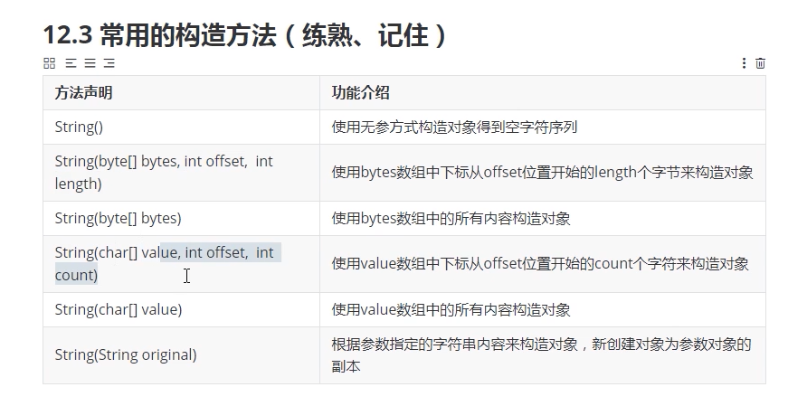
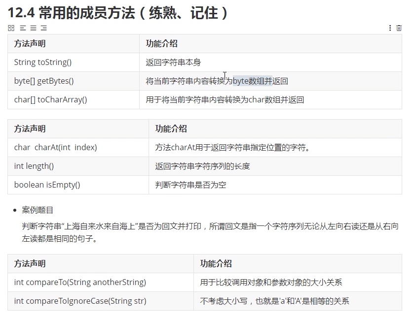
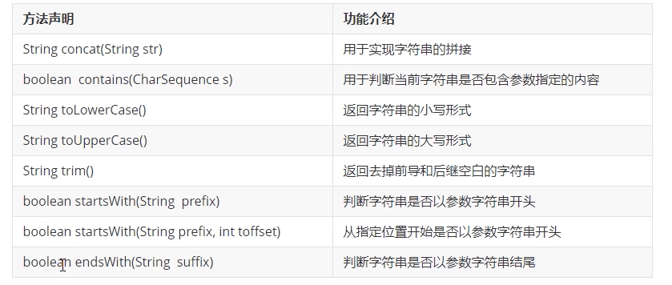
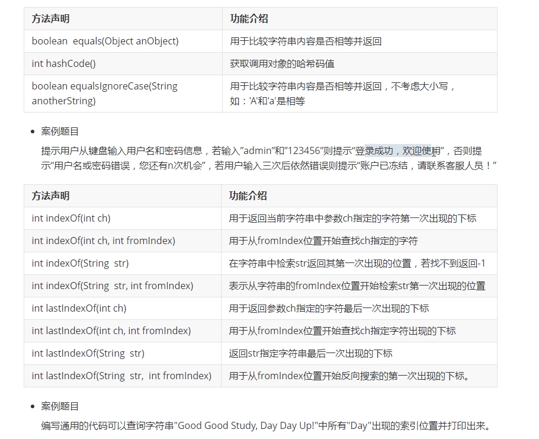
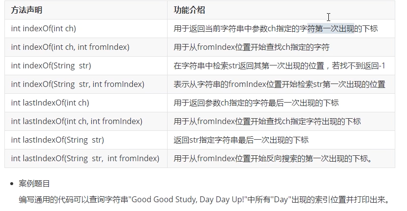
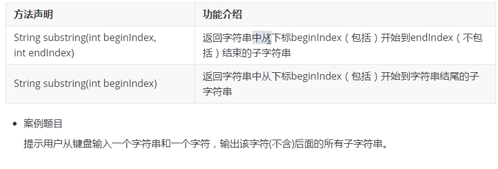
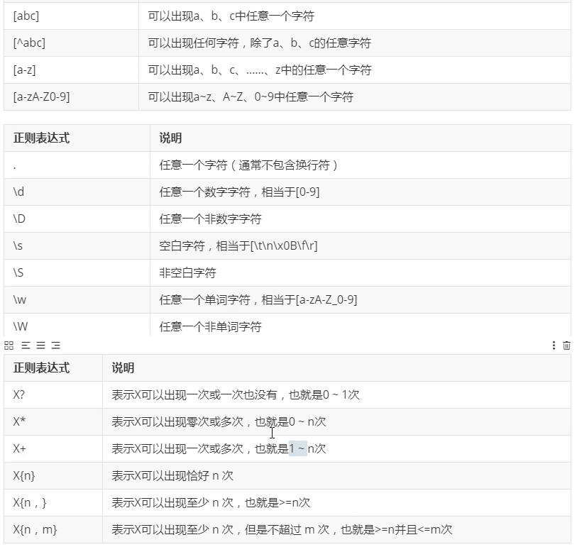
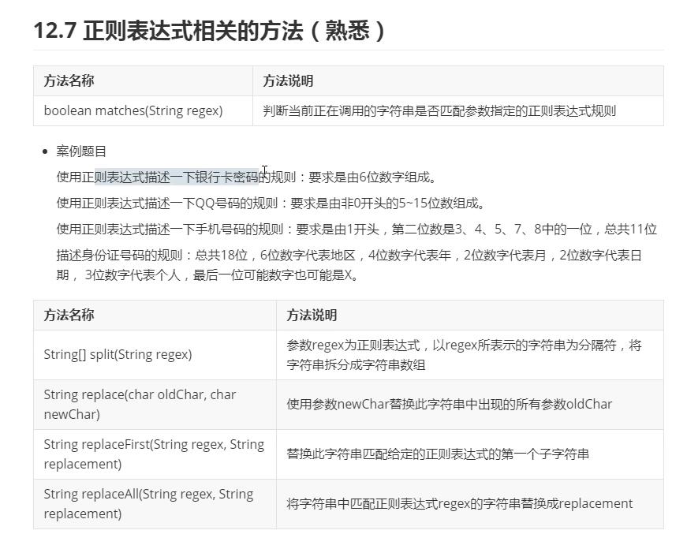

### String类的概述和使用
#### String类和常量池的概念
+ java.lang.String类用于描述字符串，java程序中所有字符串字面值都可以使用该类的对象加以描述，如："abc"（来着lang包表示使用不需要引入）
    + 该类由final修饰表示该类不能被继承
    + 从jdk1.9开始该类的底层不用char[]来存储数据，而是改成了byte[] 加上编码标记从而节约了一些空间
    + 该类描述的字符串内容是个常量不可更改，因此可以被共享使用
        ```
            String str = "abc"; // 其中"abc"这个字符串是常量不可改变
            str = "123";        // 将"123"的地址赋值给str（"abc"没人被使用会被jvm回收），改变了str的指向并没有改变指向内容
            // str只是String类型的引用并不是String类型不可改变的是String类型的变量如"abc",而不是引用
        ```
+ 常量池概念
    + 由于String类型描述的字符串内容是常量不可改变，因此java虚拟机将首次出现的字符串放入常量池中若后续代码出现了相同的字符串内容直接使用池中已有的字符串对象无需申请内存创建对象，从而提高性能
#### String类常用构造方法的使用
+ 常用构造方法
    
    ```
        // 使用无参方法构造对象
        String str1 = new String();

        // 使用byte数字构造对象
        byte[] b = new byte[] {97,98,99,100};
        // String str2 = new String(b);
        String str2 = new String(b,1,2);
        System.out.println(str2);

        // 使用char数组构造对象
        char[] c = new char[] {'h','e','l','l','o'};
        // String str3 = new String(c);
         String str3 = new String(c,0,5);
        System.out.println(str3);

        // 使用string构造对象
        String str4 = new String(str3);
        System.out.println(str4);
    ```
+ 常用方法


#### String类的笔试考点
+ 示例
    ```
        // 1.下面会创建几个对象，分别放在哪里
        String str = "abc";        // 一个对象在常量池
        String str0 = new String("abc"); // 两个对象一个在常量池一个再堆区

        // 2.常量池和堆区的比较
        String str1 = "hello";
        String str2 = "hello";
        String str3 = new String("hello");
        String str4 = new String("hello");
        System.out.println(str1 == str2);       // 比较地址，都在常量池 true
        System.out.println(str1.equals(str2));  // 比较内容，true
        System.out.println(str3 == str4);       // 比较地址，是不同的对象 false
        System.out.println(str3.equals(4));     // 比较内容 true
        System.out.println(str2 == str4);       // 比较地址 一个堆区一个常量池 false
        System.out.println(str2.equals(str4));  // 比较内容 true

        // 3.常量优化，变量不优化
        String str5 = "abcd";
        String str6 = "ab"+"cd";
        System.out.println(str5 == str6); // 常量优化，已存在合并后常量，true
        String str7 = "ab";
        String str8 = str7 + "cd";
        System.out.println(str5 == str8); // 变量生成新地址 false
    ```
#### String类型和数组之间的转换
+ 示例
    ```
        String str = "abc";
        byte[] b = str.getBytes();
        char[] c = str.toCharArray();
    ```
#### String类型中字符的获取和使用
+ 示例
    ```
        String str = "abc";
        char c = str.charAt(0);
    ```
#### String类型实现字符串之间大小的判断
+ 示例
    ```
        // 1.构造String类型的对象并打印
        String str1 = new String( original: "hel1o" );
        System.out.println("str1 = " + str1); // hello
        // 2. 使用构造好的对象镇它字符串对象之间比较大小并打印
        System. out . print1n(str1.compareTo("world")); // 'h' - 'w'=> 104 - 119 => - 15
        System.out.println( str1.compareTo("haha")); // 'e'- 'a'=> 101 - 97 => 4
        System.out.print1n(str1.compareTo("hehe")); // 'L' - 'h'=> 108 - 104 => 4
        System.out.println(str1.compareTo("heihei")); // 'L'- 'i'=> 108 - 105 => 3
        System.out.print1n(str1.compareTo("helloworld")); //长度: 5 - 1日=> -5
        System.out.println(str1.compareToIgnoreCase( str: "HELLO")); //日
    ```
#### String类实现各种方法的使用


#### String类型实现登录功能的模拟

+ 示例
    ```
        import java.util.*;
        public class StringEquals {

            public static void main(String[] args) {

                Scanner sc = new Scanner(System.in);

                int num = 1;
                while (true) {
                    System.out.println("please input username and password");
                    String[] str = sc.nextLine().split(" ");
                    if(str[0].equals("admin") && str[1].equals("password")) {
                        System.out.println("welcome to system");
                        break;
                    }
                    else {
                        if (num == 3) {
                            System.out.println("your account is locked!");
                            break;
                        }
                        System.out.println("error ! please input again ! this is your "+(num++)+" input");
                    }
                }
                sc.close();
            }
        }
    ```

#### String类型实现字符和字符串的查找


+ 示例
    ```
        String str = "good good study Day Day up!";
        int pos = 0;
        while((pos = str.indexOf("Day",pos)) != -1) {
            System.out.println(pos);
            pos += "Day".length();
        }
    ```

#### String类中子字符串的获取


+ 示例

    ```
        import java.util.*;
        public class StringSubTest {

            public static void main(String[] args) {

                Scanner sc = new Scanner(System.in);

                System.out.println("please input data");
                String[] str = sc.nextLine().split(" ");
                System.out.println(str[1].substring(str[1].indexOf(str[0])+1));
            }
        }
    ```

#### 正则表达式的概念和规则
+ 概念
    + 正则表达式是一个规则字符串，可以用于对字符串数据的格式进行验证以及匹配，查找，替换操作，该字符串通常使用^运算符开头，使用$作为结尾标志，当然也可以省略


#### 正则表达式的使用


+ 示例银行卡密码
    ```
        import java.util.*;
        public class StringMatchTest {

            public static void main(String[] args) {

                Scanner sc = new Scanner(System.in);
                // String reg = "^[0-9]{6}$"; 
                String reg = "^\\d{6}$";
                // 当中的^$可以省略 reg="\\d{6}"

                while (true) {
                    System.out.println("please input your password: ");
                    String str = sc.nextLine();
                    if (str.matches(reg)) {
                        System.out.println("welcome to system");
                        break;
                    } else System.out.println("error!");
                }
            }
        }
    ```
+ QQ号规则
    ```
        String reg = "[1-9]//d{4,14}";
    ```
+ 手机号规则
    ```
        String reg = "1[34578]//d{9}";
    ```
+ 身份证规则
    ```
        String reg = "\\d{6}\\d{4}\\d{2}\\d{2}\\d{3}[0-9|X]";
    ```
#### 正则表达式相关的方法使用
+ replaceAll()
    ```
        String reg = "[ab]";

        String data = "acabdabdasd";

        String str = data.replaceAll(reg,"I");
        System.out.println(str);
        // 注意这边replaceAll之后，data本身不会发生改变，该方法会复制原字符串的值之后进行修改再返回修改后的字符串
    ```