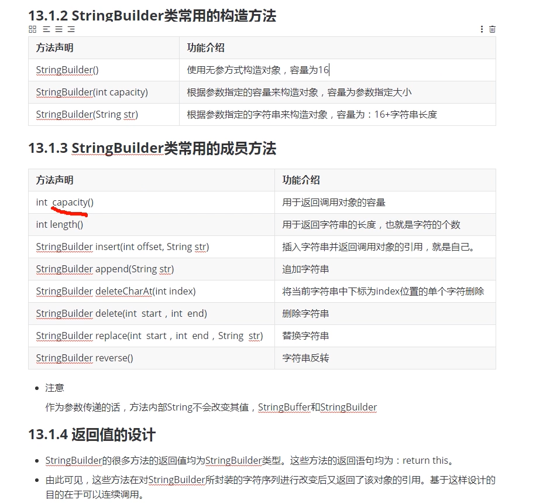
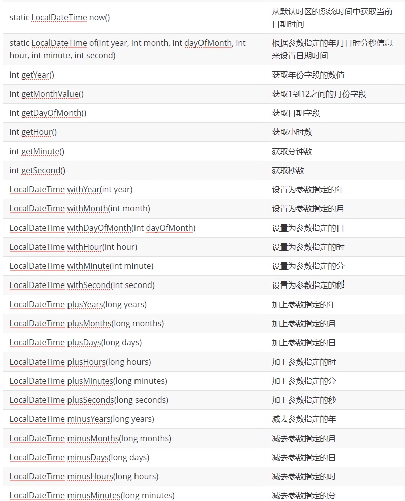
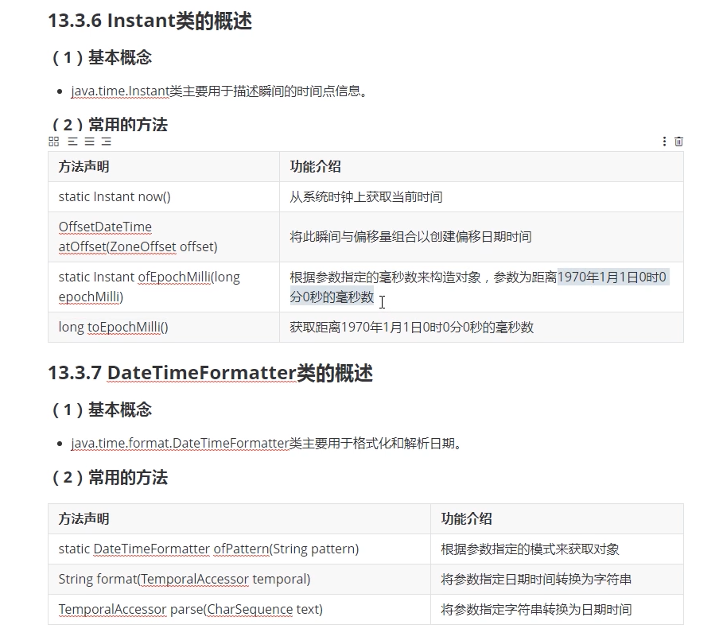

### 可变字符串类与日期相关类
#### 可变字符串类的基本概念
+ 概念
    + 由于String类描述的字符串是常量不可变，当需要在java代码中描述大量相似的字符串时只能单独申请和存储，这会造成内存空间的浪费
    + 为了解决上面的问题可以使用java.lang.StringBuffer和java.lang.StringBuilder类来描述字符序列也改变的字符串
        + StringBuffer类是从jdk1.0开始存在，属于线程安全类所以效率比较低
        + StringBuilder类是从jdk1.5开始存在，属于非线程安全类效率比较高
#### StringBuilder类的常用构造方法


+ length()
    + 实际长度
+ capacity()
    + 申请内存的大小
#### StringBuilder类实现插入操作
+ 示例
    ```
        StringBuilder sb = new StringBuilder();
        sb.insert(0,"123");
        System.out.println(sb);
    ```
#### StringBuilder类扩容算法源码解析
+ 别问问就是2*n+2,如果扩容还不够，自己看源码
#### StringBuilder类实现字符和字符串的删除
+ 示例
    ```
        StringBuilder sb = new StringBuilder();
        sb.insert(0,"123");
        sb.append("456");  // 123456
        sb.replace(0,1,"01"); // 这边是左开右闭，只会替换索引为0处的字符,0123456
        sb.delete(0,0);     // 这边是左开右闭的，0-0不会删除 0123456
        sb.deleteCharAt(sb.length()-1); // 012345
        System.out.println(sb);
    ```
#### StringBuilder类的改查以及反转操作
+ 示例
    ```
        StringBuilder sb = new StringBuilder();
        sb.insert(0,"123");
        sb.append("456");  // 123456
        sb.replace(0,1,"01"); // 这边是左开右闭，只会替换索引为0处的字符,0123456
        sb.delete(0,0);     // 这边是左开右闭的，0-0不会删除 0123456
        sb.deleteCharAt(sb.length()-1); // 012345
        sb.setCharAt(0,'6');     // 612345
        System.out.println(sb.reverse());   // 543216
        System.out.println(sb.indexOf("1"));    // 4
    ```
#### 字符串类的笔试考点
+ 为什么StringBuilder类的对象本身可以修改，为什么成员方法还需要返回值呢？
    + 为了连续调用
        ```
            sb.reverse().append("1").append("2");
        ```
+ 如何实现StringBuilder和String之间的相互转换
    + 调用相关成员方法
        ```
            String str = "123";
            StringBuilder sb = new StringBuilder(str);
            String res = sb.toString(); 
        ```
+ String,StringBuilder,StringBuffer之间的效率排序
    + String < StringBuffer < StringBuilder
#### System类的概念和使用
+ java.lang.System类中提供了一些有用的类和方法
    + Static long currentTimeMillis()
        + 返回当前时间与1970年1月1日0时0分0秒之间以毫秒为单位的时间差
    ```
        long ms = System.currentTimeMillis(); // 一般用来比较算法效率，计算算法执行前后时间差
        System.out.println(ms);
    ```
#### Date类的概念和使用
+ 概述
    + java.util.Date用来描述特定瞬间，也就是年月日时分秒，可以精确到毫秒
+ 常用方法
    + Date() 
        + 使用无参方法构造对象，也就是当前系统时间
    + Date(long date)
        + 根据参数指定的毫秒数构造对象，参数为距离1970年1月1日0时0分0秒的毫秒数
    + long getTime()
        + 获取调用对象距离1970年的毫秒数
    + void setTime(long time)
        + 设置调用对象为距离基准时间time毫秒的时间点
#### SimpleDateFormat类的概念和使用
+ 基本概念
    + java.text.SimpleDateFormat类主要用于实现日期和文本之间的转换
+ 常用方法
    + SimpleDateFormat()
        + 使用无参方式构造对象
    + SimpleDateFormat(String pattern)
        + 根据参数指定的模式来构造对象，模式主要有：y-年 M-月 d-日 H-时 m-分 s-秒
    + final String format(Date date)
        + 将日期转为文本
    + Date parse(String source)
        + 将文本转为日期
+ 示例
    ```
        public static void main(String[] args) throws Exception{

            Date date = new Date();

            SimpleDateFormat sdf = new SimpleDateFormat("yyyy-MM-dd HH:mm:ss");
            // 这只是创建一个格式对象，该对象的成员方法可以对date类型进行修改操作
            String res = sdf.format(date);

            Date temp = sdf.parse(res);

            System.out.println(res);
            System.out.println(temp);
        }
    ```
#### Calendar类的概念和使用
+ 概念
    + java.util.Calendar类主要描述特定的瞬间，取代Date类中过时的方法实现全球化
    + 该类是一个抽象类不能实例化对象，其子类根据不同的国家的日历系统，其中应用最广泛的是Gregori
    Calendar（格里高日历），对应世界上绝大部分国家使用的标准日历
+ 常用的方法
    + Static Calnedar getInstance()
        + 获取Calendar类型的引用
    + void set(int year,int month,int day,int hour,int min,int sec)
        + 设置年月日时分秒信息
    + Date getTime()
        + 用于将Calendar转换为Date类型
    + void set(int field,int value)
        + 设置指定字段的数值
    + void add(int field,int amount)
        + 在指定字段原有的基础上增加数值
#### Calendar类的方法和多态的使用方式
+ 示例
    ```
        public static void main(String[] args) {

            Calendar cal = Calendar.getInstance();

            cal.set(2008,8-1,2,0,0,0);
            // 这边月份需要-1
            Date date = cal.getTime();

            SimpleDateFormat sdf = new SimpleDateFormat("yyyy-MM-dd HH:mm:ss");
            String format = sdf.format(date);
            System.out.println(format);

            cal.set(Calendar.YEAR,2018);
            Date d1 = cal.getTime();
            System.out.println(sdf.format(d1));

            cal.add(Calendar.MONTH,1);
            Date d2 = cal.getTime();
            System.out.println(sdf.format(d2));
        }
    ```
+ 虽增加Calendar更为繁琐但是增加了全球化操作，血赚
+ 笔试考点
    + Calendar对象不能new对象但是可以用getInstance()获取对象
        + 多态
+ 多态使用场合
    + 通过方法的参数传递形成多态
        ```
            public static void draw(Shape s) {
                s.show();
            }
            draw(new Rect(1,2,3,4));
        ```
    + 在方法体中直接使用多态的语法格式
        ```
            Account acc = new FixedAccount();
        ```
    + 通过方法的返回值类型形成多态
        ```
            Calender getInstance() {
                return new GregorianCalendar(zone,aLocate);
            }
        ```
#### Java8日期相关类的由来和概述
+ java8日期类由来
    + jdk1.0红包含了java.util.Date类，但是大多数方法已经在jdk1.1引入Calendar类之后被弃用了，而Calendar并不比Date好多少
        + Date类中的年份是从1900年开始月份都从0开始（反应在构造函数上）
        + 格式化只对Date有用，对Calendar类无效
        + 非线程安全
+ java8日期类的概述
    + java8通过发布新的Date-Time API来进一步加强对日期与时间的处理
    + java.time包：该包日期/时间API的基础包
    + java.time.chrono包：该包提供对不同日历系统的访问
    + java.time.format包：该包能够格式化和解析日期时间对象
    + java.time.temporal包：该包包含底层框架和拓展特性
    + java.time.zone包：该包支持不同时区以及相关规则类
+ LocalDate类的概述
    + 基本概念
        + java.time.LocalDate类主要用于描述年-月-日格式的日期信息，该类不表示时间和时区信息
    + 常用方法
        + static LocalDate now()
            + 在默认时区中从系统时钟获取当前日期
+ LocalTime类的概述
    + 概念
        + java.time.LocalTime类主要用于描述时间信息，可以描述时分秒以及纳秒
    + 常用方法
        + static LocalTime now() 
            + 默认时区的系统时间中获取当前时间
        + static LocalTime now(ZoneId zone)
            + 获取指定时区的当前时间
+ LocalDateTime类的概述
    + 概念
        + java.time.LocalDateTime类主要用于描述ISO-8601日历系统中没有时区的日期时间如2007-12-03T10:15:30
    + 常用方法
#### 日期时间对象的创建和特征获取
+ 示例
    ```
        public static void main(String[] args) {

                LocalDate date = LocalDate.now();

                LocalTime time = LocalTime.now();

                LocalDateTime dt = LocalDateTime.now();

                System.out.println(date);
                System.out.println(time);
                System.out.println(dt);

                LocalDateTime dt1 = LocalDateTime.of(2000,1,1,1,1,1);
                dt1.getYear();
                dt1.getMonthValue();
                dt1.getDayOfMonth();
                dt1.getHour();
                dt1.getMinute();
                dt1.getSecond();
            }
        }

    ```
#### 日期时间对象的特征操作



#### Instant类的概念和使用和DateTimeFormatter类的概念和使用
+ 示例
    ```
        Instant ins = Instant.now();
        System.out.println(ins);
        // 这里获取的时间是0时区的时间


        OffsetDateTime offsetDateTime = ins.atOffset(ZoneOffset.ofHours(8));
        System.out.println(offsetDateTime);
    ```
+ 示例
    ```
        public static void main(String[] args) {

            LocalDateTime ldt = LocalDateTime.now();

            DateTimeFormatter dtf = DateTimeFormatter.ofPattern("yyyy-MM-dd hh:mm:ss");

            String str = dtf.format(ldt);

            TemporalAccessor parse = dtf.parse(str);
        }
    ```

