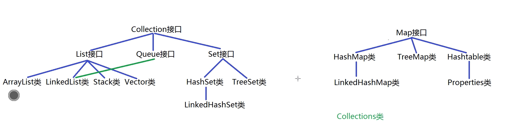

### 集合类库
#### 集合概述
+ 集合由来
    + 需要在java中记录单个数据内容，则声明一个变量
    + 需要在java中记录多个类型相同的数据内容时，声明一个一维数组
    + 需要在java中记录多个类型不同的数据内容时，创建一个对象
    + 需要在java中记录多个类型相同的对象数据时，创建一个对象数组
    + 需要在java中记录多个类型不同的对象数组时，创建一个集合
+ 集合框架结构
    + java中集合框架顶层框架层是：java.util.Collection集合和java.util.Map集合
    + 其中Collection集合存取元素的基本单位是：单个元素
    + 其中Map集合中存取元素的基本单位是：单对元素

#### Collection集合的准备和元素添加
+ 基本概念
    + java.util.Collection接口是List接口，Queue接口，Set接口的父接口，因此该接口里定义的方式既可以用于操作List集合，也可以用于操作Queue和Set集合

#### Collection集合判断单个元素是否存在
#### Collection集合判断所有元素是否存在
#### Collection集合实现交集的计算
#### Collection集合实现元素删除
#### Collection集合实现其他方法的测试
#### Collection集合和数组的转换方式
#### Collection集合实现迭代器的使用
#### Collection集合使用迭代器模拟toString()
#### Collection集合迭代的过程中删除元素
#### Collection集合中使用foreach结构
#### List集合概念和ArrayList类的源码解析
#### LinkedList类的概念和源码解析
#### Stack类和Vector类
#### List集合中增加和查找方法的使用
#### List集合中修改和删除以及子集合获取的方式
#### Stack类的编程使用
#### Queue集合的概念和使用
#### 泛型机制的基本概念
#### 泛型机制的基本使用
#### 泛型机制的底层原理
#### 自定义泛型类的实现和使用
#### 泛型类被继承时的处理方式
#### 泛型方法的定义和使用
#### 泛型通配符的使用和特点
#### Set集合的基本概念
#### HashSet集合的基本使用
#### HashSet集合放入元素的过程
#### TreeSet集合的概念
#### TreeSet集合放入String对象的实现
#### TreeSet集合中实现自然排序
#### TreeSet集合中实现比较器排序
#### Map集合的概念
#### Map集合实现元素的增加和修改
#### 元素放入HashMap集合的过程
#### Map集合实现元素的查找和删除
#### Map集合的三种遍历方式
#### Collections类的编程和使用