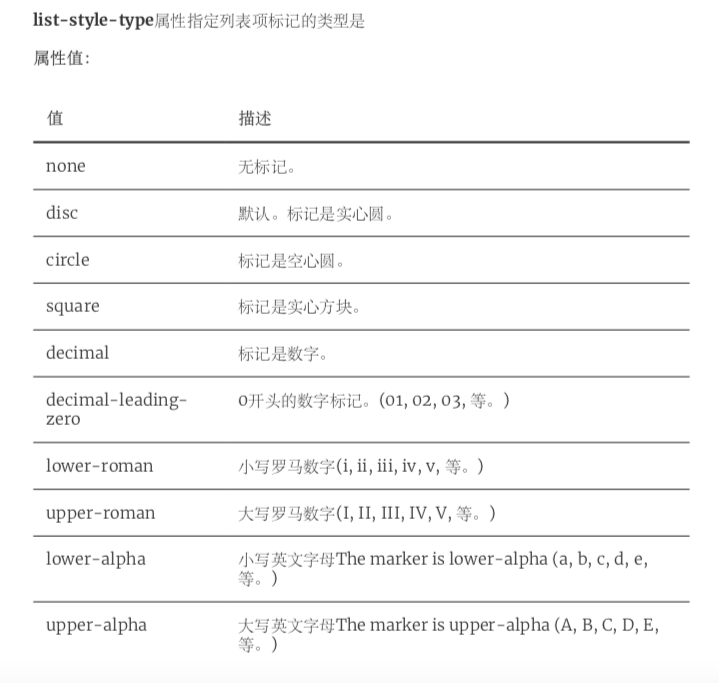
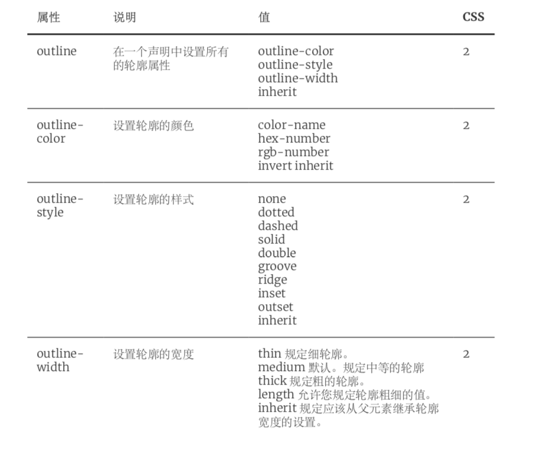

### CSS

#### css介绍

+ css是指层叠样式表全称cascading style sheets
+ 通过css让我们定义html如何显示

+ 作用

  + 让页面更好看

+ css语法规则有两方面构成

  + 选择器：声明（一条或多条）
  + 选择器{属性：值；属性：值；}

+ css和html结合方式

  + 内联样式

    + 在html标签上通过style属性引入css样式
    + 优点
      + 简单方便
    + 缺点
      + 只能对一个标签进行修饰

  + 内部样式表

    + 在head标签中通过style标签声明css
    + 优点：
      + 可以通过多个标签进行统一的样式设置
    + 缺点：
      + 它只能在本页面上进行修饰

  + 外部样式表

    + 单独定义css文件，在html中引入外部css

      + 在html页面中head标签中使用link标签

        + 介绍

          ```html
          <link rel="stylesheet" type="text/css" href="css/style_edu_01.css">
          ```

          

          + href 值为外部资源地址，这里是CSS的地址 rel 定义当前文档与被链接文档之间的关系,这 里是外部css样式表即stylesheet type 规定被链接文档的 MIME 类,这里是值为text/css

      + 在html页面中style标签内使用@import导入

      + 两种方式区别

        + @import方式导入会先加载html，然后加载css样式如果网络条件不好，就会看见没有修饰的页面，资源加载完毕之后看见被修饰和页面
        + @import方式导入css样式，不支持js动态修改，link支持

  + 多重样式优先级

    + 内联样式 > 内部样式 >外部样式 >浏览器默认

#### css选择器

+ id选择器
  + 只能选择一个元素，使用#引入，引用的事元素的id属性值
+ 类选择器
  + 类选择器使用的时候用"."描述，它描述的事class上的值
+ 元素（标签）选择器
  + 它可以对页面上相同的标签进行统一设置，它描述的就是标签的名称
+ 选择器分组
  + 就是让多个选择器可以同时使用同样的一段css，注意选择器之间使用逗号分开
+ 派生选择器
  + 在css1中也被称为上下文选择器，根据层级关系修改某个层级下标签的样式 例如：div span { backcolor: red; }

#### css伪类

+ css类型可以对css选择器添加一些特殊的效果

+ 伪类的语法：

  ```css
  selector : pesudo-class {property : value}
  ```

+ css类也可以与伪类搭配使用

  ```css
  selector.class pesudo-class {property : value}
  ```


+ 锚伪类

  

+ :first-child伪类

  + 用于选择元素的第一个子元素

#### css基本属性-字体属性

+ css字体属性定义字体，加粗，大小，文字样式

+ 在css中，有两种类型的字体，系列名称：

  + 通用字体系列
    + 拥有相似外观的字体系统组合
  + 特定字体系列
    + 一个特定的字体系列

+ 字体系列

  + font-family属性设置文本的字体系列

  + font-family属性应该设置几个字体名称作为一种“后备”机制，如果浏览器不支持第一种字体将会尝试下一种字体，如果字体名超过一个字或单词必须是要引号包裹

    ```css
    p{font-family:"Times New Roman", Times, serif;}
    ```

+ 字体风格

  + font-style属性最常用于规定斜体文本

  + 该属性有三个值

    + normal
      + 文本正常显示
    + italic
      + 文本斜体显示
    + oblique
      + 文本倾斜显示

    ```css
    p.normal {font-style:normal;}
    p.italic {font-style:italic;}
    p.oblique {font-style:oblique;}
    ```

+ 常用其他属性

  + font-weight属性设置文本粗细

  + font-size属性设置文本大小

  + em：相对长度单位

    

#### css基本属性-文本属性

+ CSS 文本属性可定义文本的外观。通过文本属性，您可以改变文本的颜色、字符间距，对齐 文本，装饰文本，对文本进行缩进，等等。

  

  

#### css基本属性-背景尺寸属性

+ 背景

  

+ 尺寸

  

#### css基本属性-列表属性

+ 如图

  

#### css基本属性-浮动

+ 浮动元素只能左右浮动不能上下浮动

+ 浮动元素会尽量左移或者右移直到碰到边框位置

+ 浮动元素前的元素不受影响，之后的元素会围绕浮动元素

  

  

#### css基本属性-边框和轮廓

+ b

  

  

  

  

+ 轮廓

  + 轮廓绘制元素周围的一条线
  + 边框 (border) 可以是围绕元素内容和内边距的一条或多条线;
  + 轮廓(outline)是绘制于元素周围的一条线，位于边框边缘的外围，可起到突出元素的作 用。

  

  

#### css基本属性-盒子模型

+ 如图

  

  

  

#### css基本属性-分类属性

+ CSS 分类属性允许你控制如何显示元素，设置图像显示于另一元素中的何处，相对于其正常 位置来定位元素，使用绝对值来定位元素，以及元素的可见度

  

+ diaplay

  

  

+ Display是用于设置元素如何显示，如果设置值为none,代表元素不会被显示。
+  Visibility 设置元素是否可见。如果设置值为hidden代表元素不可见
+  问题:
  +  Display:none与visibility:hidden有什么区别?