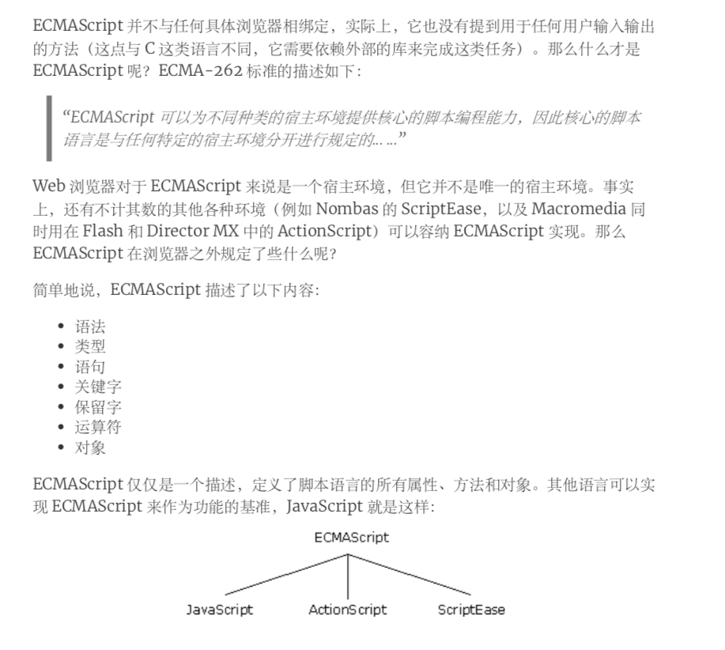
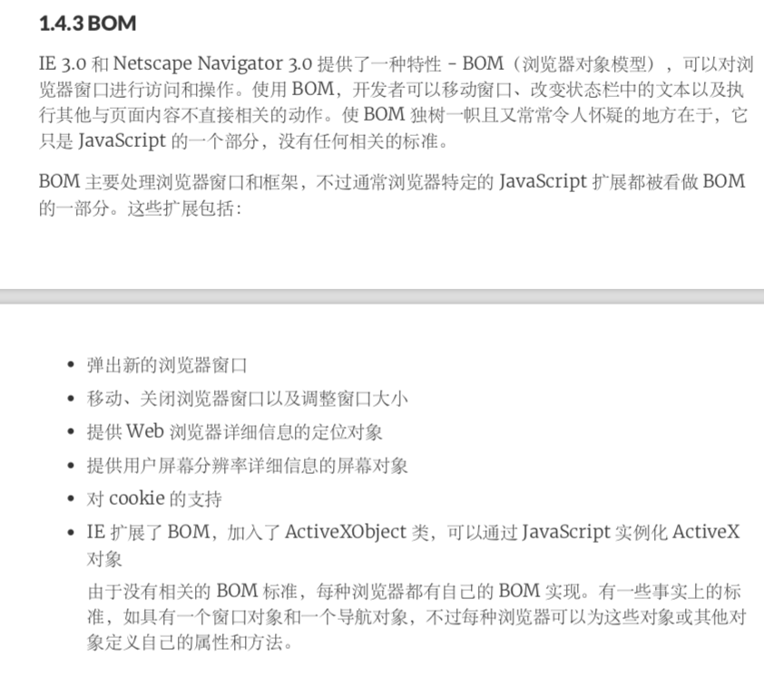
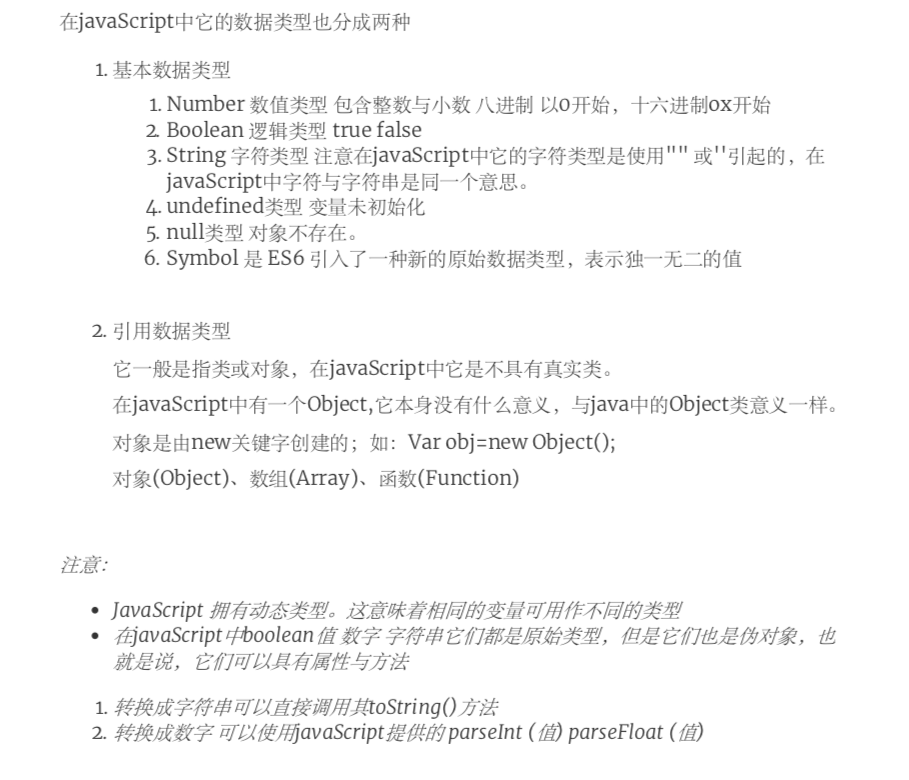
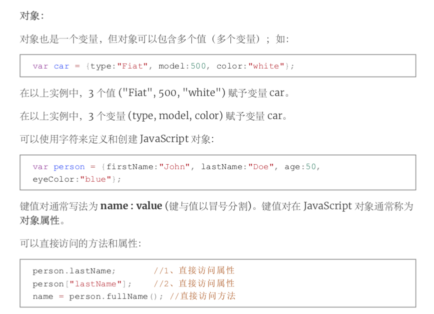
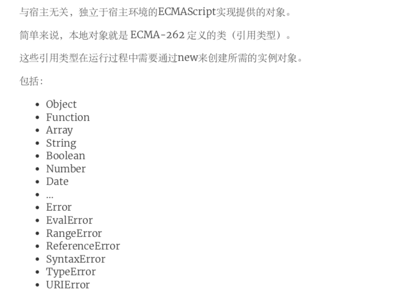
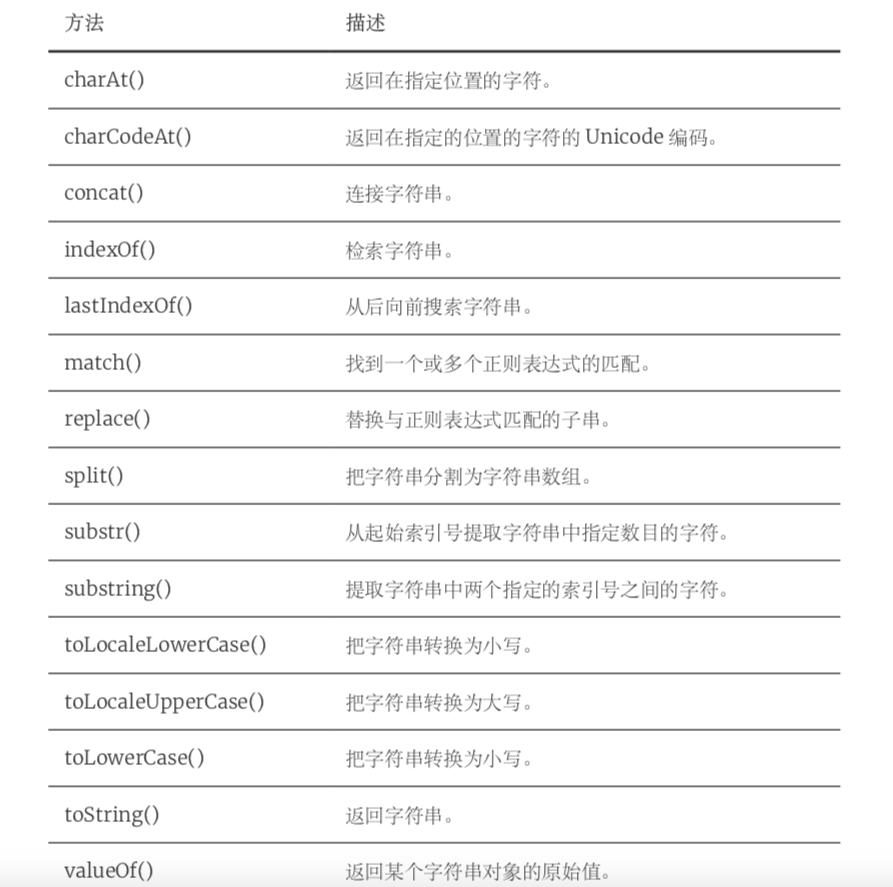
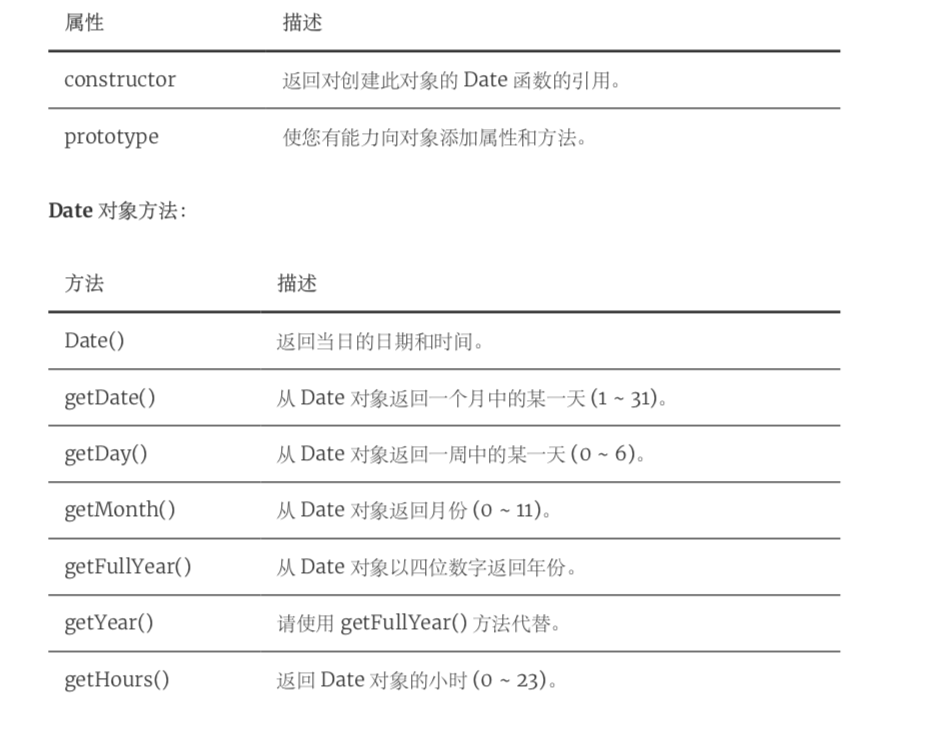
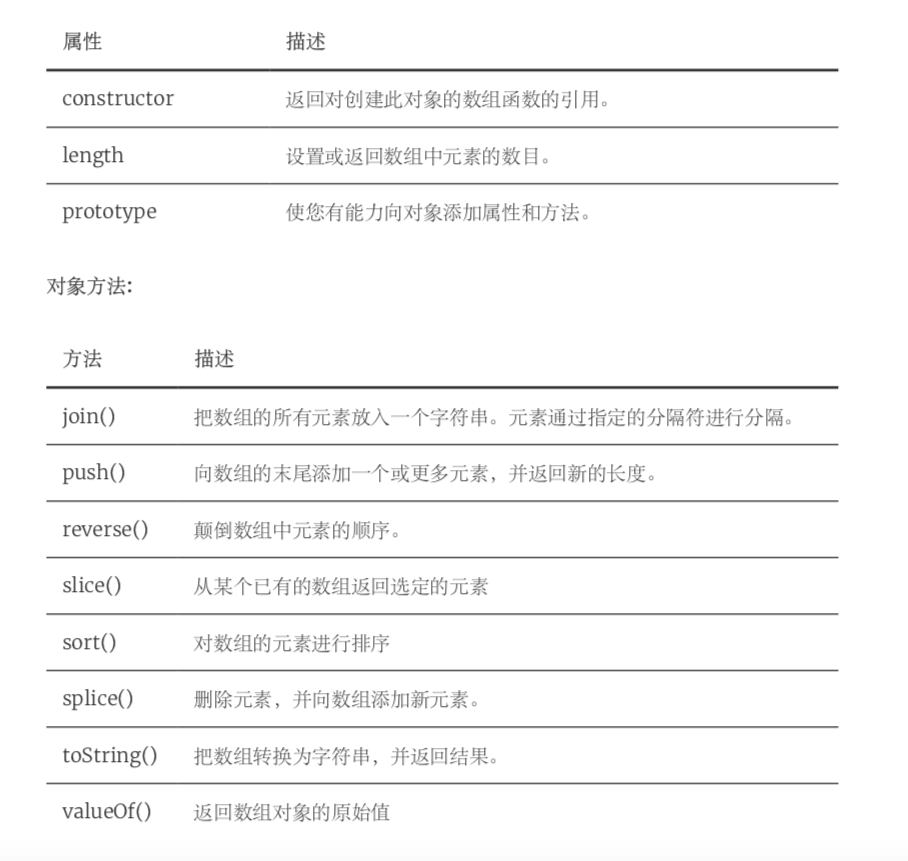
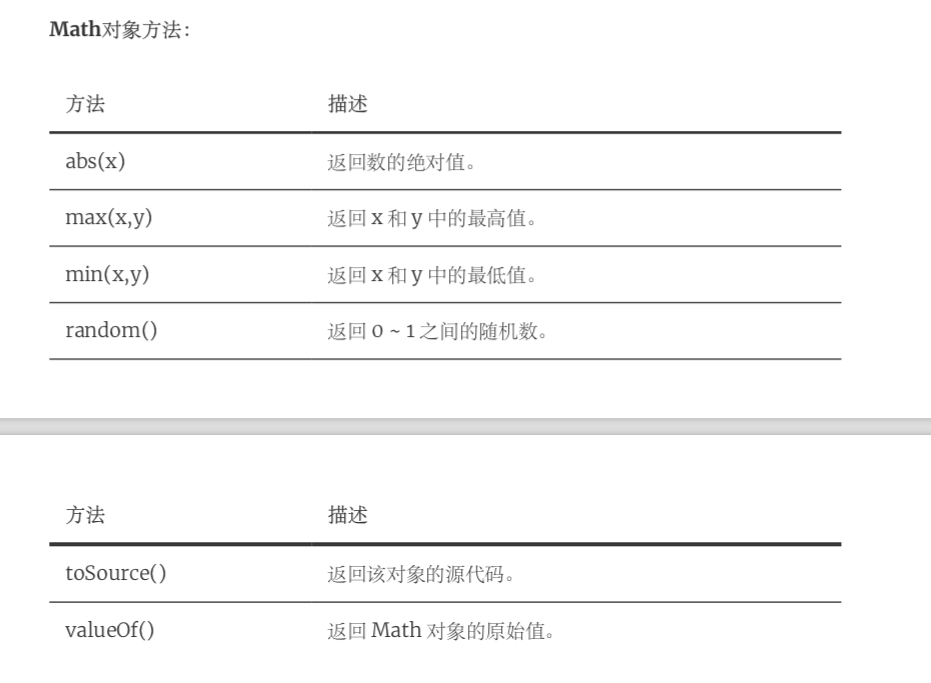

### JS

#### js介绍，作用，历史

+ js是一种可以被所有浏览器解析的脚本语言，可以增强用户和web站点的交互

+ 什么是脚本语言

  + 脚本语言叫做动态语言，它是一种解释行语言，它一般有文本编辑器编辑，脚本语言不能单独运行，需要潜入到其他语言中，比如js需要嵌入到html中

+ 作用

  + 表单验证
  + 通过js对html和css进行修改

+ 历史

+ js组成

  + ECMAScript

    + 尽管 ECMAScript 是一个重要的标准，但它并不是 JavaScript 唯一的部分，当然，也不是 唯一被标准化的部分。实际上，一个完整的 JavaScript 实现是由以下 3 个不同部分组成 的：ECMA（核心），DOM（文档对象模型），BOM（浏览器对象模型）

      

  + DOM

    + DOM(文档对象模型)是 HTML 和 XML 的应用程序接口(API)。DOM 将把整个页面规 划成由节点层级构成的文档。HTML 或 XML 页面的每个部分都是一个节点的衍生物

  + BOM

    

#### js组成和html结合方式

+ HTML 中的脚本必须位于 两个script 标签之间。 脚本可被放置在 HTML 页面的 body 和 head 部分中。

+ 如需在 HTML 页面中插入 JavaScript，请使用 script 标签。

  + 我们可以在head和body中嵌入js
  + 通常的做法是把函数放入head 部分中，或者放在页面底部。这样就可以把它们安置到同 一处位置，不会干扰页面的内容。

+ 引入外部js

  + 创建js文件

  + 在页面中引入

    ```html
    <script src="xxx.js"></script>
    ```

    

#### js使用-输出和基本语法

+  显示数据
  + 使用 **window.alert()** 弹出警告框。
  + 使用 **document.write()** 方法将内容写到 HTML 文档中。 
  + 使用 **innerHTML** 写入到 HTML 元素。
  + 使用 **console.log()** 写入到浏览器的控制台。
+ 操作HTML元素
  + 从 JavaScript 访问某个 HTML 元素，您可以使用 document.getElementById(*id*) 方法。请使用 "id" 属性来标识 HTML 元素，并 innerHTML 来获取或插入元素内容： document.getElementById(*id*).innerHTML = "something is changed";
+ 基本语法
  +  javaScript严格区分大小写
  +  javaScript是一种弱类型语言，可以任意改变变量的类型
  + 在javaScript中一行的结束可以使用分号也可以不使用，如果不使用，默认是换行做 为结束。建议大家使用分号。
  + javaScript中的注释与java中一样 a. // 单行注释 b. /* */ 多行注释
+ 变量声明
  + 变量就是用于存储数据的容器 在javaScript中声明一个变量可以使用var运算符。 声明一个变量时可以包含数字字母下划线，但是不能以数字开头。 var i=10;

#### js使用-数据类型



​	

#### js使用-一元&逻辑&算法和关系

+ 基本同java

  + 自增自减
  + 逻辑运算法，或且非，这边强调非

  

#### js使用-控制语句

+ 基本同java

+ 特殊for循环

  ```js
  for(temp : list) {
    ...;
  }
  ```

#### js使用-本地对象



+ String

  

+ Date

  

+ Array

  

#### js使用-内置对象和宿主对象

+ 内置对象(built-in object)定义为“由 ECMAScript 实现提供的、独立于宿主环境的所有 对象，在 ECMAScript 程序开始执行时出现”。这意味着开发者不必明确实例化内置对象， 它已被实例化了。只定义了两个内置对象，即 Global 和 Math (它们也是本地对象，根据 定义，每个内置对象都是本地对象)

+ math

  

+ 由 ECMAScript 实现的宿主环境提供的对象，包含两大类，一个是宿主提供，一个是 自定义类对象。所有非本地对象都属于宿主对象。 对于嵌入到网页中的JS来说，其宿主对象就是浏览器提供的对象，浏览器对象有很 多，如`Window`和`Document`等。所有的`DOM`和`BOM`对象都属于宿主对象。

#### js使用-轮播图案例

#### js使用-随机浮动广告