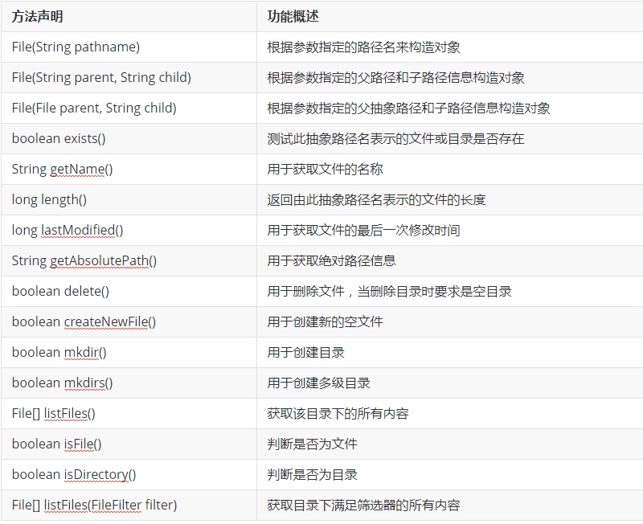

### 异常机制和File类

#### 异常机制的基本概念
+ 概念
    + 异常就是不正常的含义，在java语言中指程序执行中发生的不正常情况
    + java.lang.Throwable类是java语言中所有错误(Error)和异常(Exception)的超类
    + 其中Error类主要用于描述java虚拟机无法解决的严重错误，通常无法编码解决，比如jvm挂了
    + 其中Exception用于描述因编程错误或偶然外在因素导致的轻微错误，通常可以编码解决
#### 异常机制的分类和结构
+ java.lang.Exception是所有异常的超类(主要分为两类)
    + RuntimeException —— 运行时异常又称为非检测性异常
    + IOException以及其他异常 —— 检测性异常（检测性异常就是在编译阶段可以被检测出来的）
        ```java
            public static void main(String[] args) {
                // 1.非检测性异常
                System.out.println(5 / 0); // 编译ok，运行阶段会发生异常

                // 2.检测性异常
                Thread.sleep(1000); // 编译错误，不处理无法到运行阶段
            }
        ```
+ 其中RuntimeException类的主要子类
    + ArithmeticException —— 算术异常
    + ArrayIndexOutOfBoundsException —— 数组越界异常
    + NullPointerException  —— 空指针异常
    + ClassCastException —— 类型转换异常
    + NumberFormatException —— 数字格式异常
+ 注意
  
    + 当程序执行过程中发生异常但又没有手动处理时，jvm采用默认方式处理异常，默认方式就是打印异常的名称，异常发生的原因，异常发生的位置以及终止程序
#### 异常的避免
+ 策略
    + 使用if判断避免异常发生
    + 过多的if会影响可读性
#### 异常的捕获和实现
+ 语法格式
    ```java
        try {
            可能方式异常的代码;
        } catch (异常类型 引用变量名) {
            处理方式;
        }
        ...（可能要多次捕获）
        finally{
            编写无论如何都要执行的代码
        }
    ```
+ 示例
    ```java
        public class ExceptionCatchTest {

            public static void main(String[] args) {

                // 创建一个FileInputStream类的对象与d:/a.txt关联，打开文件
                FileInputStream fis = null;
                try {
                    System.out.println(1);
                    fis = new FileInputStream("d:/a.txt");
                    System.out.println(2);
                } catch (FileNotFoundException e) {
                    System.out.println(3);
                    e.printStackTrace();
                    System.out.println(4);
                } catch (NullPointerException e) {
                    e.printStackTrace();
                }

                try {
                    System.out.println(5);
                    fis.close();
                    System.out.println(6);
                } catch (IOException e) {
                    System.out.println(7);
                    e.printStackTrace();
                    System.out.println(8);
                } catch (NullPointerException e) {
                    e.printStackTrace();
                }

                System.out.println("program is over successfully!");
            }
        }
    ```
#### 异常捕获的注意事项
+ 懒人捕获一把梭
    ```java
        try{
            ...
        } catch (Exception e) {
            e.printStackTrace();
        }

        // 可以捕获所有异常但是可读性没有上面的强（但是我喜欢，嘿嘿嘿）

        // catch(Exception e)可以和其他异常并存但是只能放在末尾，否则会报错，因为exception已经包含其他类型异常了
    ```
#### finally的使用和笔试考点
+ 示例
    ```java
        public class ExceptionFinallyTest {

            public static void main(String[] args) {

                try{
                    int ia = 1;
                    int ib = 0;
                    System.out.println(ia/ib);
                } catch (ArithmeticException e) {
                    e.printStackTrace();

                    String str = null;
                    str.length();
                } finally {
                    System.out.println("program is over!");
                }
            }
        }
    ```
+ 流程
    ```java
        try {
            a;
            b; 可能发生异常的语句
            c;
        } catch (Exception e) {
            d;
        } finally {
            e;
        }
        // 当没有发生异常时： abce
        // 当发生异常时： abde
    ```
+ 笔试考点
    ```java
        public static int show() {

            try {
                int[] i = new int[5];
                System.out.println(i[5]);
                return 0;
            } catch (Exception e) {
                e.printStackTrace();
                return -1;
            } finally {
                return 1;
            }
        }
        // finally会在catch前执行
    ```
#### 异常的抛出实现
+ 基本概念
    在某些特殊的情况下有些异常不能处理或者不便处理，可以将该异常抛出给方法的调用者，这叫做异常的抛出，此时异常代码后续的代码不再执行
+ 语法格式
    ```
        访问权限 返回值类型 方法名（形参列表） throws 异常1，异常2... {方法体}
    ```
+ 示例
    ```java
        public class ExceptionThrowTest {

            public static void show() throws IOException {
                FileInputStream fis = new FileInputStream("d:/a.txt");
                fis.close();
            }

            public static void main(String[] args) {

                try {
                    show();
                } catch (IOException e) {
                    e.printStackTrace();
                }

            }
        }
    ```
+ 注意main方法不建议抛出异常
  
    + main方法会将异常抛出给虚拟机（会影响性能，万一挂机了。。。）
#### 异常的抛出补充
+ 子类不可以抛出比父类更大的异常，不能抛出平级不一样的异常，但是可以抛出一样的，更小的异常或者干脆不抛出
#### 自定义异常类的实现

+ 基本概念
  
  + 当需要在程序中表达年龄不合理时，java官方没有提供这种异常就需要自定义异常
+ 实现流程
  + 自定义xxxException异常类继承Exception或者它的子类
  
  + 使用两个版本的构造方法，一个是无参构造方法，另一个是字符串作为参数的构造方法
  
  + 加上序列化版本号
  
    ```java
    public class AgeException extends Exception{
    
        // 这边序列化版本号没有加 —— implements Seri...然后alt+enter自动生成
        public AgeException() {
        }
    
        public AgeException(String message) {
            super(message);
        }
    }
    ```
  
+ 异常的产生
  + throw new 异常类型（实参）；
  + 如 throw new AgeException("年龄不合理")；
+ java采用的异常处理机制是将异常处理的程序代码集中在一起与正常的代码分开，使得程序简洁，优雅易于维护

#### 自定义异常类的使用

+ Student.java

  ```java
  public void setAge(int age) throws AgeException {
          if(age > 0) this.age = age;
          else throw new AgeException("年龄不合理");
      }
  ```

  

+ 嗯哼？？？
  + 在方法中需要报错异常的地方使用throw抛出一个异常类对象
  + 然后使用throws修饰该方法并一层一层抛到main然后catch处理

#### File类的概念和文件操作

+ 基本概念

  + java.io.File类主要用于描述文件或者目录路径的抽象表示信息，可以获取文件和目录的特征信息比如大小

+ 常用方法

  
  

#### File实现目录操作

+ 见下

#### File实现目录遍历
+ 示例

  ```java
  public class FileTest {
  
      public static void main(String[] args) {
  
           /*构造file类与f:/temp/a.txt相关联
           若文件存在打印相关信息后删了
           若文件不存在创建新的文件（只能在已有的目录下创建）*/
          File f1 = new File("f:/temp/a.txt");
          if(f1.exists()) {
              System.out.println(f1.getName());
              System.out.println(f1.getAbsolutePath());
              long temp = f1.lastModified();
              Date date = new Date(temp);
              SimpleDateFormat sdf = new SimpleDateFormat("yyyy-MM-dd hh:mm:ss");
              String format = sdf.format(date);
              System.out.println(format);
              System.out.println(f1.length());
              System.out.println(f1.delete() ? "delete successfully" : "this file does not exist");
          } else {
              try {
                  System.out.println(f1.createNewFile() ? "succeed to create file" : "fail to create file");
              } catch (IOException e) {
                  e.printStackTrace();
              }
          }
          // 实现目录的关联
          File f2 = new File("f:/temp/temp/temp");
          if(f2.exists()) {
              System.out.println("the name of directory is:"+f2.getName());
              System.out.println(f2.delete() ? "succeed to delete the dir" : "fail to delele the dir");
          } else {
              System.out.println(f2.mkdirs());
          }
          // 实现将目录中的文件都打印出来
          File f3 = new File("f:/temp/temp/temp");
          File[] files = f3.listFiles();
          for(File temp : files) {
              if(temp.isFile()) System.out.println(temp);
              if(temp.isDirectory()) System.out.println(temp);
          }
          // 有选择的获取内容
          // 匿名内部类
          /*FileFilter ff = new FileFilter() {
              @Override
              public boolean accept(File pathname) {
                  return pathname.getName().endsWith(".txt");
              }
          };*/
          FileFilter ff = (File pathname) -> { return pathname.getName().endsWith(".png"); };
          File[] files1 = f3.listFiles(ff);
          System.out.println(Arrays.toString(files1));
      }
  }
  
  ```
#### File实现目录以及子目录遍历

+ 示例

  ```java
  public static void main(String[] args) {
      File file = new File("F:/temp/temp/temp");
      show(file);
  }
  
  public static void show(File file) {
      File[] files = file.listFiles();
      for(File f1 : files) {
          if(f1.isFile()) System.out.println(f1.getName());
          else if(f1.isDirectory()) show(f1);
      }
  }
  ```

  