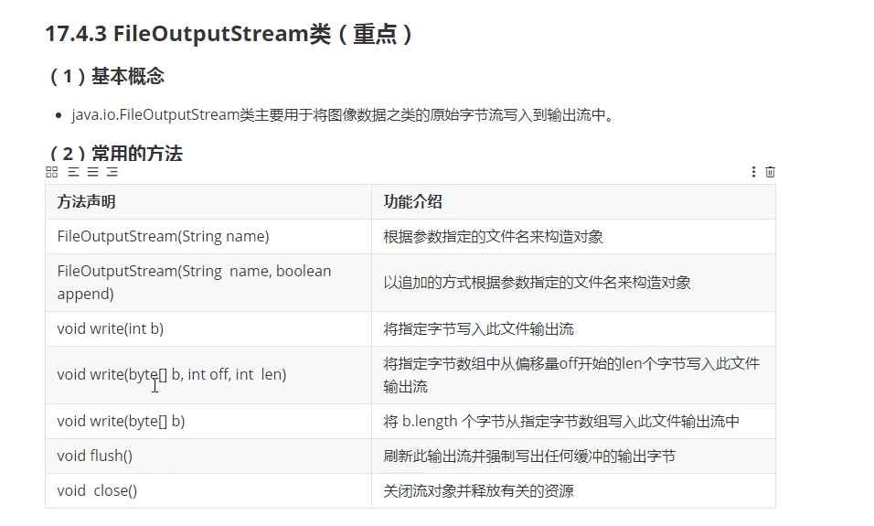
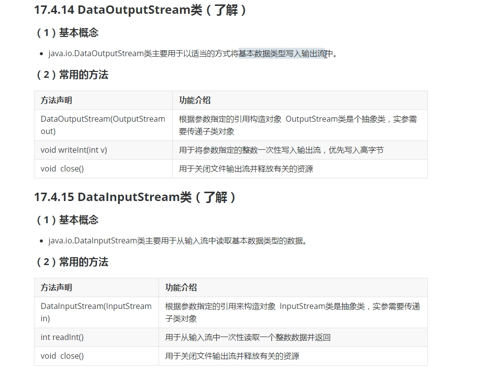

### IO流

#### IO流的概念和分类

+ 概念
  + IO就是input和output简写，也就是输入输出
  + IO流就是读写数据像流水一样，一端流到另一端因此得名流
+ 基本分类
  + 按照读写数据的基本单位不同分为字节流和字符流
    + 字节流主要以字节为单位进行数据读写的流，可以读写任意类型文件
    + 字符流主要以字符（2个字节）为单位进行数据读写只能处理文本文件
  + 按照读写数据的方向不同分为输入流和输出流（相对于程序而言）
    + 输入流是指从文件中将数据输入到程序中，也就是读文件
    + 输出流是指将程序中的数据输出到文件中，也就是写文件
  + 按照流的角色不同分为节点流和处理流
    + 其他节点流主要直接和输入输出源对象的流
    + 其中处理流主要指需要建立在节点流基础上的流

#### IO流的概念和框架

+ structure

  

+ demo

  

#### IO流的框架结构

+ 如上

#### FileWriter类的方法使用

+ methods

  
  
+ 注意

  + FileWriter在关联文件时
    + 如果文件不存在会自动创建（前提是目录都存在）
    + 如果文件存在会先清空文件内容

+ 示例
	
	```java
	public class FileWriterTest {
	
	    public static void main(String[] args) {
	
	        // ctrl+alt+t对块异常捕获
	        FileWriter fw = null;
	        try {
	            //如果文件不存在会自动创建
	            //如果文件存在会先清空文件内容
	            // fw = new FileWriter("f:/temp/temp/temp/1.txt");
	            // 如果不想清空文件内容以追加方式关联文件
	            // 以追加方式关联文件，若文件存在保留原文件内容，若文件不存在自动创建文件
	            fw = new FileWriter("f:/temp/temp/temp/1.txt",true);
	            // 写入单个字符 fw.write(65); fw.write('a');
	            char[] arr = new char[] {97,98,99,100};
	            // 写入字符数组片段 fw.write(arr,1,3);
	            // 写入字符数据
	            fw.write(arr);
	            // 刷新一下。。。并没有什么用
	            fw.flush();
	            System.out.println("写入成功");
	        } catch (IOException e) {
	            e.printStackTrace();
	        } finally {
	            if(null != fw) {
	                try {
	                    fw.close();
	                } catch (IOException e) {
	                    e.printStackTrace();
	                }
	            }
	        }
	    }
	}
	
	```
	
	
#### FileReader类的概念和基本使用


+ methods

  

#### FileReader类的方法使用

+ 示例

  ```java
  public class FileReaderTest {
  
      public static void main(String[] args) {
  
          // 构造对象
          FileReader fr = null;
          try {
              fr = new FileReader("f:/temp/temp/temp/1.txt");
              // 读取单个字符 当没有参数时，fr.read()返回读取字符的ASCII值
              // System.out.println((char)fr.read());
              // 读取所有字符
              /*int index  = 0;
              while((index = fr.read()) != -1) {
                  System.out.print((char)index);
              }
              System.out.println("-----------------");*/
              // 读取数据并输入到数组中 当参数是数组时，fr.read()返回读取的字符数量
              /*
              char[] arr = new char[10];
              System.out.println(fr.read(arr) == -1 ? "nothing to read" : Arrays.toString(arr));
              */
              // 读部分数据到数组
              char[] arr = new char[10];
              System.out.println(fr.read(arr,0,3) == -1 ? "nothing to read" : Arrays.toString(arr));
          } catch (IOException e) {
              e.printStackTrace();
          } finally {
              // 关闭
              try {
                  if(null != fr)fr.close();
              } catch (IOException e) {
                  e.printStackTrace();
              }
          }
      }
  }
  
  ```

  

#### 文件字符流实现文件的拷贝

+ 示例

  ```java
  public class CopyTest {
  
      public static void main(String[] args) {
  
          FileReader fr = null;
          FileWriter fw = null;
          try {
              fr = new FileReader("f:/temp/temp/temp/1.txt");
              fw = new FileWriter("f:/temp/temp/temp/2.txt");
  
              int index = -2;
              while ((index = fr.read()) != -1) {
                  fw.write(index);
              }
  
              System.out.println("copying is over");
          } catch (IOException e) {
              e.printStackTrace();
          } finally {
              // 先创建的后关闭
              if(null != fw) {
                  try {
                      fw.close();
                  } catch (IOException e) {
                      e.printStackTrace();
                  }
              }
              if(null != fr) {
                  try {
                      fr.close();
                  } catch (IOException e) {
                      e.printStackTrace();
                  }
              }
          }
      }
  }
  ```

  

#### 文件字节流实现文件的拷贝

+ FileOutputStream(下面文件流和字节流方法的区别仅仅是char转变为byte)

  

+ FileInputStream

  

+ 示例

  ```java
  public class StreamCopyTest {
  
      public static void main(String[] args) {
  
          FileInputStream fis = null;
          FileOutputStream fos = null;
          try {
              fis = new FileInputStream("f:/temp/temp/temp/2.png");
              fos = new FileOutputStream("f:/temp/temp/temp/3.png");
  
              int index = -1;
              while((index = fis.read()) != -1) {
                  fos.write(index);
              }
              System.out.println("copying is over");
          } catch (IOException e) {
              e.printStackTrace();
          } finally {
  
              if(null != fos) {
                  try {
                      fos.close();
                  } catch (IOException e) {
                      e.printStackTrace();
                  }
              }
              if(null != fis) {
                  try {
                      fis.close();
                  } catch (IOException e) {
                      e.printStackTrace();
                  }
              }
          }
  
  
      }
  }
  ```

  

#### 拷贝文件方式一的缺点

+ 方式一

  + 以单个字节为单位进行拷贝，就是读一个字节写一个字节（没错就是刚刚那种方式）
    + 如果文件太大拷贝速度很慢


#### 拷贝文件方式二的实现和缺点

+ 方式二

  + 准备一个和文件大小一样的缓冲区，一次将文件所有内容取出到缓冲区，然后一次性写入到文件中

    + 相关方法
      + 获取文件大小 —— fis.available()

  + 示例

    ```java
    try {
        /*fis = new FileInputStream("f:/temp/temp/temp/2.png");
        fos = new FileOutputStream("f:/temp/temp/temp/3.png");*/
        fis = new FileInputStream("f:/temp/temp/temp/4.mp4");
        fos = new FileOutputStream("f:/temp/temp/temp/5.mp4");
        // BufferedInputStream bis = new BufferedInputStream(new FileInputStream("f:/temp/temp/temp/4.mp4));
        // BufferedOutStream bos = new BufferedOutputStream(new FileInputStream("f:/temp/temp/temp/4.mp4))                                                                    
                                                                              
        /* 文件较大复制过程太慢
        int index = -1;
        while((index = fis.read()) != -1) {
            fos.write(index);
        }*/
        /* 如果文件过大无法申请和文件大小一样的缓冲区，真实物理内存不足
        int len = fis.available();
        byte[] arr = new byte[len];
        int res = fis.read(arr);
        fos.write(arr);*/
        System.out.println("copying is over");
    } catch (IOException e) {
      e.printStackTrace();
    }
  ```
  
  
  
+ 缺点
  
    + 如果文件过大无法申请和文件大小一样的缓冲区，真实物理内存不足
  
  

#### 拷贝文件方式三的实现

+ 思路

  + 准备一个相对适当的缓存区，分多次将文件拷贝完成

+ 示例

  ```java
  byte[] arr = new byte[1024];
  int index = 0;
  while((index = fis.read(arr)) != -1) {
      fos.write(arr,0,index);
  }
  System.out.println("copying is over");
  ```

  

#### 缓冲字节流实现文件的拷贝

+ 缓存输出流

  

+ 缓存输入流

  

+ 示例

  ```java
  public class ByteCopyTest {
  
      public static void main(String[] args) {
  
          BufferedInputStream bis = null;
          BufferedOutputStream bos = null;
          try {
              bis = new BufferedInputStream(new FileInputStream("f:/temp/temp/temp/4.mp4"));
              bos = new BufferedOutputStream(new FileOutputStream("f:/temp/temp/temp/5.mp4"));
  
              byte[] arr = new byte[1024];
              int size = 0;
  		   // Buffered类中自定义了缓存区的大小默认为8192，配合数组缓存区使用，减少了流与底层接触的次数，从而提高了效率(本来使用FileInputStream只要数值存满1024，就立刻写入，但是使用Buffered流，类内部会暂时存储前几次读取的内容，当内容大小到达8192时统一写入)
              while((size = bis.read(arr)) != -1) {
                  bos.write(arr,0,size);
              }
              
              System.out.println("copy is over");
          } catch (Exception e) {
              e.printStackTrace();
          }finally {
              if(null != bos) {
                  try {
                      bos.close();
                  } catch (IOException e) {
                      e.printStackTrace();
                  }
              }
              if(null != bis) {
                  try {
                      bis.close();
                  } catch (IOException e) {
                      e.printStackTrace();
                  }
              }
          }
  
  
      }
  }
  
  ```
```
  
  

#### 缓冲字节流和文件字节流效率的比较

+ 别问，问就是缓冲字节流效率更高

+ 示例

  ```java
  public class ByteCopyTest {
  
      public static void main(String[] args) {
  
          BufferedInputStream bis = null;
          BufferedOutputStream bos = null;
          try {
              bis = new BufferedInputStream(new FileInputStream("f:/temp/temp/temp/4.mp4"));
              bos = new BufferedOutputStream(new FileOutputStream("f:/temp/temp/temp/5.mp4"));
  
              byte[] arr = new byte[1024];
              int size = 0;
  
              while((size = bis.read(arr)) != -1) {
                  bos.write(arr,0,size);
              }
              System.out.println("copy is over");
          } catch (Exception e) {
              e.printStackTrace();
          }finally {
              if(null != bos) {
                  try {
                      bos.close();
                  } catch (IOException e) {
                      e.printStackTrace();
                  }
              }
              if(null != bis) {
                  try {
                      bis.close();
                  } catch (IOException e) {
                      e.printStackTrace();
                  }
              }
          }
  
  
      }
  }
```

  

#### 缓冲字符流的使用

​	


+ 示例

  ```java
  	public class BufferCharCopyTest {

        public static void main(String[] args) {

            BufferedReader br = null;
            BufferedWriter bw = null;
            try {
                br = new BufferedReader(new FileReader("f:/temp/temp/temp/1.txt"));
                bw = new BufferedWriter(new FileWriter("f:/temp/temp/temp/2.txt"));

                String str = null;
                while ((str = br.readLine()) != null) {
                    bw.write(str);
                    bw.newLine(); // 行分隔符
                }
                System.out.println("copy is over");
            } catch (IOException e) {
                e.printStackTrace();
            } finally {
                if(null != bw) {
                    try {
                        bw.close();
                    } catch (IOException e) {
                        e.printStackTrace();
                    }
                }
                if(null != br) {
                    try {
                        br.close();
                    } catch (IOException e) {
                        e.printStackTrace();
                    }
                }
            }
      }
    }
  
  ```

#### 打印流和转换流模拟聊天功能的实现

+ 打印流方法

  

+ 文本输出流方法

  

+ 字节流与字符流转换

  

+ 案例

  + 不断要求用户输入内容，若发送的内容是“bye”则，聊天结束，否则将用户输入的内容写入到文件d:/a.txt中
  + 要求使用BufferedReader类来读取键盘输入，System.in代表键盘输入
  + 要求使用PrintStream类负责将数据写入文件

+ 示例

  ```java
  public class ProblemOne {
  
      public static void main(String[] args) {
          BufferedReader br = null;
          PrintStream ps = null;
  
          try {
              // 由手册可知：构造方法需要的是Reader类型的引用，但是Reader是一个抽象类，实参只能传递子类的对象，字符流
              // 由手册可知：System.in代表键盘输入，而且是InputStream类型的字节流（所以需要转换）
              br = new BufferedReader(new InputStreamReader(System.in));
              ps = new PrintStream(new FileOutputStream("f:/temp/temp/temp/2.txt"));
              while (true) {
                  //提示用户输入要发送的聊天记录并使用变量记录
                  System.out.println("please input content:");
                  String str = br.readLine();
                  // 判断字符串是否为bye
                  if ("bye".equals(str)) break;
                      // 如果不是则写入到文件中
                  else {
                      ps.println(str);
                  }
              }
          } catch (IOException e) {
              e.printStackTrace();
          } finally {
              if(null != ps) ps.close();
              if(null != br) {
                  try {
                      br.close();
                  } catch (IOException e) {
                      e.printStackTrace();
                  }
              }
          }
      }
  }
  
  ```

  

#### 聊天功能优化

+ 优化是不可能优化的

#### 字符编码


####  数据流的概念和使用

+ 基本概念以及方法

  

+ 示例

  ```java
  public class DataOutputStreamTest {
  
      public static void main(String[] args) {
  
          DataOutputStream dos = null;
          try {
              dos = new DataOutputStream(new FileOutputStream("f:/temp/temp/temp/2.txt"));
              int num = 66;
              // 文件中是“  B”因为默认先输出高位，int类型是4个字节，前三个字节都是0
              dos.writeInt(num);
              System.out.println("succeed to output");
          } catch (IOException e){
              e.printStackTrace();
          } finally {
              if(null != dos) {
                  try {
                      dos.close();
                  } catch (IOException e) {
                      e.printStackTrace();
                  }
              }
          }
      }
  }
  ```

  

#### ObjectOutputStream类的概念和使用

+ 基本概念

  

+ 示例

  + User.java

    ```java
    public class User implements java.io.Serializable{
    
        // setting -> editor -> Inspection -> java -> serialization issues -> serializable class without "serialVersionUID" 设置提示，然后alt + enter自动生成
        private static final long serialVersionUID = -7888646945608498424L;
        private String username;
        private String password;
        private String phonenum;
    
        public User() {
        }
    
        public User(String username, String password, String phonenum) {
            this.username = username;
            this.password = password;
            this.phonenum = phonenum;
        }
    
        public String getUsername() {
            return username;
        }
    
        public void setUsername(String username) {
            this.username = username;
        }
    
        public String getPassword() {
            return password;
        }
    
        public void setPassword(String password) {
            this.password = password;
        }
    
        public String getPhonenum() {
            return phonenum;
        }
    
        public void setPhonenum(String phonenum) {
            this.phonenum = phonenum;
        }
    }
    
    ```

    

  + ObjectOutStreamTest.java

  ```java
  public class ObjectOutStreamTest {
  
      public static void main(String[] args) {
  
          ObjectOutputStream oos = null;
          try {
              oos = new ObjectOutputStream(new FileOutputStream("f:/temp/temp/temp/2.txt"));
  
              User user = new User("luna","123456","110");
              oos.writeObject(user);
              System.out.println("output over");
          } catch (IOException e) {
              e.printStackTrace();
          } finally {
              if(null != oos) {
                  try {
                      oos.close();
                  } catch (IOException e) {
                      e.printStackTrace();
                  }
              }
          }
      }
  }
  
  ```

  

#### ObjectInputStream类的使用和补充

+ 序列号

  

+ 被transient修饰的属性不会参加序列化也不会被objectOutputStream记录

  ```java
  private transient String phonenum;
  ```

  

+ 示例

  ```java
  public class ObjectInputStreamTest {
  
      public static void main(String[] args) {
  
          ObjectInputStream ois = null;
          try {
              ois = new ObjectInputStream(new FileInputStream("f:/temp/temp/temp/2.txt"));
  
              Object obj= ois.readObject();
              System.out.println(obj);
          } catch (IOException e) {
              e.printStackTrace();
          } catch (ClassNotFoundException e) {
              e.printStackTrace();
          } finally {
              if(null != ois) {
                  try {
                      ois.close();
                  } catch (IOException e) {
                      e.printStackTrace();
                  }
              }
          }
  
      }
  }
  ```

  

#### RandomAccessFile类的概念和使用

+ 基本概念

  

+ 示例

  ```java
  public class RandomAccessFileTest {
  
      public static void main(String[] args) {
  
          RandomAccessFile raf = null;
          try {
              raf = new RandomAccessFile("f:/temp/temp/temp/1.txt","rw");
              raf.seek(4);
              int index = raf.read();
              System.out.println((char)index);
              raf.write('4');
          } catch (IOException e) {
              e.printStackTrace();
          } finally {
              if(null != raf) {
                  try {
                      raf.close();
                  } catch (IOException e) {
                      e.printStackTrace();
                  }
              }
          }
      }
  }
  
  ```

  