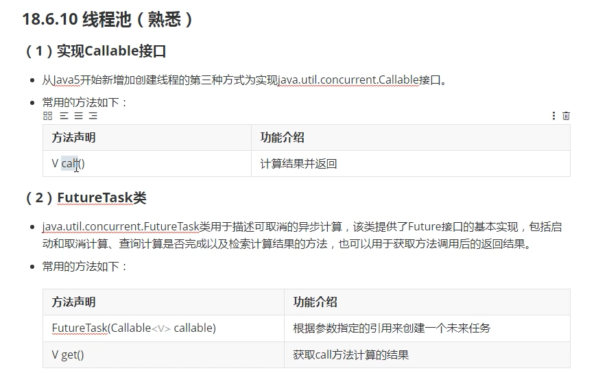

### 多线程

#### 程序和进程的概念

+ 程序 —— 数据结构 + 算法，主要指存放在硬盘上的可执行文件
+ 进程 —— 主要指内存中的可执行文件
+ 目前主流的操作系统都支持多线程，为了让操作系统执行多个任务，但是进程是重量级的，也就是新建一个进程会消耗CPU和内存空间等系统资源，因此进程的数量比较局限

#### 线程的概念和执行原理

+ 为了解决上面的问题，提出了线程的概念，线程就是进程内部的程序流，也就是说操作系统是支持多进程的，每个进程又是支持多线程的，线程是轻量的，新建线程会共享所在进程的系统资源，因此目前主流的开发都是多线程
+ 多线程是采用时间片轮转法来保证多个线程并发执行，所谓并发就是宏观并行，微观串行

#### 线程的创建方式和相关方法

+ 概念

  + java.lang.Thread类代表线程，任何线程对象都是Thread类（子类）的实例
  + Thread类是线程的模板，封装了复杂的线程开启等操作，封装了系统的差异性

+ 创建方式

  + 自定义类继承Thread类并重写run方法，然后创建该类的对象调用start方法
  + 自定义类实现runnable接口并重写run方法，创建该类的对象作为实参来构造Thread类型的对象，然后使用Thread类型的对象调用start方法

+ methods

  

#### Thread类中run方法的测试

+ 示例

  ```java
  public class ThreadTest {
  
      public static void main(String[] args) {
  
          // 无参方式构造 由源码可知target为null，对应的是runnable对象
          Thread th = new Thread();
          // run测试 由源码可知run方法会判断target是否为null，如果不为null会调用target.run()
          // 可惜这里的target就是null
          th.run();
          System.out.println("thread is over");
      }
  }
  ```

  

#### 线程的创建和启动方式一

+ SubThreadRun.java

  ```java
  public class SubThreadRun extends Thread{
  
      @Override
      public void run() {
          for(int i = 0;i < 21;i++) {
              System.out.println("i = "+i);
          }
      }
  }
  
  ```

+ SubThreadRunTest.java

  ```java
  public class SubThreadRunTest {
  
      public static void main(String[] args) {
  
          // 使用多态创建线程
          Thread th = new SubThreadRun();
          //run方法测试 th.run();
          // 但是api中规定使用start方法用于启动线程，java虚拟机会自动调用该类线程中的run方法
          // run只是一个方法，start则是另外开启一个线程
          // 调用run方法系统将会执行完run方法再开始循环，但是调用start方法会额外开启线程执行run方法，于是会交错执行
          th.start();
          for(int i = 0;i < 21;i++) {
              System.out.println("---"+i);
          }
      }
  }
  ```

  

#### 线程的创建和启动方式二

+ 示例

  ```java
  public class DiyRunableTest {
  
      public static void main(String[] args) {
  
          // 创建自定义类对象
          DiyRunable dr = new DiyRunable();
  
          // 使用自定义类对象构造Thread对象
          Thread th = new Thread(dr);
          // 调用start方法
          th.start();
  
          for(int i = 0;i < 21;i++) {
              System.out.println("main: "+i);
          }
      }
  }
  ```

  

#### 匿名内部类的方式实现线程创建和启动

+ 以上方式比较
  + 第一种方式虽然调用方便但是该类继承Thread类之后不能继承其他类不利于扩展
  + 推荐第二种

+ 示例

  ```java
  public class AsyThreadTest {
  
      public static void main(String[] args) {
  
          /*Runnable r2 = new Runnable() {
              @Override
              public void run() {
                  System.out.println("runnable");
              }
          };*/
          /*Runnable r1 = () -> {
              System.out.println("runnable");
          };*/
          /*new Thread(new Runnable() {
              @Override
              public void run() {
                  System.out.println("runnable");
              }
          }).start();*/
          // 这特么都行？？？
          new Thread(() -> System.out.println("runnable")).start();
  
          /*Thread th2 = new Thread(){
             @Override
             public void run()  {
                 System.out.println("thread");
             }
          };
          th2.start();*/
          new Thread(){
              @Override
              public void run()  {
                  System.out.println("thread");
              }
          }.start();
  
      }
  }
  ```

  

#### 线程的生命周期


#### 继承方式管理线程编号和名称


+ 案例
  
+ 自定义类继承Thread类并重写run方法，在run方法中先打印当前线程的编号和名称，然后将线程的名称修改为“张飞”后再次打印编号和名称，要求在main方法中也要打印线程的编号和名称
  
+ 示例

  ```java
  public class Sub2ThreadRun extends Thread{
  
      public Sub2ThreadRun(String name) {
          super(name);
      }
  
      @Override
      public void run () {
          System.out.println("编号: "+getId()+ " 名称: "+getName());
      }
  
      public static void main(String[] args) {
  
          Thread th = new Sub2ThreadRun("guanyu");
          th.setName("zhangfei");
          th.start();
  
          Thread th1 = Thread.currentThread();
          System.out.println("编号: "+th1.getId()+" 名称: "+th1.getName());
      }
  }
  ```

#### 实现方式管理线程编号和名称

+ 示例

  ```java
  public class RunnableNameTest implements Runnable {
  
      @Override
      public void run() {
          Thread th = Thread.currentThread();
          System.out.println(th.getId()+" "+th.getName());
      }
  
      public static void main(String[] args) {
  
  
          Thread th1 = new Thread(new RunnableNameTest());
          System.out.println(th1.getId()+" "+th1.getName());
          Thread th = Thread.currentThread();
          System.out.println(th.getId()+" "+th.getName());
      }
  }
  ```

  

#### sleep方法的使用

+ 其他方法

  

+ 示例

  ```java
  public class ThreadSleepTest extends Thread {
  
      private static boolean b1 = true;
      @Override
      public void run() {
  
          while(b1) {
              LocalDateTime dt = LocalDateTime.now();
              DateTimeFormatter stf = DateTimeFormatter.ofPattern("yyyy-MM-dd hh:mm:ss");
              System.out.println(stf.format(dt));
              try {
                  Thread.sleep(1000);
              } catch (InterruptedException e) {
                  e.printStackTrace();
              }
          }
      }
  
      public static void main(String[] args) {
  
          Thread th = new ThreadSleepTest();
          th.start();
  
          try {
              Thread.sleep(5000);
          } catch (InterruptedException e) {
              e.printStackTrace();
          }
          b1 = false;
      }
  }
  
  ```
  


#### 线程优先级的管理

+ 示例

  ```java
  public class ThreadPriorityTest extends Thread {
  
      @Override
      public void run() {
          // 注意优先级高并不一定先执行
          setPriority(10);
          for(int i = 0; i < 21; i++) {
              System.out.println("sub: "+i);
          }
      }
  
      public static void main(String[] args) {
  
  
          Thread th = new ThreadPriorityTest();
          th.start();
  
          Thread th1 = Thread.currentThread();
          System.out.println("main "+ th1.getPriority());
          for(int i = 0; i < 21; i++) {
              System.out.println("main: "+i);
          }
      }
  }
  
  ```

  

#### 线程的等待

+ demo

  ```java
  public class ThreadJoinTest extends Thread{
  
      @Override
      public  void run () {
          System.out.println("倒计时开始");
          for(int i = 0; i < 21;i++) {
              System.out.println(i);
              try {
                  Thread.sleep(1000);
              } catch (InterruptedException e) {
                  e.printStackTrace();
              }
          }
      }
  
      public static void main(String[] args) {
  
          Thread th1 = new ThreadJoinTest();
          th1.start();
  
          System.out.println("main is waitting");
  
          try {
              // 等待该线程结束 th1.join();
              // 只等该线程5秒
              th1.join(5000);
          } catch (InterruptedException e) {
              e.printStackTrace();
          }
          System.out.println("program is over");
      }
  }
  
  ```

  

#### 守护线程

+ demo

  ```java
  public class ThreadDeamonTest extends Thread{
  
      @Override
      public void run() {
          for(int i = 0;i < 50;i++){
              System.out.println("sub: "+i);
          }
      }
  
      public static void main(String[] args) {
  
          Thread th1 = new ThreadDeamonTest();
          // 当子线程不是守护进程时会打印完所有数字
          // 当子线程是守护进程时，会随主线程结束而结束所以不一定会打印完所有数字，设置子进程必须在start之前
          th1.setDaemon(true);
          th1.start();
          for(int i =0; i < 20; i++) {
              System.out.println("main: "+i);
          }
      }
  }
  ```

  

#### 多个线程执行不同的代码

+ SubThread1Test.java

  ```java
  public class SubThread1Test extends Thread{
  
      @Override
      public void run() {
          int n = 1;
          while(n < 50) {
              System.out.println("sub1: "+(2 * n - 1));
              n++;
              try {
                  Thread.sleep(1000);
              } catch (InterruptedException e) {
                  e.printStackTrace();
              }
          }
      }
  }
  ```

+ SubThread2Test.java

  ```java
  public class SubThread2Test extends Thread{
  
      @Override
      public void run() {
          int i = 1;
          while (i < 50) {
              System.out.println("sub2: "+(2 * i));
              i++;
              try {
                  Thread.sleep(1000);
              } catch (InterruptedException e) {
                  e.printStackTrace();
              }
          }
      }
  }
  ```

+ SubThreadTest

  ```java
  public class SubThreadTest {
  
      public static void main(String[] args) {
  
  
          Thread th1 = new SubThread1Test();
          Thread th2 = new SubThread2Test();
          th1.start();
          th2.start();
      }
  }
  
  ```

  

#### 线程同步机制的概念由来

+ sence

  ```java
  public class AccountRunnableTest implements Runnable{
  
      private int balance;
  
      public AccountRunnableTest() {
      }
  
      public AccountRunnableTest(int balance) {
          this.balance = balance;
      }
  
      public int getBalance() {
          return balance;
      }
  
      public void setBalance(int balance) {
          this.balance = balance;
      }
  
      @Override
      public void run() {
          int temp = getBalance();
          if (temp > 200) {
              System.out.println("正在出钞...");
              temp -= 200;
              try {
                  Thread.sleep(2000);
              } catch (InterruptedException e) {
                  e.printStackTrace();
              }
              System.out.println("出钞完毕请取款");
          } else {
              System.out.println("余额不足");
          }
          setBalance(temp);
      }
  
      public static void main(String[] args) {
  
          AccountRunnableTest accountRunnableTest = new AccountRunnableTest(1000);
          Thread th1 = new Thread(accountRunnableTest);
          Thread th2 = new Thread(accountRunnableTest);
          th1.start();
          th2.start();
  
          System.out.println("main is waiting");
          try {
              th1.join();
              th2.join();
          } catch (InterruptedException e) {
              e.printStackTrace();
          }
          // 虽然进行了两次操作但是只扣款一次，因为线程2在线程1更新数据之前启动了
          System.out.println("余额为： "+ accountRunnableTest.getBalance());
      }
  }
  
  ```

+ solution

  ```java
  public static void main(String[] args) {
  
          AccountRunnableTest accountRunnableTest = new AccountRunnableTest(1000);
          Thread th1 = new Thread(accountRunnableTest);
          Thread th2 = new Thread(accountRunnableTest);
          th1.start();
  
          System.out.println("main is waiting");
          try {
              th1.join();
              // 线程2在线程1结束之后启动即可
              th2.start();
              th2.join();
          } catch (InterruptedException e) {
              e.printStackTrace();
          }
          System.out.println("余额为： "+ accountRunnableTest.getBalance());
      }
  ```

+ 但是上面的策略太蠢了，不用多线程也能这么干于是...

+ 基本概念

  

  

#### 同步代码块实现线程同步的方式一

+ synchronize使用

  ```java
  synchronized(类引用) {
      代码块;
  }
  ```

  

+ demo

  ```java
  public class AccountRunnableTest implements Runnable{
  
      private int balance;
      private Demo demo =  new Demo();
  
      public AccountRunnableTest() {
      }
  
      public AccountRunnableTest(int balance) {
          this.balance = balance;
      }
  
      public int getBalance() {
          return balance;
      }
  
      public void setBalance(int balance) {
          this.balance = balance;
      }
  
      @Override
      public void run() {
          // synchronize
          // synchronized(new Demo())是不可行的，只能是用一个引用
          synchronized(demo) {
              int temp = getBalance();
              if (temp > 200) {
                  System.out.println("正在出钞...");
                  temp -= 200;
                  try {
                      Thread.sleep(2000);
                  } catch (InterruptedException e) {
                      e.printStackTrace();
                  }
                  System.out.println("出钞完毕请取款");
              } else {
                  System.out.println("余额不足");
              }
              setBalance(temp);
          }
      }
  
      public static void main(String[] args) {
  
          AccountRunnableTest accountRunnableTest = new AccountRunnableTest(1000);
          Thread th1 = new Thread(accountRunnableTest);
          Thread th2 = new Thread(accountRunnableTest);
          th1.start();
          th2.start();
  
          System.out.println("main is waiting");
          try {
              th1.join();
              // th2.start();
              th2.join();
          } catch (InterruptedException e) {
              e.printStackTrace();
          }
          System.out.println("余额为： "+ accountRunnableTest.getBalance());
      }
  }
  
  // 一个java文件可以用多个类但是只有一个类可以被public修饰
  class Demo{}
  
  ```

  

#### 同步代码块实现线程同步的方式二

+ demo

  ```java
  public class AccountThreadTest extends Thread {
  
      private int balance;
       
      // static修饰，即使创建多个对象也能锁死
      private static Demo demo =  new Demo();
  
      public AccountThreadTest() {
      }
  
      public AccountThreadTest(int balance) {
          this.balance = balance;
      }
  
      public int getBalance() {
          return balance;
      }
  
      public void setBalance(int balance) {
          this.balance = balance;
      }
  
      @Override
      public void run() {
          // synchronize
          synchronized(demo) {
              int temp = getBalance();
              if (temp > 200) {
                  System.out.println("正在出钞...");
                  temp -= 200;
                  try {
                      Thread.sleep(2000);
                  } catch (InterruptedException e) {
                      e.printStackTrace();
                  }
                  System.out.println("出钞完毕请取款");
              } else {
                  System.out.println("余额不足");
              }
              setBalance(temp);
          }
      }
  
      public static void main(String[] args) {
  
          AccountThreadTest th1 = new AccountThreadTest(1000);
          AccountThreadTest th2 = new AccountThreadTest(1000);
  
          th1.start();
          th2.start();
          System.out.println("main is waiting");
          try {
              th1.join();
              // th2.start();
              th2.join();
          } catch (InterruptedException e) {
              e.printStackTrace();
          }
          System.out.println("余额为： "+ th1.getBalance());
          System.out.println("余额为： "+ th2.getBalance());
      }
  
  }
  
  ```

  

#### 同步方法实现线程同步的方式一

+ demo

  ```java
  	@Override
  	// 锁死整个方法直接synchronized修饰整个方法
      public synchronized void run() {
          // synchronize
          //synchronized(demo) {
              int temp = getBalance();
              if (temp > 200) {
                  System.out.println("正在出钞...");
                  temp -= 200;
                  try {
                      Thread.sleep(2000);
                  } catch (InterruptedException e) {
                      e.printStackTrace();
                  }
                  System.out.println("出钞完毕请取款");
              } else {
                  System.out.println("余额不足");
              }
              setBalance(temp);
          // }
      }
  ```

+ demo2

  ```java
  @Override
      public /*synchronized */void run() {
          // synchronize
          //synchronized(demo) {
          // 直接使用this包含整个代码块，有源码可知调用run方法的是Thread实例化对象，能不能锁住取决于是不是同一个对象，注意方法上加synchronize关键字和synchronized（this）作用是一样的
          synchronized(this){
              int temp = getBalance();
              if (temp > 200) {
                  System.out.println("正在出钞...");
                  temp -= 200;
                  try {
                      Thread.sleep(2000);
                  } catch (InterruptedException e) {
                      e.printStackTrace();
                  }
                  System.out.println("出钞完毕请取款");
              } else {
                  System.out.println("余额不足");
              }
              setBalance(temp);
          }
      }
  
  ```

  

#### 同步方法实现线程同步的方式二

+ info

  

+ demo

  ```java
  @Override
      public /*synchronized */void run() {
          test();
      }
  
  	public static /*synchronized*/ test() {
          // 静态方法加synchronized修饰等同于synchronized（类名.class）包含代码块
          synchronized(AccountThreadTest.class){
              int temp = getBalance();
              if (temp > 200) {
                  System.out.println("正在出钞...");
                  temp -= 200;
                  try {
                      Thread.sleep(2000);
                  } catch (InterruptedException e) {
                      e.printStackTrace();
                  }
                  System.out.println("出钞完毕请取款");
              } else {
                  System.out.println("余额不足");
              }
              setBalance(temp);
          }
      }
  ```
#### 线程安全和死锁问题

+ info

  

#### 使用lock锁实现线程同步

+ info

  

#### 线程之间的通信实现

+ Object线程相关方法

  

+ demo

  ```java
  public class ThreadCommunicateTest implements Runnable{
  
      private int cnt = 1;
  
      @Override
      public void run() {
          while ( true) {
              synchronized (this) {
                  notify();  // 唤醒一个进程
                  if(cnt < 101) {
                      System.out.println("线程"+Thread.currentThread().getName()+"中，cnt: "+(cnt++));
                      try {
                          Thread.sleep(100);
                      } catch (InterruptedException e) {
                          e.printStackTrace();
                      }
                      try {
                          wait();  // 当前进程进入锁定状态，自动释放对象锁，必须在锁定的代码中调用
                      } catch (InterruptedException e) {
                          e.printStackTrace();
                      }
                  } else break;
              }
          }
      }
  
      public static void main(String[] args) {
  
          ThreadCommunicateTest t1 = new ThreadCommunicateTest();
          Thread th1 = new Thread(t1);
          th1.start();
  
          Thread th2 = new Thread(t1);
          th2.start();
      }
  }
  
  ```

  

#### 生产者消费者模型的概念

+ 自行了解

#### 生产者消费者模型的实现

+ StoreHouse.java

  ```java
  public class StoreHouse {
  
      private int cnt = 0;  // num of product
  
      public synchronized void produceProduct() {
          notify();
          if(cnt < 10){
              cnt += 1;
              System.out.println("线程"+Thread.currentThread().getName()+"生产了第"+cnt+"个产品");
          } else {
              try {
                  System.out.println("仓库已满，无法继续生产");
                  wait();
              } catch (InterruptedException e) {
                  e.printStackTrace();
              }
          }
      }
  
      public synchronized void consumerProduct() {
          notify();
          if(cnt > 0) {
              cnt--;
              System.out.println("线程"+Thread.currentThread().getName()+"消费了第"+cnt+"个产品");
          } else {
              try {
                  System.out.println("仓库没有产品可以消费");
                  wait();
              } catch (InterruptedException e) {
                  e.printStackTrace();
              }
          }
      }
  }
  
  ```

  

+ ConsumerThread.java

  ```java
  public class ConsumerThread extends Thread{
  
      private StoreHouse storeHouse;
  
      public ConsumerThread(StoreHouse storeHouse) {
          this.storeHouse = storeHouse;
      }
  
      @Override
      public void run() {
          while (true) {
              storeHouse.consumerProduct();
              try {
                  Thread.sleep(1000);
              } catch (InterruptedException e) {
                  e.printStackTrace();
              }
          }
      }
  }
  
  ```

  

+ ProduceThread.java

  ```java
  public class ProduceThread extends Thread{
  
      private StoreHouse storeHouse;
  
      public ProduceThread(StoreHouse storeHouse) {
          this.storeHouse = storeHouse;
      }
  
      @Override
      public void run() {
          while (true) {
              storeHouse.produceProduct();
              try {
                  Thread.sleep(100);
              } catch (InterruptedException e) {
                  e.printStackTrace();
              }
          }
      }
  }
  
  ```

  

+ StoreHouseTest.java

  ```java
  public class StoreHouseTest {
  
      public static void main(String[] args) {
  
          StoreHouse storeHouse = new StoreHouse();
          ConsumerThread ct = new ConsumerThread(storeHouse);
          ProduceThread pt = new ProduceThread(storeHouse);
  
          ct.start();
          pt.start();
      }
  }
  
  ```

  

#### 创建和启动线程的方式三

+ info

  

+ demo

  ```java
  public class ThreadCallableTest implements Callable {
  
  
      @Override
      public Object call() throws Exception {
          int sum =0;
          for(int i =0;i < 10000;i++) {
              sum += i;
          }
          return sum;
      }
  
      public static void main(String[] args) {
  
          ThreadCallableTest tct = new ThreadCallableTest();
          FutureTask ft = new FutureTask(tct);
          Thread th = new Thread(ft);
          th.start();
          Object obj = null;
          try {
              obj = ft.get();
          } catch (InterruptedException e) {
              e.printStackTrace();
          } catch (ExecutionException e) {
              e.printStackTrace();
          }
          System.out.println(obj);
      }
  }
  
  ```

  

#### 线程池的概念和使用

+ info

  

+ demo

  ```java
  public class ThreadPoolTest {
  
      public static void main(String[] args) {
  
          ExecutorService es = Executors.newFixedThreadPool(10);
          es.submit(new ThreadCallableTest());
          es.shutdown();
      }
  }
  ```

  