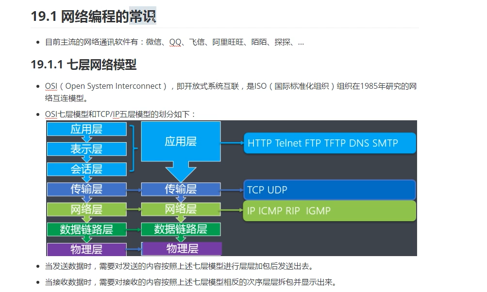
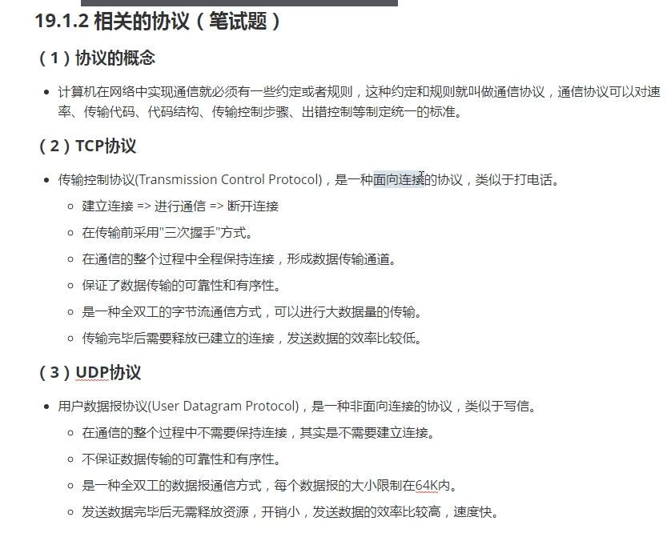
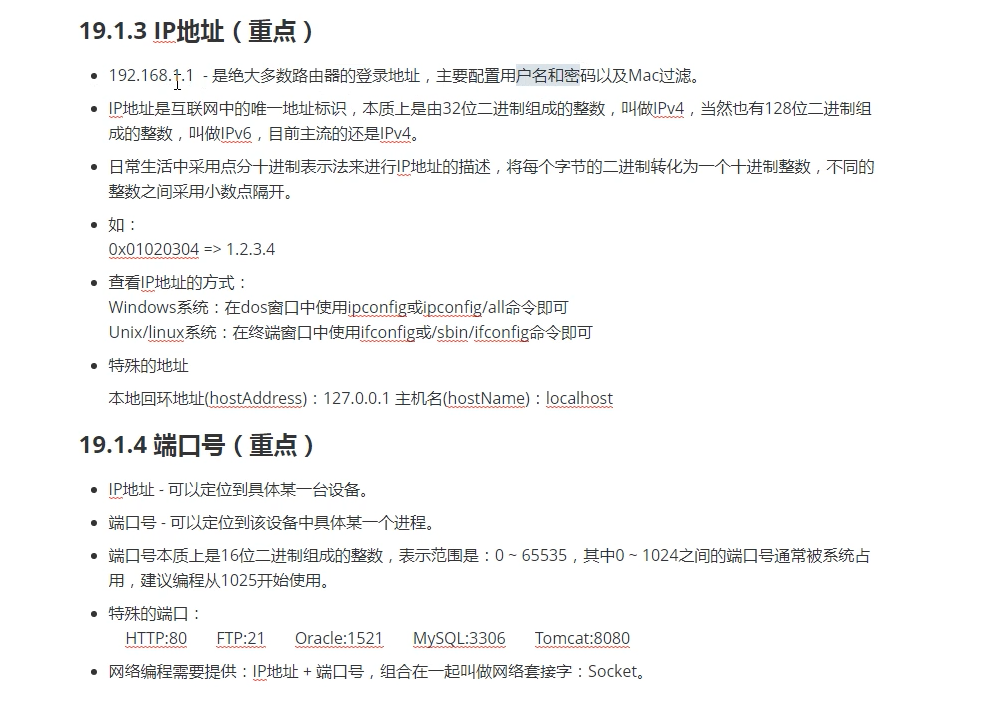
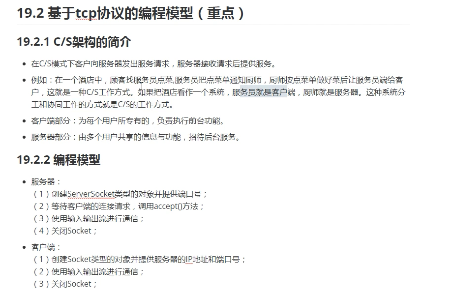
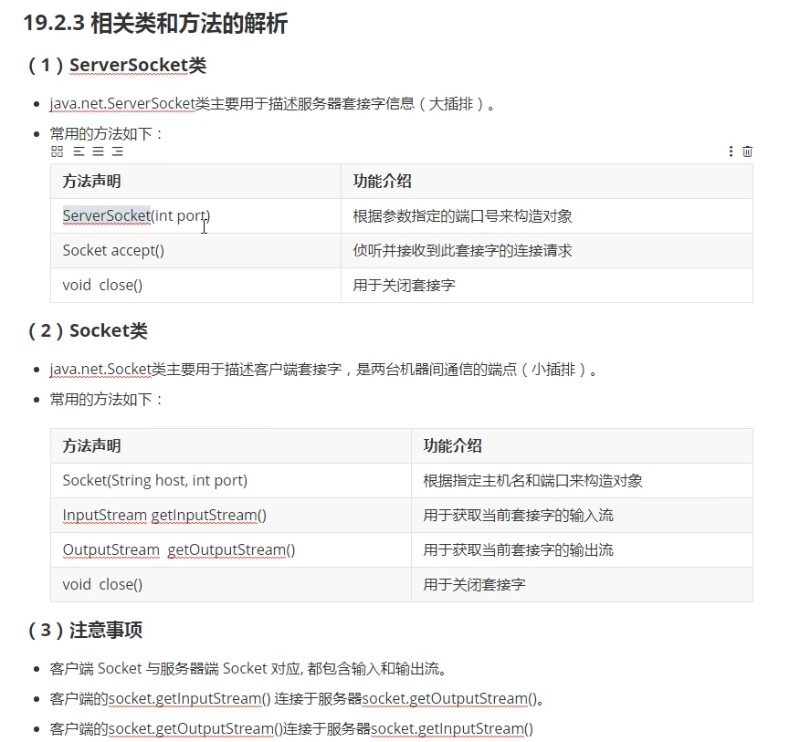
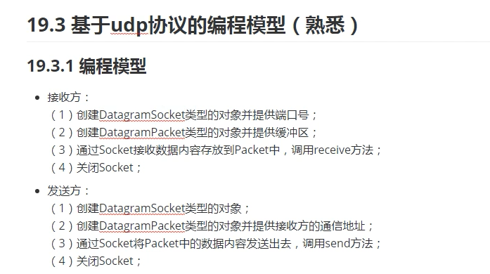
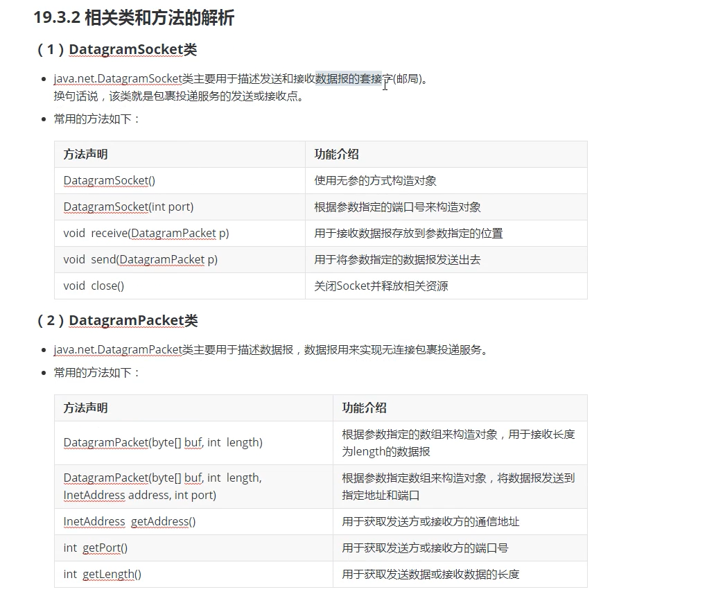
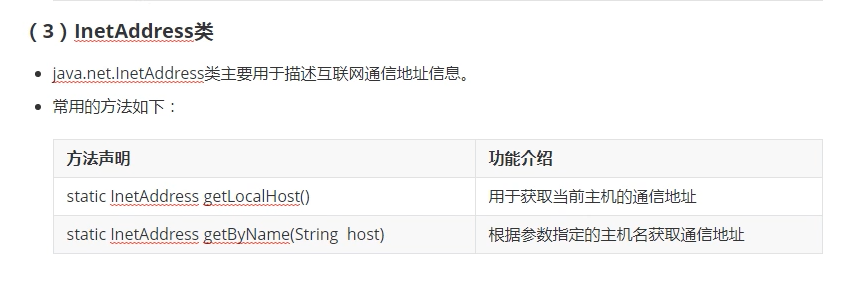
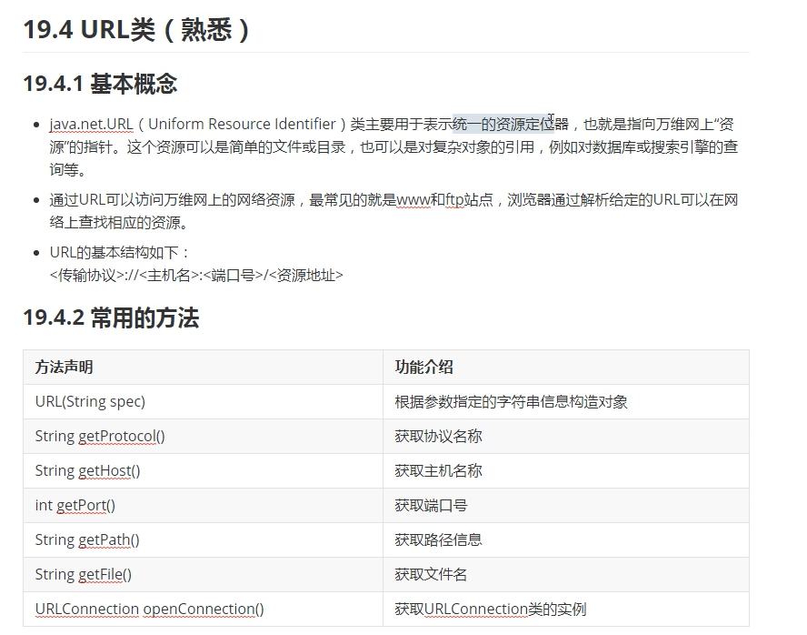
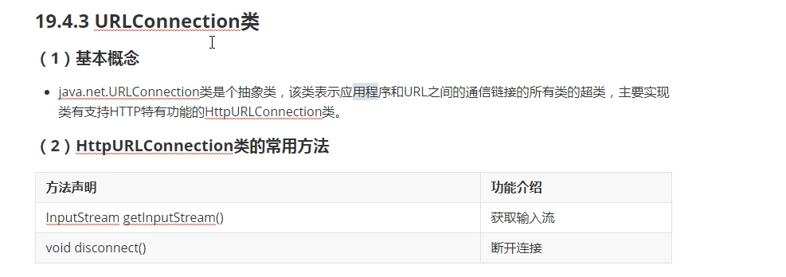

### 网络编程

#### 七层网络协议

+ intro

  

#### 相关协议

+ intro

  

#### IP地址和端口号

+ intro

  

#### 基于tcp协议的编程模型

+ intro

  

#### 基于tcp协议模型的框架实现

+ intro

  

+ Server

  ```java
  public class ServerStringTest {
  
      public static void main(String[] args) {
  
          ServerSocket ss = null;
          Socket s = null;
  
          try {
              // 1.创建ServerSocket类型的对象并提供端口号
              ss = new ServerSocket(8888);
              // 2.等待客户端连接请求，调用accept方法
              System.out.println("client is waiting...");
              s = ss.accept();
              System.out.println("client is connected!");
              // 3.使用输入输出流进行通信
          } catch (IOException e) {
              e.printStackTrace();
          } finally {
              // 4.关闭socket并释放有关的资源
              if(null != s) {
                  try {
                      s.close();
                  } catch (IOException e) {
                      e.printStackTrace();
                  }
              }
              if(null != ss) {
                  try {
                      ss.close();
                  } catch (IOException e) {
                      e.printStackTrace();
                  }
              }
          }
  
      }
  }
  
  ```

+ client

  ```java
  public class ClientStringTest {
  
      public static void main(String[] args) {
          Socket s = null;
  
          try {
              // 1. 创建Socket类型对象并提供服务器的主机名和端口号
              s = new Socket("127.0.0.1",8888);
              // 2. 使用输入输出流进行通信
          } catch (IOException e) {
              e.printStackTrace();
          } finally {
              // 3. 关闭Socket释放资源
              if(null != s) {
                  try {
                      s.close();
                  } catch (IOException e) {
                      e.printStackTrace();
                  }
              }
          }
  
      }
  }
  
  ```

  

#### 客户端向服务器发送数据的实现

+ Server

  ```java
  public class ServerStringTest {
  
      public static void main(String[] args) {
  
          ServerSocket ss = null;
          Socket s = null;
          BufferedReader br = null;
          try {
              // 1.创建ServerSocket类型的对象并提供端口号
              ss = new ServerSocket(8888);
              // 2.等待客户端连接请求，调用accept方法
              System.out.println("client is waiting...");
              s = ss.accept();
              System.out.println("client is connected!");
              // 3.使用输入输出流进行通信
              br = new BufferedReader(new InputStreamReader(s.getInputStream()));
              String s1 = br.readLine();
              System.out.println("the info of client is : "+ s1);
          } catch (IOException e) {
              e.printStackTrace();
          } finally {
              // 4.关闭socket并释放有关的资源
              if(null != s) {
                  try {
                      s.close();
                  } catch (IOException e) {
                      e.printStackTrace();
                  }
              }
              if(null != ss) {
                  try {
                      ss.close();
                  } catch (IOException e) {
                      e.printStackTrace();
                  }
              }
              if(null != br) {
                  try {
                      br.close();
                  } catch (IOException e) {
                      e.printStackTrace();
                  }
              }
          }
  
      }
  }
  
  ```

+ client

  ```java
  public class ClientStringTest {
  
      public static void main(String[] args) {
          Socket s = null;
          PrintStream ps =null;
          try {
              // 1. 创建Socket类型对象并提供服务器的主机名和端口号
              s = new Socket("127.0.0.1",8888);
              // 2. 使用输入输出流进行通信
              Thread.sleep(5000);
              ps = new PrintStream(s.getOutputStream());
              ps.println("hello");
              System.out.println("info of client sends successfully");
          } catch (IOException e) {
              e.printStackTrace();
          } catch (InterruptedException e) {
              e.printStackTrace();
          } finally {
              // 3. 关闭Socket释放资源
              if(null != s) {
                  try {
                      s.close();
                  } catch (IOException e) {
                      e.printStackTrace();
                  }
              }
              if(null != ps) {
                  ps.close();
              }
          }
  
      }
  }
  
  ```

  

#### 服务器向客户端回发数据的实现

+ server

  ```java
  public static void main(String[] args) {
  
          ServerSocket ss = null;
          Socket s = null;
          BufferedReader br = null;
          PrintStream ps = null;
          try {
              // 1.创建ServerSocket类型的对象并提供端口号
              ss = new ServerSocket(8888);
              // 2.等待客户端连接请求，调用accept方法
              System.out.println("client is waiting...");
              s = ss.accept();
              System.out.println("client is connected!");
              // 3.使用输入输出流进行通信
              br = new BufferedReader(new InputStreamReader(s.getInputStream()));
              String s1 = br.readLine();
              System.out.println("the info of client is : "+ s1);
              // 服务器返回信息
              ps = new PrintStream(s.getOutputStream());
              ps.println("message received!");
              System.out.println("server send message successdully!");
          }
      ...
  }
  ```

+ client

  ```java
  public static void main(String[] args) {
  
          Socket s = null;
          PrintStream ps =null;
          Scanner sc = null;
          BufferedReader br = null;
          try {
              // 1. 创建Socket类型对象并提供服务器的主机名和端口号
              s = new Socket("127.0.0.1",8888);
              // 2. 使用输入输出流进行通信
              sc = new Scanner(System.in);
              System.out.println("please input the message you want to send: ");
              String str = sc.nextLine();
              ps = new PrintStream(s.getOutputStream());
              // ps.println("hello");
              ps.println(str);
              System.out.println("info of client sends successfully");
              br = new BufferedReader(new InputStreamReader(s.getInputStream()));
              String s1 = br.readLine();
              System.out.println("the info server send is :"+s1);
          }
      ...
  }
  ```

  

#### 客户端和服务器不断通信的实现

+ server

  ```java
  public static void main(String[] args) {
  
          ServerSocket ss = null;
          Socket s = null;
          BufferedReader br = null;
          PrintStream ps = null;
          try {
              // 1.创建ServerSocket类型的对象并提供端口号
              ss = new ServerSocket(8888);
              // 2.等待客户端连接请求，调用accept方法
              System.out.println("client is waiting...");
              s = ss.accept();
              System.out.println("client is connected!");
              // 3.使用输入输出流进行通信
              br = new BufferedReader(new InputStreamReader(s.getInputStream()));
              ps = new PrintStream(s.getOutputStream());
              while (true) {
                  String s1 = br.readLine();
                  System.out.println("the info of client is : " + s1);
                  // 服务器返回信息
                  ps.println("message received!");
                  System.out.println("server send message successdully!");
              }
          }
      ...
  }
  ```

+ client

  ```java
  public static void main(String[] args) {
  
          Socket s = null;
          PrintStream ps =null;
          Scanner sc = null;
          BufferedReader br = null;
          try {
              // 1. 创建Socket类型对象并提供服务器的主机名和端口号
              s = new Socket("127.0.0.1",8888);
              System.out.println("succeed to connnect to server!");
              // 2. 使用输入输出流进行通信
              sc = new Scanner(System.in);
              ps = new PrintStream(s.getOutputStream());
              br = new BufferedReader(new InputStreamReader(s.getInputStream()));
              while(true) {
                  System.out.println("please input the message you want to send: ");
                  String str = sc.nextLine();
                  if("bye".equalsIgnoreCase(str)) {
                      System.out.println("chat is over");
                      break;
                  }
                  // ps.println("hello");
                  ps.println(str);
                  System.out.println("info of client sends successfully");
                  String s1 = br.readLine();
                  System.out.println("the info server send is :" + s1);
              }
          }
      ...
  }
  ```

  

#### 服务器采用多线程机制的实现

+ server

  ```java
  public static void main(String[] args) {
  
          ServerSocket ss = null;
          Socket s = null;
  
          try {
              // 1.创建ServerSocket类型的对象并提供端口号
              ss = new ServerSocket(8888);
              // 2.等待客户端连接请求，调用accept方法
              while (true) {
                  System.out.println("client is waiting...");
                  s = ss.accept();
                  System.out.println("client " + s.getInetAddress() + " is connected!");
                  // 3.使用输入输出流进行通信
                  new ServerThread(s).start();
              }
          }
      ...
  }
  ```

+ serverThread

  ```java
  public class ServerThread extends Thread{
  
      private Socket s;
  
      public ServerThread(Socket s){
          this.s = s;
      }
  
      @Override
      public void run() {
          BufferedReader br = null;
          PrintStream ps = null;
          try {
              br = new BufferedReader(new InputStreamReader(s.getInputStream()));
              ps = new PrintStream(s.getOutputStream());
              while (true) {
                  String s1 = br.readLine();
                  InetAddress inetAddress = s.getInetAddress();
                  System.out.println("the info of "+inetAddress+" send is : " + s1);
                  if("bye".equalsIgnoreCase(s1)) {
                      System.out.println("client "+inetAddress+" is offline");
                      break;
                  }
                  // 服务器返回信息
                  ps.println("message received!");
                  System.out.println("server send message successfully!");
              }
          } 
          ...
      }
  }
  
  ```
  
+ client

  ```java
  public static void main(String[] args) {
  
          Socket s = null;
          PrintStream ps =null;
          Scanner sc = null;
          BufferedReader br = null;
          try {
              // 1. 创建Socket类型对象并提供服务器的主机名和端口号
              s = new Socket("127.0.0.1",8888);
              System.out.println("succeed to connnect to server!");
              // 2. 使用输入输出流进行通信
              sc = new Scanner(System.in);
              ps = new PrintStream(s.getOutputStream());
              br = new BufferedReader(new InputStreamReader(s.getInputStream()));
              while(true) {
                  System.out.println("please input the message you want to send: ");
                  String str = sc.nextLine();
                  if("bye".equalsIgnoreCase(str)) {
                      System.out.println("chat is over");
                      break;
                  }
                  // ps.println("hello");
                  ps.println(str);
                  System.out.println("info of client sends successfully");
                  String s1 = br.readLine();
                  System.out.println("the info server send is :" + s1);
              }
          }
      ...
  }
  ```

  

  

#### 基于udp协议的编程模型

+ intro

  

+ methods

  

+ inetaddress

  

#### 发送方发送字符串的实现

+ receive

  ```java
  public class ReceiveTest {
  
      public static void main(String[] args) {
  
          DatagramSocket ds = null;
          try {
              // 创建DatagramSocket对象
              ds = new DatagramSocket(8888);
              // 创建DatagramPacket对象并提供缓存区
              byte[] arr1 = new byte[20];
              DatagramPacket dp = new DatagramPacket(arr1, arr1.length);
              // 调用通过socket调用receive方法存储数据
              System.out.println("wait data...");
              ds.receive(dp);
              System.out.println("data received: "+ new String(arr1,0,dp.getLength()));
          } catch (IOException e) {
              e.printStackTrace();
          } finally {
              // 关闭socket方法
              if(null != ds ) ds.close();
          }
  
      }
  }
  
  ```

+ send

  ```java
  public class SendTest {
  
      public static void main(String[] args) {
  
          DatagramSocket ds = null;
          try {
              // 创建socket类型对象
              ds = new DatagramSocket();
              // 创建packet类型对象并提供接收方的通讯地址和端口号
              byte[] arr1 = "hello".getBytes();
              DatagramPacket dp = new DatagramPacket(arr1,arr1.length, InetAddress.getLocalHost(),8888);
              // 通过Socket发生Packet，调用send方法
              ds.send(dp);
              System.out.println("succeed to send");
          } catch (IOException e) {
              e.printStackTrace();
          } finally {
              // 关闭Socket
              if(null != ds) ds.close();
          }
      }
  }
  
  ```

  

#### 接收方会发消息的实现

+ receive

  ```java
  public static void main(String[] args) {
  
          DatagramSocket ds = null;
          try {
              // 创建DatagramSocket对象
              ds = new DatagramSocket(8888);
              // 创建DatagramPacket对象并提供缓存区
              byte[] arr1 = new byte[20];
              DatagramPacket dp = new DatagramPacket(arr1, arr1.length);
              // 调用通过socket调用receive方法存储数据
              System.out.println("wait data...");
              ds.receive(dp);
              System.out.println("data received: "+ new String(arr1,0,dp.getLength()));
  
              // 回发
              byte[] arr2 = "data received".getBytes();
              dp = new DatagramPacket(arr2,arr2.length,dp.getAddress(),dp.getPort());
              ds.send(dp);
              System.out.println("succeed to send data");
          }
      ... 
  }
  ```

+ send

  ```java
  public static void main(String[] args) {
  
          DatagramSocket ds = null;
          try {
              // 创建socket类型对象
              ds = new DatagramSocket();
              // 创建packet类型对象并提供接收方的通讯地址和端口号
              byte[] arr1 = "hello".getBytes();
              DatagramPacket dp = new DatagramPacket(arr1,arr1.length, InetAddress.getLocalHost(),8888);
              // 通过Socket发生Packet，调用send方法
              ds.send(dp);
              System.out.println("succeed to send");
  
              // 接受数据
              byte[] arr2 = new byte[20];
              DatagramPacket dp2 = new DatagramPacket(arr2,arr2.length);
              ds.receive(dp2);
              System.out.println("succeed to receive "+ new String(arr2,0,dp2.getLength()));
          }
      ... 
  }
  ```

  

#### URL类的概念和使用

+ intro

  

+ urlconnect

  

+ demo

  ```java
  public class UrlTest {
  
      public static void main(String[] args) {
  
          try {
              // 使用参数指定的字符串构造对象
              URL url = new URL("https://www.lagou.com/");
              // 获取相关信息并打印
              System.out.println(url.getHost());
              System.out.println(url.getPort());
              System.out.println(url.getProtocol());
              // 建立连接读取相关信息
              SslUtils.ignoreSsl(); // 忽略证书信息
              HttpURLConnection urlConnection = (HttpURLConnection) url.openConnection();
              InputStream inputStream = urlConnection.getInputStream();
              BufferedReader br = new BufferedReader(new InputStreamReader(inputStream));
              String str = null;
              while((str = br.readLine()) != null) {
                  System.out.println(str);
              }
              br.close();
              urlConnection.disconnect();
          } catch (MalformedURLException e) {
              e.printStackTrace();
          } catch (IOException e) {
              e.printStackTrace();
          } finally {
          }
  
      }
  }
  
  ```

+ SslUtils.java

  ```java
  public class SslUtils {
  
      public static void trustAllHttpsCertificates() throws Exception {
          TrustManager[] trustAllCerts = new TrustManager[1];
          TrustManager tm = new miTM();
          trustAllCerts[0] = tm;
          SSLContext sc = SSLContext.getInstance("SSL");
          sc.init(null, trustAllCerts, null);
          HttpsURLConnection.setDefaultSSLSocketFactory(sc.getSocketFactory());
      }
  
      static class miTM implements TrustManager,X509TrustManager {
          public X509Certificate[] getAcceptedIssuers() {
              return null;
          }
  
          public boolean isServerTrusted(X509Certificate[] certs) {
              return true;
          }
  
          public boolean isClientTrusted(X509Certificate[] certs) {
              return true;
          }
  
          public void checkServerTrusted(X509Certificate[] certs, String authType)
                  throws CertificateException {
              return;
          }
  
          public void checkClientTrusted(X509Certificate[] certs, String authType)
                  throws CertificateException {
              return;
          }
      }
  
      /**
       * 忽略HTTPS请求的SSL证书，必须在openConnection之前调用
       * @throws Exception
       */
      public static void ignoreSsl() throws Exception{
          HostnameVerifier hv = new HostnameVerifier() {
              public boolean verify(String urlHostName, SSLSession session) {
                  return true;
              }
          };
          trustAllHttpsCertificates();
          HttpsURLConnection.setDefaultHostnameVerifier(hv);
      }
  }
  
  ```

  