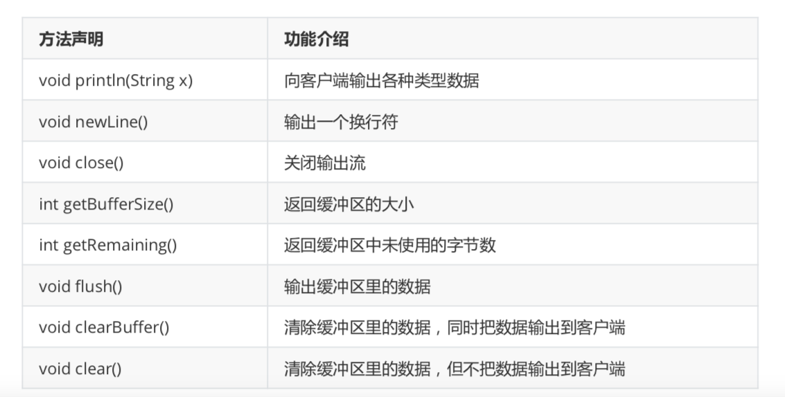

# Java web核心

## Servlet核心技术

### BS和CS

- CS架构的概念和优缺点
  - 概念：cs架构客户端/服务端模式，是一种比较早的软件结构，这种结构需要将业务合理的分配到客户端和服务端，客户端负责完成交互，服务端完成数据管理
  - 优点：
    - 客户端界面丰富和功能丰富
    - 应用服务器负担较轻
    - 响应速度快
  - 缺点：
    - 适用面窄，用户群固定	
    - 维护升级成本高，所有客户端都需要更新版本
- BS架构的概念和优缺点
  - 概念：浏览器/服务器模式，是互联网兴起的软件体系结构，该结构将系统功能，实现的主要业务逻辑集中到服务器端，极少数业务在浏览器实现，浏览器负责完成与用户的的交互任务，服务器负责数据管理
  - 优点：
    - 无需安装客户端，只要有浏览器即可
    - 适用面广，用户群不确定
    - 通过权限控制实现多用户访问目的，交互性强
    - 维护和升级版本成本低，无需更新所有客户端版本
  - 缺点：
    - 应用服务器负载较重
    - 浏览器界面和功能想要达到客户端的丰富程度需要花费大量的成本
    - 在跨浏览器上不尽人意，适配麻烦

### JavaWeb概念

+ 适用java开发web资源
+ 早期bs架构
  + 浏览器和服务器之间通过http连接，服务器里存放html
+ 后面的bs架构
  + 浏览器和服务器之间通过http连接，服务器里存放servlet和jsp

### HTTP协议的概念和格式

+ 概念

  + 超文本传输协议由W3C组织指定的一种应用层协议，是用来规范浏览器与web之间如何通讯的数据格式，主要涉及浏览器的发请求格式和服务器的响应格式
  + HTTP协议通常称在与TCP协议之上，而承载TLS或者SSL协议层之上的协议就是HTTPS协议
  + HTTP默认端口80，HTTPS默认端口443

+ http请求格式

  + 客户端发送一个请求到服务端的信息主要包括：请求行，请求头，空白行，请求体

    + 请求行：说明请求类型和要访问的资源以及所使用的HTTP版本，格式如下：请求类型 请求路径 协议版本（1.1）

    + 请求头：紧接请求行之后的部分，用来说明服务器要使用的附加信息，格式（key：value）如下： 主机 请求长度 请求的浏览器相关信息

    + 空白行：请求头部的空行，即使后面的数据为空则必须有空行

    + 请求体也叫请求数据，可以添加任意的其他数据

      ```
      -- 请求行
      POST /task01_demo01/demo1.html HTTP/1.1	
      
      -- 请求头
      Host: localhost:8088
      Content-Length: 21
      Cache-Control: max-age=0
      User-Agent: Mozilla/5.0 (Windows NT 6.1; WOW64)
      
      --空白行
      
      -- 请求体
      name=scott&pwd=123456
      ```

+ http响应格式

  + 通常情况下，服务器接收并处理客户端发送的请求后会发送一个http响应消息，主要包括：响应行，响应头，空白行，响应体

    + 响应行：说明HTTP版本号，状态码和状态消息，格式：协议版本（1.0 1.1）状态码（200） 状态信息

    + 响应头：说明客户端需要的附加信息，格式（key：value）

    + 空白行：同上

    + 响应体：返回给客户端的文本信息

      ```
      HTTP/1.1 200 OK
      Content-Type: text/html
      Content-Length: 588
      Date: Thu, 08 Sep 2021 12:59:54 GMT
      
      <html><head><title>示例1</title></head> <body><h1>这是一个HTML页面</h1></body> </html>
      ```

      

### Tomcat服务器

- Tomcat服务器的概念和下载安装方式

  - 概念
    - 单词意为公猫，sun公司的软件架构师詹姆斯·邓肯·戴维森开发，后来他帮助将其变为开源项目，并由sun公司贡献给apache基金会
    - Tomcat服务器是一个开源的轻量级web应用服务器，在中小型系统和并发量小的场合下被普遍使用，是开发调试jsp和servlet的首选
  - 安装方式
    - <a href="http://tomcat.apache.org/">官网下载</a>
    - <a href="https://www.jianshu.com/p/949f91fc93b3">mac安装教程</a>
      - 注意安装路径可随意，路径下必须能够检索到java环境
  - 目录结构
    - bin
      - 主要存放二进制可执行文件和脚本
    - conf
      - 主要存放配置文件
    - lib
      - 主要存放Tomcat运行需要加载的jar包
    - logs
      - 主要存放Tomcat执行过程中产生的日志文件
    - temp
      - 主要存放Tomcat在运行中产生的临时文件
    - webapps
      - 主要存放应用程序，Tomcat启动时会加载该目录下的应用程序
    - work
      - 主要存放tomcat在运行时的编译后文件，例如jsp编译后的文件

- Tomcat服务器的启动和关闭

  - 启动：

    - 方式一：点击startup.bat文件
    - 方式二：执行bin下的startup.sh

  - 关闭：

    - 方式一：点击bin下的shutdown.bat文件
    - 方式二：执行bin下的shutdown.sh

  - 注意事项

    - 启动之前需要安装jdk并配置环境变量JAVA_HOME，如果希望tomcat可以全局启动需要配置

      - windows下

        - 环境变量CATALINA_HOME=tomcat路径
        - path中加入变量：%CATALINA_HOME%\bin;

      - macos下

        - vim ~/.bash_profile

          ```shell
          export CATALINA_HOME=tomcat目录绝对路径
          export PATH=$PATH:$CATALINA_HOME/bin
          ```

        - 配置文件生效

           ```shell
          source ~/.bash_profile
          ```

        - 终端输入env检测path是否添加

        - 如果报错catalina.sh不存在或没有权限访问

          ```shell
          # 进入tomcat bin目录
          chmod +x ./*.sh
          ```

          

    - 通过批处理文件启动显示信息处理：

      - logging.propertites文件修改java.util.logging.ConsoleHandler.encoding=GBK

- Tomcat服务器端口号修改

  - config目录下server.xml是服务器的主配置文件，当中有一个Connector属性可以更改port端口号，如果改为80则是浏览器默认端口，访问该服务时只需要输入地址即可，不用输入端口号
  - 此外该文件还可以修改tomcat服务器的域名或ip，默认的加载项目，请求编码

- Tomcat服务器管理账号和密码的配置

  - users.xml可以用来配置管理Tomcat服务器的用户与权限

    ```xml
    <role rolename="manager-gui" />
    <user username="admin" password="123456" roles="manager-gui" />
    ```

    

- Tomcat服务器中项目的部署

  - 在tomcat目录下的webapp创建hello文件夹，然后创建index.html

    ```html
    <html>
      <head>
         <title>first</title>
      </head>
      <body>
         <h1>hello world</h1>
      </body>
    </html>
    ```

  - 启动服务后在浏览器访问:localhost:8080/hello/index.html

    - Index.xxx是默认访问项，可以不加
    - tomcat在没有任何配置的情况下会默认访问root文件夹，然后寻找名为index的文件进行访问，默认是index.jsp，但是通过出现index.html，html后缀的优先级更高

### IDEA创建web服务

- IDEA创建Web服务的方式
  - 创建空项目
  - 文件——创建模块——javaEE——勾选webapplication——选择tomcat项目
- IDEA中Tomcat服务器的相关配置
  - 选中edit configurations开始修改
    - name建议和模块名一致
    - development
      - application context(访问路径)：建议删除war以及后面的字段
- IDEA中启动服务器和访问项目
  - 直接点，谢谢

### Servlet概念

+ 简单介绍
  + servlet全称：server applet，小服务程序或服务连接器，是java语言编写的服务器端程序，servlet就是运行在服务器上的java类
  + servlet用来完成bs架构下的客户端请求的响应处理，也就是交互式浏览和生成数据，生成动态web内容

- 创建Servlet服务的三种方式

  - 第一种

    - 建立一个java webapplication项目并配置tomcat服务器

    - 自定义实现servlet接口并重写service方法

      - 在src中创建com.Ivan.demo02.HelloServlet.java实现servlet接口自动重写方法

    - 将自定义类的信息配置到web.xml 文件并启动，配置方式如下：

      ```xml
      <?xml version="1.0" encoding="UTF-8"?>
      <web-app xmlns="http://xmlns.jcp.org/xml/ns/javaee"
               xmlns:xsi="http://www.w3.org/2001/XMLSchema-instance"
               xsi:schemaLocation="http://xmlns.jcp.org/xml/ns/javaee http://xmlns.jcp.org/xml/ns/javaee/web-app_4_0.xsd"
               version="4.0">
      
          <!--  配置servlet  -->
          <servlet>
              <!--配置别名 通常和类名一致-->
              <servlet-name>HelloServelt</servlet-name>
              <!--配置类名路径-->
              <servlet-class>com.Ivan.demo02.HelloServlet</servlet-class>
          </servlet>
      
          <!--配置映射关系-->
          <servlet-mapping>
              <!--建立映射的servlet的别名-->
              <servlet-name>HelloServelt</servlet-name>
              <!--浏览器访问路径-->
              <url-pattern>/hello</url-pattern>
          </servlet-mapping>
      </web-app>
      ```

    - Javax.servlet.Servlet接口用于定义所有Servlet必须实现的方法

      

  - 第二种

    - 建立一个java webapplication项目并配置tomcat服务器

    - 自定义实现继承httpservlet类并重写service方法

      - 在src中创建com.Ivan.demo02.HelloServlet2.java实现重写方法

    - 将自定义类的信息配置到web.xml 文件并启动，配置方式如下：(几乎一致)

      ```xml
      <?xml version="1.0" encoding="UTF-8"?>
      <web-app xmlns="http://xmlns.jcp.org/xml/ns/javaee"
               xmlns:xsi="http://www.w3.org/2001/XMLSchema-instance"
               xsi:schemaLocation="http://xmlns.jcp.org/xml/ns/javaee http://xmlns.jcp.org/xml/ns/javaee/web-app_4_0.xsd"
               version="4.0">
      
          <!--  配置servlet  -->
          <servlet>
              <!--配置别名 通常和类名一致-->
              <servlet-name>HelloServelt2</servlet-name>
              <!--配置类名路径-->
              <servlet-class>com.Ivan.demo02.HelloServlet2</servlet-class>
          </servlet>
      
          <!--配置映射关系-->
          <servlet-mapping>
              <!--建立映射的servlet的别名-->
              <servlet-name>HelloServelt2</servlet-name>
              <!--浏览器访问路径-->
              <url-pattern>/hello2</url-pattern>
          </servlet-mapping>
        
          <!--  配置servlet  -->
          <servlet>
              <!--配置别名 通常和类名一致-->
              <servlet-name>HelloServelt</servlet-name>
              <!--配置类名路径-->
              <servlet-class>com.Ivan.demo02.HelloServlet</servlet-class>
          </servlet>
      
          <!--配置映射关系-->
          <servlet-mapping>
              <!--建立映射的servlet的别名-->
              <servlet-name>HelloServelt</servlet-name>
              <!--浏览器访问路径-->
              <url-pattern>/hello</url-pattern>
          </servlet-mapping>
      </web-app>
      ```

    - 基本概念

      - java.servlet.GenericServlet类主要用于定义一个通用的，与协议无关的servlet，该类实现了Servlet接口
      - 若编写通用Servelt只需要重写service方法即可

    - 常用方法

      | 方法声明                                                     | 功能介绍                         |
      | ------------------------------------------------------------ | -------------------------------- |
      | abstract void service(ServletRequest req,<br>ServletResponse res) | 由servlet容器调用运行servlet请求 |

      

  - 第三种

    - 继承HttpServlet接口重写service方法（同上）

    - 基本概念

      - javax.servlet.http.HttpServlet类是一个抽象类并继承了GenericServlet类

        - 用于创建适用于网站的HTTP Servlet，该类的子类必须至少重写一个方法

        

- servlet生命周期

  - 重写httpservlet中的方法

    ```java
    public class HelloServlet3 extends HttpServlet {
    
        public HelloServlet3() {
            System.out.println("http servlet construct");
        }
    
        @Override
        protected void service(HttpServletRequest req, HttpServletResponse resp) throws ServletException, IOException {
            System.out.println("service");
        }
    
        @Override
        public void destroy() {
            System.out.println("destory");
        }
    
        @Override
        public void init() throws ServletException {
            System.out.println("init");
        }
    }
    
    ```

  - 在浏览器中访问服务，构造函数先行，然后init执行，然后执行service，每次访问该服务路径service都会出发一次，服务退出钱destroy触发

    

- servlet简化写法

  - 直接右击创建servlet项目

  - 创建项目时使用默认的注解配置

    ```java
    // 通过urlPatterns完成映射
    @WebServlet(name = "HelloServlet04",urlPatterns = "/hello4")
    public class HelloServlet04 extends HttpServlet {
        protected void doPost(HttpServletRequest request, HttpServletResponse response) throws ServletException, IOException {
    
        }
    
        protected void doGet(HttpServletRequest request, HttpServletResponse response) throws ServletException, IOException {
    
        }
    
        @Override
        protected void service(HttpServletRequest req, HttpServletResponse resp) throws ServletException, IOException {
            System.out.println("helloServlet04");
        }
    }
    
    ```

    

- post和get请求

  - get请求主要方式

    ```
    发出GET请求的主要方式:
    (1)在浏览器输入URL按回车
    (2)点击<a>超链接
    (3)点击submit按钮，提交 <form method=“get”>表单
    GET请求特点: 会将请求数据添加到请求URL地址的后面，只能提交少量的数据、不安全
    ```

  - post请求主要方式

    ```
    发出POST请求的方法如下:
    点击submit按钮，提交 <form method=“post”>表单
    POST请求的特点: 请求数据添加到HTTP协议体中，可提交大量数据、安全性好
    ```

    

- 请求参数的获取方式

  - ServletRequest接口基本概念

    - javax.servlet.ServletRequest接口主要用于向servlet提供客户端请求信息，可以从中获取到任何请求信息。
    - Servlet容器创建一个ServletRequest对象，并将其作为参数传递给Servlet的service方法。

  - 常用方法

    

  - 方式一

    - 编写parameter.html

      ```html
      <!DOCTYPE html>
      <html lang="en">
      <head>
          <meta charset="UTF-8">
          <title>Title</title>
      </head>
      <body>
          <div>
              <form action="parameterServlet" method="post">
                  姓名：<input type="text" name="name" /><br />
                  年龄：<input type="text" name="age" /><br />
                  爱好：<input type="checkbox" name="hobby" value="java"/>java
                      <input type="checkbox" name="hobby" value="c"/>c
                      <input type="checkbox" name="hobby" value="c++"/>c++
                      <input type="submit" value="提交">
              </form>
          </div>
      </body>
      </html>
      ```

    - 编写parameterServlet.java

      ```java
      public class parameterServlet extends HttpServlet {
          protected void doPost(HttpServletRequest request, HttpServletResponse response) throws ServletException, IOException {
            	// 打印属性值
              String name = request.getParameter("name");
              System.out.println("name: "+name);
              String[] hobbies = request.getParameterValues("hobby");
              System.out.println("hobbies: "+ Arrays.toString(hobbies));
      
            	// 打印属性名
              Enumeration<String> parameterNames = request.getParameterNames();
              System.out.println("获取的参数名有： ");
              while(parameterNames.hasMoreElements()) {
                  System.out.println(parameterNames.nextElement()+" ");
              }
          }
      
          protected void doGet(HttpServletRequest request, HttpServletResponse response) throws ServletException, IOException {
      
          }
      }
      
      ```

    - 添加和映射后访问静态页面，填入数据提交即可

  - 方式二

    - 在parameterServlet中添加方法

      ```java
      public class parameterServlet extends HttpServlet {
          protected void doPost(HttpServletRequest request, HttpServletResponse response) throws ServletException, IOException {
              String name = request.getParameter("name");
              System.out.println("name: "+name);
              String[] hobbies = request.getParameterValues("hobby");
              System.out.println("hobbies: "+ Arrays.toString(hobbies));
      
              Enumeration<String> parameterNames = request.getParameterNames();
              System.out.println("获取的参数名有： ");
              while(parameterNames.hasMoreElements()) {
                  System.out.println(parameterNames.nextElement()+" ");
              }
      
              Map<String, String[]> parameterMap = request.getParameterMap();
              Set<Map.Entry<String, String[]>> entries = parameterMap.entrySet();
              for(Map.Entry<String, String[]> me : entries) {
                  System.out.println(me.getKey()+" 对应数值：");
                  for(String ts : me.getValue()) {
                      System.out.print(ts+" ");
                  }
                  System.out.println();
              }
          }
      
          protected void doGet(HttpServletRequest request, HttpServletResponse response) throws ServletException, IOException {
      
          }
      }
      
      ```

      

- 请求中其他信息的获取

  - HttpServletRequest接口基本概念

    - javax.servlet.http.HttpServletRequest接口是ServletRequest接口的子接口，主要用于提供HTTP 请求信息的功能。

    - 不同于表单数据，在发送HTTP请求时，HTTP请求头直接由浏览器设置。

    - 可直接通过HttpServletRequest对象提供的一系列get方法获取请求头数据。

    - 常用方法

      

  - 同样在doPost方法中添加

    ```java
    System.out.println("发送请求的客户端IP地址为：" + request.getRemoteAddr());
    System.out.println("发送请求的客户端端口号为：" + request.getRemotePort());
    System.out.println("请求资源的路径为：" + request.getRequestURI());
    System.out.println("请求资源的完整路径为：" + request.getRequestURL());
    System.out.println("请求方式为：" + request.getMethod());
    System.out.println("请求的附带参数为：" + request.getQueryString());
    System.out.println("请求的Servlet路径为：" + request.getServletPath());
    ```

    

- 响应信息的处理

  - ServletResponse接口概述

    - javax.servlet.ServletResponse接口用于定义一个对象来帮助Servlet向客户端发送响应

    - Servlet容器创建ServletResponse对象，并将其作为参数传递给servlet的service方法。

    - 常用方法

      

  - 响应信息的设置和发送

    ```java
    // 向浏览器发送响应数据
    //  获取响应数据默认编码方式
    String characterEncoding = response.getCharacterEncoding();
    System.out.println("服务器编码方式： "+characterEncoding); // ISO-8859-1
    // 设置编码方式
    response.setContentType("text/html;charset=UTF-8");
    // 发送数据
    PrintWriter writer = response.getWriter();
    writer.write("info received");
    writer.close();
    ```

    

  - 响应信息中随机数的发送

    - HttpServletResponse基本概念

      - javax.servlet.http.HttpServletResponse接口继承ServletResponse接口，以便在发送响应时提供 特定于HTTP的功能。

    - 常用方法

      

    - 这这这。。。随机数会吧？

- 请求信息的乱码处理

  - 这边浏览器向servlet发送post请求如果带有中文会乱码(一般会显示多个问号)，解决方式

    ```java
    // 设置请求信息的编码方式为utf-8
    request.setCharacterEncoding("utf-8");
    ```

- ServletConfig接口的使用

  - 基本概念

    - javax.servlet.ServletConfig接口用于描述Servlet本身的相关配置信息，在初始化期间用于将信息 传递给Servlet配置对象。

  - 常用方法

    

  - xml中配置

    ```xml
    <servlet>
        <servlet-name>ConfigServlet</servlet-name>
        <servlet-class>com.Ivan.demo02.ConfigServlet</servlet-class>
        <!-- 实现初始化参数的配置 -->
        <init-param>
            <!-- 初始化参数的名称 -->
            <param-name>userName</param-name>
            <!-- 初始化参数的数值 -->
            <param-value>admin</param-value>
        </init-param>
        <init-param>
            <param-name>password</param-name>
            <param-value>123456</param-value>
        </init-param>
    </servlet>
    
    <servlet-mapping>
        <servlet-name>ConfigServlet</servlet-name>
        <url-pattern>/config</url-pattern>
    </servlet-mapping>
    ```

  - ConfigServlet.java

    ```java
    public class ConfigServlet implements Servlet {
    
        @Override
        public void init(ServletConfig servletConfig) throws ServletException {
            System.out.println("初始化操作执行了...");
            System.out.println("Servlet的别名是：" + servletConfig.getServletName()); // ConfigServlet
    
            System.out.println("-----------------------------------------------");
            // 获取配置文件中的初始化参数信息
            String userName = servletConfig.getInitParameter("userName");
            System.out.println("获取到的初始化用户名为：" + userName);
            // 获取所有配置参数的名称
            Enumeration<String> initParameterNames = servletConfig.getInitParameterNames();
            while (initParameterNames.hasMoreElements()) {
                System.out.println("初始化参数名为：" + initParameterNames.nextElement());
            }
    
            System.out.println("-----------------------------------------------");
            // 获取ServletContext接口的引用
            ServletContext servletContext = servletConfig.getServletContext();
            System.out.println("获取到的ServletContext引用为：" + servletContext);
        }
    
        @Override
        public ServletConfig getServletConfig() {
            return null;
        }
    
        @Override
        public void service(ServletRequest servletRequest, ServletResponse servletResponse) throws ServletException, IOException {
    
        }
    
        @Override
        public String getServletInfo() {
            return null;
        }
    
        @Override
        public void destroy() {
    
        }
    }
    
    ```

    

- ServletContex接口引用

  - 基本概念

    - javax.servlet.ServletContext接口主要用于定义一组方法，Servlet使用这些方法与它的Servlet容 器通信。
    - 服务器容器在启动时会为每个项目创建唯一的一个ServletContext对象，用于实现多个Servlet之间 的信息共享和通信。
    - 在Servlet中通过this.getServletContext()方法可以获得ServletContext对象。

  - 常用方法

    

  - xml配置

    ```xml
    <!--对ServletContext对象对参数进行配置-->
      <context-param>
          <param-name>param1</param-name>
          <param-value>value1</param-value>
      </context-param>
      <context-param>
          <param-name>param2</param-name>
          <param-value>value2</param-value>
      </context-param>
      <servlet>
          <servlet-name>ContextServlet</servlet-name>
          <servlet-class>com.Ivan.demo02.ContextServlet</servlet-class>
      </servlet>
      <servlet-mapping>
          <servlet-name>ContextServlet</servlet-name>
          <url-pattern>com.Ivan.demo02.ContextServlet</url-pattern>
      </servlet-mapping>
    ```

    

  - 参数配置和获取

    - ContextServlet.java

      ```java
      public class ContextServlet extends HttpServlet {
          protected void doPost(HttpServletRequest request, HttpServletResponse response) throws ServletException, IOException {
              // 1.配置参数的获取
              ServletContext servletContext = getServletConfig().getServletContext();
              Enumeration<String> initParameterNames = servletContext.getInitParameterNames();
              while (initParameterNames.hasMoreElements()) {
                  String s = initParameterNames.nextElement();
                  System.out.println( s + "对应的值为：" + servletContext.getInitParameter(s));
              }
          }
      
          protected void doGet(HttpServletRequest request, HttpServletResponse response) throws ServletException, IOException {
      
          }
      }
      
      ```

      

  - 路径获取

    ```java
    public class ContextServlet extends HttpServlet {
        protected void doPost(HttpServletRequest request, HttpServletResponse response) throws ServletException, IOException {
            // 1.配置参数的获取
            ServletContext servletContext = getServletConfig().getServletContext();
            Enumeration<String> initParameterNames = servletContext.getInitParameterNames();
            while (initParameterNames.hasMoreElements()) {
                String s = initParameterNames.nextElement();
                System.out.println( s + "对应的值为：" + servletContext.getInitParameter(s));
            }
    
            System.out.println("----------------------------------------------------------");
            // 2.相关路径的获取
            // 本质上就是获取工程路径    /工程名
            String contextPath = servletContext.getContextPath();
            System.out.println("获取上下文关联的路径信息为：" + contextPath); // /task01_demo02
    
            // / 在服务器被解析为： http://ip地址:端口号/工程名  获取实际路径信息
            // 获取到的是部署工程路径信息   对应  当前工程中的web目录
            String realPath = servletContext.getRealPath("/");
            // C:\Users\Marz\IdeaProjects\javaweb\out\artifacts\task01_demo02_war_exploded\
            System.out.println("获取到的实际路径信息为：" + realPath);
    
        }
    
        protected void doGet(HttpServletRequest request, HttpServletResponse response) throws ServletException, IOException {
            this.doPost(request, response);
        }
    }
    
    ```

    

  - 属性管理

    ```java
    public class ContextServlet extends HttpServlet {
        protected void doPost(HttpServletRequest request, HttpServletResponse response) throws ServletException, IOException {
            // 1.配置参数的获取
            ServletContext servletContext = getServletConfig().getServletContext();
            Enumeration<String> initParameterNames = servletContext.getInitParameterNames();
            while (initParameterNames.hasMoreElements()) {
                String s = initParameterNames.nextElement();
                System.out.println( s + "对应的值为：" + servletContext.getInitParameter(s));
            }
    
            System.out.println("----------------------------------------------------------");
            // 2.相关路径的获取
            // 本质上就是获取工程路径    /工程名
            String contextPath = servletContext.getContextPath();
            System.out.println("获取上下文关联的路径信息为：" + contextPath); // /task01_demo02
    
            // / 在服务器被解析为： http://ip地址:端口号/工程名  获取实际路径信息
            // 获取到的是部署工程路径信息   对应  当前工程中的web目录
            String realPath = servletContext.getRealPath("/");
            // C:\Users\Marz\IdeaProjects\javaweb\out\artifacts\task01_demo02_war_exploded\
            System.out.println("获取到的实际路径信息为：" + realPath);
    
            System.out.println("----------------------------------------------------------");
            // 3.设置和获取属性信息
            servletContext.setAttribute("key", "value");
            Object key = servletContext.getAttribute("key");
            System.out.println("根据参数指定的属性名获取到的属性值为：" + key); // value
            servletContext.removeAttribute("key");
            key = servletContext.getAttribute("key");
            System.out.println("根据参数指定的属性名获取到的属性值为：" + key); // null
        }
    
        protected void doGet(HttpServletRequest request, HttpServletResponse response) throws ServletException, IOException {
            this.doPost(request, response);
        }
    }
    
    ```

    

### 注册页面实现

+ Servlet+JDBC应用

  + 在Servlet中可以使用JDBC访问数据库，常见功能如下：

    + 查询DB数据，然后生成显示页面，例如：列表显示功能
    + 接收请求参数，然后对DB操作，例如：注册，登陆，修改密码功能

  + 为了方便重用和便于维护等目的，经常会采用DAO（Data Access Object）模式对数据库操作进行独立封装

    

  + DAO工厂（工厂模式）

    + 工厂类：封装了对象的创建细节，为调用者提供符合要求的对象

- 前端实现

- Servlet获取请求中的用户名和密码信息

- 用户对象创建

- DbUtil工具类的实现和测试

- UserDao类的实现

- 处理结果发送到浏览器

- 重定向

  - 概念

    - 首先客户浏览器发送http请求，当web服务器接受后发送302状态码响应及对应新的location给客 户浏览器，客户浏览器发现是302响应，则自动再发送一个新的http请求，请求url是新的location 地址，服务器根据此请求寻找资源并发送给客户。

  - 使用

    - 实现重定向需要借助javax.servlet.http.HttpServletResponse接口中的以下方法:

      .

  - 原理

    

  - 特点

    - 重定向之后，浏览器地址栏的URL会发生改变。
    - 重定向过程中会将前面Request对象销毁，然后创建一个新的Request对象。
    - 重定向的URL可以是其它项目工程。

- 转发

  - 概念

    - 一个Web组件(Servlet/JSP)将未完成的处理通过容器转交给另外一个Web组件继续处理，转发

      的各个组件会共享Request和Response对象。

  - 使用

    

  - 原理和特点

    - 转发之后浏览器地址栏的URL不会发生改变。

    -  转发过程中共享Request对象。 

    - 转发的URL不可以是其它项目工程。

      

- Servlet线程安全

  - 概念和案例实现
    - 服务器在收到请求之后，会启动一个线程来进行相应的请求处理。
    -  默认情况下，服务器为每个Servlet只创建一个对象实例。当多个请求访问同一个Servlet时，会有 多个线程访问同一个Servlet对象，此时就可能发生线程安全问题。 
    - 多线程并发逻辑，需要使用synchronized对代码加锁处理，但尽量避免使用。
  - 解决方案

- 状态管理的概念

  - Web程序基于HTTP协议通信，而HTTP协议是”无状态”的协议，一旦服务器响应完客户的请求之后，就断开连接，而同一个客户的下一次请求又会重新建立网络连接。
- 服务器程序有时是需要判断是否为同一个客户发出的请求，比如客户的多次选购商品。因此，有必要跟踪同一个客户发出的一系列请求。
  - 把浏览器与服务器之间多次交互作为一个整体，将多次交互所涉及的数据保存下来，即状态管理。
- 多次交互的数据状态可以在客户端保存，也可以在服务器端保存。状态管理主要分为以下两类:
  - 客户端管理:将状态保存在客户端。基于Cookie技术实现。
  - 服务器管理:将状态保存在服务器端。基于Session技术实现。
  
- cookie

  - 概念

    - Cookie本意为”饼干“的含义，在这里表示客户端以“名-值”形式进行保存的一种技术。
    -  浏览器向服务器发送请求时，服务器将数据以Set-Cookie消息头的方式响应给浏览器，然后浏览器 会将这些数据以文本文件的方式保存起来。 
    - 当浏览器再次访问服务器时，会将这些数据以Cookie消息头的方式发送给服务器。

  - 常用方法

    

  - 创建

  - 获取

  - 修改

  - 生命周期

    - 默认情况下，浏览器会将Cookie信息保存在内存中，只要浏览器关闭，Cookie信息就会消失。

      如果希望关闭浏览器后Cookie信息仍有效，可以通过Cookie类的成员方法实现。

      

  - 路径问题

    - 浏览器在访问服务器时，会比较Cookie的路径与请求路径是否匹配，只有匹配的Cookie才会发送

      给服务器。

       Cookie的默认路径等于添加这个Cookie信息时的组件路径，例如:/项目名/目录/add.do请求添加

      了一个Cookie信息，则该Cookie的路径是 /项目名/目录。 

      访问的请求地址必须符合Cookie的路径或者其子路径时，浏览器才会发送Cookie信息。

      | 方法声明                 | 功能介绍             |
      | ------------------------ | -------------------- |
      | void serPath(String url) | 设置cookie的路径信息 |

  - 特点

    - Cookie技术不适合存储所有数据，程序员只用于存储少量、非敏感信息，原因如下:
      - 将状态数据保存在浏览器端，不安全。 
      - 保存数据量有限制，大约4KB左右。 
      - 只能保存字符串信息。 
      - 可以通过浏览器设置为禁止使用。

- Session

	- 概念
	
	  - Session本意为"会话"的含义，是用来维护一个客户端和服务器关联的一种技术。
	  -  浏览器访问服务器时，服务器会为每一个浏览器都在服务器端的内存中分配一个空间，用于创建一 个Session对象，该对象有一个id属性且该值唯一，我们称为SessionId，并且服务器会将这个 SessionId以Cookie方式发送给浏览器存储。 
	  - 浏览器再次访问服务器时会将SessionId发送给服务器，服务器可以依据SessionId查找相对应的 Session对象
	
	- 常用方法
	
	  
	
	- 创建
	
	- 实现属性的设置
	
	- 实现属性的获取
	
	- 生命周期
	
	  - 为了节省服务器内存空间资源，服务器会将空闲时间过长的Session对象自动清除掉，服务器默认
	
	    的超时限制一般是30分钟。
	
	  - 使用javax.servlet.http.HttpSession接口的成员方法实现失效实现的获取和设置。
	
	    
	
	  - 通过配置web.xml修改失效时间
	
	    ```xml
	    <session-config>
	        <session-timeout>30</session-timeout>
	    </session-config>
	    ```
	
	- 特点
	
	  + 数据比较安全。
	  + 能够保存的数据类型丰富，而Cookie只能保存字符串。
	  +  能够保存更多的数据，而Cookie大约保存4KB。
	  +  数据保存在服务器端会占用服务器的内存空间，如果存储信息过多、用户量过大，会严重影响服务 器的性能。

## jsp核心技术

### 概述

+ JSP概念

  + JSP是Java Server Pages的简称，跟Servlet一样可以动态生成HTML响应， JSP文件命名为 xxx.jsp。 
  + 与Servlet不同，JSP文件以HTML标记为主，然后内嵌Java代码段，用于处理动态内容。

+ JSP示例

  ```jsp
  <%@ page import="java.util.Date" %>
  <%@ page contentType="text/html;charset=UTF-8" language="java" %>
  <html>
    <head>
      <title>Hello Time</title>
    </head>
    <body>
  现在的时间是:<%= new Date()%> </body>
  </html>
  ```

+ JSP和Servlet关系

  

### JSP语法结构

+ 声明区
+ 程序代码区
+ 表达式
+ 注释
+ 指令和动作
+ 对象

### 声明和打印

+ 声明区

  + 基本语法<%! %>

  + 说明：可以定义全局变量，方法，类

    ```jsp
    <%!
    int i;
        public void setName(){... ...}
    %>
    ```

+ 程序代码区

  + 基本语法:<%程序代码区%> 

  + 说明:可以定义局部变量以及放入任何的Java程序代码。

    ```jsp
    <%
      int j;
      for (int k=0; k<10; k++) { ......
      } 
    %>
    ```

+ 表达式

  + 基本语法:<%=... ...%> 

  + 说明:可以输出一个变量或一个具体内容，但=后面必须是字符串变量或者可以被转换成字符串的 表达式。

  + 注意:不需要以;结束，只有一行

    ```jsp
    <%=“hello world”%>
    <%=i+1%>
    ```

    

### 生成的Servlet源码解析

### 案例讲解

```
使用for循环输出一个html语言的表格，具体表头如下: 
	id name age salary 
	1		1		1		1 
	2		2		2		2
	... 
	5		5		5		5
```

### 注释的使用

```
格式:
<!--... ...-->		HTML文件的注释，浏览器可以查看到
<%--... ...--%>		JSP文件的注释，浏览器看不到
<%//... ...%>			JAVA语言中的单行注释，浏览器看不到
<%/*... ...*/%> 	JAVA语言中的多行注释，浏览器看不到
注释的内容不会被执行
```

###  指令和动作

+ 概述

+ page

  + page指令用于导包和设置一些页面属性，常用属性如下:

    ```
    import						导入相应的包，惟一允许在同一文档中多次出现的属性
    contentType				设置Content-Type响应报头，标明即将发送到浏览器的文档类型
    pageEncoding			设置页面的编码
    language					指定页面使用的语言
    session						控制页面是否参与HTTP会话
    errorPage					处理当前页面中抛出但未被捕获的任何异常
    isErrorPage				当前页是否可以作为其他页面的错误处理页面  
    ```

+ taglib

  + taglib指令用来扩展JSP程序的标签元素，引入其他功能的标签库文件。

    ```jsp
    <!-- prefix属性用于指定库前缀 -->
    <!-- uri属性用于指定库的标识 -->
    <%@taglib uri=“tagLibary” prefix=“prefix”%>
    ```

+ include

  + include指令用于引入另一个JSP程序或HTML文件等，格式如下:

    ```jsp
    <%@include file=“被包含的文件地址%>
    ```

  + JSP引擎会在JSP文件的转换时期先把file属性设定的文件包含进来，然后开始执行转换及编译的工作。

+ jsp:include/jsp:param

  + jsp:include动作用于引入另一个JSP程序或HTML文件等。

  +  执行到include时，被include的文件才会被编译。 

  + 如果include的是jsp文件，那它不会被转换成Servlet文件。

    ```jsp
    <jsp:include page=“URLSpec” flush=“true”/>
    <jsp:include page=“URLSpec” flush=“true”>
        <jsp:param name=“key” value=“value”/>
    </jsp:include>
    ```

+ include指令和include动作的区别

  + include指令是在JSP程序的转换时期就将file属性所指定的程序内容嵌入再编译执行(静态包含)。 
  + include动作在转换时期是不会被编译的，只有在客户端请求时期被执行到才会被动态的编译载入 (动态包含，推荐)。

+ Jsp:forward/jsp:param

  + forward动作用于在JSP中实现转发，将请求转发到另一个指定的JSP程序或者Servlet中处理。

    ```jsp
    <jsp:forward page=“urlSpec” flush=“true”/>
    <jsp:forward page=“urlSpec”>
    <!-- 用于指定参数和其对应的值 -->
           <jsp:param name=“key” value=“value”/>
    </jsp:forward>
    ```

### JSP文件

- 文件包含
- 文件转发

### JSP内置对象

+ 基本概念

  + 在JSP程序中有9个内置对象由容器为用户进行实例化，程序员可以不用定义就直接使用这些变量。 
  + 在JSP转换成Servlet后，会自动追加这些变量的定义，使用内置对象可以简化JSP的开发。

+ 对象名称

  

- out内置对象的使用

  - out内置对象是一个缓冲的输出流，用来给客户端输出信息。

  - 常用方法

    

- request内置对象的使用

  - request对象封装的是调用JSP页面的请求信息，它是HttpServletRequest接口的一个实例。 

  - 该对象的属性值只在一个请求中保存。

  - 常用方法如下:

    

- response内置对象的使用

  - response对象用于给客户端相应输出处理结果，它是HttpServletResponse接口的一个实例。 

  - 经常用于设置HTTP标题，添加cookie、设置响应内容的类型和状态、发送HTTP重定向和编码 URL。

  - 常用方法如下:

    

- session内置对象的使用

  - session对象表示浏览器和服务器之间的一次会话，一次会话可以包含多次请求，在多次请求之间 可以借助session对象存储信息，它是HttpSession类型的一个实例。 

  - 该对象的属性值在一次会话范围中保存，保存在服务器端，只要不关闭浏览器，默认半个小时内都 可以访问。

  - 常用方法如下:

    

- application内置对象的使用

  - application对象是一个web程序的全局变量，它是ServletContext类型的一个实例。

  - 在整个服务器上保存数据，所有用户共享。

  - 常用方法如下:

    

- pageContext内置对象的使用

  - pageContext对象是PageContext类型的对象，可以使用这个对象来管理其他的隐含对象。 

  - 只在一个页面中保存数据。

    

- exception内置对象的使用

  - exception 对象是Throwable的实例，表示的是JSP的异常信息。 

  - 如果要使用它，必须将对应页面page指令的isErrorPage属性设置成true。 

  - 单个页面的处理方式

    ```xml
    <%@page errorPage="error.jsp" %>
    ```

  - 在web.xml中统一处理

    ```xml
    <error-page>
        <exception-type>java.lang.Throwable</exception-type>
        <location>/error.jsp</location>
    </error-page>
    ```

    

### JSP实现对象的创建打印

### JavaBean实现对象的创建打印

+ JavaBean基本概念

  + JavaBean 是使用 Java 语言开发的一个可重用的组件，在 JSP 开发中可以使用 JavaBean 减少重复 代码，使整个 JSP 代码的开发更加简洁。
  + JavaBean本质上就是Java类，通常要求如下:
    + 属性:全部私有化，通过get和set方法进行访问。
    + 方法:必须是public关键字修饰。
    + 构造器 :必须有无参构造方法。

+ 使用方式

  + 使用jsp:useBean的方式创建javaBean实例

    ```jsp
    <jsp:useBean id=“对象名” scope=“保存范围 class=“包名.类名” /> 
    保存范围有:page|request|sessin|application，默认为page范围。
    ```

  + 使用jsp:setProperty的方式设置javaBean的属性值

    ```jsp
    <jsp:setProperty name="对象名" property="属性名" value="属性值" param="参数名"/>
    ```

  + 使用jsp:getProperty的方式获取javaBean的属性值

    ```jsp
    <jsp:getProperty name="对象名" property="属性名"/>
    ```

+ 保存范围

  + JavaBean的保存范围有page、request、session以及application，默认是page范围。

+ 删除方式

  ```jsp
  <%
  	内置对象.removeAttribute(“JavaBean的名字”);
  %>
  ```

  

### javaBean处理传入参数

### javaBean实现删除操作

### MVC模式的概念模型

+ 基本概念

  + MVC是模型(Model)和视图(View)以及控制器(Controller)的简写，是一种将数据、界面显示和业务 逻辑进行分离的组织方式，这样在改进界面及用户交互时，不需要重新编写业务逻辑，从而提高了 代码的可维护性。
    + M:主要用于封装业务数据的JavaBean(Bean) 和 业务逻辑的JavaBean(Service)及访问数据库的 DAO对象。
    + V:主要负责数据收集 和 数据展现，通常由JSP文件完成。
    + C:主要负责流程控制 和 页面跳转，通常由Servlet完成。

+ 基本模型

  

### 登陆页面和Servlet接收实现

### DAO层的实现

### Service层的实现

### Servlet层的实现

### View层实现

*XMind - Trial Version*