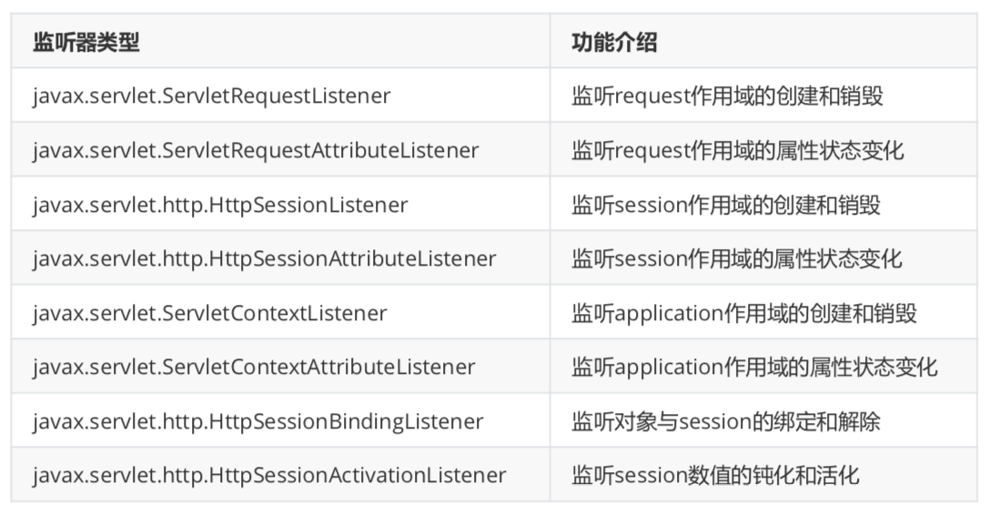

# JavaWeb核心下

## EL和JSTL核心技术

### EL表达式

#### EL表达式的概念和主要功能

- 概念
  - EL（Expression Language）表达式提供了在jsp中简化表达式的方法，可以方便的访问各种数据并输出
- 主要功能
  - 依次访问pageContext（当前页面有效），request（当前请求有效），session（当前会话有效），application（当前浏览器有效）作用域对象存储的数据
  - 获取请求参数值
  - 访问Bean对象中的属性值
  - 访问集合中的数据
  - 输出简单的运算结果

#### EL表达式访问内置对象的数据

- 访问方式

  ```jsp
  <%=request.getAtrribute("varName")%>
  <-- 用EL实现${varName} -->
  ```

- example

  ```jsp
  <%
      pageContext.setAttribute("name1","pageContext");
      request.setAttribute("name2","request");
      session.setAttribute("name3","session");
      application.setAttribute("name4","application");
  %>
  <%--使用jsp原始方式打印数据--%>
  <%--<%= "name1:"+ pageContext.getAttribute("name1")%><br/>--%>
  <%--<%= "name2:"+ request.getAttribute("name2")%><br/>--%>
  <%--<%= "name3:"+ session.getAttribute("name3")%><br/>--%>
  <%--<%= "name4:"+ application.getAttribute("name4")%><br/>--%>
  
  <%--使用el表达式--%>
  name1:${name1}<br/>
  name2:${name2}<br/>
  name3:${name3}<br/>
  name4:${name4}<br/>
  ```

  

#### EL表达式访问请求参数的数据

- 在EL之前使用下列方式请求数据

  ```jsp
  request.getParameter(name);
  request.getParameterValue(name);
  ```

- 在EL中使用下列方式访问请求参数的数值

  + param:接收的参数只有一个值

  + paramValues：接受的参数有多个值

    ```jsp
    <!-- 获取指定参数的值 -->
    ${param.name}
    <!-- 获取指定参数中指定下标的数值 -->
    ${paramValues.hobby[0]}
    ```

  + Example

    ```jsp
    param.jsp
    <form action="el_param.jsp" method="post">
    name: <input type="text" name="name"><br/>
    hobby:<input type="checkbox" name="hobby" value="唱歌">唱歌<br/>
            <input type="checkbox" name="hobby" value="跳舞">跳舞<br/>
            <input type="checkbox" name="hobby" value="学习">学习<br/>
        <input type="submit" value="提交">
    </form>
    
    el_param.jsp
    <%-- 原始方法 --%>
    <%= "name: "+request.getParameter("name")%><br/>
    <%= "hobby: "+ Arrays.toString(request.getParameterValues("hobby"))%><br/>
    
    <%-- EL表达式--%>
    name: ${param.name}
    hobby: ${paramValues.hobby}
    ```

    

#### EL表达式访问BEAN对象的属性值

- 访问方式

  - 方式一
    - $ { 对象名 . 属性名 }，例如:${user.name}
  - 方式二
    - $ { 对象名 [“属性名”] }，例如:${user["name"]}

- 区别

  - 当要存取的属性名中包含一些特殊字符，如: . 或 ,等并非字母或数字的符号，就一定要使用 [ ]而 不是.的方式

  - 使用[]的方式可以动态取值，具体方式如下:

    ```jsp
    <%
        request.setAttribute(“prop”,“age”);
    %>
    <!-- 相当于表达式中写一个变量 -->
    ${ user[prop] }
    ```

    

- 新建Person类包含姓名年龄字段

- example

  ```jsp
  <body>
  <%
      Person person = new Person();
      person.setAge(16);
      person.setName("luna");
      pageContext.setAttribute("person",person);
  %>
  
  <%--原始方式--%>
  <%="name: "+person.getName()%><br/>
  <%="age: "+person.getAge()%><br/>
  
  <%--EL表达式--%>
  <%--第一种--%>
  name: ${person.name}
  age:${person.age}
  <%--第二种(建议)--%>
  name: ${person["name"]}
  age: ${person["age"]}
  </body>
  ```

  

#### EL表达式访问集合中的数据

+ 格式

  ```jsp
  <!-- student为ArrayList类型的对象 --> 
  ${student[0].name}
  ```

  

- EL表达式常用的内置对象

  

- EL表达式常用运算的使用

  - 常用算术运算符

  

  + 常用关系运算符

  

  + 常用逻辑运算符

  

  + 条件运算符

    ```
    ${条件表达式? 语句1 : 语句2}	
    ```

    

  + 验证运算符

    ```
    ${empty 表达式} 返回布尔值判断表达式是否为"空"值，null值、无元素的集合或数组、长度为零的String被认为是空值。
    ```

    

### JSTL

#### JSTL标签库的概念和使用

- 概念

  - JSTL( JSP Standard Tag Library ) 被称为JSP标准标签库。 
  - 开发人员可以利用这些标签取代JSP页面上的Java代码，从而提高程序的可读性，降低程序的维护 难度。

- 使用

  - <a href="https://tomcat.apache.org/download-taglibs.cgi">下载jar包</a>

  - 在jsp页面使用taglib指定引入jstl标签库，方式为：

    ```jsp
    <!-- prefix属性用于指定库前缀 -->
    <!-- uri属性用于指定库的标识 -->
    <%@ taglib prefix="c" uri="http://java.sun.com/jsp/jstl/core" %>
    ```

#### 常用核心标签

- 输出标签

  ```jsp
  <c:out></c:out> 用来将指定内容输出的标签
  ```

  

- 设置标签

  ```jsp
  <c:set></c:set> 用来设置属性范围值的标签
  ```

  

- 删除标签

  ```jsp
  <c:remove></c:remove> 用来删除指定数据的标签
  ```

  

- 单条件判断标签

  ```jsp
  <c:if test =“EL条件表达式”> 
    满足条件执行
  </c:if >
  ```

  

- 多条件判断标签

  ```jsp
  <c:choose >
    <c:when test =“EL表达式”>
    满足条件执行
    </c:when>
    ...
    <c:otherwise>
  		不满足上述when条件时执行 
    </c:otherwise>
  </c:choose >
  ```

  

- 循环标签

  ```jsp
  <c:forEach var=“循环变量” items=“集合”> 
    	...
  </c:forEach>
  ```

  

- 常用函数标签

  ```jsp
  <%@ taglib prefix="fn" uri="http://java.sun.com/jsp/jstl/functions" %>
  ```

  

- 常用格式化标签

  ```jsp
  <%@ taglib prefix="fmt" uri="http://java.sun.com/jsp/jstl/fmt" %>
  ```

  

- 自定义标签

  - 如果上面几个标签不能满足需求，程序员也可以自定义标签，步骤如下:

  - 编写标签类继承SimpleTagSupport类或TagSupport类并重写doTag方法或doStartTag方法。

    ```java
    public class HelloTag extends SimpleTagSupport {
        private String name;
        public String getName() {
            return name;
    		}
        public void setName(String name) {
            this.name = name;
    		}
    		@Override
    		public void doTag() throws JspException, IOException { 
          JspWriter out = this.getJspContext().getOut(); 
          out.println("自定义标签的参数为:" + name);
    		} 
    }
    ```

  - 定义标签库文件(tld标签库文件)并配置标签说明文件到到WEB-INF下:

    ```xml
    <tag>
        <name>helloTag</name>
        <tag-class>com.lagou.demo02.HelloTag</tag-class>
        <body-content>empty</body-content>
        <attribute>
            <name>name</name>
            <required>true</required>
        </attribute>
    </tag>
    ```

  - 在JSP中添加taglib指令引入标签库使用:

    ```jsp
    <%@ taglib prefix="hello" uri="http://lagou.com" %>
    ```

    

- JSTL标签库的set标签使用
- JSTL标签库中remove标签的使用
- JSTL标签库中if标签的使用
- JSTL标签库中choose标签的使用
- JSTL标签库中forEach标签的使用
- JSTL函数标签的使用
- JSTL标签库中格式化标签的使用
- JSTL标签库中自定义标签的使用

## Filter+Listener核心技术

### Filter

#### Filter过滤器的基本概念和工作方式

- 基本概念

  - Filter本意为”过滤“的含义，是JavaWeb的三大组件之一，三大组件为:Servlet、Filter、 Listener。
  - 过滤器是向 Web 应用程序的请求和响应处理添加功能的 Web 服务组件。
  -  过滤器相当于浏览器与Web资源之间的一道过滤网，在访问资源之前通过一系列的过滤器对请求 进行修改、判断以及拦截等，也可以对响应进行修改、判断以及拦截等。

- 工作方式

  

#### 使用方式

- 自定义实现Filter接口并重写doFilter方法

  ```java
  public class LoginFilter implements Filter {
  	public void doFilter(ServletRequest request, ServletResponse response, FilterChain chain) throws IOException,ServletException {
  		//TODO 处理逻辑，必须调用下面的方法
  		chain.doFilter(request,response);
  	} 
  }
  ```

- 在web.xml文件中配置过滤器。

  ```xml
  <filter>
      <filter-name>LoginFilter</filter-name>
      <filter-class>com.lagou.LoginFilter</filter-class>
  </filter>
  <filter-mapping>
      <filter-name>LoginFilter</filter-name>
      <url-pattern>/*</url-pattern>
  </filter-mapping>
  ```

  

- 登陆页面和servlet通信实现
- 登陆功能的缺陷
- 登陆功能的优化实现

#### Filter接口的方法使用

- 基本概念

  + javax.servlet.Filter接口主要用于描述过滤器对象，可以对资源的请求和资源的响应操作进行筛选 操作。

- 常用方法

  

#### FilterConfig方法的接口使用

- 基本概念

  - javax.servlet.FilterConfig接口主要用于描述过滤器的配置信息。

- 常用方法

  

#### 多过滤器的使用和优点

- 多个过滤器使用

  

- 优点

  - 实现代码的“可插拔性”，即增加或减少某个功能模块，不会影响程序的正常执行。
  - 可以将多个相同处理逻辑的模块集中写在过滤器里面，可实现重复利用、也方便代码的维护。

### Listener

#### 监听器的概念和分类

- 基本概念

  - Servlet规范中定义的一种特殊的组件，用来监听Servlet容器产生的事件并进行相应的处理。
  -  容器产生的事件分类如下:
    -  生命周期相关的事件。
    - 属性状态相关的事件。
    - 存值状态相关的事件。
  - 底层原理是采用接口回调的方式实现。

- 分类

  

#### ServletRequestListener监听器的使用

- 在ServletRequest创建和关闭时都会通知ServletRequestListener监听器。

- 常用方法

  

#### ServletRequestAttributeListener监听器的使用

+ 向ServletRequest添加、删除或者替换一个属性的时候，将会通知 ServletRequestAttributeListener监听器。

+ 常用方法

  

#### HttpSessionListener监听器的使用

- 当一个HttpSession刚被创建或者失效(invalidate)的时候，将会通知HttpSessionListener监听 器。

- 常用方法

  

#### HttpSessionAttributeListener监听器的使用

- HttpSession中添加、删除或者替换一个属性的时候，将会通知HttpSessionAttributeListener监 听器。

- 常用方法

  

#### ServletContextListener监听器的使用

- 在ServletContext创建和关闭时都会通知ServletContextListener监听器。

- 常用方法

  

#### ServletContextAttributeListener监听器的使用

- 向ServletContext添加、删除或者替换一个属性的时候，将会通知 ServletContextAttributesListener监听器

- 常用方法

  

#### HttpSessionBindingListener监听器的使用

- HttpSession中绑定和解除绑定时，将会通知HttpSessionListener监听器。

- 常用方法

  

#### HttpSessionActivationListener监听器的使用

- 当有session数值的钝化和活化操作时，将会通知HttpSessionActivationListener监听器。

- 常用方法

  

- 配置context.xml文件的方式如下:

  ```xml
  <Manager className="org.apache.catalina.session.PersistentManager"
  saveOnRestart="true">
  		<!-- 配置文件存放的路径信息，可以自由指定 -->
      <Store className="org.apache.catalina.session.FileStore"
  directory="C:\session"/>
  </Manager>
  ```

  

- 监听器实现在线用户数量的统计

  - 自定义类实现监听器接口并重写相关的方法

    ```java
    public class OnlineUser implements HttpSessionListener,ServletContextListener {
        ServletContext ctx = null;
      
        // 初始化ServletContext
        public void contextInitialized(ServletContextEvent e) {
        		ctx = e.getServletContext();
        }
      
        // 销毁ServletContext
        public void contextDestroyed(ServletContextEvent e) {
        	//将ServletContext设置成null; 
        }
      
        // 当新创建一个HttpSession对象时
        public void sessionCreated(HttpSessionEvent e) {
        	//将当前的在线人数加上1，并且保存到ServletContext(application)中 
        }
        // 当一个HttpSession被销毁时(过期或者调用了invalidate()方法) 
      	public void sessionDestroyed(HttpSessionEvent e) {
        //将当前人数减去1，并且保存到ServletContext(application)中 
        }
    }
    ```

    

  - 在web.xml中配置监听器

    ```xml
    <listener>
        <listener-class> com.lagou.listener.OnlineUser </listener-class>
    </listener>
    ```

    

*XMind - Trial Version*