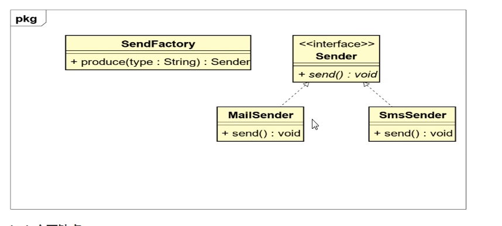
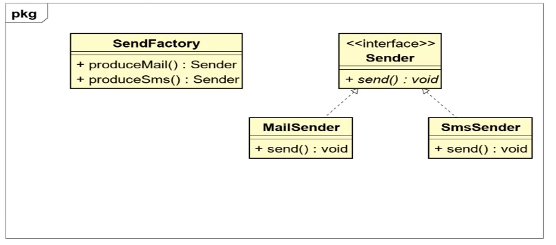
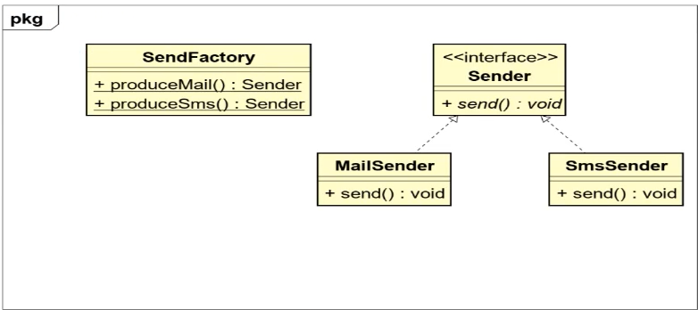
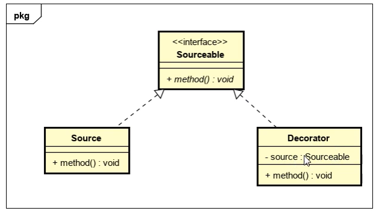
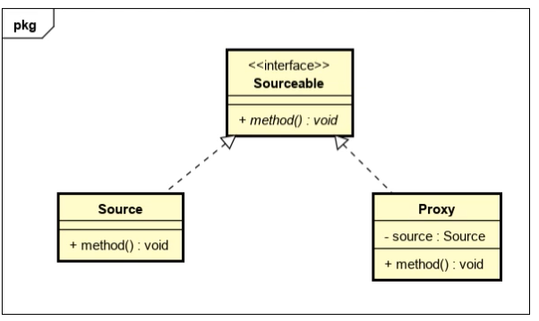
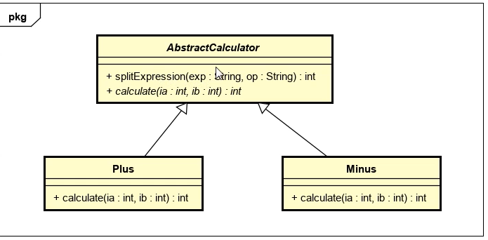

### 常用设计原则和设计模式

#### 开闭原则和里氏代换原则

+ 软件开发的原则

  + 需求分析文档
  + 概要设计文档
  + 详细设计文档
  + 编码和测试
  + 安装和调试
  + 维护和升级

+ 常用的设计原则

  + 开闭原则

    + 对扩展开放对修改关闭，为了使程序的扩展性好，易于维护和升级

    + demo

      ```java
      public class Person {
      
          private String name;
          // 当有新的需求，比如增加年龄变量时，如果前期测试已经没问题，建议创建Person的子类添加变量
          // 而不是直接修改原文件，这样会导致前期测试时间全部白费
          public Person() {
          }
      
          public Person(String name) {
              this.name = name;
          }
      
          public String getName() {
              return name;
          }
      
          public void setName(String name) {
              this.name = name;
          }
      }
      
      ```

      

  + 里氏代换原则

    + 任何基类可以出现的地方，子类一定可以出现，多使用多态的方式

  + 依赖倒转原则

    + 尽量多依赖抽象类或者接口而不是具体实现类，对子类具有强制性和规范性

  + 接口隔离原则
  
    + 尽量多使用小接口而不是大接口，避免接口的污染，降低类之间的耦合度

  + 迪米特法则

    + 一个实体应该尽量少于其他实体之间发生相互作用，是系统功能模块相对独立
  
  + 合成复用原则
    

#### 依赖倒转原则和接口隔离原则
+ 接口隔离原则
	+ 尽量多使用小接口而不是大接口，避免接口的污染，降低类之间的耦合度
    + demo

      ```java
      public interface Animal {
      
          void run();
      
          void fly();
      }
      
      ----------------------------------------
      public class Dog implements Animal{
      
          @Override
          public void run() {
      
          }
          // 狗可以跑但是不能飞，这里应该实现另一个功能之一run的接口
          @Override
          public void fly() {
      
          }
      }
      ```


#### 迪米特法则和合成复用原则
+ 合成复用原则

    + 尽量多使用合成或聚合的方式，而不是继承方式

      ```java
      public class B {
      
          private A a;
      
          public B(A a) {
              this.a = a;
          }
      
          // B想要调用A类中的方法，除了继承还可以声明一个A类的引用，然后构造方法中初始化
          public void test(){
              a.show();
          }
      }
      ```
#### 设计模式的概念和分类

+ 基本概念
  + 设计模式是一套被反复使用，多人知晓经过分类编目的，代码设计经验的总结
  + 设计模式就是一种用于固定场合的固定套路
+ 分类
  + 创建型模式（主要关注对象的创建）
    + 单例设计模式，工厂方法模式，抽象工厂模式
  + 结构型模式（主要关注结构关系）
    + 装饰器模式，代理模式
  + 行为型模式（关注行为效果）
    + 模板设计模式

#### 懒汉式线程同步实现

+ demo

  ```java
  public class Singleton {
  
      private static Singleton sin = null;
  
      private Singleton() {};
  
      public static synchronized Singleton getInstance() {
          // 当出现并发行为时，a进来发现sin是null创建一个对象
          // b同时进来发送sin是null，于是也会创建对象，这样就返回了两个对象了，不是单例
          // 为了避免上述情况出现加上synchronized关键字
          if(null == sin) {
              sin = new Singleton();
          }
          return sin;
      }
  }
  -------------------------------------------------------------------------------
  	public static /*synchronized */Singleton getInstance() {
          // 当出现并发行为时，a进来发现sin是null创建一个对象
          // b同时进来发送sin是null，于是也会创建对象，这样就返回了两个对象了，不是单例
          // 为了避免上述情况出现加上synchronized关键字
          synchronized (Singleton.class) {
              if (null == sin) {
                  sin = new Singleton();
              }
              return sin;
          }
      }
  ```

  

#### 懒汉式线程同步优化

+ demo

  ```java
  public static /*synchronized */Singleton getInstance() {
      // 当出现并发行为时，a进来发现sin是null创建一个对象
      // b同时进来发送sin是null，于是也会创建对象，这样就返回了两个对象了，不是单例
      // 为了避免上述情况出现加上synchronized关键字
      /*synchronized (Singleton.class) {
          if (null == sin) {
              sin = new Singleton();
          }
          return sin;
      }*/
      // 上述做法的缺陷在于每次返回对象都要做判断事实上只需要在第一次调用该方法创建对象时加锁
      // 后续情绪，只有返回对象就行不存在创建多个对象的情况可修改为
      if(null == sin) {
          synchronized(Singleton.class) {
              // 多个线程第一次进入，发现为null，第一个线程执行完创建好对象
              // 其他线程在解锁后执行时发现已经有唯一对象了就不会创建对象了
              if(null == sin) sin = new Singleton();
          }
      }
      return sin;
  }
  ```

  

#### 普通工厂模式的概念和实现

+ 概念
  
+ 普通工厂方法模式就是建立一个工厂类，对实现统一接口的不同实现类进行实例创建
  
+ 类图

  

+ Sender

  ```java
  public interface Sender {
  
      void send();
  }
  ```

  

+ MainSender

  ```java
  public class MailSender implements Sender {
  
      @Override
      public void send() {
          System.out.println("MailSender");
      }
  }
  ```

  

+ SmsSender

  ```java
  public class SmsSender implements Sender {
  
      @Override
      public void send() {
          System.out.println("SmsSender");
      }
  }
  ```

  

+ SendFactory

  ```java
  public class SendFactory {
  
      public Sender produce(String type) {
          if("mail".equals(type)) return new MailSender();
          if("sms".equals(type)) return new SmsSender();
          return null;
      }
  }
  ```

  

+ SendFactoryTest

  ```java
  public class SendFactoryTest {
  
      public static void main(String[] args) {
  
          // 声明工厂类型的引用指向工厂类型的方法
          SendFactory sendFactory = new SendFactory();
          // 调用生产方法来实现对象的创建，并使用接口类型的引用指向该对象
          Sender mail = sendFactory.produce("mail");
          // 使用对象调用方法模拟发生行为
          mail.send();
  
      }
  }
  ```

#### 普通工厂模式的意义

+ 优点
  + 扩展性，可维护性更强
+ 主要缺点
  + 在普通方法模式中如果传递的字符串出错，不能创建对象，并且可能出现空指针异常

#### 多个工厂方法模式的实现

+ 类图

  

+ 实现
  
+ 编写多个制造方法
  
+ SendFactory

  ```java
  public class SendFactory {
  
      /*public Sender produce(String type) {
          if("mail".equals(type)) return new MailSender();
          if("sms".equals(type)) return new SmsSender();
          return null;
      }*/
  
      public Sender produceMail() {
          return new MailSender();
      }
  
      public Sender produceSms() {
          return new SmsSender();
      }
  }
  ```

+ SendFactoryTest

  ```java
  public class SendFactoryTest {
  
      public static void main(String[] args) {
  
          // 声明工厂类型的引用指向工厂类型的方法
          SendFactory sendFactory = new SendFactory();
          // 调用生产方法来实现对象的创建，并使用接口类型的引用指向该对象
          // Sender mail = sendFactory.produce("mail");
          Sender mail = sendFactory.produceMail();
          // 使用对象调用方法模拟发生行为
          mail.send();
  
      }
  }
  ```

+ 主要缺点
  
  + 在多个工厂方法模式中，为了能够正确创建对象，先需要创建工厂类的对象才能调用工厂类的生产方法

#### 静态工厂方法模式的实现

+ 类图

  

+ SendFactory方法上加上static

  ```java
  public class SendFactory {
  
      /*public Sender produce(String type) {
          if("mail".equals(type)) return new MailSender();
          if("sms".equals(type)) return new SmsSender();
          return null;
      }*/
  
      public static Sender produceMail() {
          return new MailSender();
      }
  
      public static Sender produceSms() {
          return new SmsSender();
      }
  }
  ```

+ SendFactoryTest

  ```java
  public class SendFactoryTest {
  
      public static void main(String[] args) {
  
          // 声明工厂类型的引用指向工厂类型的方法
          // SendFactory sendFactory = new SendFactory();
          // 调用生产方法来实现对象的创建，并使用接口类型的引用指向该对象
          // Sender mail = sendFactory.produce("mail");
          // Sender mail = sendFactory.produceMail();
          Sender mail = SendFactory.produceMail();
          // 使用对象调用方法模拟发生行为
          mail.send();
  
      }
  }
  ```

+ 实际意义
  
  + 工厂方法适合：凡是出现了大量的产品需要创建且具有共同的接口时，可以通过工厂方法模式创建
+ 主要缺点
  
  + 工厂方法模式有一个问题就是，类的创建依赖工厂类，也就是说，如果想要拓展程序生成新的产品就必须对工厂类进行修改，违背了开闭原则

#### 抽象工厂模式的实现

+ Provider

  ```java
  public interface Provider {
  
      Sender produce();
  }
  ```

+ SmsSendFactory

  ```java
  public class SmsSendFactory implements Provider{
      @Override
      public Sender produce() {
          return new SmsSender();
      }
  }
  ```

+ MailSendFactory

  ```java
  public class MailSendFactory implements Provider {
      @Override
      public Sender produce() {
          return new MailSender();
      }
  }
  ```

  

+ SendFactoryTest

  ```java
  public class SendFactoryTest {
  
      public static void main(String[] args) {
  
          // 声明工厂类型的引用指向工厂类型的方法
          // SendFactory sendFactory = new SendFactory();
          // 调用生产方法来实现对象的创建，并使用接口类型的引用指向该对象
          // Sender mail = sendFactory.produce("mail");
          // Sender mail = sendFactory.produceMail();
          // 使用对象调用方法模拟发生行为
  
          // 静态工厂方法
          // Sender mail = SendFactory.produceMail();
          // mail.send();
  
          // 抽象工厂实现
          Provider provider = new SmsSendFactory();
          Sender produce = provider.produce();
          produce.send();
  
  
      }
  }
  ```

  

#### 抽象工厂模式的扩展优势

+ 创建工厂实现provider接口即可

#### 装饰器模式的实现

+ 基本概念

  + 装饰器模式就是给一个对象动态的增加一些新功能，要求装饰对象和被装饰对象实现同一个接口，装饰对象持有被装饰对象的实例

+ 类图

  

+ 实际意义

  + 可以实现一个类功能的扩展
  + 可以动态增加功能，而且还能动态增加

+ 缺点

  + 产生过多相似对象不易排错

+ 实现

  + Sourceable.java

    ```java
    public interface Sourceable {
    
        void method();
    
    }
    ```

  + Source.java

    ```java
    public class Source implements Sourceable {
        @Override
        public void method() {
            System.out.println("this is a method");
        }
    }
    ```
    
  + Decorator.java

    ```java
    public class Decorator implements Sourceable {
    
        private Sourceable source;
    
        public Decorator(Sourceable source) {
            this.source = source;
        }
        @Override
        public void method() {
            source.method();    // 保证原有功能不变增加新的功能
            System.out.println("decorate the method");
        }
    }
    ```
    
  + SourceableTest.java

    ```java
    public class SourceableTest {
    
        public static void main(String[] args) {
    
            Sourceable sourceable = new Source();
            sourceable.method();
    
            Sourceable sourceable1 = new Decorator(sourceable);
            sourceable1.method();
    
        }
    }
    ```


​    

#### 代理模式的实现

+ 基本概念

  + 代理模式
    + 就是找一个代理类替原对象进行一些操作
    + 比如我们在租房子时找中介

+ 类图结构

  

+ 实际意义

  + 如果在使用的时候需要对方法进行改进可以采用一个代理类调用原有方法，并且对产生的结果进行控制，这种方法就是代理模式
  + 使用代理模式可以将功能划分的更加清晰，有助于后期维护

+ 代理模式和装饰器模式的比较

  + 装饰器模式通常的做法是将原始对象作为一个参数传给装饰着的构造器，而代理模式通常在一个代理类中创建一个被代理的对象
  + 装饰器模式关注于在一个对象上动态的方法，然而代理模式关注于控制对对象的访问

+ 实现

  ```java
  public class Proxy implements Sourceable {
  
      private Source source;
  
      public Proxy() {
          source = new Source();
      }
  
      @Override
      public void method() {
          source.method();
          System.out.println("the proxy of source");
      }
  }
  
  ```

  

#### 模板方法模式的实现

+ 类图

  

+ 基本概念

  + 模板方法模式主要指一个抽象类红封装了一个固定流程，流程中具体的步骤可以由不同的子类进行不同的实现，通过抽象类让固定的流程产生不同的结果
  + 实际意义
    + 将多个子类共有逻辑基本相同的内容提取出来实现代码复用
    + 不同的子类实现不同的效果形成多态，有助于后期维护

+ 实现

  + AbstractCaculator.java

    ```java
    public abstract class AbstractCaculator  {
    
        public int splitExpression(String exp, String op) {
            String[] split = exp.split(op);
            return calculate(Integer.parseInt(split[0]) , Integer.parseInt(split[1]) );
        }
    
        public abstract int calculate(int ia,int ib);
    
    }
    ```

    

  + Minus.java

    ```java
    public class Minus extends AbstractCaculator {
        @Override
        public int calculate(int ia, int ib) {
            return ia - ib;
        }
    }
    ```

    

  + Plus.java

    ```java
    public class Plus extends AbstractCaculator {
    
        @Override
        public int calculate(int ia, int ib) {
            return ia + ib;
        }
    }
    ```

  + AbstractCaculatorTest.java

    ```java
    public class AbstractCaculatorTest {
    
        public static void main(String[] args) {
    
            AbstractCaculator plus = new Plus();
            int res = plus.splitExpression("1+1","\\+");
            System.out.println(res);
        }
    }
    ```

    