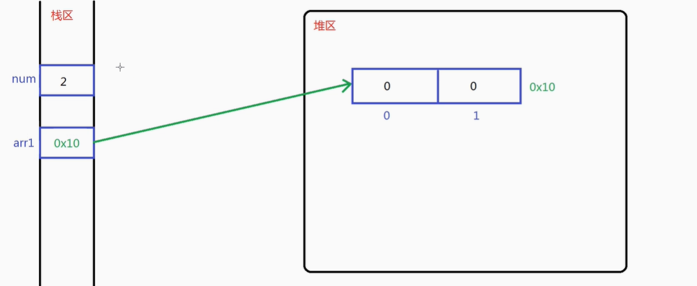
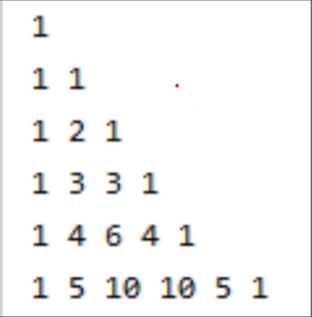

### 数组即应用
#### 一维数组的基本概念
+ 描述
    + 当需要唉java程序中记录多个类型相同的数据时，声明一个以为数组即可，一维数组本质是内存中连续的存储单元
    + 数组是相同数据类型多个元素的容器，元素按线性顺序排列，在java语言中体现为一种引用数据类型
#### 一维数组的声明方式
+ 语法
    ```
        数据类型[] 数组名称 = new 数据类型[数组长度]
    ```
+ 数组通过length获取长度，通过下标访问元素，下标0 —— n-1
#### 一维数组的使用
+ 案例
    ```
        int arr1[] = new arr[2]; // 不推荐这种方式
        // int arr = 2;
        int[] arr2 = new arr[2]; // 推荐这种方式因为在结构上更容易和变量区分
    ```
#### 一维数组的初始化
+ 初始值
    + 基本类型的数组创建后，元素初始值byte,short,char,int,long为0,float,double为0.0,boolean为false
+ 可以在声明数组的同时初始化
    ```
        数据类型[] 数组名称 = new 数据类型[] {变量1，变量2...}
        // 下面是简化版
        数据类型[] 数组名称 = {变量1，变量2...}
    ```
#### 内存结构分析
+ 内存结构之栈区
    + 栈用于存放程序运行过程当中所有的局部变量，一个运行的java程序从开始到结构会有多次变量声明
+ 内存结构之堆区
    + JVM会在其内存空间中开辟一个称之为堆的存储空间，这部分空间用于存储使用new关键字创建的数组和对象
+ 基本数据类型数据空间存放的是变量，而引用数据类型中存放的是地址
    + 数组和基本数据类型存储形式
    
    + int[] arr1 = new int[2]
        + int[] arr1 —— 在栈区中申请一个名为arr1的空间
        + new int[2] —— 程序会在堆区中申请两个空间，默认值为0
        + 等号是将堆区中申请的连续空间地址存放在栈区申请的内存中
#### 一维数组增删查改之声明和赋值操作
+ 题目
    + 声明一个长度为5，元素类型为int的一维数组，打印所有元素
        ```
            int[] arr = new int[5];
            for(int i = 0; i < arr.length;i++) {
                System.out.println(arr[i]);
            }
        ```
    + 将11,22,33,44赋值给数组前四个元素并打印
        ```
            arr[0] = 11;
            arr[1] = 22;
            arr[2] = 33;
            arr[3] = 44;
            for(int i = 0; i < arr.length;i++) {
                System.out.println(arr[i]);
            }
        ```
    + 
#### 一维数组之插入操作
+ 题目
    + 将55插入下标0的位置，，并打印数组
        ```
            for(int i = arr.length-1;i>0;i--) {
                arr[i] = arr[i-1];
            }
            arr[0] = 55;
            for(int i = 0; i < arr.length;i++) {
                System.out.println(arr[i]);
            }
        ```
#### 一维数组之删除操作
+ 题目
    + 将元素55从数组中删除，删除方式为后续元素前移，最后位置为0，并打印数组
        ```
            for(int i = 0;i<arr.length-1;i++) {
                arr[i] = arr[i+1];
            }
            arr[4] = 0;
            for(int i = 0; i < arr.length;i++) {
                System.out.println(arr[i]);
            }
        ```
#### 一维数组之查改操作
+ 题目
    + 查询数值中是否存在元素22，若存在修改为220再打印
        ```
            for(int i = 0;i<arr.length;i++) {
                if(22 == arr[i]) arr[i] = 220;
            }
            for(int i = 0; i < arr.length;i++) {
                System.out.println(arr[i]);
            }

        ```
#### 一位数组的优缺点
+ 数组的优缺点
    + 优点
        + 可以通过下标可以访问指定位置元素，速度快
    + 缺点
        + 数组要求所有元素类型相同
        + 数组要求内存空间连续，长度一旦确定不能修改
        + 增加删除元素时需要移动大量元素，效率低
#### 一维数组之间元素的拷贝实现
+ 题目
    + 声明一个初始值为11,22,33,44,55的数组并打印所有元素
    + 声明一个长度为3元素类型为int的一维数组并打印所有元素
    + 实现将第一个数组中间三个元素赋值到第二个数组中
    + 再次打印第二个元素中所有的元素
        ```
            int[] arr1 = new int[] {11,22,33,44,55};
            int[] arr2 = new int[3];
            int index = arr1.length/2-1;
            for(int i = 0;i < 3;i++) {
                arr2[i] = arr1[index++];
            }
            System.out.println(Arrays.toString(arr2));
        ```
#### 一维数组之间元素的拷贝优化
+ 使用java官网提供的方法
    ```
        System.arraycopy(arr1,index,arr2,0,3);
    ```
#### 一维数组之间拷贝的笔试考点
+ 数组之间赋值
    ```
        int[] arr = new int[3];
        int[] brr = new int[5];
        brr = arr;
        System.out.println(Arrays.toString(brr));
        // 当指向发生转变，没有变量指向原先brr指向的内存空间jvm将会回收这些空间
    ```
#### 一维数组统计数字次数原理分析及编码实现
+ 统计用户输入任意一个正整数中每个数字出现次数的统计并打印
    ```
        int[] arr = new int[10];
        int data = 123123;
        while(data > 0) {
            int temp = data % 10;
            arr[temp]++;
            data = data/10;
        }
        for(int i = 0; i<arr.length;i++) {
            if(arr[i] != 0) {
                System.out.println("数字"+i+"出现了"+arr[i]+"次");
            }
        }
    ```
#### 数组实现学生成绩的录入和打印
+ 题目
    + 提示输入学生的人数以及学生的考试成绩
        ```
            Scanner input = new Scanner(System.in);
            System.out.println("please input the num of student: ");
            int num = input.nextInt();
            int[] arr = new int[num];
            for(int i = 0;i<num;i++) {
                System.out.println("please input the score of student: ");
                arr[i] = input.nextInt();
            }
            System.out.println(Arrays.toString(arr));
        ```
#### 数组实现学生成绩总分和平均分计算
+ 题目
    + 计算该班级的总分和平均分并打印
        ```
            int sum = 0;
            int aver = 0;
            for(int i = 0;i < num;i++) {
                sum += arr[i];
            }
            aver = sum/num;
            System.out.println("总分为："+sum+" 平均分为："+aver);
        ```
#### 数组工具类的概念和元素打印
+ java.util.Arrays类可以实现对数组元素的遍历查找排序
    + 声明一个值为10,20,30,40,50的一维数组
    + 使用原始方式打印数组，所有元素要求格式 [10, 20, 30, 40, 50]（一数字一空格）
    + 使用工具类完成同样格式打印
    ```
        int[] arr = new int[] {10,20,30,40,50};
        ---------------------------------------
        System.out.print("[")
        for(int i = 0;i < arr.length-1; i++) {
            System.out.print(arr[i]+ ", ");
        }
        System.out.print(arr[arr.length-1]+"]");
        --------------------------------------
        System.out.println(Arrays.toString(arr));
    ```
+ 数组工具类常用方法
    + 输出数组内容 —— String toString(int[] a)
    + 将指定参数赋值给数组所有元素 —— void fill(int[] a,int val)
    + 判断两个数组次序内容是否相等 —— boolean equals(int[] a,int[] b)
    + 对数组中元素进行从小到大排序 —— void sort(int[] arr)
    + 查询数组中指定元素位置 —— int binarySearch(int[] a,int key)
        + 找到返回下标，找不到返回-1
#### 数组工具类实现元素填充和比较
+ 上述方法示例
    ```
        // fill
        int[] arr = new int[5];
        Arrays.fill(arr,-1);
        System.out.println(Arrays.toString(arr)); 

        // equals
        int[] arr1 = new int[5];
        Arrays.fill(arr1,-1);
        System.out.println(Arrays.equals(arr,arr1)); 
    ```
#### 数组工具类实现元素排序和查找
+ 上述方法示例
    ```
        int[] arr = new int[] {12,11,24,51,23};
        System.out.println(Arrays.toString(arr));

        // sort
        Arrays.sort(arr);
        System.out.println(Arrays.toString(arr));

        // binarySearch 找到返回下标，找不到返回-1
        System.out.println(Arrays.binarySearch(arr,12));
    ```
#### 二维数组基本概念
+ 二维数组是由多个一维数组摞在一起的数组，二维数组中每个元素都是一维数组，而一维数组的元素才是数据内容
+ int[i][j] —— i代表行，j代表列
    + arr.length 代表二维数组长度行数
    + arr[0].length 代表二维数组列数
#### 二维数组的声明和使用
+ 二维数组示例
    ```
        int[][] arr = new int[2][2];
        for(int i = 0;i < arr.length;i++) {
            System.out.println(Arrays.toString(arr[i]));
        }
    ```
#### 二维数组的初始化和考点
+ 示例
    ```
        // 初始化
        int[][] arr = new int[][] {{1,2,3},{4,5,6},{7,8,9}};
    ```
+ 考点
    ```
        int[][] arr = new int[3][];
        // 表示声明三行不知道多少列的数组
        arr[0] = new int[3];
        arr[1] = new int[4];
        arr[2] = new int[5];
        // 所以使用双层for循环时不能一直使用arr[0].length,而是使用arr[i].length
        for(int i = 0;i < arr.length;i++) {
            for(int j = 0;j < arr[i].length; j++) {
                System.out.println(arr[i][j]);
            }
        }
    ```
#### 二维数组实现杨辉三角
+ 题目
    + 根据用户输入的行数输出杨辉三角形
    
    ```
        import java.util.*;
        public class test {
            
            public static void main(String[] args) {

                Scanner input = new Scanner(System.in);
                System.out.println("please input the number: ");
                int num = input.nextInt();
                int[][] arr = new int[num][num];
                for(int i = 0;i<arr.length;i++) {
                    arr[i][0] = 1;
                }
                for(int i = 1;i < arr.length;i++) {
                    for(int j = 1;j < arr[i].length;j++) {
                        arr[i][j] = arr[i-1][j] + arr[i-1][j-1];
                    }
                }
                for(int i = 0;i < arr.length;i++) {
                    for(int j = 0;j < arr[i].length;j++) {
                        if (arr[i][j] != 0) {
                            System.out.print(arr[i][j]+ " ");
                        }
                    }
                    System.out.println("");
                }
            }   
        }
    ```
#### 总结