## 前端基础

### HTML

#### html介绍和语法规范

+ html格式

  ```html
  <html>
    <head>
      <meta charset="utf-8"/>
      <title>标题</title>
    </head>
    <body>
      ...
    </body>
  </html>
  ```

+ html标签代表当前页面是一个html

+ head标签声明html相关信息

  + 比如：title，icon，编码集

+ body标签主要用于显示页面信息

#### html标签使用-文件标签

+ html

+ head

+ body

  + text
    + 设置文字颜色
  + bgcolor
    + 设置背景色
  + background
    + 设置背景图片

  ```html
  <html>
    <head>
      <meta charset="utf-8"/>
      <title>标题</title>
    </head>
    <body text="red" bgcolor="blue" background="...	">
      ...
    </body>
  </html>
  ```

  

#### html标签使用-排版标签

+ 换行

  ```html
  <br />  换行
  <br></br> 换行的同时空一行
  ```

+ 段落

  + p标签中的内容会在开始和结束产生一个空白行，并且会自动换行，常用属性align的作用是设置段落中的内容对齐的方式可取值left，right，center

  ```html
  <p></p> 
  ```

+ 水平线

  + 常用属性
    + align：可取left，right，center代表水平线位置
    + size：代表水平线的厚度
    + width：水平线的宽度
    + color：水平线的颜色

+ Div块标签

+ span块标签

  + div和span的区别
    + div会自动换行，我们称之为行级元素
    + span不会自动换行，我们称之为行内元素

  ```html
  <div>
      我是一个div标签、
      <br/>
      我是行级标签---
      <span>
          我是一个span标签，我是行内标签；
          <br/>
          这是我换行的数据
      </span>
    </div>
  ```

  

#### html标签使用-字体标签

+ font标签

  + face字体
  + size大小
  + color颜色
    + 英文名
    + 十六进制
    + rgb表示

   ```html
  <font face="宋体" size="22" color="#ff0000">学习<b>HTML</b>很简单</font>
   ```

+ 标题标签h

+ 加粗标签b，倾斜标签i

+ 清单标记

  + 有序
    + ol
    + start属性：代表开始的数目
    + type属性：代表序号方式： 1 a A i I
  + 无序
    + ul
    + type属性：代表清单符号的效果，可以取值
      + disc：圆点（默认）
      + circle：圆圈
      + square： 方块

  ```html
  <div>
      <!-- 有序列表 I II III-->
      <ol type="I" start="3">
          <!-- 序列的内容用什么标示?<li>标签来显示 -->
          <li>张三</li>
          <li>李四</li>
          <li>王五</li>
      </ol>
      <!-- 无序列表 -->
      <ul type="square">
          <li>Java</li>
          <li>Python</li>
          <li>C#</li>
      </ul>
  </div>
  ```

  

#### html标签使用-图形标签

+ img

  + width

  + height

  + Alt(找不到资源文件时显示的文字)

  + Src

  + border（图片边框）

  + align（文件与图片的对齐方式）

    | 值     | 描述             |
    | ------ | ---------------- |
    | left   | 把图像对齐到左边 |
    | right  | 把图像对齐到右边 |
    | middle | 把图像对齐到中央 |
    | top    | 把图片对齐到顶部 |
    | bottom | 把图片对齐到底部 |

    

  ```html
  
  ```

  

#### html标签使用-超链接标签

+ a标签可以实现跳转路径，超链接内容不仅可以是文本，也可以是图片等其他属性
+ 常用属性
  + href代表我们要跳转的路径
  + name属性可以让我们在本页面设置一个锚点
    + 注意想要通过超链接跳转指定的锚点位置必须在前面加上#
  + target这个属性规定在何处打开这个链接的文档
    + _blank
      + 在新窗口中打开链接
    + _self
      + 默认，在相同的框架中打开被链接文档
    + _parent
      + 在父框架集中打开被链接文档
    + _top
      + 在整个窗口中打开被链接文档
    + framename
      + 在指定的框架中打开被链接文档

#### html标签使用-表格标签

+ table标签
  + 代表一个表格
  + 常用属性
    + left
      + 左对齐
    + right
      + 右对齐
    + center
      + 居中对齐
+ tr标签
  + 代表行
  + 常用属性
    + left
      + 内容左对齐
    + right
      + 内容右对齐
    + center
      + 内容居中对齐
    + justify
      + 对行进行伸展，这样每行的长度都相等
    + char
      + 将内容对准指定字符
+ td标签
  + 代表单元格
  + 常用属性
    + colspan
      + 表示列的合并
    + rowspan
      + 表示行的合并
+ th标签
  + 也是单元格和td类型
  + th默认居中对齐，文字加粗，适合表头
+ caption标签
  + 给表格添加标题列
  + 如果使用caption标签，必须是table标签的下一行
  + 开发中表格使用较少，一般是css+div

#### html标签使用-表单标签

+ 表格可以让我们将录入信息提交到指定位置
+ 注意事项
  + 所有表单的元素都要名称
  + 单选框要想可以一次选择一个，要具有相同的name值，如果要设置默认值，可以通过checked=“checked”来设置
  + 可以给textarea来设置rows和cols来控制行数和列数
  + 多选框要想设置默认选中与单选框设置一样，都可以通过checked=“checked”来设置
  + 如果要设置下拉框被选中可以在option标签上设置selected=“selected”

#### html标签使用-表单案例

+ form标签属性
  + name
    + 代表表单名称
  + action
    + 提交位置
  + method
    + 代表的是表单提交的方式，常用的提交方式是get/post，默认get
+ 注意
  + 表单提交时，action代表的是表单提交的路径，在表单的所有标签上如果添加了name属性，这时，提交表单信息时，会以路径？name=value&name=value提交，对于我们的radio，checkbox，option也需要设置他们的value值
+ input标签
  + 用于搜集用户信息
  + 属性
    + button
      + 定义可点击按钮（一般通过js启动脚本）
    + checkbox
      + 定义复选框
    + file
      + 定义输入字段和浏览按钮，供文件上传
    + hidden
      + 定义隐藏的输入字段
    + password
      + 定义密码字段，该字段中的字符被隐藏
    + radio
      + 定义单选按钮
    + reset
      + 定义重制按钮，重制按钮会清楚表单中所有数据
    + submit
      + 定义提交按钮，提交按钮会将表单中所有数据发送到服务器
    + text
      + 定义单行输入字段，用户可在其中输入文本，默认宽度为20个字符
  + 常用属性
    + text类型输入框
      + value
        + 文本库默认值
      + size
        + 文本框长度
      + maxlength
        + 文本框最大输入字符个数
    + password类型输入框
      + value
      + size
      + maxlength
    + radio类型单选框
      + name
      + value
      + checked
        + 设置单选框默认选中
    + checkbox类型复选框
      + name
      + value
      + checked
    + button类型按钮
      + value设置按钮上文字
  + 下拉框
    + select
      + 可以创建单选或多选菜单
    + select元素中的option标签用于定义列表中的可用项
    + select是一种表单控件，可用于在表单中接受用户输入
    + 下拉框select,option
      + name
        + 下拉框名称
      + size
        + 显示的行数
      + multiple
        + 是否一次可以选择多个（shift）
        + option有一个属性value
          + 代表提交到服务器的值
  + 文本域textarea
    + rows
      + 设置行
    + cols
      + 设置列
    + 如果想要在文本域中显示默认值，我们需要在textarea标签中间设置

#### html标签使用-框架标签

+ 通过框架标签可以定制html页面布局

  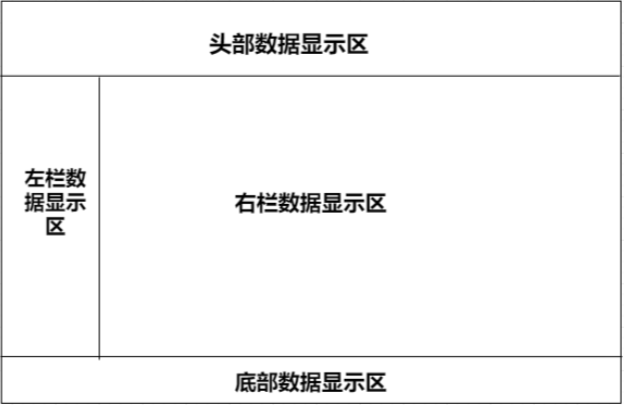

+ 关于框架中指定位置显示我们指定页面显示，需要使用a标签的target属性通过测试，a标签的target属性值可以是frame框架的name值，代表链接所指向的文件是我们指定框架位置上显示

+ 注意当我们在html页面描述框架信息时，不可以将frameset写在body标签中

#### html标签使用-其他标签

+ meta标签

  + meta标签必须在head标签之间
    + 它可以对页面进行描述以及热词设置，可以方便搜索引擎查找页面
    + 通过meta标签设置http响应信息
    + 通过meta标签可以设置页面的编码
    + 通过meta标签可以设置页面加载完成后在指定的时间后跳转到指定页面

+ link标签

  + 后面我们会使用link标签来导入css
  + 注意link标签也必须卸载head中

+ 特殊字符

  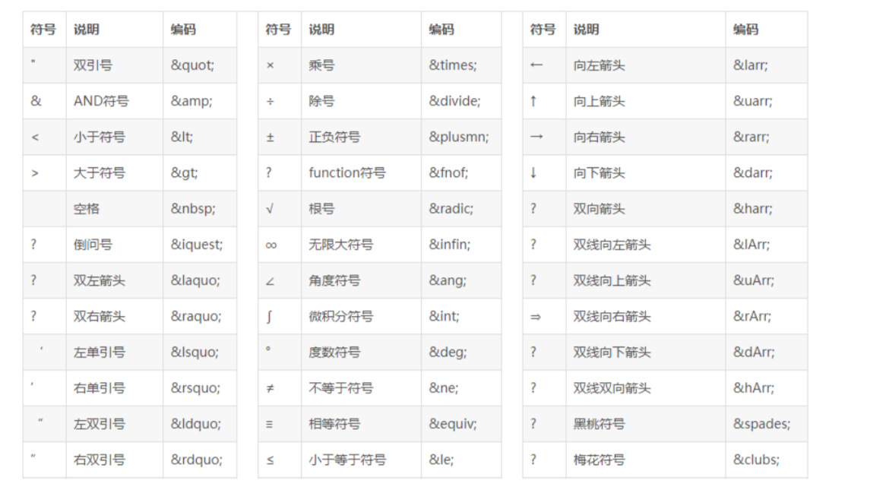

  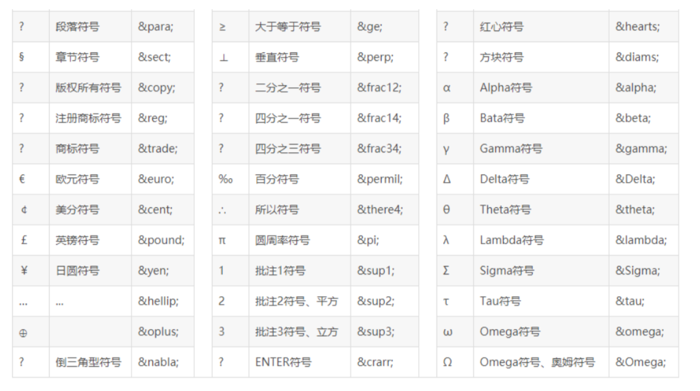

#### html标签使用-DOM介绍

+ html dom定义的访问和操作html文档的标准方法

+ DOM是文档对象模型，是html和xml文档的编程接口

+ DOM以树结构表单html文档

  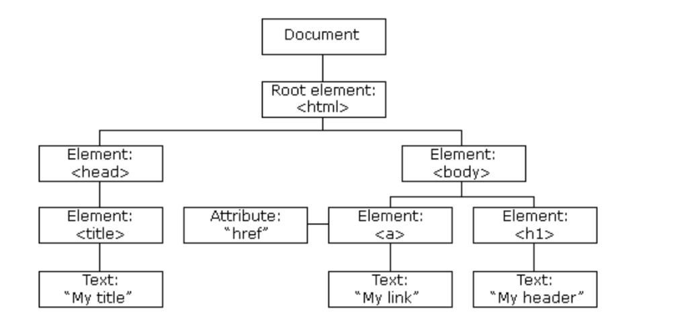

+ DOM是W3C的标准

+ DOM定义了访问HTML和XML的标准

+ W3C DOM标准被分为3个不同的部分

  + 核心DOM针对任何结构化文档的标准模型
  + XML DOM —— 针对XML的标准模型
  + HTML DOM —— 针对XML的标准模型

+ DOM节点

  + 在HTML DOM中，所有事务都是节点，DOM是被视为节点树的HTML

    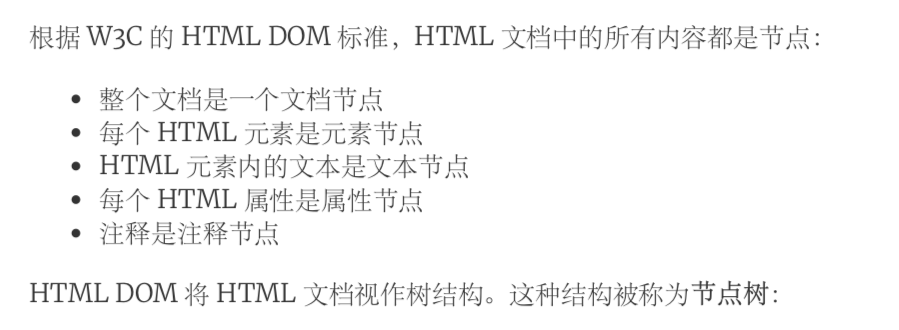

    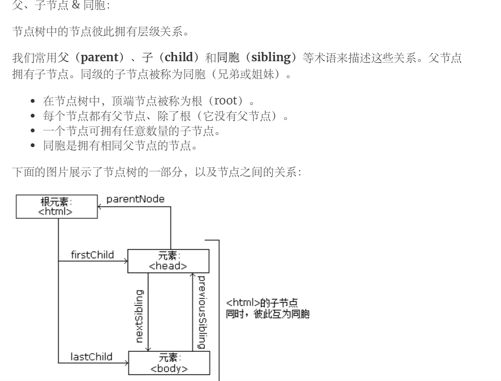

    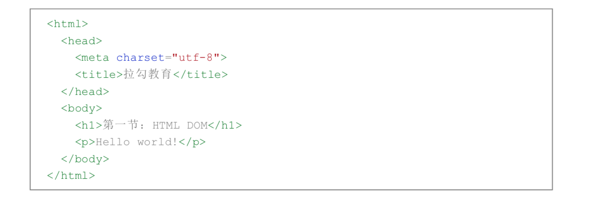

    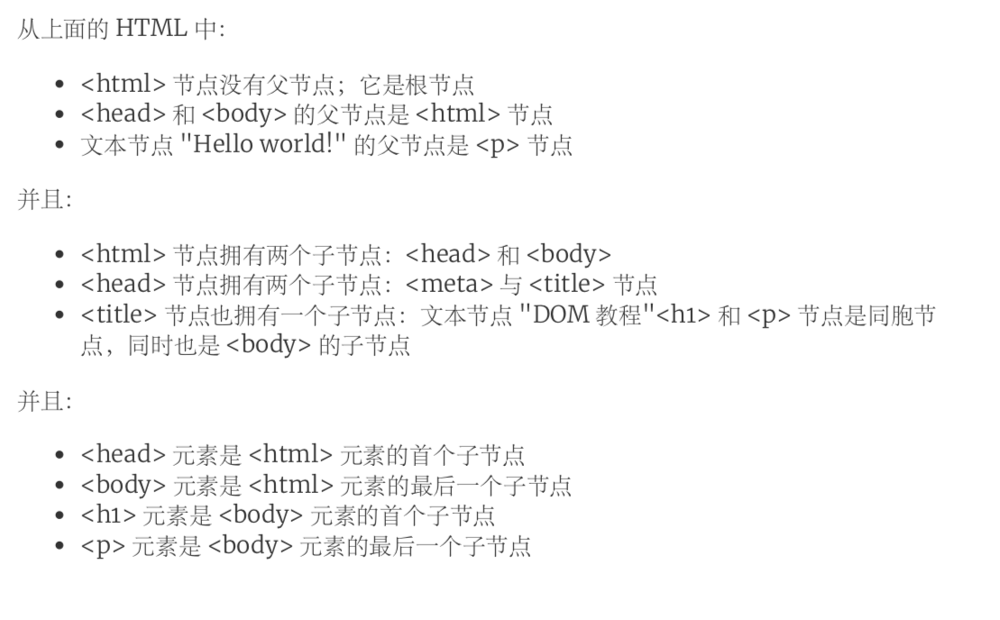

+ DOM方法&属性

  + DOM方法是我们可以在节点上执行的动作

  + DOM属性是我们可以在节点上设置和修改的值

  + 编程接口

    + 可通过js或其他语言访问dom
    + 所有html元素被定义为对象，而编程接口则是对象方法和对象属性
    + 方法是执行的动作
    + 属性是可以设置和修改的值

    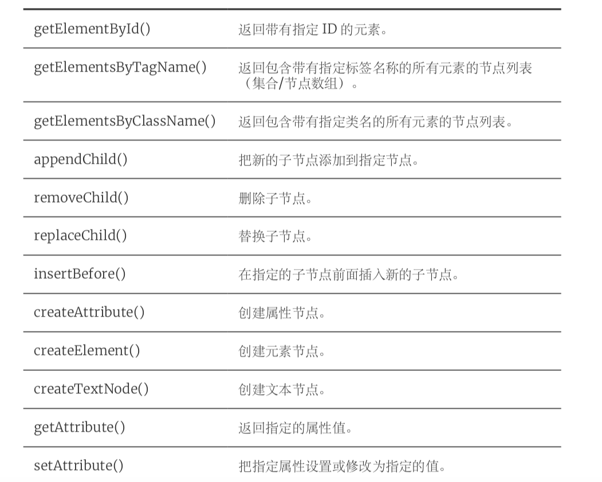

  + DOM

    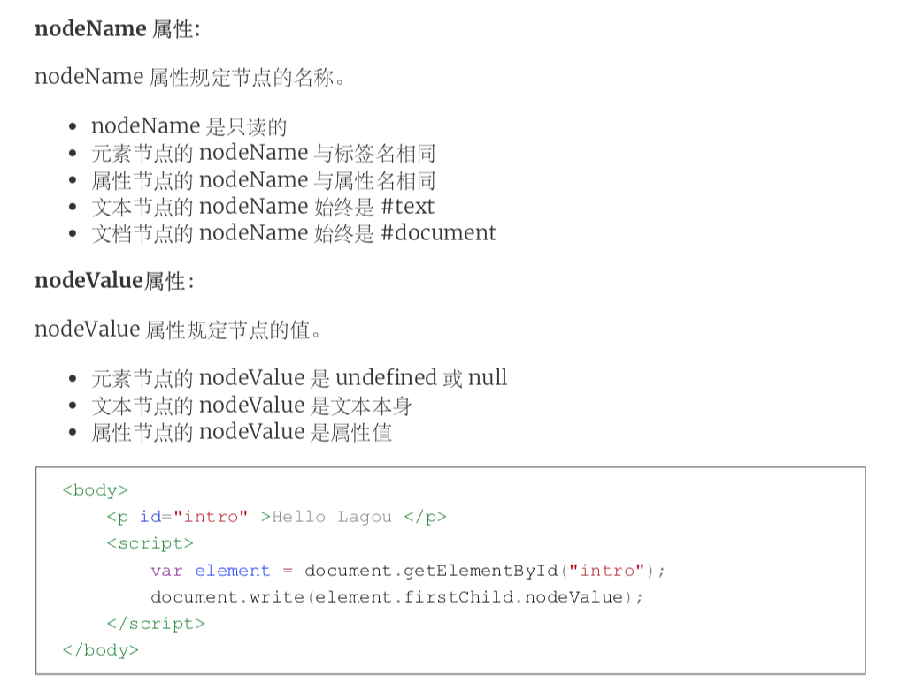

    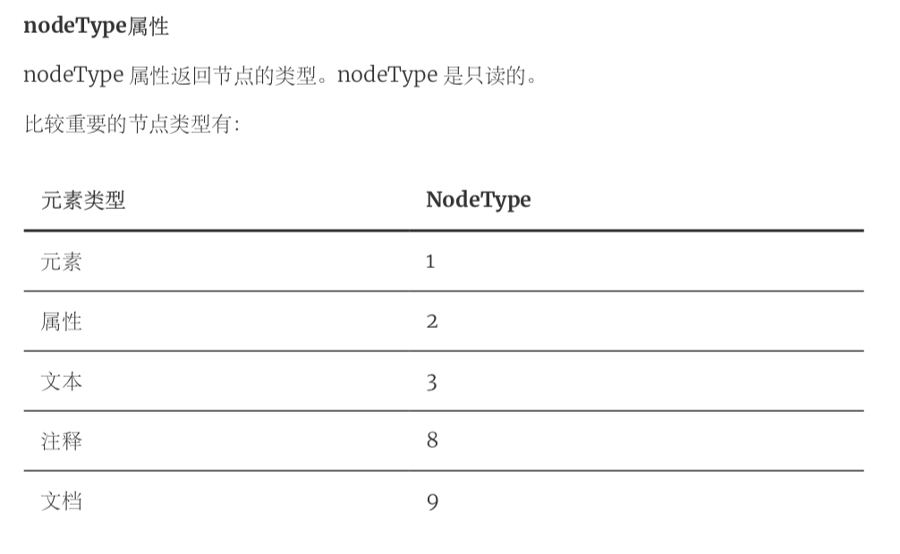

#### html标签使用-DOM访问

+ getElementById() 方法返回带有指定 ID 的元素:
+ getElementsByTagName() 返回带有指定标签名的所有元素 :
+ getElementsByClassName() 查找带有相同类名的所有 HTML 元素 :

#### html标签使用-DOM修改

+ DOM修改意味着许多不同的方面

  + 改变html内容
  + 改变css
  + 改变html属性
  + 创建新的html元素
  + 删除已有的html元素
  + 改变事件

+ 改变p元素内容，段落样式

  

  + fontsize

    

    + 添加新元素	

    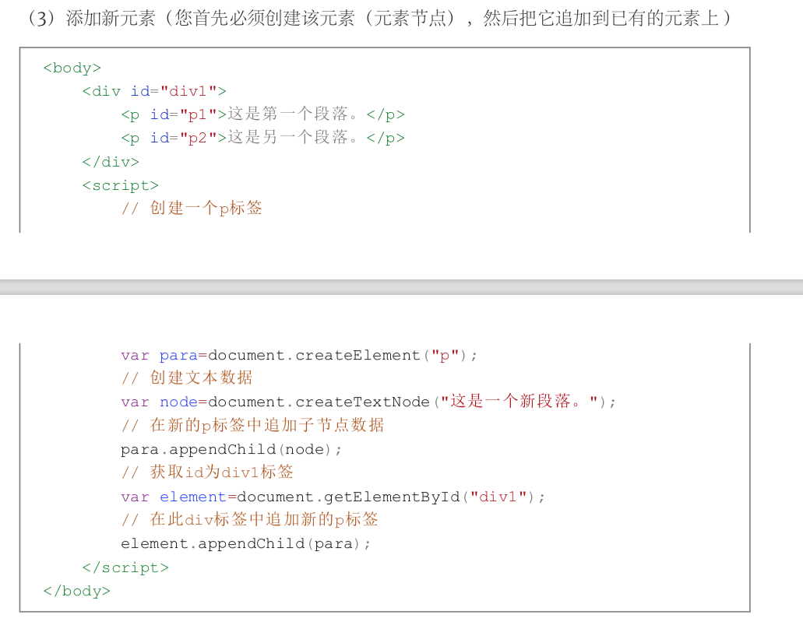

    + 增加元素另一种方式

      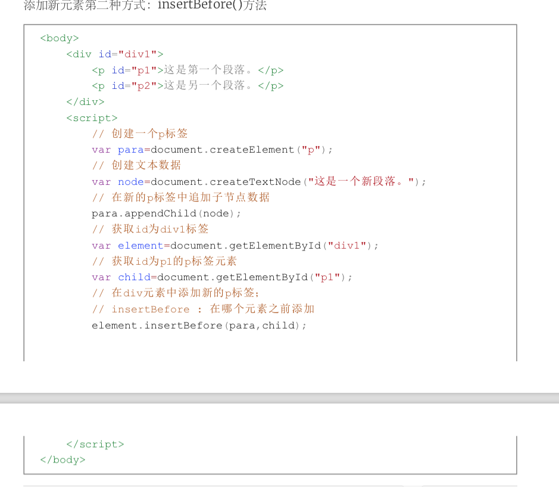

    + 删除html元素

      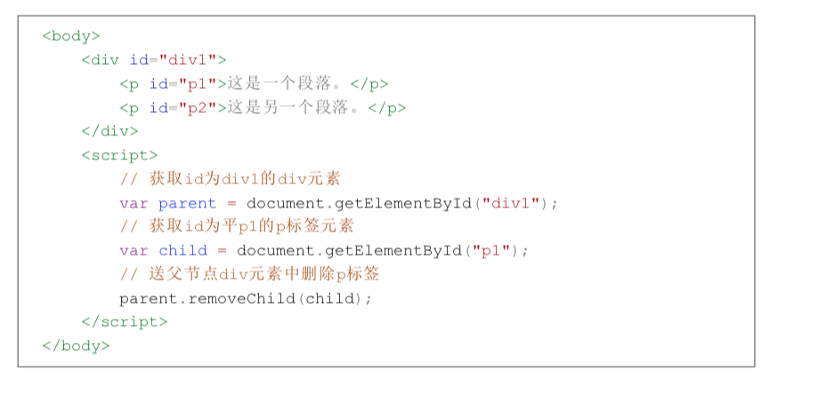

      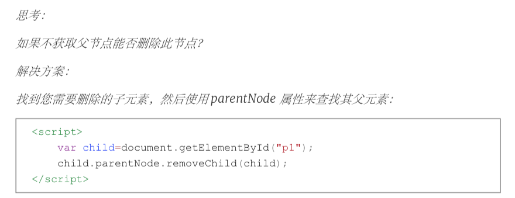

    + 替换元素

      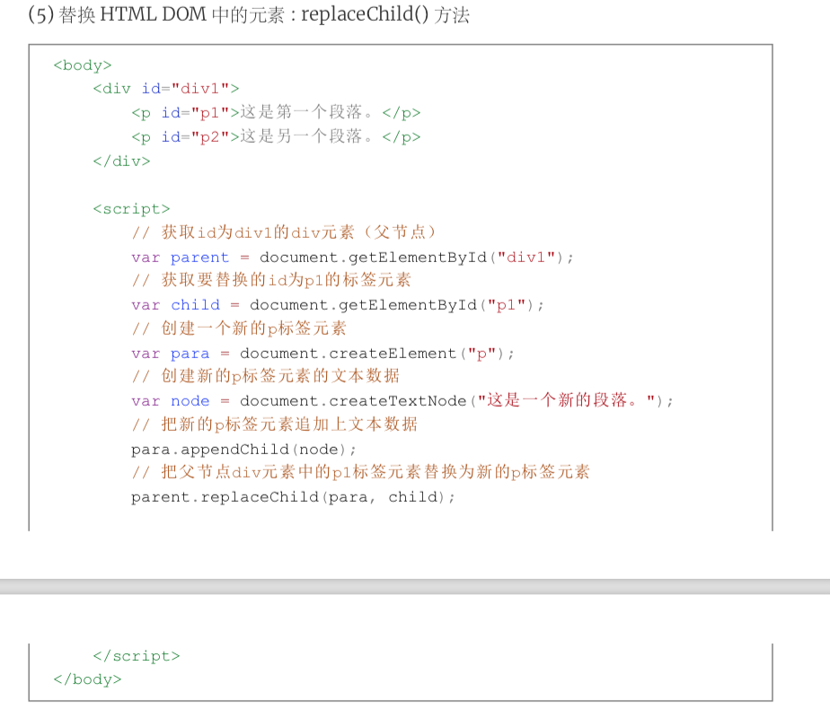

      

#### html标签使用-DOM事件

+ 简介

  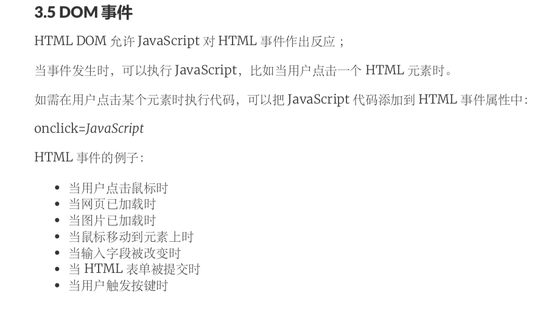

+ 窗口事件

  + 仅在body和frameset元素中有效

    | 属性     | 值   | 描述                                                         |
    | -------- | ---- | ------------------------------------------------------------ |
    | onload   | 脚本 | 当文档被载入时执行脚本                                       |
    | onupload | 脚本 | 当文档被卸下时执行脚本，属性会在页面下载时触发（或者浏览器已关闭） |

+ 表单元素事件

  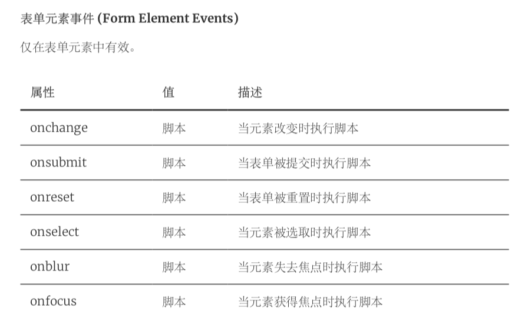

+ 图像事件

  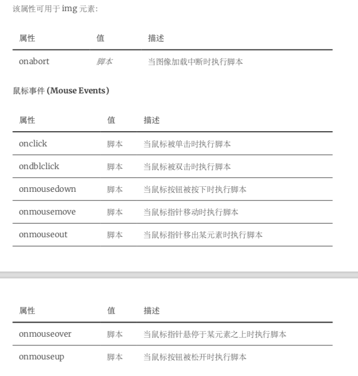

+ onload和onunload事件

  

#### 


