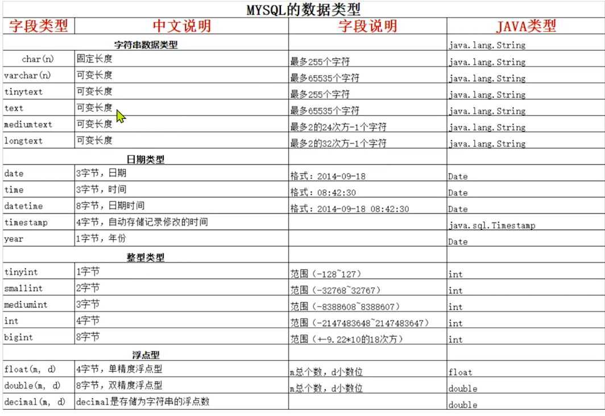

### mysql基础和sql入门

#### 数据库基本概念

+ 什么是数据库

  + 数据库(DataBase)就是存储和管理数据的仓库
  + 其本质是一个文件系统，还是以文件的方式将数据保存在电脑上

+ 为什么使用数据库

  + 数据存储方式比较

    | 存储方式 | 优点                                                         | 缺点                         |
    | -------- | ------------------------------------------------------------ | ---------------------------- |
    | 内存     | 速度快                                                       | 不能永久保存，数据是临时状态 |
    | 文件     | 数据是可以永久保存的                                         | 使用IO流操作不方便           |
    | 数据库   | 1.数据可以永久保存 2.方便存储和管理数据 3.有统一的方式操作数据库 | 占用资源，有些数据库需要付费 |

    

#### 常见数据库软件

+ mysql数据库
  + 开源免费数据库
  + mysql1996年开始运作，目前被oracle公司收购，mysql1.6开始收费
+ oracle数据库
  + 收费的大型数据库，oracle公司的核心产品
  + 安全性高
+ db2
  + IBM公司的数据库产品收费的超大型数据库
  + 常在银行系统中使用
+ sql server
  + MicroSoft微软公司收费的中型数据库
  + c#, .net等语言常使用
  + 但该数据库只能运行在windows机器上扩展性，稳定性，安全性，性能都表现平平
+ why mysql ？
  + 开源，免费
  + 功能强大，足够应付web应用开发

+ 以下两项见文档

  ```
  链接：https://pan.baidu.com/s/1VsXBKwXXSbzgldgSg2J5XQ 
  提取码：essm
  ```

  + mysql安装
  + mysql卸载

#### 配置环境变量

+ 新建系统变量
  + 变量名： MYSQL_HOME
  + 变量值： 含有bin目录的mysql目录绝对路径（这边是D:\chrome\mysql-8.0.18-winx64\mysql-8.0.18-winx64）
+ 将系统变量添加到Path当中
  + 编辑系统变量中的Path
  + 新建%MYSQL_HOME%\bin

+ 验证
  + cmd
  + mysql -uxxx -pxxx(-u后的xxx用用户名代替，-p后面的xxx用密码代替，没有空格)

#### mysql启动和关闭

+ 方式一（图形化）
  + 右键文档电脑 —— 管理 ——服务和应用程序 —— 服务 —— MYSQL ——右击关闭开启
+ 方式二（命令）
  + 管理员身份打开cmd
    + net stop MYSQL
    + net start MYSQL

#### 命令行登录mysql

+ 登录

+ mysql是一个需要账户密码登录的数据库，登录后使用，它提供一个默认的root账号，使用安装设置的密码即可登录

  | 命令                                                | 说明                                              |
  | --------------------------------------------------- | ------------------------------------------------- |
  | mysql   -u用户名    -p密码 （参数和数值之间无空格） | 使用指定用户名和密码登录当前计算机中的mysql数据库 |
  | mysql    -h主机ip    -u用户名   -p密码              | -h 指定IP方式进行登录                             |

+ demo

  ```mysql
  mysql -uroot -p123456
  mysql -h127.0.0.1 -uroot -p123456
  ```

+ 退出

  ```mysql
  exit
  quit
  ```

#### sqlyog的安装和介绍

+ SqlYog的使用

  + 简介

    + SqlYog是业界著名的Webyog公司出品的一款简洁高效，功能强大的图形话mysql数据库管理工具，使用SqlYog可以快速直观的让您从世界任何角落通过网络来维护远端的MYSQL数据库

  + 安装教程见上面的百度云链接

  + 连接

    + 默认localhost地址3306端口root账户，输入密码即可

    + 如果报错（多半是mysql5.x以上版本）（错误号码2058 Plugin caching_sha2_password could not be load）

      + 原因
        
        + 插件缓存——`sha2_`密码无法进行加载”，这是由于你的`SQLyog` `mysql`密码加密方法变了，`SQLyog`未能正确解析使用
+ 解决策略，登录mysql
      
          ```mysql
          'localhost' IDENTIFIED WITH mysql_native_password BY 'password'; // passsword是你的密码
          ```

#### mysql目录结构

+ mysql安装目录

  + mysql默认安装在C:\Program Files\MYSQL\目录下

    | 目录    | 目录内容                   |
    | ------- | -------------------------- |
    | bin     | 放置一些可执行文件         |
    | docs    | 文档                       |
    | include | 包含头文件                 |
    | lib     | 依赖库                     |
    | share   | 用于存放字符集，语言等信息 |

  + mysql配置文件与数据库及数据表所在的目录C:\ProgramData\MYSQL\
    + Data目录中存放的是数据库和数据表相关的信息
    + my.ini文件是mysql的配置文件，一般不建议修改

#### 数据库管理系统

+ 什么是数据库管理系统
  + 数据库管理系统（DBMS）：指一种操作和管理数据库的大型软件，MYSQL就是一个数据库管理系统软件，安装了mysql的电脑，我们叫它数据库服务器
+ 数据库管理系统的作用
  + 用于建立，使用和维护数据库，对数据库进行统一的管理
+ 数据库管理系统，数据库和表之间的联系
  + MYSQL中管理着很多数据库，在实际开发环境中一个数据库一般对应一个应用，数据库当中保存着多个表，没长表对应不同的业务，表中保存着对应业务的数据

#### 数据库表

+ 存储记录的表

#### sql的概念

+ 操作数据库的语言

#### sql的通用语法

+ sql语句可以单行或多行，以分号结尾(SqlYog里不需要分号)

  ```mysql
  show databases;
  ```

  

+ 可以使用空格和缩进来增加语句的可读性

+ mysql中使用sql语句不区分大小写一般关键字大写，数据库名表名列名小写

+ 注释方式

  + "-- "

    ```mysql
    show databases; -- 打印所有数据库
    ```

  + /* */

    ```mysql
    show databases; /* 这是多行注释  */
    ```

    

#### sql的分类

| 分类         | 说明                                                         |
| ------------ | ------------------------------------------------------------ |
| 数据定义语言 | 简称DDL(Data Definition Language)，用来定义数据库对象:数据库，表，列 |
| 数据操作语言 | 简称DML(Data Manipulation Language)，用来对数据库中表的记录进行更新 |
| 数据查询语言 | 简称DQL(Data Query Language)，用来查询数据表中的记录         |
| 数据控制语言 | 简称DCL(Data Control Language)，用来定义数据库的访问权限和安全级别以及创建用户 |

+ DDL是用来操作数据库和数据表的
+ DML对表中的数据进行增删改
+ DQL查询表中的数据
+ DCL定义数据库的访问权限

#### 对数据库操作的分类

+ CRUD
  + create —— 创建
  + retrieve —— 查询
  + update —— 修改
  + delete —— 删除

#### DDL操作数据库_创建&查询

| 命令                                           | 说明                                                  |
| ---------------------------------------------- | ----------------------------------------------------- |
| CREATE DATABASE 数据库名;                      | 创建指定名称的数据库                                  |
| CREATE DATABASE 数据库名 CHARACTER SET 字符集; | 创建指定名称的数据库，并且指定字符集（一般指定utf-8） |

```mysql
/*
  创建数据库,默认latin1编码
*/
CREATE DATABASE db1;

-- 创建如果不存在则数据库
CREATE DATABASE IF NOT EXISTS db1;
/*
  创建数据库，指定utf-8编码
*/
CREATE DATABASE db1_1 CHARACTER SET utf8;

/*
  查数据库
*/

# 切换数据库
USE db1_1;
# 查询当前在使用的数据库
SELECT DATABASE();
```


#### MYSQL自带数据库介绍

+ infomation_schema
  + 信息数据库 保存的是其他数据库的信息
+ mysql
  + mysql核心数据库 保存的是用户和权限相关的信息
+ performance_schema
  + 保存性能相关信息，监控mysql性能
+ sys
  + 记录DBA需要的一些信息，更加方便的让DBA了解数据库运行情况，DBA数据库管理员

#### DDL操作数据库——修改&删除

```mysql
-- 修改数据库字符集
-- 语法格式 alter database 数据库名 character set utf8;

ALTER DATABASE db1 CHARACTER SET utf8;

-- 查询当前数据库信息
SHOW CREATE DATABASE db1;

-- 删除数据库操作(永久删除)
-- 语法格式 drop database 数据库名称
DROP DATABASE db1;  -- 慎用
```

#### mysql常见数据类型

+ 创建表的语法格式

  ```mysql
  /*
    创建表的语法格式
    create table 表名 (
       字段名称1 字段类型1(长度),
       字段名称2 字段类型2(长度),
       字段名称3 字段类型3(长度)   -- 最后一个字段不用逗号
    );
    
    mysql常见数据类型
    + int		整型
    + double	浮点型
    + varchar	字符串型
    + date	日期类型 只显示年月日
    + datetime 	时间类型 年月日时分秒
    + char	字符串类型
  */
  ```

  

  

+ varchar和char的区别
  + varchar是可变长度，存储字符串时，只使用所需的空间
  + char类型的特点是固定长度的，指定了多少的长度，创建时就使用多少

#### DDL——操作数据表——创建&查看

```mysql
-- 创建商品分类表
/*
  表名 category
  cid int 分类id
  cname varchar 分类的名称
*/

-- 选择使用的数据库
USE db1_1;

-- 创建分类表
CREATE TABLE category(
   cid INT,
   cname VARCHAR(20)
);

-- 创建测试表
/*
  表名 test1
  tid int
  tdate date
*/
CREATE TABLE test1(
  tid INT,
  tdate DATE
);

-- 快速创建一个表结构相同的表（赋值表结构）
-- 语法结构 create table 新表名 like 旧表
-- 创建一个与test1结构相同的test2

CREATE TABLE test2 LIKE test1;


-- 查看表
-- 查看当前数据库中所有的数据表
SHOW TABLES;

-- 查看创建表的sql
SHOW CREATE TABLE category;

-- 查看表结构
DESC test2;
```


#### DDL——操作数据表——删除

```java
/*
	表的删除
	    语法格式
		drop table 表名;   -- 从数据库中永久删除表
		drop table if exists 表名; -- 判断表是否存在，如果存在就删除，不存在就不删除
*/

-- 直接删除
DROP TABLE test1;
-- 先判断再删除
DROP TABLE IF EXISTS test1;
```


#### DDL数据表——修改

```mysql
/*
  修改表的名称
  修改表的字符集
  修改表中的某一列（数据类型 名称 长度）
  向表中添加一列
  删除表中的某一列
*/

-- 修改表名称 语法格式： rename table 旧表名 to 新表名
RENAME TABLE category TO category1;

-- 修改表的字符集 语法格式： alter table 表名 character set 字符集
ALTER TABLE category1 CHARACTER SET gbk;

-- 向表中添加一个字段 关键字 add
-- 语法格式： alter table 表名 add 字段名称 字段类型（长度）
-- 添加分类描述字段
ALTER TABLE category1 ADD cdesc VARCHAR(20);

-- 修改表中列的类型或者长度 关键字 modify
-- 语法格式： alter table 表名 modify 字段名称 字段类型
ALTER TABLE category1 MODIFY cdesc VARCHAR(10);	
ALTER TABLE category1 MODIFY cdesc CHAR(50);	

-- 修改列的名称 关键字： change
-- 语法格式： alter table 表名 change 旧列名 新列名 类型（长度）
ALTER TABLE category1 CHANGE cdesc des VARCHAR(20); 

-- 删除列 关键 drop
-- 语法格式： alter table 表名 drop 列名
ALTER TABLE category1 DROP des; 
```


#### DML——插入数据

```mysql
/*
  DML对表中的数据进行增删改
  增加
	语法格式： insert into 表名 （字段名1，字段名2...） values (字段值1，字段值2)；
*/

CREATE TABLE IF NOT EXISTS student(
	sid INT,
	sname VARCHAR(20),
	age INT,
	sex CHAR(1),
	address VARCHAR(40)
);

-- 向学生表中插入数据
-- 方式一 插入全部字段  将所有字段名都写出来
INSERT INTO student (sid,sname,age,sex,address) VALUES (1,'luna',16,'女','earth');

-- 方式二 插入全部字段 不写字段名
INSERT INTO student VALUES(2,'saber',16,'女','nowhere');

-- 方式三 插入指定字段(注意，值和字段必须一一对应)
INSERT INTO student (sid,sname) VALUES (3,'sakura');
INSERT INTO student (sid,address) VALUES (4,'marth');

-- 注意事项
  -- 1.值与字段必须对应 个数&数据类型&长度 都必须一致
  -- 2. 在插入 varchar char date类型的时候，必须要使用单引号或者双引号进行包裹（尽量使用单引号）
  -- 3. 如果插入空值，可以忽略不写字段名和字段值，或者写字段名但是字段值写null
  INSERT INTO student (sid,sname) VALUES (6,NULL);
  
-- extend 插入数据方式四
INSERT INTO student set sid = 5, sname = 'random';
```


#### DML——修改数据

```mysql
/*
  修改操作
     语法格式1：update 表名 set 列名 = 值
     语法格式2：update 表名 set 列名 = 值 where ... 
*/

-- 修改表中的所有学生性别为女
UPDATE student SET sex = "女";  -- 慎用，修改了所有属性
-- 带条件修改
UPDATE student SET sex = "男" WHERE sid = 4;
-- 一次性修改多个列
UPDATE student SET sname = 'k',age = '18',sex = '男' WHERE sid = 6;
```


#### DML——删除数据

```mysql
 /*
   删除
	语法格式1：delete from 表名；
	语法格式2：delete from 表名 where 条件；
 */
 
 -- 删除单个数据
 DELETE FROM student WHERE sid = 6;
 
 -- 删除表中所有数据
 DELETE FROM student;
 
 -- 删除数据的两种方式
	-- 1. delete from 表名;  不推荐，逐条删除数据，效率低
	-- 2. truncate table 表; 推荐，删除整张表，然后创建一个一模一样的表
	
	INSERT INTO student SET sid = 1,sname = 'luna'; 
	TRUNCATE TABLE student;
```


#### DQL——简单查询

```mysql
-- 员工表 emp
CREATE TABLE IF NOT EXISTS emp(
	eid INT,
	ename VARCHAR(20),
	sex CHAR(1),
	salary DOUBLE,
	hire_date DATE,
	dept_name VARCHAR(20)
)
-- 么得数据。。。走个形式

/* 
  DQL 
      简单查询
	select 列名 from 表名;
*/

-- 查询emp所有数据
SELECT * FROM emp;  -- * 表示所有列

-- 查询所有数据只显示id和name
SELECT eid,ename FROM emp;

-- 查询所有的数据，然后将列名改为中文
SELECT * FROM emp;
-- 别名查询使用关键字as
SELECT 
	eid AS '编号', 
	ename AS '姓名'，
	sex AS '性别',
	salary AS '薪水',
	hire_date '入职时间', -- as可以省略
	dept_name '部门名称'
FROM emp;

-- 查询一共有几个部门
SELECT dept_name FROM emp;

-- 去重 distinct
SELECT DISTINCT dept_name FROM emp;

-- 将员工工资加1000进行展示
SELECT ename,salary+1000 FROM emp;
```


#### DQL——条件查询

```mysql
/*
	条件表达式
	语法格式： select 列名 from 表名 where 调教表达式;
	
	比较运算符
	> < <= >= = <> !=
	BETWEEN ...AND...
	IN(集合)
	LIKE
	IS NULL
	
	逻辑运算符
	AND
	OR
	NOT
*/

INSERT INTO emp VALUES(1,'孙悟空','男',7200,'2013-02-04','教学部'); 
INSERT INTO emp VALUES(2,'猪八戒','男',3600,'2010-12-02','教学部'); 
INSERT INTO emp VALUES(3,'唐僧','男',9000,'2008-08-08','教学部');
INSERT INTO emp VALUES(4,'白骨精','女',5000,'2015-10-07','市场部'); 
INSERT INTO emp VALUES(5,'蜘蛛精','女',5000,'2011-03-14','市场部'); 
INSERT INTO emp VALUES(6,'玉兔精','女',200,'2000-03-14','市场部'); 
INSERT INTO emp VALUES(7,'林黛玉','女',10000,'2019-10-07','财务部'); 
INSERT INTO emp VALUES(8,'黄蓉','女',3500,'2011-09-14','财务部'); 
INSERT INTO emp VALUES(9,'吴承恩','男',20000,'2000-03-14',NULL); 
INSERT INTO emp VALUES(10,'孙悟饭','男', 10,'2020-03-14',财务部);
INSERT INTO emp VALUES(11,'兔八哥','女', 300,'2010-03-14',财务部);

# 查询员工姓名为黄蓉的员工信息
SELECT * FROM emp WHERE ename = '黄蓉';

# 查询薪水价格为5000的员工信息
SELECT * FROM emp WHERE salary = 5000;

# 查询薪水价格不是5000的所有员工信息
SELECT * FROM emp WHERE salary != 5000;
SELECT * FROM emp WHERE salary <> 5000;

# 查询薪水价格大于6000元的所有员工信息
SELECT * fromemp WHERE salary > 6000;

# 查询薪水价格在5000到10000之间所有员工信息
SELECT * FROM emp WHERE salary > 5000 AND salary < 10000;
SELECT * FROM em WHERE salary BETWEEN 5000 AND 10000;

# 查询薪水价格是3600或7200或者20000的所有员工信息
SELECT * FROM emp WHERE salary = 3600 OR salary = 7200 OR salary = 20000;
-- 方式2 使用 in() 匹配括号中的参数
SELECT * FROM emp WHERE salary IN (3600,7200,20000);

/*
	like '_精'
		% 通配符 ,表示匹配任意多个字符串
		_ 通配符 ,表示匹配一个字符
*/

# 查询含有'精'字的所有员工信息
SELECT * FROM emp WHERE ename LIKE '%精%';
# 查询以'孙'开头的所有员工信息
SELECT * FROM emp WHERE ename LIKE '孙%';
# 查询第二个字为'兔'的所有员工信息
SELECT * FROM emp WHERE ename LIKE '_兔%';
# 查询没有部门的员工信息
-- 错误方式 select * from where dept_name = null;
SELECT * FROM emp WHERE dept_name IS NULL;
# 查询有部门的员工信息
SELECT * FROM emp WHERE dept_name IS NOT NULL;

```

