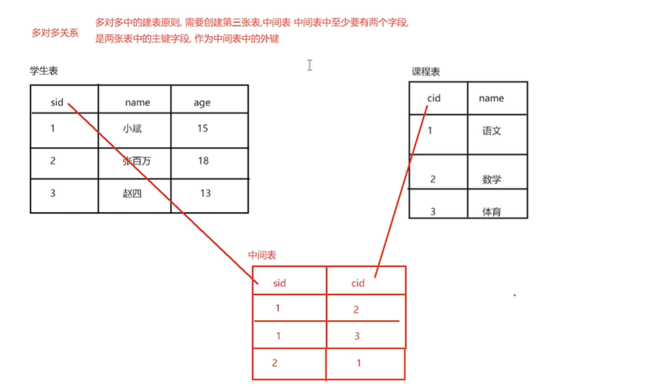
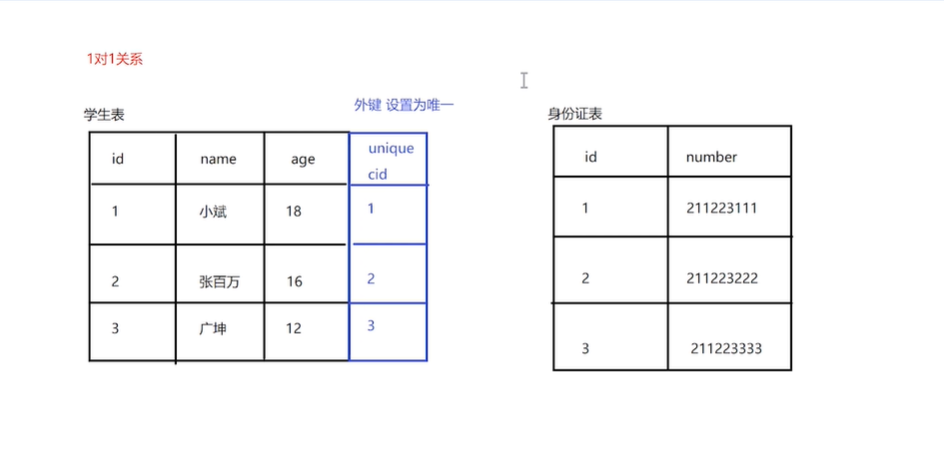
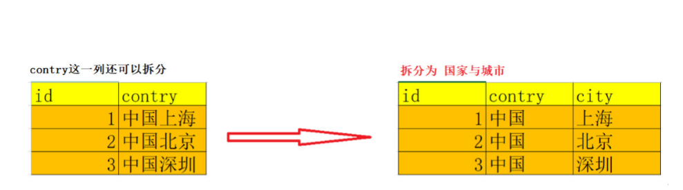
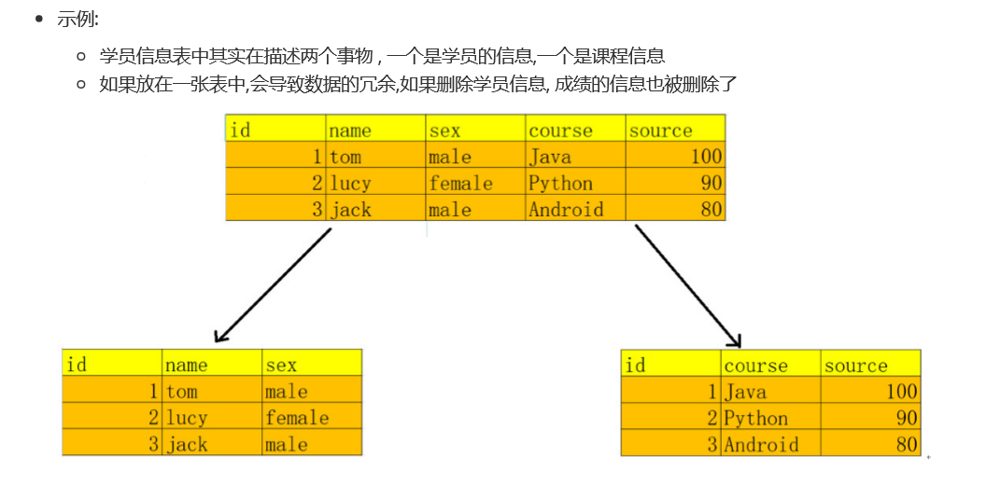
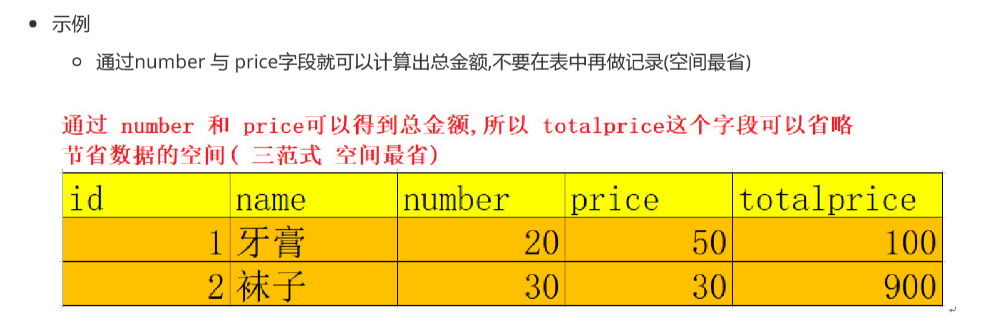
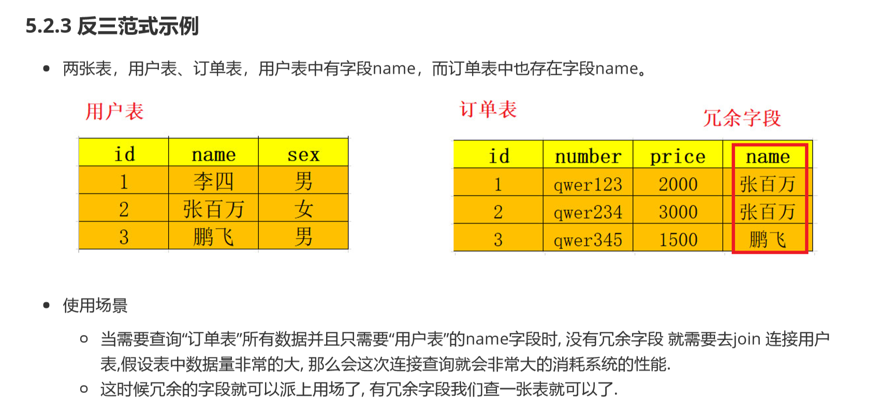

### mysql多表外键数据库设计

#### 多表的概述

+ 在实际开发中，一个项目通常需要很多张表才能完成

+ 单表的缺点

  + 出现大量冗余数据

  + 示例

    ```mysql
    CREATE DATABASE db3 CHARACTER SET utf8;
    
     
    -- 创建emp表 主键自增 
    CREATE TABLE emp(
        eid INT PRIMARY KEY AUTO_INCREMENT,    
        ename VARCHAR(20),    
        age INT ,    
        dep_name VARCHAR(20),    
        dep_location VARCHAR(20) 
    )
    
    INSERT INTO emp (ename, age, dep_name, dep_location) VALUES ('张百万', 20, '研发部', '广州');  INSERT INTO emp (ename, age, dep_name, dep_location) VALUES ('赵四', 21, '研发部', '广州');  INSERT INTO emp (ename, age, dep_name, dep_location) VALUES ('广坤', 20, '研发部', '广州');  INSERT INTO emp (ename, age, dep_name, dep_location) VALUES ('小斌', 20, '销售部', '深圳');  INSERT INTO emp (ename, age, dep_name, dep_location) VALUES ('艳秋', 22, '销售部', '深圳');  INSERT INTO emp (ename, age, dep_name, dep_location) VALUES ('大玲子', 18, '销售部', '深圳'); 
    
    ```

  + 其中研发部已经研发，地点出现大量重复

  + 优化策略

    ```mysql
    
     
      3. 添加部门表 数据
     
     
    -- 创建部门表 -- 一方,主表 
    CREATE TABLE department(     
        id INT PRIMARY KEY AUTO_INCREMENT,        
        dep_name VARCHAR(30),       
        dep_location VARCHAR(30) 
    );
     
    -- 创建员工表 -- 多方 ,从表 
    CREATE TABLE employee(    
        eid INT PRIMARY KEY AUTO_INCREMENT,    
        ename VARCHAR(20),    
        age INT,    
        dept_id INT 
    );
    
    -- 添加部门
    INSERT INTO department VALUES(NULL, '研发部','广州'),(NULL, '销售部', '深圳'); 
    
    -- 添加员工信息
    INSERT INTO employee (ename, age, dept_id) VALUES ('张百万', 20, 1); 
    INSERT INTO employee (ename, age, dept_id) VALUES ('赵四', 21, 1); 
    INSERT INTO employee (ename, age, dept_id) VALUES ('广坤', 20, 1); 
    INSERT INTO employee (ename, age, dept_id) VALUES ('小斌', 20, 2); 
    INSERT INTO employee (ename, age, dept_id) VALUES ('艳秋', 22, 2); 
    INSERT INTO employee (ename, age, dept_id) VALUES ('大玲子', 18, 2);
    
    ```

  + 优化后的问题

    ```mysql
    -- 插入一条不存在部门的数据是可以成功的 
    INSERT INTO employee (ename,age,dept_id) VALUES('无名',35,3);
    ```

    

#### 创建外键约束

```mysql
 /*
	外键约束
		作用：外键约束可以让两张表之间产生一个对应的关，从而保证了主从表引用的完整性
	外键
		外键指的是在从表中与主表的主键对应的字段
	主表和从表
		主表 主键id所在的表，一的一方
		从表 外键字段所在的表，多的一方
	添加外键约束的语法格式
		1.创建表的时候添加外键
		create table 表名(
			字段...
			[constraint] [外键约束名] foreign key （外键字段名） references 主表（主键字段）
		);
		2. 创建表之后添加外键
        -- 语法格式 alter table 从表 add constraint emp_dept_fk foreign key (dept_id) references department(id)
 */

 -- 创建员工表添加外键
 CREATE TABLE employee(
	eid INT PRIMARY KEY AUTO_INCREMENT,
	ename VARCHAR(20),
	age INT,
	dept_id INT,
	CONSTRAINT emp_dept_fk FOREIGN KEY(dept_id) REFERENCES department(id)
 );
 
 -- 这样插入一条错误的数据
 -- 添加外键约束之后 就会产生一个强制的外键约束检查 保证数据的完整性和一致性
 INSERT INTO employee (ename,age,dept_id) VALUES('无名',35,3);
```


#### 删除外键约束

```mysql
/*
	删除外键操作
	语法格式
		alter table 从表 drop foreign key 外键约束名称
*/

-- 删除 employee 表中的外键约束
ALTER TABLE employee DROP FOREIGN KEY emp_dept_fk;

-- 创建表之后添加外键
-- 语法格式 alter table 从表 add constraint emp_dept_fk foreign key (dept_id) references department(id)

-- 简写 不写外键约束名
ALTER TABLE employee ADD FOREIGN KEY(dept_id) REFERENCES department(id);

/*
	外键约束的注意事项
		1.从表的外键类型和主表的主键类型应该一致
		2.添加数据时，应该先添加主表的数据
		3.删除时，应该先删除从表中相关的数据否则会报错
*/
```

#### 级联删除

```mysql
/*	
	级联删除
		指的是删除主表数据的同时，可以删除与之相关的从表中的数据
	语法格式
		on delete cascade
*/

-- 重新创建添加级联操作 
CREATE TABLE employee(    
	eid INT PRIMARY KEY AUTO_INCREMENT,    
	ename VARCHAR(20),    
	age INT,    dept_id INT,    
	CONSTRAINT emp_dept_fk FOREIGN KEY(dept_id) REFERENCES department(id)    
	-- 添加级联删除    
	ON DELETE CASCADE 
);
 
-- 添加数据 
INSERT INTO employee (ename, age, dept_id) VALUES ('张百万', 20, 1); 
INSERT INTO employee (ename, age, dept_id) VALUES ('赵四', 21, 1); 
INSERT INTO employee (ename, age, dept_id) VALUES ('广坤', 20, 1); 
INSERT INTO employee (ename, age, dept_id) VALUES ('小斌', 20, 2); 
INSERT INTO employee (ename, age, dept_id) VALUES ('艳秋', 22, 2); 
INSERT INTO employee (ename, age, dept_id) VALUES ('大玲子', 18, 2); 
 
-- 删除部门编号为2 的记录 于此同时将会删除主表中id为2的数据
DELETE FROM department WHERE id = 2;
```


#### 关系介绍

```mysql
/*
	表与表之间的三种关系
		一对多关系(1:n 常见) 班级和学生 部门和员工
		多对多关系(n:n 常见) 学生与课程 演员与角色
		一对一关系(1:1 罕见) 使用较少因为一对一的关系可以合成为一张表
*/
```


#### 多对多关系介绍



#### 一对一关系介绍



#### 设计省市表（一对多关系）

```mysql
#创建省表 (主表,注意: 一定要添加主键约束) 
CREATE TABLE province(    
	id INT PRIMARY KEY AUTO_INCREMENT,    
	NAME VARCHAR(20),    
	description VARCHAR(20) 
);
 
#创建市表 (从表,注意: 外键类型一定要与主表主键一致) 
CREATE TABLE city(    
	id INT PRIMARY KEY AUTO_INCREMENT,    
	NAME VARCHAR(20),    
	description VARCHAR(20),    
	pid INT,    -- 添加外键约束    
	CONSTRAINT pro_city_fk FOREIGN KEY (pid) REFERENCES province(id)    
);
```


#### 设计演员与角色表（多对多关系）

```mysql
 #创建演员表 
 CREATE TABLE actor(    
	id INT PRIMARY KEY AUTO_INCREMENT,    
	NAME VARCHAR(20) 
);
 
#创建角色表 
CREATE TABLE role(    
	id INT PRIMARY KEY AUTO_INCREMENT,    
	NAME VARCHAR(20) 
);
 
#创建中间表 
CREATE TABLE actor_role(    
	-- 中间表自己的主键    
	id INT PRIMARY KEY AUTO_INCREMENT,        
	-- 指向actor 表的外键    
	aid INT,    
	-- 指向role 表的外键    
	rid INT 
);
-- 为中间表的aid字段,添加外键约束 指向演员表的主键 
ALTER TABLE actor_role ADD FOREIGN KEY(aid) REFERENCES actor(id);
 
-- 为中间表的rid字段, 添加外键约束 指向角色表的主键 
ALTER TABLE actor_role ADD FOREIGN KEY(rid) REFERENCES role(id);
```


#### 多表查询的介绍

```mysql
-- 创建 db3_2 数据库,指定编码 
CREATE DATABASE db3_2 CHARACTER SET utf8;

#分类表 (一方 主表) 
CREATE TABLE category (  
	cid VARCHAR(32) PRIMARY KEY ,  
	cname VARCHAR(50) 
);
 
#商品表 (多方 从表)
CREATE TABLE products(  
	pid VARCHAR(32) PRIMARY KEY ,  
	pname VARCHAR(50),  
	price INT,  
	flag VARCHAR(2),      
	#是否上架标记为：1表示上架、0表示下架  
	category_id VARCHAR(32),  
	-- 添加外键约束  
	FOREIGN KEY (category_id) REFERENCES category (cid) 
);

#分类数据 
INSERT INTO category(cid,cname) VALUES('c001','家电'); 
INSERT INTO category(cid,cname) VALUES('c002','鞋服'); 
INSERT INTO category(cid,cname) VALUES('c003','化妆品'); 
INSERT INTO category(cid,cname) VALUES('c004','汽车');
 
 
#商品数据 
INSERT INTO products(pid, pname,price,flag,category_id) VALUES('p001','小米电视 机',5000,'1','c001'); 
INSERT INTO products(pid, pname,price,flag,category_id) VALUES('p002','格力空 调',3000,'1','c001'); 
INSERT INTO products(pid, pname,price,flag,category_id) VALUES('p003','美的冰 箱',4500,'1','c001');
INSERT INTO products (pid, pname,price,flag,category_id) VALUES('p004','篮球鞋',800,'1','c002'); 
INSERT INTO products (pid, pname,price,flag,category_id) VALUES('p005','运动裤',200,'1','c002'); 
INSERT INTO products (pid, pname,price,flag,category_id) VALUES('p006','T恤',300,'1','c002'); 
INSERT INTO products (pid, pname,price,flag,category_id) VALUES('p007','冲锋 衣',2000,'1','c002');
INSERT INTO products (pid, pname,price,flag,category_id) VALUES('p008','神仙水',800,'1','c003'); 
INSERT INTO products (pid, pname,price,flag,category_id) VALUES('p009','大宝',200,'1','c003');

# 假设集合A={a, b}，集合B={0, 1, 2}，则两个集合的笛卡尔积为{(a, 0), (a, 1), (a, 2), (b, 0), (b, 1), (b, 2)}
# select * from table1,table2 这样获取到的数据就是table1和table2的笛卡尔积
```


#### 内连接查询

```mysql
/*
	内连接查询
		内连接特点： 通过指定的条件去匹配两张表中的数据，匹配上就显示，匹配不上就不显示
		比如通过： 从表的外键 = 主表的主键 方式去匹配
	1.隐式内连接
		form子句 后面直接写多个表名 使用where指定连接条件的这种方式是隐式内连接
		使用where条件清除无用的数据
		语法格式： SELECT 字段名 FROM 左表, 右表 WHERE 连接条件;
	2.显式内连接
		使用inner join ...on 这种方法就是显式内连接
		语法格式：
		SELECT 字段名 FROM 左表 [INNER] JOIN 右表 ON 条件   -- inner 可以省略
*/

# 隐式内连接
SELECT * FROM products,category WHERE category_id = cid;

# 查询商品表的商品名称 和 价格,以及商品的分类信息
# 可以通过给表起别名的方式, 方便我们的查询(有提示)
SELECT p.`pname`, p.`price`, c.`cname` FROM products p ,category c WHERE p.`category_id` = c.`cid`;

# 显式内连接查询 
SELECT * FROM products p INNER JOIN category c ON p.category_id = c.cid

# 查询鞋服分类下,价格大于500的商品名称和价格 
	-- 我们需要确定的几件事 
	-- 1.查询几张表 products & category 
	-- 2.表的连接条件 从表.外键 = 主表的主键 
	-- 3.查询的条件 cname = '鞋服' and price > 500 
	-- 4.要查询的字段 pname price 
 
SELECT
	p.pname, 
	p.price 
FROM products p INNER JOIN category c ON p.category_id = c.cid 
WHERE p.price > 500 AND cname = '鞋服';

```


#### 外连接查询

```mysql
/*
	外连接查询
		左外连接
			语法格式： 关键字 left [outer] join
				select 字段名 from 左表 left [outer] join 右表 on 连接条件
			左外连接的特点
				以左表为基准 匹配右表中的数据 如果能匹配上就显示
				如果匹配不上，左表中的数据正常显示，右表数据显示为null
		右外连接
			语法格式： 关键字 right [outer] join
				select 字段名 from 左表 right [outer] join 右表 on 连接条件
			左外连接的特点
				以右表为基准 匹配右表中的数据 如果能匹配上就显示
				如果匹配不上，右表中的数据正常显示，左表数据显示为null
*/

-- 左外连接查询 
SELECT 
*
FROM category c 
LEFT JOIN products p ON c.`cid`= p.`category_id`;

-- 右外连接查询 
SELECT * FROM products p RIGHT JOIN category c ON p.`category_id` = c.`cid`;
```


#### 子连接查询

```mysql
/*
	子查询
		一条select语句的结果作为另一条语句的一部分
	子查询的特点
		子查询必须放在小括号中
		子查询作为父查询的条件使用（更多的情况）
*/
```


#### 子连接介绍

```mysql
/*
	子查询常见分类
		where型 子查询:  将子查询的结果, 作为父查询的比较条件 
		from型 子查询 :  将子查询的结果, 作为 一张表,提供给父层查询使用 
		exists型 子查询:  子查询的结果是单列多行, 类似一个数组, 父层查询使用 IN 函数 ,包含子查询的结
*/
```


#### 子查询作为查询条件

```mysql
/*
	子查询的结果作为查询条件
		语法格式：SELECT 查询字段 FROM 表 WHERE 字段=（子查询）
*/

--  通过子查询的方式, 查询价格最高的商品信息 
-- 1.先查询出最高价格 
SELECT MAX(price) FROM products;
 
-- 2.将最高价格作为条件,获取商品信息 
SELECT 
*
FROM products 
WHERE price = (SELECT MAX(price) FROM products);

#查询化妆品分类下的 商品名称 商品价格
 
-- 先查出化妆品分类的 id 
SELECT cid FROM category WHERE cname = '化妆品';
 
-- 根据分类id ,去商品表中查询对应的商品信息 
SELECT 
p.`pname`, p.`price` 
FROM products p 
WHERE p.`category_id` = (SELECT cid FROM category WHERE cname = '化妆品');

-- 查询小于平均价格的商品信息
-- 1.查询平均价格 
SELECT AVG(price) FROM products; -- 1866
 
-- 2.查询小于平均价格的商品 
SELECT 
*
FROM products 
WHERE price < (SELECT AVG(price) FROM products);
```


#### 子查询结果作为一张表

```mysql
/*
	子查询结果作为一张表
		语法格式：SELECT 查询字段 FROM （子查询）表别名 WHERE 条件;
*/

-- 1. 先查询分类表的数据 
SELECT * FROM category;
 
-- 2.将上面的查询语句 作为一张表使用 
SELECT     
p.`pname`, p.`price`, c.cname 
FROM products p -- 子查询作为一张表使用时 要起别名 才能访问表中字段 
INNER JOIN (SELECT * FROM category) c ON p.`category_id` = c.cid 
WHERE p.`price` > 500;

# 注意： 当子查询作为一张表的时候，需要起别名，否则无法访问表中的字段
```


#### 子查询结果是单列多行

```mysql
/*
	子查询结果是单列多行
	子查询的结果类似一个数组, 父层查询使用 IN 函数 ,包含子查询的结果
	语法格式： SELECT 查询字段 FROM 表 WHERE 字段 IN （子查询）;
*/

# 查询价格小于两千的商品,来自于哪些分类(名称)
-- 先查询价格小于2000 的商品的,分类ID 
SELECT DISTINCT category_id FROM products WHERE price < 2000;
 
-- 在根据分类的id信息,查询分类名称 
-- 以下sql会报错:  Subquery returns more than 1 row -- 子查询的结果 大于一行 
SELECT * FROM category WHERE cid = (SELECT DISTINCT category_id FROM products WHERE price < 2000);

-- 使用in函数处理多行结果
-- 子查询获取的是单列多行数据 
SELECT * FROM category WHERE cid IN (SELECT DISTINCT category_id FROM products WHERE price < 2000);

# 查询家电类 与 鞋服类下面的全部商品信息 
-- 先查询出家电与鞋服类的 分类ID 
SELECT cid FROM category WHERE cname IN ('家电','鞋服');
 
-- 根据cid 查询分类下的商品信息 
SELECT * FROM products WHERE category_id IN (SELECT cid FROM category WHERE cname IN ('家电','鞋服'));

```


#### 数据库设计三范式

+ 三范式指的是数据库设计的一个规则

  + 作用 就是为了创建冗余较小 结果合理的数据库
  + 范式 就是设计数据库的要求（规范）

+ 三范式解释
    + 第一范式(1nf) 满足最低要求的范式
    		
    		+ 列具有原子性，设计列要做到列不可拆分
    		
    		+ 第一范式是最基本的范式。数据库表里面字段都是单一属性的，不可再分, 如果数据表中每个字段都是不 可再分的最小数据单元，则满足第一范式
    		
    		+ 示例： 地址信息表中, contry这一列,还可以继续拆分,不符合第一范式
    		
    		    
    		
     + 第二范式(2nf) 在第一范式的基础上进一步满足更多的规范
  
         + 在第一范式的基础上更进一步，目标是确保表中的每列都和主键相关
  
         + 一张表只能描述一件事.
  
          
  
     + 第三范式(3nf) 在第二范式的基础上满足更多的规范
  
         + 消除传递依赖
  
         + 表的信息，如果能够被推导出来，就不应该单独的设计一个字段来存放
  
          

#### 数据库反三范式

+ 反三范式
  + 指的是通过增加冗余或者重复的数据来提高数据库的性能
  + 浪费储存空间节省查询时间（空间换时间 三范式是时间换空间）
  + 冗余字段
    + 某一个字段属于一张表但是又在多张表中都有出现
      



+ 创建一个关系型数据库设计，我们有两种选择 
  + 尽量遵循范式理论的规约，尽可能少的冗余字段，让数据库设计看起来精致、优雅、让人心醉。 
  + 合理的加入冗余字段这个润滑剂，减少join，让数据库执行性能更高更快