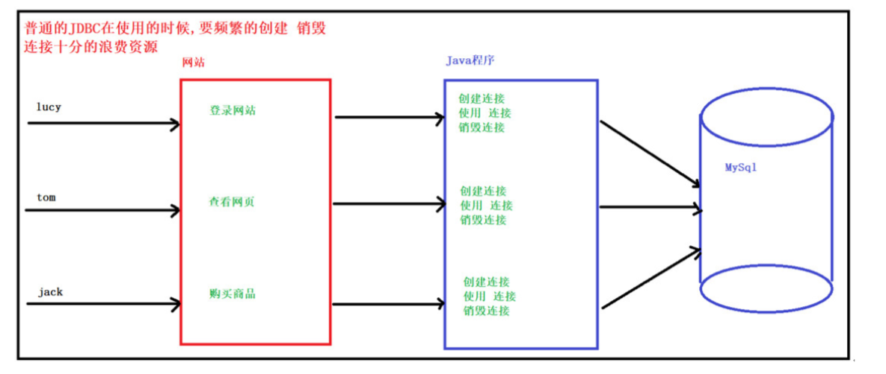
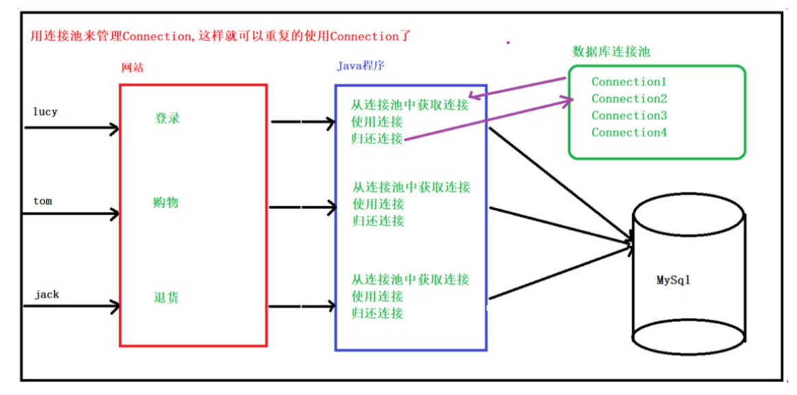
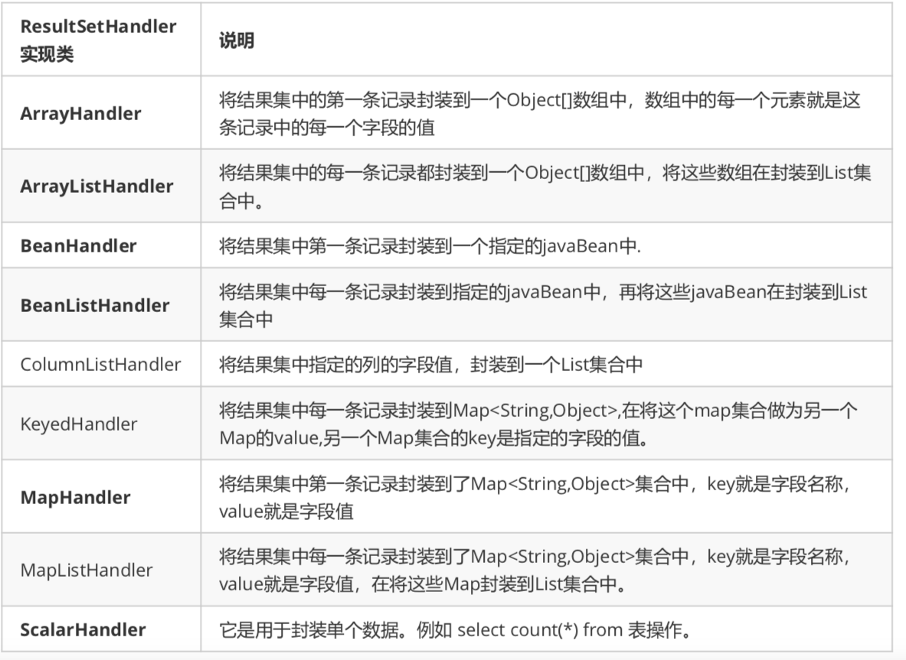
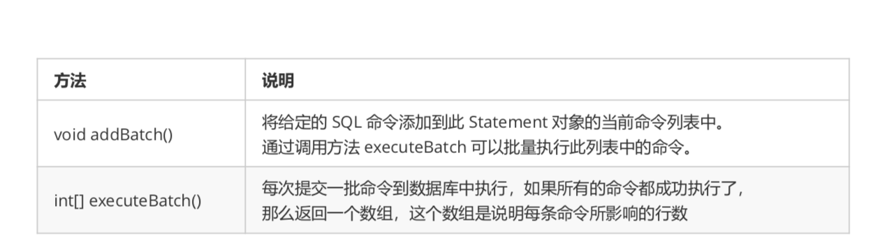
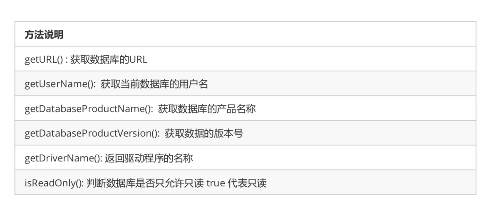
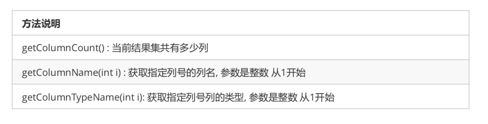

### 数据库连接池和DBUtils

#### 数据库连接池介绍

+ 什么是数据库连接池

  + 实际开放中“获得连接”或“释放资源”是非常消耗系统资源的过程，为了解决此类性能问题，通常情况我们采用连接池技术，来共享连接Connection，这样我们就不需要每次都创建连接了，释放连接了，这写操作都交给连接池

+ 连接池的好处

  + 用池来管理Connection，这样可以重复使用Connection，当使用完connection之后调用connection的close方法也不会真的关闭connection，而是把connection归还给池

+ jdbc方式与连接池方式

  + 普通jdbc

    

  + 连接池

    

#### 如何使用连接池

+ java为数据库连接池提供了公共接口，javax.sql.DataSource各个厂商需要让自己的连接池实现这个接口，这样应用程序应用程序可以方便的切换不同厂商的连接池
+ 常见的连接池有DBCP,C3P0,Druid

+ 数据准备

  ```mysql
  #创建数据库
  CREATE DATABASE db5 CHARACTER SET utf8;
  #使用数据库 
  use db5;
  #创建员工表
  CREATE TABLE employee (
      eid INT PRIMARY KEY AUTO_INCREMENT ,
  		ename VARCHAR (20),	-- 名称
      age INT ,					-- 年龄
      sex VARCHAR (6),	-- 性别
      salary DOUBLE ,		-- 薪水
      empdate DATE			-- 入职日期
  );
  # 插入数据
  INSERT INTO employee (eid,ename,age,sex,salary,empdate) VALUES (NULL,'李清照',22,'女',4000,'2018-11-12');
  INSERT INTO employee (eid,ename,age,sex,salary,empdate) VALUES (NULL,'林黛玉',20,'女',5000,'2019-03-14');
  INSERT INTO employee (eid,ename,age,sex,salary,empdate) VALUES (NULL,'杜甫',40,'男',6000,'2020-01-01');
  INSERT INTO employee (eid,ename,age,sex,salary,empdate) VALUES (NULL,'李白',25,'男',3000,'2017-10-01');
  ```

  

#### DBCP连接池介绍

+ DBCP也是一个开源的连接池，是apache的成员之一，在企业开发中比较常见，tomcat内置的连接池
+ 创建项目导入jar包

#### DBCP连接池工具类编写

+ 编写工具类
  + 连接数据库表的工具类，采用DBCP连接池的方式来完成

    + java中提供一个连接池的规则接口：DataSource，它是java中提供的连接池
    + 在DBCP包中提供了DataSource接口的实现类，我们要用具体的连接池BasicDataSource类

    + 代码示例

      ```java
      public class DBCPUtils {
      
          // 1.定义常量 保存数据库连接的相关信息
          public static final String DRIVERNAME = "com.mysql.jdbc.Driver";
          public static final String URL = "jdbc:mysql://localhost:3306/db5?characterEncoding=UTF-8";
          public static final String USERNAME = "root";
          public static final String PASSWORD = "L1178594290";
      
          // 2.创建连接池对象（有DBCP实现类）
          public static BasicDataSource dataSource = new BasicDataSource();
      
          // 3.使用静态代码块进行配置
          static {
              dataSource.setDriverClassName(DRIVERNAME);
              dataSource.setUrl(URL);
              dataSource.setUsername(USERNAME);
              dataSource.setPassword(PASSWORD);
          }
      
          // 4.获取连接的方法
          public static Connection getConnection() throws SQLException {
      
              Connection connection = dataSource.getConnection();
              return connection;
          }
      
          // 5.释放资源方法
          public static void close(Connection connection, Statement statement) {
              if(null != connection && null != statement) {
                  try {
                      statement.close();
                      connection.close();
                  } catch (SQLException throwables) {
                      throwables.printStackTrace();
                  }
              }
          }
      
          public static void close(Connection connection, Statement statement, ResultSet resultSet) {
              if(null != connection && null != statement) {
                  try {
                      resultSet.close();
                      statement.close();
                      connection.close();
                  } catch (SQLException throwables) {
                      throwables.printStackTrace();
                  }
              }
          }
      }
      
      ```

      

#### 测试DBCPUtils

+ 需求：查询所有员工姓名

  ```java
  public class TestDBCP {
  
  
      /**
       * 测试DBCP连接
       * @param args
       */
      public static void main(String[] args) throws SQLException {
  
          // 1.从DBCP连接池获取连接
          Connection connection = DBCPUtils.getConnection();
          // 2.获取对象
          Statement statement = connection.createStatement();
          // 3.查询所有员工的姓名
          String sql = "select ename from employee";
          ResultSet set = statement.executeQuery(sql);
  
          // 4.处理结果集
          while(set.next()) {
              String ename = set.getString("ename");
              System.out.println("ename: "+ ename);
          }
  
          // 5.释放资源
          DBCPUtils.close(connection,statement,set);
  
      }
  }
  
  ```

  

#### DBCP常见配置项介绍

+ 常见配置项

  | 属性            | 描述         |
  | --------------- | ------------ |
  | driverClassName | 数据库驱动名 |
  | Url             | 数据库地址   |
  | Username        | 用户名       |
  | password        | 密码         |
  | maxActive       | 最大连接数量 |
  | maxIdel         | 最大空闲闲置 |
  | minIdel         | 最小空闲闲置 |
  | InitialSize     | 初始化连接   |

#### C3P0连接池介绍

+ C3P0连接池
  + C3P0是一个开源的JDBC连接池，支持JDBC3规范和JDBC2的标准扩展，目前使用它的开源项目有Hibernate和Spring

+ 导入jar包和配置文件即可

  + 复制jar包到依赖目录

    + c3p0
    + Change-commons-java

  + 导入配置文件 c3p0-config.xml

    + 文件名不可更改

    + 直接放到src目录下或者放到资源文件夹中

      ```xml
      <c3p0-config>
        
        <!--默认配置-->
          <default-config>  
      	
      		<!-- initialPoolSize：初始化时获取三个连接，
      			  取值应在minPoolSize与maxPoolSize之间。 --> 
              <property name="initialPoolSize">3</property>  
      		
      		<!-- maxIdleTime：最大空闲时间,60秒内未使用则连接被丢弃。若为0则永不丢弃。-->
              <property name="maxIdleTime">60</property>  
      		
      		<!-- maxPoolSize：连接池中保留的最大连接数 -->
              <property name="maxPoolSize">100</property>  
      		<!-- minPoolSize: 连接池中保留的最小连接数 -->
              <property name="minPoolSize">10</property>  
      		
          </default-config>  
        
         <!--配置连接池mysql-->
          <!--自定义配置-->
          <named-config name="mysql">
              <property name="driverClass">com.mysql.jdbc.Driver</property>
              <property name="jdbcUrl">jdbc:mysql://localhost:3306/db5?characterEncoding=UTF-8</property>
              <property name="user">root</property>
              <property name="password">L1178594290</property>
              <property name="initialPoolSize">10</property>
              <property name="maxIdleTime">30</property>
              <property name="maxPoolSize">100</property>
              <property name="minPoolSize">10</property>
          </named-config>
          <!--配置连接池2,可以配置多个-->
      
      </c3p0-config>
      ```

  + 在项目中创建一个resources文件夹（专门存放资源文件）
  + 右击reource文件点点Resource Root将该文件夹设置为资源文件夹
  + 将xml文件放在resources文件夹中，创建连接池对象的时候会去加载这个配置文件

#### C3P0连接池工具类编写

+ C3P0提供的核心工具类，ComboPooledDataSource，如果想要使用连接池，就必须创建该类的对象

+ 创建对象
  + new ComboPooledDataSource();   使用默认配置

  + new ComboPooledDataSource("mysql");   使用命名配置

    ```java
    public class C3P0Utils {
    
        // 1.创建连接池对象 C3P0对DataSource接口的实现类
        // 使用的配置是配置文件中的默认配置
        // public static ComboPooledDataSource dataSource = new ComboPooledDataSource();
    
        // 使用指定配置
        public static ComboPooledDataSource dataSource = new ComboPooledDataSource("mysql");
    
        // 获取连接的方法
        public static Connection getConnection() throws SQLException {
    
            return dataSource.getConnection();
    
        }
    
        // 释放资源方法
        public static void close(Connection connection, Statement statement) {
            if(null != connection && null != statement) {
                try {
                    statement.close();
                    connection.close();
                } catch (SQLException throwables) {
                    throwables.printStackTrace();
                }
            }
        }
    
        public static void close(Connection connection, Statement statement, ResultSet resultSet) {
            if(null != connection && null != statement) {
                try {
                    resultSet.close();
                    statement.close();
                    connection.close();
                } catch (SQLException throwables) {
                    throwables.printStackTrace();
                }
            }
        }
    }
    
    ```

#### 测试C3P0Utils

+ 查询姓名为李白的员工信息

  ```java
  public class TestC3P0 {
  
      public static void main(String[] args) throws SQLException {
  
          Connection connection = C3P0Utils.getConnection();
  
          String sql = "select * from employee where ename = ?";
          PreparedStatement ps = connection.prepareStatement(sql);
  
          ps.setString(1,"李白");
          ResultSet resultSet = ps.executeQuery();
  
          while(resultSet.next()) {
              int eid = resultSet.getInt("eid");
              String ename = resultSet.getString("ename");
              int age = resultSet.getInt("age");
              String sex = resultSet.getString("sex");
              double salary = resultSet.getDouble("salary");
              Date empdate = resultSet.getDate("empdate");
  
              System.out.println(eid+" "+ename+" "+age+" "+sex+" "+salary+" "+empdate);
  
          }
  
          C3P0Utils.close(connection,ps);
      }
  }
  
  ```

+ 常见配置

  | 分类     | 属性            | 描述                                                         |
  | -------- | --------------- | ------------------------------------------------------------ |
  | 必须     | user            | 用户名                                                       |
  |          | password        | 密码                                                         |
  |          | driverClass     | 驱动                                                         |
  |          | jdbcUrl         | 路径                                                         |
  | 基本配置 | initialPoolSize | 连接池初始化时创建的连接数                                   |
  |          | maxPoolSize     | 连接池中最大连接数                                           |
  |          | minPoolSize     | 连接池保持最小连接数                                         |
  |          | maxIdelTime     | 连接最大空闲时间，如果超过时间，某个数据库连接害没有被使用，则会断开连接，如果为0，则永远不会断开连接，默认值为0 |

  

#### Druid连接池介绍

+ Druid（德鲁伊）是阿里巴巴开发的号称为监控而生的数据库连接池，Druid是目前最好的数据库连接池，在功能，性能，扩展性方面，都超过其他数据库连接池，同时加入日志监控，可以很好的监控DB连接池和sql的执行情况

+ 导入jar包及配置文件

  + 将jar包放在依赖目录中

    + druid

  + 导入配置文件

    + 是properties形式的

    + 可以叫任意名称，可以放在任意目录下，我们统一放到resources资源目录

      ```properties
      driverClassName=com.mysql.jdbc.Driver
      url=jdbc:mysql://127.0.0.1:3306/db5?characterEncoding=UTF-8
      username=root
      password=L1178594290
      initialSize=5
      maxActive=10
      maxWait=3000
      ```

      

#### Druid连接池工具类编写

+ 获取数据库连接池对象

  + 通过工厂来获取DruidDataSourceFactory类的createDataSource方法

  + createDataSource（Properties p）方法参数可以是一个属性集对象

    ```java
    public class DruidUtils {
    
        public static DataSource dataSource;
    
        static {
    
            try {
                // 创建属性集对象
                Properties p = new Properties();
    
                // Druid连接池不能主动加载配置文件，需要指定文件
                InputStream inputStream = DruidUtils.class.getClassLoader().getResourceAsStream("druid.properties");
    
                // Properties对象到load方法从字节流中读取配置信息
                p.load(inputStream);
    
                // 通过工厂类获取连接池对象
                dataSource = DruidDataSourceFactory.createDataSource(p);
            } catch (Exception e) {
                e.printStackTrace();
            }
        }
    
        // 获取连接
        public static Connection getConnection() {
            try {
                return dataSource.getConnection();
            } catch (SQLException throwables) {
                throwables.printStackTrace();
                return null;
            }
        }
    
        // 返回连接池到对象
        public static DataSource getDataSource() {
            return dataSource;
        }
    
        // 释放资源方法
        public static void close(Connection connection, Statement statement) {
            if(null != connection && null != statement) {
                try {
                    statement.close();
                    connection.close();
                } catch (SQLException throwables) {
                    throwables.printStackTrace();
                }
            }
        }
    
        public static void close(Connection connection, Statement statement, ResultSet resultSet) {
            if(null != connection && null != statement) {
                try {
                    resultSet.close();
                    statement.close();
                    connection.close();
                } catch (SQLException throwables) {
                    throwables.printStackTrace();
                }
            }
        }
    }
    ```

#### 测试DruidUtils

+ 需求：查询薪资在3000-5000元之间的员工姓名

  ```java
  public class TestDruid {
  
      public static void main(String[] args) throws SQLException {
  
          Connection connection = DruidUtils.getConnection();
  
          Statement statement = connection.createStatement();
  
          ResultSet resultSet = statement.executeQuery("select ename from employee where salary between 3000 and 5000");
  
          while (resultSet.next()) {
              String ename = resultSet.getString("ename");
              System.out.println(ename);
          }
  
          DruidUtils.close(connection,statement);
      }
  }
  
  ```

  

#### DBUtils工具类介绍

+ 简介
  + 使用jdbc我们发现冗余的代码太多了，为了简化开发，我们选择使用DbUtils
  + common DbUtils是Apache组织提供一个对jdbc进行简单封装的开源工具类库，使用它能够简化jdbc应用程序的开发，同时也不会影响程序性能
  + 使用方式
    + DBUtils就是jdbc的简化工具包，需要项目导入commons-dbutils-1.6-jar
    + Dbutils核心功能介绍
      + QueryRunner中提供对sql语句操作的api
      + ResultSetHandler接口，用于定义select操作后，怎样封装结果集
      + DbUtils类，他是一个工具类，定义了关闭资源和事务处理方法

#### 案例相关知识介绍

+ 表和类的关系

  + 整个表可以看成一个类
  + 一行对应一个对象
  + 一列对应一个属性

+ javaBean组件

  + javaBean就是一个类，开发中通常用于封装数据，有以下特点

    + 需要实现序列化接口，Serializable（暂时可以忽略）
    + 提供私有字段：private 类型 变量名
    + 提供getter和setter
    + 提供空参构造

  + 创建Employee类和数据库的employee表对应

    + 创建一个entity包，专门用来存放javaBean对象

      ```java
      public class Employee implements Serializable {
      
          private int eid;
          private String ename;
          private int age;
          private String sex;
          private double salary;
          private Date empdate;
      
      		// get,set,构造方法这边省略
      }
      ```

      

#### QueryRunner核心类的创建方式

+ 构造对象

  + QueryRunner()
  + QueryRunner(DataSource ds),提供数据源（连接池），DbUtils底层自动维护连接connection

+ 常用方法

  + update（Connection conn,String sql, Object ... params）,用来完成表数据的增加，删除，更新操作
  + query（Connection conn，String sql，ResultSetHandler<T> rsh, Object ...params）用来完成数据库查询操作

+ 创建

  + 手动模式

    ```java
    public class DBUtilsDemo01 {
    
        // QueryRunner创建方式
        public static void main(String[] args) {
    
            // 方式一 手动模式（空参创建）
            QueryRunner queryRunner = new QueryRunner();
        }
    }
    ```

  + 自动模式

    ```java
    public class DBUtilsDemo01 {
    
        // QueryRunner创建方式
        public static void main(String[] args) {
    
            // 方式一 手动模式（空参创建）
            QueryRunner qr = new QueryRunner();
    
            // 方式二 自动模式
            QueryRunner qr2 = new QueryRunner(DruidUtils.getDataSource());
        }
    }
    ```

  + 自动模式需要传入连接池对象

    ```java
    // 。。。工具类里返回就好了
    ```

#### QueryRunner类实现插入操作

+ 核心方法

  + update(Connection conn,String sql, Object... params) 

    | 参数            | 说明                                                         |
    | --------------- | ------------------------------------------------------------ |
    | Connection conn | 数据库连接对象，自动模式创建QueryRun可以不传，手动模式必须传递 |
    | String sql      | 占位符形式的sql，使用?占位符                                 |
    | Object... param | Object类型的可变参，用来设置占位符上的参数                   |

+ 步骤

  + 创建QueryRunner（手动或自动）
  + 占位符方式编写sql
  + 设置占位符参数
  + 执行

+ 添加

  ```java
  public class DBUtilsDemo02 {
  
      @Test
      public void testInsert() throws SQLException {
  
          // 手动创建
          QueryRunner qr = new QueryRunner();
  
          // 编写sql
          String sql = "insert into employee values(?,?,?,?,?,?)";
  
          // 构造参数
          Object[] param = {null,"张百万",20,"女",10000,"1990-12-26"};
  
          // 获取连接
          Connection connection = DruidUtils.getConnection();
  
          // 执行sql
          qr.update(connection,sql,param);
  
          // 静默关闭
          DbUtils.closeQuietly(connection);
      }
  }
  ```

#### QueryRunner类实现修改删除操作

+ 修改

  ```java
  public class DBUtilsDemo02 {
  
  
      @Test
      public void testUpdate() throws SQLException {
  
          QueryRunner qr = new QueryRunner(DruidUtils.getDataSource());
  
          String sql = "update employee set salary = ? where ename = ?";
  
          Object[] param = {15000,"张百万"};
  
          // 自动创建不需要指定连接，也不需要手动关闭流
          qr.update(sql,param);
      }
  }
  
  ```

+ 删除

  ```java
  public class DBUtilsDemo02 {
  
      @Test
      public void testDelete() throws SQLException {
  
          QueryRunner qr = new QueryRunner(DruidUtils.getDataSource());
  
          String sql = "delete from employee where eid = ?";
  
          qr.update(sql,1);
      }
  }
  
  ```

#### QueryRunner类实现查询操作

+ 见下

#### ResultHander结果集处理接口介绍

+ ResultSetHandler接口简介

  + ResultSetHandler可以对查询出来的ResultSet结果集进行处理，达到一些业务上的需求

+ ResultSetHandler结果集处理类

  + 本例展示的是使用ResultSetHandler接口的几个常见实现类，实现数据库的增删查改，可以大大减少代码量，优化程序

  + 每一种实现类都代表了对查询结果集的一种处理方式

    

    

#### ResultSetHander常用实现类测试

+ QueryRunner的查询方法

+ Query方法的返回值都是泛型，具体的类型回根据结果集的处理方式发生改变

  | 方法                                                    | 说明                              |
  | ------------------------------------------------------- | --------------------------------- |
  | query(String sql, handler,Object[] param)               | 自动模式创建QueryRunner，执行查询 |
  | query(Connection con,String sql,handler,Object[] param) | 手动模式创建QueryRunner，执行查询 |

+ 创建一个测试类对ResultSetHandler接口的几个常见实现类进行测试

  + 查询id为5的记录，封装到数组中

    ```java
    public class DBUtilsDemo03 {
    
        /**
         * 查询id为5的记录，封装到数据中
         * ArrayHandler 将结果集到第一条数据封装到数组中
         */
        @Test
        public void testDindById() throws SQLException {
    
            // 1. 创建QueryRunner
            QueryRunner qr = new QueryRunner(DruidUtils.getDataSource());
    
            // 2. 编写sql
            String sql = "select * from employee where eid = ?";
    
            // 3. 执行查询
            Object[] query = qr.query(sql,new ArrayHandler(),5);
    
            // 4. 获取数据
            System.out.println(Arrays.toString(query));
        }
    }
    
    ```

    

  + 查询所有数据，封装到list集合中

    ```java
    public class DBUtilsDemo03 {
    
        /**
         * 查询所有到数据封装到list集合中
         * ArrayListHandler 可以将每条数据先封装到数据中，再将数组封装到集合中
         */
        @Test
        public void testFindAll() throws SQLException {
    
            QueryRunner qr = new QueryRunner(DruidUtils.getDataSource());
    
            String sql = "select * from employee";
    
            List<Object[]> query = qr.query(sql, new ArrayListHandler());
    
            for(Object[] objects : query) {
                System.out.println(Arrays.toString(objects));
            }
        }
    }
    
    ```

  + 查询id为5的记录，封装到指定的javaBean中

    ```java
    public class DBUtilsDemo03 {
    
        /**
         * 查询id为5到记录，封装到指定JavaBean中
         * BeanHandler 将结果集的第一条数据封装到javaBean中
         */
        @Test
        public void testFindByIdJavaBean() throws SQLException {
    
            QueryRunner qr = new QueryRunner(DruidUtils.getDataSource());
    
            String sql = "select * from employee where eid = ?";
    
            Employee employee = qr.query(sql, new BeanHandler<Employee>(Employee.class), 3);
    
            System.out.println(employee);
    
        }
    }
    
    ```

  + 查询薪资大于三千多员工，封装到javaBean中，再封装到list集合中

    ```java
    public class DBUtilsDemo03 {
    
        /**
         * 查询薪资大于3000到所有员工信息，封装到JavaBean中再封装到list集合中
         * BeanListHandler 将结果集到每一条和数据封装到JavaBean中再将JavaBean放到List集合中
         */
        @Test
        public void testFindBySalary() throws SQLException {
    
            QueryRunner qr = new QueryRunner(DruidUtils.getDataSource());
    
            String sql = "select * from employee where salary > ?";
    
            List<Employee> query = qr.query(sql, new BeanListHandler<Employee>(Employee.class), 3000);
    
            for(Employee employee : query) {
                System.out.println(employee);
            }
        }
    }
    
    ```

  + 查询姓名是张百万的员工信息，将结果封装到map集合中

    ```java
    public class DBUtilsDemo03 {
    
        /**
         * 查询姓名是 张百万到员工信息，将结果封装到map集合中
         * MapHandler 将结果集的第一条记录封装到Map<String,Object>中
         * key对应的是列名 value对应的是列值
         */
        @Test
        public void testFindBName() throws SQLException {
    
            QueryRunner qr = new QueryRunner(DruidUtils.getDataSource());
    
            String sql = "select * from employee where ename = ?";
    
            Map<String, Object> map = qr.query(sql, new MapHandler(), "张百万");
    
            Set<Map.Entry<String, Object>> entries = map.entrySet();
    
            for(Map.Entry<String,Object> entry : entries) {
                System.out.println(entry.getKey() + " = "+ entry.getValue());
            }
        }
    
    }
    
    ```

  + 查询所有员工的薪资总额

    ```java
    public class DBUtilsDemo03 {
    
        /**
         * 查询所有员工的薪资总额
         * ScalarHandler 用于封装单个数据
         */
        @Test
        public void testCount() throws SQLException {
    
            QueryRunner qr = new QueryRunner(DruidUtils.getDataSource());
    
            String sql = "select sum(salary) from employee";
    
            Double sum = (Double)qr.query(sql, new ScalarHandler<>());
    
            System.out.println("sum = "+ sum);
        }
    }
    
    ```

#### 批处理介绍

+ 什么是批处理

  + 批处理操作数据库
    + 批处理是一次操作中执行多条sql语句，批处理相比于一次一次执行效率会提高很多
    + 当向数据库添加大量数据时需要用到批处理
  + 举例：送货员
    + 未使用批处理的时候，送货员每次只能运送一件货物给商家
    + 使用批处理，则是送货员将所有的货物都用车带到发放处给商家

+ 实现批处理

  + Statement和PreparedStatement都支持批处理操作，先介绍preparedStatement的批处理

    

    + mysql批处理默认是关闭的，所以需要加一个参数才打开mysql数据库批处理，在url中添加

      ```java
      rewriteBatchStatements=true
      例如：url=jdbc:mysql://127.0.0.1:3306/db5?characterEncoding=UTF-8&rewriteBatchedStatements=true
      ```

#### 批处理操作插入10000条数据

+ 创建一张表

  ```mysql
  create table testBatch(
  	id int primary key auto_increment,
    uname varchar(50)
  )
  ```

  

+ 向标中加入10000条数据

  ```java
  public class BatchInsert {
  
      // 使用批处理向表中添加1000条数据
      public static void main(String[] args) throws SQLException {
  
          Connection connection = DruidUtils.getConnection();
  
          PreparedStatement preparedStatement = connection.prepareStatement("insert into testBatch(uname) values(?)");
  
          for(int i = 0; i < 10000; i++) {
              preparedStatement.setString(1,"小强" + i);
              preparedStatement.addBatch();
          }
  
          preparedStatement.executeBatch();
  
          DruidUtils.close(connection,preparedStatement);
      }
  }
  
  ```

  

#### mysql元数据介绍和相关命令

+ 什么是元数据

  + 除了表之外的数据都是元数据，可以分为三类
    + 查询结果信息： update或delete语句受影响的行数
    + 数据库和数据表的信息：包含了数据库及数据表的结构信息
    + mysql服务器信息：包含了数据库服务器的当前状态，版本号

+ 常用命令

  ```mysql
  -- 元数据相关的命令介绍
  
  -- 1.查看服务器当前状态
  select version();
  
  -- 2.查看mysql版本信息
  show status;
  
  -- 3.查询表中的详细信息
  show columns from table_name;
  
  -- 4.显示数据表的详细索引信息
  show index from table_name;
  
  -- 5.列出所有数据库
  show databases;
  
  -- 6.显示当前数据库的所有表
  show tables;
  
  -- 7.获取当前数据库名
  select database();
  ```

  

#### JDBC获取元数据常用类介绍

+ 通过jdbc也可以获取到元数据，比如数据库相关信息，或者当我们使用程序查询一个不熟悉的表时，我们可以通过获取元数据信息，了解表中有多少个字段，字段名称和字段类型

+ 常用类介绍

  + jdbc中描述元数据的类

    | 元数据类          | 作用                   |
    | ----------------- | ---------------------- |
    | DatabaseMetaData  | 描述数据库的元数据对象 |
    | ResultSetMetaData | 描述结果集的元数据对象 |

  + 获取元数据对象的方法：getMetaData()

    + Connection连接对象，调用getMetaData()方法，获取的是DatabaseMetaData数据库元数据对象
    + preparedStatement预处理对象，调用getMetaData()方法，获取的是ResultSetMetaData，结果集元数据对象

  + DatabaseMetaData的常用方法

    

  + ResultSetMetaData的常用方法

    

  + 示例

    ```java
    public class TestMetaData {
    
        // 获取数据库相关的元数据信息，使用DatabaseMetaData
        @Test
        public void testDataBaseMetaData() throws SQLException {
    
            Connection connection = DruidUtils.getConnection();
    
            DatabaseMetaData metaData = connection.getMetaData();
    
            String url = metaData.getURL();
            String username = metaData.getUserName();
            String productName = metaData.getDatabaseProductName();
            String version = metaData.getDatabaseProductVersion();
            String driverName = metaData.getDriverName();
    
        }
    }
    
    ```

    

#### JDBC获取数据库元数据信息

```java
public class TestMetaData {

    // 1.获取数据库相关的元数据信息，使用DatabaseMetaData
    @Test
    public void testDataBaseMetaData() throws SQLException {

        Connection connection = DruidUtils.getConnection();

        DatabaseMetaData metaData = connection.getMetaData();

        String url = metaData.getURL();
        String username = metaData.getUserName();
        String productName = metaData.getDatabaseProductName();
        String version = metaData.getDatabaseProductVersion();
        String driverName = metaData.getDriverName();

        System.out.println("url:" + url);
    }
}


```


#### JDBC获取结果集元数据信息

```java
public class TestMetaData {

    @Test
    public void testResultSetMetaData() throws SQLException {

        // 获取连接
        Connection connection = DruidUtils.getConnection();


        // 获取结果集元素对象
        PreparedStatement ps = connection.prepareStatement("select * from employee");
        ResultSet resultSet = ps.executeQuery();

        // 获取结果集元素对象
        ResultSetMetaData metaData = ps.getMetaData();

        // 获取当前结果集共有多少列
        int count = metaData.getColumnCount();
        System.out.println("当前结果集中共有： "+ count + "列");

        // 获取结果集中列的名称和类型
        for(int i = 1; i <= count;i++) {
            String columnName = metaData.getColumnName(i);
            System.out.println("列名： " + columnName);

            String columnTypeName = metaData.getColumnTypeName(i);
            System.out.println("类型： " + columnTypeName);
        }
    }
}


```

