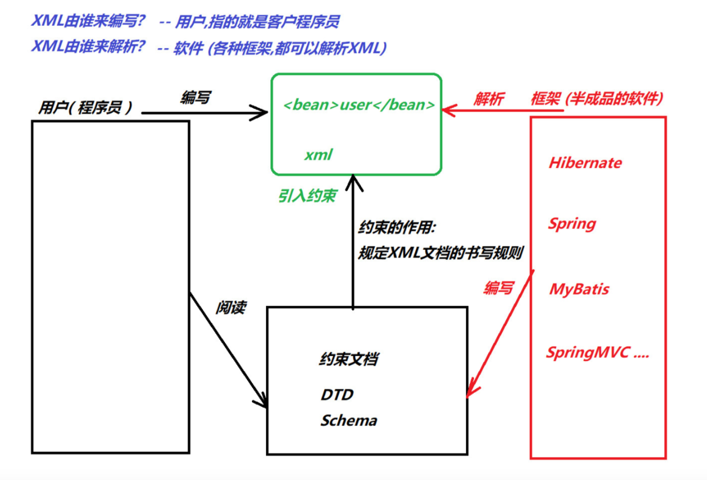
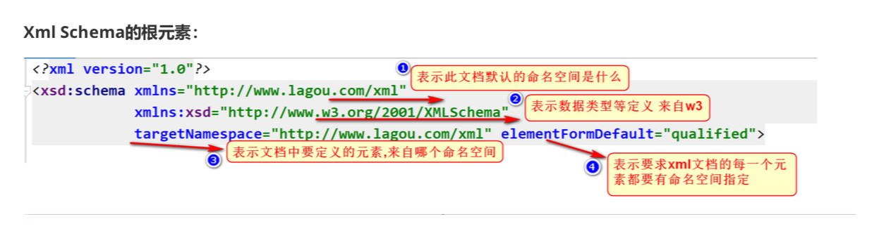
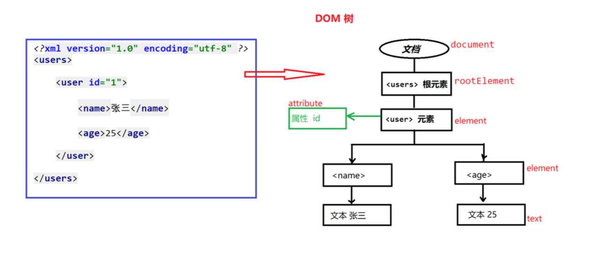
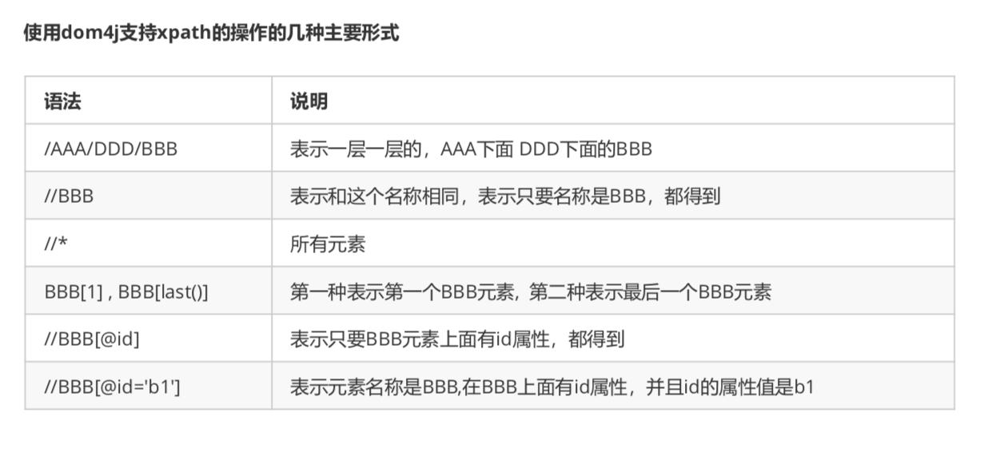

### XML

#### xml基本介绍

+ 概述

  + xml即可扩展标记语言（extensible markup language）
  + W3C在1998年2月发布1.0版本，2004年2月又发布了1.1版本，但是因为1.1版本不能向下兼容1.0版本所以没人用，同时04年2月，W3C又发布了1.0版本的第三版，我们学习的还是1.0
  + 特点
    + 可扩展的，标签都是自定义的
    + 语法十分严格

+ xml作用

  | 功能         | 说明                                                         |
  | ------------ | ------------------------------------------------------------ |
  | 存储数据     | 通常，我们在数据库中存储数据，不过，如果希望数据的可以移植性比较强<br/>我们可以把数据存储在xml中 |
  | 配置文件     | 作为各种技术框架的配置文件使用（最多）                       |
  | 在网络中传输 | 客户端可以使用xml格式向服务器发送数据，服务器接收到xml格式数据，进行解析 |

+ 

#### xml语法介绍

+ xml文档声明格式

  ```xml
  <?xml version="1.0" encoding="UTF-8"?>
  ```

+ 属性说明

  + version：指定xml文档版本，必须属性，因为我们不会选择1.1，只会选择1.0
  + encoding：指定当前文件编码，可选属性，默认是utf-8

+ 描述

  + Element元素：是xml文件中的重要组成部分

  + 元素命名规则

    + 不能使用空格，不能使用冒号
    + xml标签名称区分大小写
    + xml必须有且只有一个根元素

  + 语法格式

    ```xml
    <users></users>
    ```

    + xml必须且只有一个根元素，它是所有其他元素的父元素，比如以下实例中users就是根元素

      ```xml
      <?xml version="1.0" encoding="UTF-8">
      <users>
      </users>
      ```

    + 普通元素的结构开始标签，元素体，结束标签组成

      ```xml
      <hello>hello world! </hello>
      ```

    + 空元素：空元素只有开始标签，而没有结束标签，但元素必须自己闭合

      ```xml
      <!--空元素没有结束标签-->
          <close/>
      ```

      

    + 属性

      ```xml
      <?xml version="1.0" encoding="UTF-8" ?>
      <users>
          <user id="123">
              <name>luna</name>
              <age>16</age>
          </user>
          <user id="456">
              <name>sakura</name>
              <age>15</age>
          </user>
      
          <!--空元素没有结束标签-->
          <close/>
      </users>
      ```

      

      + 属性是元素的一部分，它必须出现在元素的开始标签中
      + 属性定义的样式：属性名=属性值，其中属性值必须使用单引或双印
      + 一个元素可以有0-n个属性，但是一个元素不能出现同名属性
      + 属性名不能使用空格，冒号等特殊字符，且必须以字母开头

    + 注释

      + xml的注释，会以 "" 结束，注释内容会被xml解析器忽略

    + 使用xml描述数据表中的数据

      ```xml
      
      ```

      

#### 自定义xml描述数据

#### xml约束介绍

+ 在xml技术中，可以编写一个文档来约束一个xml文档的书写规范，这称之为xml约束

+ 常见的xml约束

  + DTD
  + Schema

+ 需要掌握

  + 会读
  + 会引入
  + 不用自己编写

  

#### DTD约束介绍和编写

+ 简介

  + DTD，文档类型定义，用来约束xml文档，规定xml文档中元素的名称，子元素的名称及顺序，元素的属性

+ 编写DTD

  + 开发中，我们不会自己编写DTD约束文档
  + 通常情况我们都是通过框架提供的DTD，编写对应的xml文档，常见框架使用DTD约束有：Struts2，hibernate等

  ```dtd
  <!ELEMENT students (student+) >
      <!ELEMENT student (name,age,sex)>
      <!ELEMENT name (#PCDATA)>
      <!ELEMENT age (#PCDATA)>
      <!ELEMENT sex (#PCDATA)>
      <!ATTLIST student number ID #REQUIRED>
  
  <!--
      ELEMENT 定义元素
        students (student+): students 代表根元素
        student+ ： 根标签中至少有一个student子元素
        student (name,age,sex): student标签中可以包含的子元素按顺序出现
        #PCDATA: 普通的文本内容
        ATTLIST: 用来定义属性
        student number ID: student标签中 有一个ID属性 叫做number
        #REQUIRED: number的属性必须填写
        ID 唯一的值不能重复
  -->
  ```

  

#### 引入DTD约束

+ 引入方式

  + 内部DTD：将约束规则定义在xml文档中

  + 外部DTD：将约束的规则定义在外部的DTD中

    > 本地:<!DOCTYPE 根标签名 SYSTEM "dtd文件的位置"> 
    >
    > 网络:<!DOCTYPE 根标签名 PUBLIC "dtd文件名字" "dtd文件的位置URL">

+ 示例

  ```xml
  <?xml version="1.0" encoding="UTF-8" ?>
  <!DOCTYPE students SYSTEM "student.dtd">
  
  <students>
      <student number="s1">
          <name>luna</name>
          <age>16</age>
          <sex>female</sex>
      </student>
  </students>
  ```

  

#### Schema约束介绍和编写

+ 说明是Schema

  + Schema是新的xml文档约束，比DTD强大得多，是DTD的替代者
  + Schema本身也是xml文档但是后缀是xsd，而不是xml
  + Schema功能更强大，内置多种简单和复杂的数据类型
  + Schema支持命名空间（一个XML中可以引入多个约束文档）

+ 示例

  ```xsd
  <?xml version="1.0" encoding="UTF-8" ?>
  <xsd:schema xmlns="http://www.lagou.com/xml"
              xmlns:xsd="http://www.w3.org/2001/XMLSchema"
              targetNamespace="http://www.lagou.com/xml" elementFormDefault="qualified">
  
      <xsd:element name="students" type="studentsType"/>
      <xsd:complexType name="studentsType">
          <xsd:sequence>
              <xsd:element name="student" type="studentType" minOccurs="0" maxOccurs="unbounded"/>
          </xsd:sequence>
      </xsd:complexType>
      <xsd:complexType name="studentType">
          <xsd:sequence>
              <xsd:element name="name" type="xsd:string"/>
              <xsd:element name="age" type="ageType" />
              <xsd:element name="sex" type="sexType" />
          </xsd:sequence>
          <xsd:attribute name="number" type="numberType" use="required"/>
      </xsd:complexType>
      <xsd:simpleType name="sexType">
          <xsd:restriction base="xsd:string">
              <xsd:enumeration value="male"/>
              <xsd:enumeration value="female"/>
          </xsd:restriction>
      </xsd:simpleType>
      <xsd:simpleType name="ageType">
          <xsd:restriction base="xsd:integer">
              <xsd:minInclusive value="0"/>
              <xsd:maxInclusive value="200"/>
          </xsd:restriction>
      </xsd:simpleType>
      <xsd:simpleType name="numberType">
          <xsd:restriction base="xsd:string">
              <xsd:pattern value="hehe_\d{4}"/>
          </xsd:restriction>
      </xsd:simpleType>
  </xsd:schema>
  ```

  

#### 引入Schema约束

+ 步骤

  + 查看Schema文档找到根元素，在xml中写出来

    ```xml
    <students></students>
    ```

  + 根元素来自哪个命名空间，使用xmlns指令来声明

    ```xml
    xmlns="http://www.lagou.com/xml"
    ```

  + 引入W3C的标准命名空间，复制即可

    ```xml
    xmlns:xsi="http://www.w3.org/2001/XMLSchema-instance"
    ```

  + 引入的命名空间根哪个xsd文件对应，使用schemaLocation来指定：两个取值：第一个为命名空间第二个为xsd文件的路径

    ```xml
    xsi:schemaLocation="http://www.lagou.com/xml student.xsd"
    ```

  + 命名空间

    ```xml
    指的是命名空间，你的标签来自哪个环境定义的
    ```

    

  + student.xml

    ```xml
    <?xml version="1.0" encoding="UTF-8" ?>
    <students
            xmlns="http://www.lagou.com/xml"
            xmlns:xsi="http://www.w3.org/2001/XMLSchema-instance"
            xsi:schemaLocation="http://www.lagou.com/xml student.xsd"
    >
        <student number="hehe_1235">
            <name>luna</name>
            <age>16</age>
            <sex>female</sex>
        </student>
    
    
    </students>
    ```

#### xml解析方式介绍

+ 解析概述

  + 当数据存储在xml之后，我们就希望通过程序获得xml的内容，如果我们使用java基础所学习的IO知识是可以完成的，不过你需要非常繁琐的操作才能完成，且开发中会遇到不同的问题（只读，只写），人们为不同问题，提供不同的解析方式，并提交对应的解析器，方便开发人员操作xml

+ xml的解析方式

  + 开发中常见的解析方式有两种，如下：

    + DOM：要求解析器把整个xml文档装载到内存，并解析成一个Document对象

      + 优点：元素与元素之间保留结构关系，故可以进行增删查改操作
      + 缺点：xml文档过大可能出现内存溢出显现

    + SAX：是一种速度更快，更有效的方法，它逐行扫描文档，一边扫描一边解析，并以事件驱动的方式进行具体解析，每执行一行，都将触发对应的事件

      + 优点：占用内存少，处理速度快，可以处理大文件
      + 缺点：只能读，逐行后释放资源

      

#### 常见的xml解析器

+ 解析器：就是根据不同的解析方式提供的具体实现，有的解析器操作过于繁琐，为了方便开发人员，有提供易于操作的解析开发包
  + JAXP：sum公司提供的解析器，支持DOM，和SAX两种思想
  + DOM4J：一款非常优秀的解析器，Dom4J是一个易用的，开源的库，用于xml，XPath和XSLT，它应用与java平台，采用java集合框架并完全支持DOM，SAX和JAXP
  + Jsoup：jsoup是一款java的html解析器，也可以解析xml
  + PULL：Android内置的xml解析方式，类似SAX

#### DOM4jAPI介绍

+ 导入包
+ 介绍
  + 使用核心类SaxReader加载XML文档获得Document，通过Document对象获得文档的根元素，然后就可以操作了
  + 常用api
    + SaxReader对象
      + read(...)加载执行xml文档
    + Document对象
      + getRootElement()获得根元素
    + Element对象
      + elements(...) 获得指定名称的所有子元素，可以不指定
      + element(...) 获得指定名称的第一个元素，可以不指定
      + getName() 获得当前元素的元素名
      + attributeValue(...) 获得指定属性名的属性值
      + ElementText(...) 获得指定名称子元素的文本值
      + getText() 获得当前元素的文本内容

#### 准备xml文件

+ 编写user.xsd schema约束

```xml
<?xml version="1.0" encoding="UTF-8" ?>
<xsd:schema xmlns="http://www.lagou.com/xml"
            xmlns:xsd="http://www.w3.org/2001/XMLSchema"
            targetNamespace="http://www.lagou.com/xml" elementFormDefault="qualified">

    <xsd:element name="users" type="usersType"/>
    <xsd:complexType name="usersType">
        <xsd:sequence>
            <xsd:element name="user" type="userType" minOccurs="0" maxOccurs="unbounded"/>
        </xsd:sequence>
    </xsd:complexType>

    <xsd:complexType name="userType">
        <xsd:sequence>
            <xsd:element name="name" type="xsd:string"/>
            <xsd:element name="age" type="ageType" />
            <xsd:element name="hobby" type="hobbyType" />
        </xsd:sequence>
        <xsd:attribute name="id" type="numberType" use="required"/>
    </xsd:complexType>

    <xsd:simpleType name="ageType">
        <xsd:restriction base="xsd:integer">
            <xsd:minInclusive value="0"/>
            <xsd:maxInclusive value="100"/>
        </xsd:restriction>
    </xsd:simpleType>

    <xsd:simpleType name="hobbyType">
        <xsd:restriction base="xsd:string">
            <xsd:enumeration value="抽烟"/>
            <xsd:enumeration value="喝酒"/>
            <xsd:enumeration value="烫头"/>
        </xsd:restriction>
    </xsd:simpleType>

    <xsd:simpleType name="numberType">
        <xsd:restriction base="xsd:string">
            <xsd:pattern value="\d{3}"/>
        </xsd:restriction>
    </xsd:simpleType>
</xsd:schema>
```

+ 编写user.xml引入约束

  ```xml
  <?xml version="1.0" encoding="UTF-8" ?>
  <users
          xmlns="http://www.lagou.com/xml"
          xmlns:xsi="http://www.w3.org/2001/XMLSchema-instance"
          xsi:schemaLocation="http://www.lagou.com/xml user.xsd"
  >
      <user id="001">
          <name>张百万</name>
          <age>25</age>
          <hobby>抽烟</hobby>
      </user>
  
      <user id="002">
          <name>于谦</name>
          <age>55</age>
          <hobby>烫头</hobby>
      </user>
  
      <user id="003">
          <name>小斌</name>
          <age>25</age>
          <hobby>喝酒</hobby>
      </user>
  </users>
  ```

#### DOM4j解析xml

```java
public class TestDOM4J {

    @Test
    public void test1() throws DocumentException {

        // 1.获取xml解析对象
        SAXReader reader = new SAXReader();

        // 2.解析xml获取文档对象
        Document read = reader.read("/Volumes/本地磁盘/ideaProject/lagou/jdbc_work/jdbc_task03/src/con/Ivan/xml03/user.xml");

        // 3.获取根元素
        Element rootElement = read.getRootElement();

        // 4.获取根元素名称
        System.out.println(rootElement.getName());

        // 不传参获取所有，传参获取指定 rootElement.elements();
        List<Element> elements = rootElement.elements();
        for(Element element : elements) {
            System.out.println("子节点： "+ element.getName());

            List<Element> list = element.elements();
            for(Element e : list) {
                System.out.println(e.getName());
            }
        }
    }

    @Test
    public void test2() throws DocumentException {

        // 1. 获取解析对象
        SAXReader reader = new SAXReader();

        // 2. 获取文档对象
        Document read = reader.read("/Volumes/本地磁盘/ideaProject/lagou/jdbc_work/jdbc_task03/src/con/Ivan/xml03/user.xml");

        // 3. 获取根节点
        Element rootElement = read.getRootElement();
        // 4. 获取所有子节点
        List<Element> elements = rootElement.elements();
        // 5. 获取第一个子节点
        Element user = elements.get(0);
        // 6. 获取标签中的信息
        String id = user.attributeValue("id");
        String name = user.elementText("name");
        String age = user.elementText("age");
        String hobby = user.element("hobby").getText();

        System.out.println(id+" "+name+" "+age+" "+hobby);
    }
}

```


#### XPath的节本介绍

+ XPath介绍

  + Xpath是一门在xml文档中查找信息的语言，可以是使用xpath查找xml中的内容
  + Xpath的优势：
    + 由于Dom4j在解析xml时只能一层一层解析，所以当xml文件层数过多时使用会很不方便，结合XPATH就可以直接获取到某个元素

+ 导入jaxen包

+ 基本语法介绍

  

+ API介绍

  + 常用方法：
    + selectSingleNode(query):查找和xpath查询匹配的一个节点
      + 参数时Xpath查询串
    + selectNodes(query):得到的是xml根节点下的所有满足xpath节点
      + 参数时Xpath查询串
    + Node：节点对象

+ Xpath读取xml

  + 准备book.xml

    ```xml
    <?xml version="1.0" encoding="UTF-8" ?>
    <bookstore>
        <book id="book1">
            <name>金瓶梅</name>
            <author>金圣叹</author>
            <price>99</price>
        </book>
        <book id="book2">
            <name>红楼梦</name>
            <author>曹雪芹</author>
            <price>69</price>
        </book>
        <book id="book3">
            <name>Java编程思想</name>
            <author>埃克尔</author>
            <price>59</price>
        </book>
    </bookstore>
    ```

  + 代码示例：

    + 使用selectSingleNode方法查询指定节点中的内容

      ```java
      public class TestPath {
      
          @Test
          public void test1() throws DocumentException {
      
              SAXReader reader = new SAXReader();
      
              Document document = reader.read("/Volumes/本地磁盘/ideaProject/lagou/jdbc_work/jdbc_task03/src/con/Ivan/xml04/book.xml");
      
              Node node = document.selectSingleNode("/bookstore/book/name");
      
              System.out.println("节点名" + node.getName());
              System.out.println("书名" + node.getText());
      
              Node node1 = document.selectSingleNode("/bookstore/book[3]/name");
      
              System.out.println("节点名" + node1.getName());
              System.out.println("书名" + node1.getText());
      
          }
      }
      
      ```

    + 使用selectSingleNode方法获取属性值，或者属性值对应的节点

      ```java
      public class TestPath {
      
          /**
           * 使用 selectSingleNode（） 获取属性值或者通过属性值获取节点
           */
          @Test
          public void test02() throws DocumentException {
      
              SAXReader reader = new SAXReader();
      
              Document document = reader.read("/Volumes/本地磁盘/ideaProject/lagou/jdbc_work/jdbc_task03/src/con/Ivan/xml04/book.xml");
      
              // 1.获取第一个book节点中的id属性值
              Node node1 = document.selectSingleNode("/bookstore/book/attribute::id");
              System.out.println(node1.getText());
      
              // 2.获取最后一个book节点中的id属性值
              Node node2 = document.selectSingleNode("/bookstore/book[last()]/attribute::id");
              System.out.println(node2.getText());
      
              // 3. 通过id的值 获取book2节点中的书名
              Node node3 = document.selectSingleNode("/bookstore/book[@id='book2']");
              Node name = node3.selectSingleNode("name");
              System.out.println(name.getText());
      
          }
      }
      
      ```

    + 使用selectSingleNode方法获取对应名称的所有节点

      ```java
      public class TestPath {
      
          /**
           * 使用selectNodes() 查询所有节点
           */
          @Test
          public void test3() throws DocumentException {
      
              SAXReader reader = new SAXReader();
      
              Document document = reader.read("/Volumes/本地磁盘/ideaProject/lagou/jdbc_work/jdbc_task03/src/con/Ivan/xml04/book.xml");
      
              // 1.获取所有的节点名
              List<Node> list1 = document.selectNodes("//*");
      
              for(Node node : list1) {
                  System.out.println("节点名： " + node.getName());
              }
      
              // 2.获取所有的书名
              List<Node> list2 = document.selectNodes("//name");
      
              for(Node node : list2) {
                  System.out.println("书名： "+node.getText());
              }
      
              // 3.获取id值为book1的节点中的所有内容
              List<Node> list3 = document.selectNodes("/bookstore/book[@id='book1']//*");
      
              for(Node node : list3) {
                  System.out.println(node.getName()+" "+node.getText());
              }
          }
      }
      
      ```

      

#### XPath语法获取单个节点信息

#### XPath语法获取属性值

#### XPath语法获取多个节点信息

#### 配置式JDBCUTILS编写配置文件

+ Jdbc自定义xml

  + 定义配置文件

    + 创建自定义xml，保存数据库连接信息

    + jdbc-config.xml

      ```xml
      <?xml version="1.0" encoding="UTF-8" ?>
      <jdbc>
          <property name="driverClass">com.mysql.jdbc.Driver</property>
          <property name="jdbcUrl">jdbc:mysql://localhost:3306/db5?characterEncoding=UTF-8</property>
          <property name="user">root</property>
          <property name="password">L1178594290</property>
      </jdbc>
      ```

#### 配置式JDBCUTILS编写工具类

+ 编写工具类，使用xpath读取数据库信息

  ```java
  public class JDBCUtils {
  
      // 定义字符串变量保存连接后信息
      public static String DRIVERNAME;
      public static String URL;
      public static String USER;
      public static String PASSWORD;
  
  
      // 静态代码块
      static {
          // 使用XPATH语法对xml中数据进行读取
          SAXReader reader = new SAXReader();
  
          try {
              Document document = reader.read("/Volumes/本地磁盘/ideaProject/lagou/jdbc_work/jdbc_task03/src/con/Ivan/xml05/jdbc-config.xml");
  
              //
              Node node1 = document.selectSingleNode("/jdbc/property[@name='driverClass']");
              DRIVERNAME = node1.getText();
  
              Node node2 = document.selectSingleNode("/jdbc/property[@name='jdbcUrl']");
              URL = node2.getText();
  
              Node node3 = document.selectSingleNode("/jdbc/property[@name='user']");
              USER = node3.getText();
  
              Node node4 = document.selectSingleNode("/jdbc/property[@name='password']");
              PASSWORD = node4.getText();
  
              // 注册驱动
              Class.forName(DRIVERNAME);
  
          } catch (Exception e) {
              e.printStackTrace();
          }
      }
  
      // 获取连接
      public static Connection getConnection() {
  
          Connection connection = null;
          try {
              connection = DriverManager.getConnection(URL, USER, PASSWORD);
              return connection;
          } catch (SQLException throwables) {
              throwables.printStackTrace();
              return null;
          }
      }
  
  }
  
  ```

  

#### 配置式JDBCUTILS测试

+ 测试：获取所有员工姓名

  ```java
  public class TestJDBC {
  
      public static void main(String[] args) throws SQLException {
  
          Connection connection = JDBCUtils.getConnection();
  
          Statement statement = connection.createStatement();
  
          ResultSet resultSet = statement.executeQuery("select * from employee");
  
          while (resultSet.next()) {
              String name = resultSet.getString("ename");
              System.out.println("员工姓名： "+name);
          }
  
          
      }
  }
  
  ```

  


